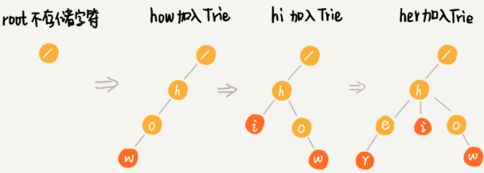
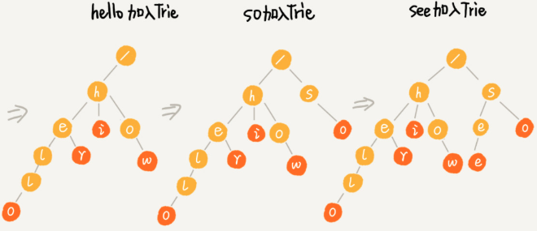
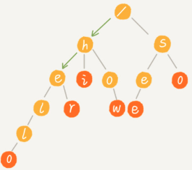
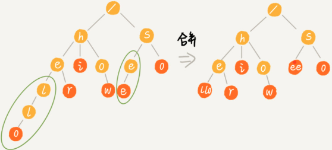

[TOC]

# 定义

Trie 树的本质：**利用字符串之间的公共前缀，将重复的前缀合并在一起**。


特点

1. 根节点不包含任何信息。
2. 每一个节点表示字符串的字符，从根节点到红色节点的路径表示一个字符串。

# 构造过程

每一步相当于往Trie 树中，插入一个字符串。所有字符串插入完毕，一棵字典树就构造完成了。





查找 her （绿色的路径）


查找 he ：e 节点并不是红色，说明 “he” 只是某个字符串的前缀，字典中并不存在“he” 这个字符串。



# 代码实现

##  python 字典实现

```python
class TrieNode:
    def __init__(self, data=None):
        self.data = data
        self.children = {}

class Trie:
    def __init__(self):
        self.root = TrieNode("/")

    def insert(self, text):
        p = self.root
        for i in range(len(text)):
            if text[i] not in p.children:
                p.children[text[i]] = TrieNode()
            p = p.children[text[i]]
        p.data = text

    def find(self, pattern):
        p = self.root
        for i in range(len(pattern)):
            if pattern[i] not in p.children: return
            p = p.children[pattern[i]]
        return p.data
```

更具有python 风格的实现

```python
class Trie2:
    def __init__(self):
        self.root = TrieNode("/")

    def __contains__(self, key):
        return self[key] is not None

    def __getitem__(self, key):
        p = self.root
        for char in key:
            p = p.children[char]
            if not p: return
        return p.data

    def __setitem__(self, key, value):
        p = self.root
        for i, char in enumerate(key):
            # 只有结束结点才写入 data
            if char not in p.children:
                p.children[char] = TrieNode()
            p = p.children[char]
        p.data = value
        
 if __name__ == "__main__":
    trie = Trie2()

    # 增
    trie["自然"] = "nature"
    trie["自然人"] = "human"
    trie["自然语言"] = "language"
    trie["自语"] = "talk to oneself"
    trie["入门"] = "introduction"
    assert '自然' in trie

    # 删
    trie["自然"] = None
    assert '自然' not in trie

    # 改
    trie["自然语言"] = "human language"
    assert trie["自然语言"] == "human language"

    # 查
    assert trie["入门"] == "introduction"
```

Trie Tree 构建时间复杂度：O(m*len)   m 敏感词个数，len 敏感词的平均长度。

## 自己设计散列表

```python
class TrieNode:
    def __init__(self):
        self.data = None
        self.children = [None] * (65535 + 1)

class Trie:
    def __init__(self):
        self.root = TrieNode()

    # 往 Trie 树中插入一个字符串
    def insert(self, text):
        p = self.root
        for i in range(len(text)):
            index = ord(text[i])
            if not p.children[index]:
                p.children[index] = TrieNode()
            p = p.children[index]
        p.data = text

    # 在 Trie 树中查找一个字符串（精确查找）
    def find(self, pattern):
        p = self.root
        for i in range(len(pattern)):
            index = ord(pattern[i])
            if not p.children[index]:
                return False
            p = p.children[index]
        return p.data is not None

    # Trie Tree 多模式串匹配。
    def multi_match(self, text):
        res = []
        for i in range(len(text)):
            p = self.root
            for j in range(i, len(text)):
                index = ord(text[j])
                if p.children[index] is None: break
                p = p.children[index]
            if p.data: res.append(p.data)

        return res

if __name__ == "__main__":
    trie = Trie()
    # 加载敏感词表
    trie.insert("格力")
    trie.insert("苹果")
    trie.insert("和服")

    text = "格力电器和苹果公司的商品和服务非常不错"
    print(trie.multi_match(text))
```

问题：每个节点中存储一个：65536 长度的数组。对存储空间是极大的浪费。

# 首列三列双数组字典树

对于分词应用，汉语中两个字的词语占了绝大数。也就是根节点 children 占有率较高，下边其他节点children 很少。

所以只对 root 节点 children 使用 65536 长的数组。其他节点使用有序数组，或者字典。如果使用有序数组，搜索时可以通过二分查找。

首字直接分配内存，之后二分动态数组的 Trie树，能够平衡时间和空间。

```python
class TrieNode:
    def __init__(self, char):
        self.data = None
        self.children = []
        self.char = char

    def add_child(self, char):
        node = TrieNode(char)
        if not self.children:
            self.children.append(node)
            return node
        index = self.binary_search(char)
        # children 存在 char 的结点
        if index > 0:
            return self.children[index]
        else:
            self.children.insert(index, node)
        return node

    # 返回值 >= 0 表示 char 在 children 中存在，index 是存在的位置。
    # 返回值 < 0 表示 char 在 children 中不存在，-index 要插入的位置。
    def binary_search(self, char):
        high = len(self.children) - 1
        if len(self.children) < 1: return high
        low = 0
        while low <= high:
            mid = (low + high) >> 2
            cmp = self.compare_to(self.children[mid], char)
            if cmp < 0:
                low = mid + 1
            elif cmp > 0:
                high = mid - 1
            else:
                return mid
        return -(low + 1)

    # 根基 node.char 比较大小
    def compare_to(self, node, char):
        if ord(node.char) > ord(char):
            return 1
        if ord(node.char) < ord(char):
            return -1
        return 0

class Trie:
    def __init__(self):
        self.root = TrieNode('/')
        self.root.children = [None] * (65535 + 1)

    # 往 Trie 树中插入一个字符串
    def insert(self, text):
        p = self.root
        for i in range(len(text)):
            if p == self.root:
                index = ord(text[i])
                if not p.children[index]:
                    p.children[index] = TrieNode(text[i])
                p = p.children[index]
            else:
                p = p.add_child(text[i])

        p.data = text

    # 在 Trie 树中查找一个字符串（精确查找）
    def find(self, pattern):
        p = self.root
        for i in range(len(pattern)):
            if p == self.root:
                index = ord(pattern[i])
                if not p.children[index]:
                    return False
            else:
                index = p.binary_search(pattern[i])
                if index < 0: return False
            p = p.children[index]
        return p.data is not None

    # Trie Tree 多模式串匹配。
    def multi_match(self, text):
        res = []
        for i in range(len(text)):
            p = self.root
            for j in range(i, len(text)):
                char = text[j]
                if p == self.root:
                    index = ord(char)
                    if p.children[index] is None: break
                else:
                    index = p.binary_search(char)
                    if index < 0: break
                p = p.children[index]
                if p.data: res.append(p.data)

        return res

if __name__ == "__main__":
    trie = Trie()
    # 加载敏感词表
    trie.insert("格力")
    trie.insert("苹果")
    trie.insert("和服")

    print(trie.find("和服"))
    print(trie.find("格力"))
    print(trie.find("苹果"))
    print(trie.find("苹"))

    text = "格力电器和苹果公司的商品和服务非常不错"
    print(trie.multi_match(text))
```


Trie Tee 的 children 可以是有序数组，调表，散列表，红黑树等。

Trie Tree 有一些变体，可以在一定程度上缓解内存消耗的问题，比如：缩点优化。

缩点优化：对只有一个子节点的结点，且此节点不是结束结点，可以将此节点与子节点合并。



# Trie Tree VS 散列表 VS 红黑树

Trie Tree 使用场景要求比较严苛

1. 字符串中包含的字符集不能太大。
2. 字符串的前缀重合比较多。
3. Trie Tree 一般要求自己实现。
4. Trie Tree 使用了指针，数据在内存中是散乱的，对缓存不友好。

一般工程中**精确匹配**使用 行列表和 红黑树就可以了。

Trie Tree 不适合精确匹配，适合**模糊匹配**。