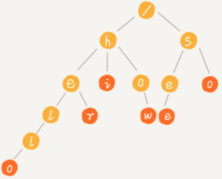

[TOC]

# 定义

Trie 树的本质：**利用字符串之间的公共前缀，将重复的前缀合并在一起**。



特点

1. 根节点不包含任何信息。
2. 每一个节点表示字符串的字符，从根节点到红色节点的路径表示一个字符串。

# 构造过程

每一步相当于往Trie 树中，插入一个字符串。所有字符串插入完毕，一棵字典树就构造完成了。


查找 her （绿色的路径）


查找 he ：e 节点并不是红色，说明 “he” 只是某个字符串的前缀，字典中并不存在“he” 这个字符串。


# 代码实现

##  python 字典实现

```python
class TrieNode:
    def __init__(self, data=None):
        self.data = data
        self.children = {}

class Trie:
    def __init__(self):
        self.root = TrieNode("/")

    def insert(self, text):
        p = self.root
        for i in range(len(text)):
            if text[i] not in p.children:
                p.children[text[i]] = TrieNode()
            p = p.children[text[i]]
        p.data = text

    def find(self, pattern):
        p = self.root
        for i in range(len(pattern)):
            if pattern[i] not in p.children: return
            p = p.children[pattern[i]]
        return p.data
```

更具有python 风格的实现

```python
class Trie2:
    def __init__(self):
        self.root = TrieNode("/")

    def __contains__(self, key):
        return self[key] is not None

    def __getitem__(self, key):
        p = self.root
        for char in key:
            p = p.children[char]
            if not p: return
        return p.data

    def __setitem__(self, key, value):
        p = self.root
        for i, char in enumerate(key):
            # 只有结束结点才写入 data
            if char not in p.children:
                p.children[char] = TrieNode()
            p = p.children[char]
        p.data = value
        
 if __name__ == "__main__":
    trie = Trie2()

    # 增
    trie["自然"] = "nature"
    trie["自然人"] = "human"
    trie["自然语言"] = "language"
    trie["自语"] = "talk to oneself"
    trie["入门"] = "introduction"
    assert '自然' in trie

    # 删
    trie["自然"] = None
    assert '自然' not in trie

    # 改
    trie["自然语言"] = "human language"
    assert trie["自然语言"] == "human language"

    # 查
    assert trie["入门"] == "introduction"
```


## 自己设计散列表

假设：所有的字符串只有 a - z 这 26 个字母。

```python
class TrieNode:
    def __init__(self, data):
        self.data = data
        self.children = [None] * 26
        self.isEndingChar = False


class Trie:
    def __init__(self):
        self.root = TrieNode("/")

    # 往 Trie 树中插入一个字符串
    def insert(self, text):
        p = self.root
        for i in range(len(text)):
            index = ord(text[i]) - ord("a")
            if not p.children[index]:
                p.children[index] = TrieNode(text[i])
            p = p.children[index]
        p.isEndingChar = True

    # 在 Trie 树中查找一个字符串（精确查找）
    def find(self, pattern):
        p = self.root
        for i in range(len(pattern)):
            index = ord(pattern[i]) - ord("a")
            if not p.children[index]:
                return False
            p = p.children[index]
        return p.isEndingChar
```


Trie Tee 的 children 可以是有序数组，调表，散列表，红黑树等。

Trie Tree 有一些变体，可以在一定程度上缓解内存消耗的问题，比如：缩点优化。

缩点优化：对只有一个子节点的结点，且此节点不是结束结点，可以将此节点与子节点合并。


# Trie Tree VS 散列表 VS 红黑树

Trie Tree 使用场景要求比较严苛

1. 字符串中包含的字符集不能太大。
2. 字符串的前缀重合比较多。
3. Trie Tree 一般要求自己实现。
4. Trie Tree 使用了指针，数据在内存中是散乱的，对缓存不友好。

一般工程中**精确匹配**使用 行列表和 红黑树就可以了。

Trie Tree 不适合精确匹配，适合**模糊匹配**。