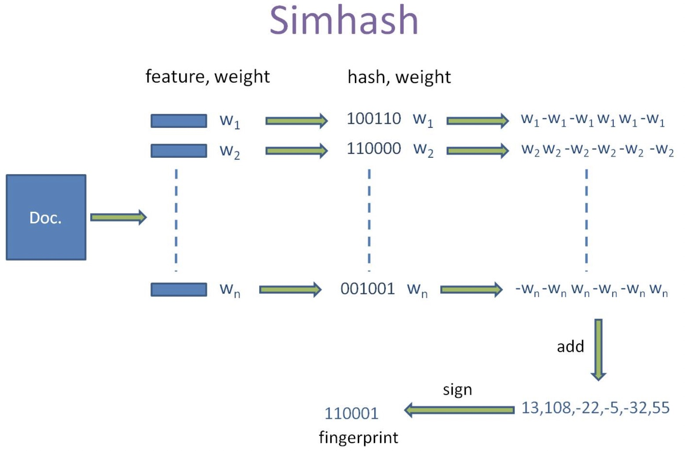

simhash是 google 用来处理海量文本去重的算法。

simhash本质上是**局部敏感性的hash**



Simhash 值计算过程：

```python
# 1. 将 doc 分词并计算权重:(feature,weight)
feature_weight_pairs = [ (f1,w1),(f2,w2)…(fn,wn) ]

# 2. 生成图中：(hash,weight),假设 bits_count = 6
hash_pairs = [ (hash(f),w) for f,w in feature_weight_pairs ]

# 3. 对 hash_weight_pairs 进行位的纵向累加，如果是 1,则 +weight,如果是 0,则 -weight,最后生成 bits_count = [13,108,-22,-5,-32,55]

# 4. [13,108,-22,-5,-32,55] -> 110001。正 1 负 0
```

判断文档是否相似：simhash 值海明距离

```python
doc_a = 100111
doc_b = 101010
hamming_distance=(doc_a ^ doc_b).count()
```


**A和B的海明距离是否小于等于n，这个n值根据经验一般取值为3**

simhash本质上是**局部敏感性的hash**

```java
    public static int hammingDistance(long src, long dest) {
        BigInteger srcBig = BigInteger.valueOf(src);
        BigInteger destBig = BigInteger.valueOf(dest);
        BigInteger x = srcBig.xor(destBig);
        int tot = 0;

        for (int i = 0; i < Long.SIZE; i++) {
            BigInteger bitmask = new BigInteger("1").shiftLeft(i);
            if (x.and(bitmask).signum() != 0) {
                tot += 1;
            }
        }
        return tot;
    }
```

