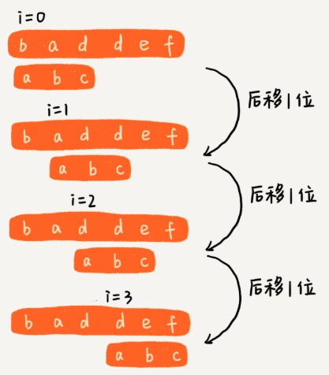
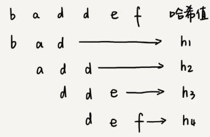

[TOC]

实现： Java 中的 indexOf()。

# BF 算法( Brute Force )

BF 暴力匹配算法。

我们在字符串 A 中查找字符串 B，那字符串 A 就是==**主串**==，字符串 B 就是==**模式串**==。

**BF 算法的思想**：**在主串中，检查起始位置分别是： 0，1，2 ... n - m 且长度为 m 的 n - m + 1 个子串，看有没有跟模式串匹配的**。



```python
def find(main, pattern):
    n = len(main)
    m = len(pattern)
    if m >= n: return 0 if pattern == main else -1

    for i in range(n - m + 1):
        j = 0
        while j < m and main[i + j] == pattern[j]:
            j += 1
        if j == m:
            return i
    return -1
```

极端的情况：

主串："aaaaaaa...aaaaa"

模式串：“aaaaaaaab”

每次对比 m 个字符，要对比 n - m + 1 次，最坏情况时间复杂度是：O( n * m )

 

尽管 BF 算法时间复杂很高，但是在实际开发中经常使用。

原因：

1. 实际开发中，模式串和主串都不会太长。并且每次匹配时，当遇到不匹配时，就停止了，每次匹配不需要 m 次匹配。
2. 算法思想非常简单，代码实现也非常简单。简单意味着不容易出错，如果有 bug 也容易修复。


# RK 算法（Rabin-Karp）

RK 算法 名称是由它的发明者：Rabin 和 Karp 的名字组合得来。

RK 算法是对 BF 算法的优化。

每次检查主串与模式串是否匹配时，需要依次对比每个字符，所以这是 BF 算法的时间复杂度比较高的根源。

如果引入哈希算法，时间复杂度立刻就会降低。


**RK 算法思路：对主串的 n - m + 1 个子串分别求哈希值，这样匹配时的复杂度就下降为O(1)。暂时不考虑hash 冲突问题**



 