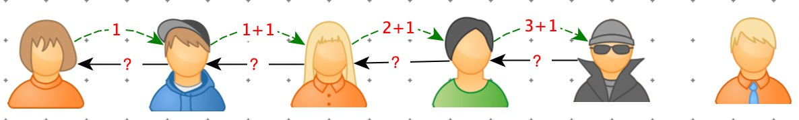
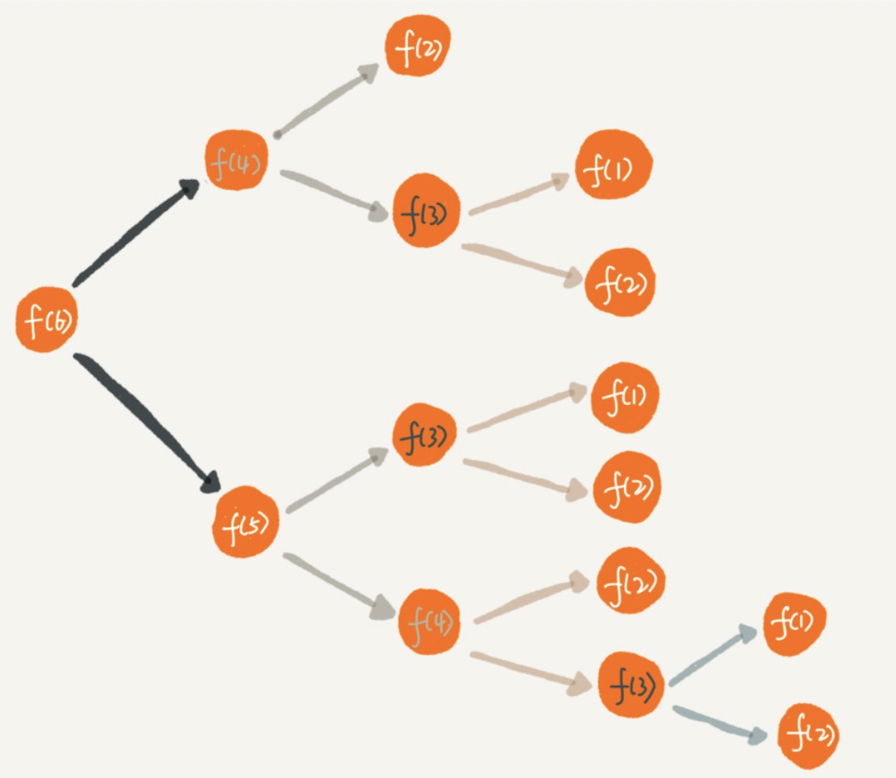

[TOC]

# 递归概念

问题：

> 周末你带着女朋友去电影院看电影，女朋友问你，咱们现在坐在第几排啊？电影院里面太黑了，看不清，没法数，现在你怎么办？

方案：运用递归。

于是你就问前面一排的人他是第几排，你想只要在他的数字上加一，就知道自己在哪一排了。但是，前面的人也看不清啊，所以他也问他前面的人。就这样一排一排往前问，直到问到第一排的人，说我在第一排，然后再这样一排一排再把数字传回来。直到你前面的人告诉你他在哪一排，于是你就知道答案了。



”问“ 的过程是”递“（从右向左）。

”回答“的过程是”归“（从左向右）。


递推公式：

> f(n) = f(n-1) + 1

终止条件：

> f(1) = 1

代码：

```python
def f(n):
    if n == 1: return 1
    return f(n - 1) + 1
```

# 递归满足的三个条件

1. 问题的解可以拆分为几个子问题的解
2. 原问题与子问题除了数据规模不同，求解思路完全一样。
3. 存在终止条件。

# 递归关键

==关键就：找到如何将大问题分解为小问题的规律，并且基于此写出递推公式，然后推敲终止条件。最终翻译成代码。==

电影院的例子，我们的递归调用只有一个分支，也就是说“一个问题只需要分解为一个子问题”，我们很容易能够想清楚“递“和”归”每一个步骤，所以写起来、理解起来都不难。

但是，一个问题要分解为多个子问题时，递归代码就没那么好理解了。

例如：

> 这里有 n 个台阶，每次你可以跨 1 个台阶或者 2 个台阶，请问走这 n 个台阶有多少种走法？如果有 7 个台阶，你可以 2，2，2，1 这样子上去，也可以 1，2，1，1，2 这样子上去，总之走法有很多，那如何用编程求得总共有多少种走法呢？

站在第 n 阶台阶上，向前看，它可能来自 n - 1 阶 也可能来自 n - 2 阶。

递推公式：

> f( n ) = f(n - 1) + f (n - 2) 

终止条件：

> f(1) = 1
>
> f(2) = 1

```python
def f(n):
    if n == 1 or n == 2: return 1
    return f(n - 1) + f(n - 2)
```


像这个例子，原问题被分解为两个子问题，处理方法也是将两个子问题简单求和。人脑已经无法把整个”递“ 和 ”归“ 的过程一步一步想清楚了。

写递归代码时，试图想清楚整个递和归过程的做法，是一个思维误区。

正确的思维：

如果一个问题 A 可以分解为若干子问题 B、C、D，你可以假设子问题 B、C、D 已经解决，在此基础上思考如何解决问题 A。而且，你只需要思考问题 A 与子问题 B、C、D 两层之间的关系即可，不需要一层一层往下思考子问题与子子问题，子子问题与子子子问题之间的关系。屏蔽掉递归细节，这样子理解起来就简单多了。


==编写递归代码的关键是，只要遇到递归，我们就把它抽象成一个递推公式，不用想一层层的调用关系，不要试图用人脑去分解递归的每个步骤。==

# 递归常见问题

## 警惕堆栈溢出

堆栈溢出会造成系统性崩溃，后果很严重。为什么递归容易造成堆栈溢出呢？

每个函数调用，都会将临时变量封装为栈帧压入内存栈，等函数执行完成返回时，才出栈。系统栈或者虚拟机栈空间一般都不大。如果递归调用层次很深，一直压入栈，就有堆栈溢出的风险。

> Exception in thread "main" java.lang.StackOverflowError


**方案：限制递归调用的最大深度**

比如：限制调用超过1000次之后，就不再递归了，直接返回报错。

电影院的例子优化：

```python
# 全局变量：递归的深度
depth = 0

def f2(n):
    global depth
    depth += 1
    if depth > 1000: raise RuntimeError("递归太深")
    if n == 1: return 1
    return f(n - 1) + 1
```

缺点：

1. 代码复制，可读性差
2. 没有完全解决问题。

## 警惕重复计算



上图是递归过程：

 f(5) = f(4) + f(3)

f(4) = f(3) + f(2)

f(3) 被重复计算了。

**方案：使用一种数据结构（散列表）存储计算结果**

走阶梯例子优化：

```python
hasSolvedList = set()

def f2(n):
    if n == 1 or n == 2: return n
    if n in hasSolvedList:
        return hasSolvedList[n]
    ret = f(n - 1) + f(n - 2)
    hasSolvedList.add(ret)
    return ret
```

 

除此之外：递归调用了很多次函数，反反复复压栈出栈，时间复杂度和空间复杂度都很高。

递归优点：表达力很强，写起来非常简洁。

方案：将递归代码改为迭代。

## 将递归代码改为迭

电影院的例子：

```python
# 迭代实现
def f3(n):
    ret = 1
    for i in range(2, n + 1):
        ret += 1
    return ret
```

走阶梯例子:

```python
def f3(n):
    if n == 1 or n == 2: return n
    ret = 0
    pre = 2
    prepre = 1
    for i in range(3, n + 1):
        ret = pre + prepre
        prepre = pre
        pre = ret
    return ret
```

递归本身是借助栈来实现的，只不过使用的系统或者虚拟机提供的栈，我们没有感知罢了。如果手动模拟入栈和出栈，任何递归代码都可以写成迭代的方式。


迭代方式：从上边例子看到，中间多了一些中间变量保存。增加了代码复杂度。

# 例子

> 题目：假设有四种面额的钱币，1元、2元、5元和10元，而您一共给我10元，那您可以奖赏我1张10元，或者10张1元，或者5张1元外加1张5元等等。如果考虑每次奖赏的金额和先后顺序，那么最终一共有多少种不同的奖赏方式呢？

```python
# 四种面额的纸币
rewards = [1, 2, 5, 10]

'''
    Args:
        total_reword: 奖赏总金额
        result: 保存当前的解
'''
def get_sum_combo(total_rewards, result=[]):
    # 当 totalReward = 0 时，证明它是满足条件的解，结束嵌套调用，输出解
    if total_rewards == 0:
        print(result)
        return
    # 当 totalReward < 0 时，证明它不是满足条件的解，不输出
    if total_rewards < 0:
        return
    for re in rewards:
        # 由于有 4 种情况，需要 clone 当前的解并传入被调用的函数
        new_result = copy.copy(result)
        # 记录当前的选择，解决一点问题
        new_result.append(re)
        # 剩下的问题，留给嵌套调用去解决
        get_sum_combo(total_rewards - re, new_result)
```

