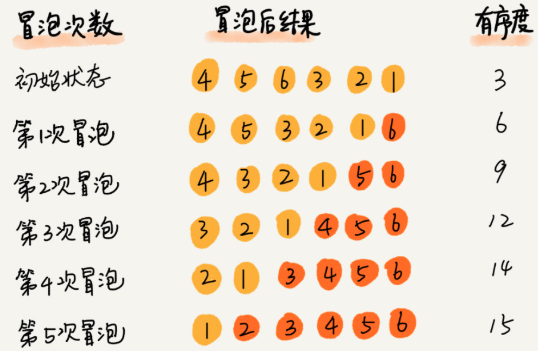
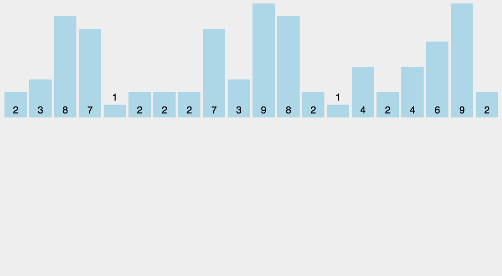

[TOC]

# 概述

## 常见的排序算法

| 排序算法         | 时间复杂度 | 是否基于比较 | 空间复杂度 |
| ---------------- | ---------- | ------------ | ---------- |
| 冒泡，插入，选择 | $O(n^2)$   | 是           | $ O(1)$    |
| 快排，归并       | $O(nlogn)$ | 是           |            |
| 桶，计数，基数   | $O(n)$     | 否           |            |

# 如何分析一个“排序算法”

## 排序算法执行效率

### 最好情况，最坏情况，平均情况的时间复杂度

了解排序算法在不同数据下的性能表现。

### 时间复杂度的系数，常数，低阶

O(n) 表示法会忽略系数，常数，低阶。但是开发中排序的规模很小时，系数，常数，低阶对性能影响很大。

### 比较次数和交换（或移动）次数

基于比较排序算法的执行过程：

1. 元素比较大小。
2. 元素交换或者移动。

## 排序算法的内存消耗

算法内存消耗：通过空间复杂度来衡量。

排序算法引入一个新概念：==原地排序==（Sorted in place）,空间复杂度为O(1)

## 排序算法是否稳定

稳定性：如果待排序的序列中存在==**值相等的元素**==，经过排序之后，相等元素之间原有的先后顺序不变。

稳定性意义：对于多建排序(A,B)。

方案一：

1. 按 A 进行排序
2. A 相同的按B 排序。

实现时，很多细节，实现麻烦。

如果借用稳定排序。

方案二：

1. 按 A 进行排序
2. 按 B 进行排序

# 排序算法

## 冒泡算法（Bubble Sort）


```python
# 冒泡排序
def bubble_sort(nums):
    for i in range(1,len(nums)):
        for j in range(len(nums) - i):
            if nums[j] > nums[j + 1]: nums[j], nums[j + 1] = nums[j + 1], nums[j]
    return nums

'''
优化后排序，如果没有交换，那么nums 已经有序，直接退出。
'''
def bubble_sort2(nums):
    for i in range(1,len(nums)):
        flag = False
        for j in range(len(nums) - i):
            if nums[j] > nums[j + 1]:
                flag = True
                nums[j], nums[j + 1] = nums[j + 1], nums[j]
        if not flag:
            return nums
    return nums

print(bubble_sort([1, 5, 2, 3]))
print(bubble_sort2([1, 5, 2, 3]))
```

1. 冒泡排序是原地排序算法吗？

   只有比较大小和交换位置，空间复杂度为：O(1)，==是原地排序算法==。

2. 冒泡排序是稳定排序算法吗？

   当元素相等时，不做交换，所以==是稳定排序算法==。

3. 冒泡排序的时间复杂度多少？

   优化后的冒泡排序：

   最好情况：1，2，3，4，5，6：只冒一次泡，$ O(n)$

   最坏情况：6，5，4，3，2，1：冒 6 次泡，$O(n^2)$ 

   平均情况：$ \frac{n*(n-1)}{4} $ 即为 $ O(n^2) $

   ​	平均情况计算比较复杂，可以通过概率论的知识求解。也可以通过==“有序度”和“逆序度”==两个概念分析。

   **有序度**：数组中具有有序关系的元素对的个数。

   > 有序元素对： a[i] <= a[j]  and i < j

   例子：[ 2，4，3，1，5，6 ]

   有序对：(2 , 4) , (2 , 3) , (2 , 5) ,(2 , 6)

   ​               (4 ,5) , (4 , 6)

   ​			   (3 , 5) , (3 ,6)

   ​				(1 , 5) , (1 , 6)

   ​				(5 , 6)

   有序元素对：11 个

   [ 6，5，4，3，2，1 ] 有序元素对：0 个 

   [ 1，2，3，4，5，6 ] 有序元素对：$ \frac{n(n-1)}{2} $ 个

   这种完全有序的数组的有序度：==**满有序度**==

   逆序度与有序度刚好相反

   > 逆序元素对：a[i] > a[j] and i < j

   ==**逆序度 = 满有序度 - 有序度**==

   

   排序的过程就是：增加有序度，减少逆序度的过程。达到满有序度时，排序完成。

   

   ​	冒泡排序包含两个原子：比较和交换。

   ​    每交换一次，有序度 +1。

   不管怎么改进，交换次数总是确定的，即为**逆序度**。$ \frac{n*(n-1)}{2} - 初始有序度 $ 。

   n 个元素的数组进行冒泡排序：

   最好情况，初始有序度为 $ \frac{n*(n-1)}{2}$ ,需要 0 次交换。

   最坏情况，初始有序度为 0，需要$ \frac{n*(n-1)}{2}$ 次交换，即为 $ O(n^2) $

   平均情况，$[0,\frac{n*(n-1)}{2}]$ 的中间值 $ \frac{n*(n-1)}{4} $ ，即为 $ O(n^2) $

## 


## 插入排序（Insertion Sort）


向一个有序数组中插入一个数据，如何保证插入后依然是有序数组。遍历数组（二分查找）对应位置插入。

插入排序就是借鉴的这种思想。

插入排序：将数组划分为连个区间：==**已排序区间和未排序区间**== 。从未排序区间获取数据，插入已排序区间。

```python
# 插入排序的标准姿势
def insertion_sort(nums):
    for i in range(1, len(nums)):
        cur = nums[i]
        j = i - 1
        while j >= 0 and nums[j] > cur:
            nums[j + 1] = nums[j]
            j -= 1
        nums[j + 1] = cur
    return nums
  
  
def insertion_sort(array):
    if not array or len(array) < 2: return

    for i in range(len(array)):
        j = i - 1
        while j >= 0 and array[j] > array[j + 1]:
            array[j], array[j + 1] = array[j + 1], array[j]
            j -= 1
  
  
print(insertion_sort2([4, 5, 6, 1, 3, 2]))
```

1. 插入排序是原地排序算法吗？

   只有比较大小和交换位置，空间复杂度为：O(1)，==是原地排序算法==。

2. 插入排序是稳定排序算法吗？

   当元素相等时，我们可以选择插入前边和后边，所以==是稳定排序算法==。

3. 插入排序的时间复杂度多少？

   最好的情况：数组已有序，不需要插入，只需要遍历一遍数据，时间复杂度为：$O(n)$ 

   最坏的情况：数组倒序，需要 n 次插入，每次选择插入位置时间为 $O(n)$, 整体时间复杂度：$O(n^2)$ 

   平均情况：假设有 n/2 次插入，每次选择插入位置时间为 $O(n)$，整体时间复杂度：$O(n^2)$

虽然冒泡排序和插入排序的时间复杂度为 $O(n^2)$ ，但是插入排序在实际工程中应用更广泛。应为冒泡排序没有优化空间，而插入排序有。比如希尔排序。


### 希尔排序

希尔排序是插入排序升级版。

```python
def shell_sort(nums):
    n = len(nums)
    gap = int(n / 2)

    while gap > 0:
        for i in range(gap, n):
            temp = nums[i]
            j = i
            # 插入排序
            while j >= gap and nums[j - gap] > temp:
                nums[j] = nums[j - gap]
                j -= gap
            nums[j] = temp
        gap = int(gap / 2)
    return nums
```

# 选择排序（selection sort）


选择排序与插入排序思路类似：将数组划分为连个区间：==**已排序区间和未排序区间**== 。选择排序每次会从未排序区选择最小元素，插入已排序区的最后。

```python
# 搜索排序的标准姿势
def selection_sort(nums):
    for i in range(n):
        # 或者最小值
        min_index = i
        for j in range(i+1, n):
            if nums[min_index] > nums[j]:
                min_index = j
        # 已排序区间末尾
        nums[i], nums[min_index] = nums[min_index], nums[i]
    return nums
```

1. 选择排序是原地排序算法吗？

   只有比较大小和交换位置，空间复杂度为：O(1)，==是原地排序算法==。

2. 选择排序是稳定排序算法吗？

   在非排序区查找最小值，与前边元素交换，破坏了稳定性。==不是稳定排序算法==

   例如：$[7_1,2,5,9,3,4,7_2,1]$ 1 是非排序区最小元素，1 与 $7_1$ 交换位置。这样就破坏了 $7_1 与 7_2$ 之间的原有的顺序。

3. 选择排序的时间复杂度多少？

   选择的情况：数组已有序，遍历一遍数据需要时间 n，每次都需在非排序区查找最小值 所需时间为 n，时间复杂度为：$O(n)$ 

   最坏的情况：与最好情况一样，整体多了 n 次插入操作, 整体时间复杂度：$O(n^2)$ 

   平均情况：与最好情况一样，整体多了 n/2 次插入操作, 整体时间复杂度：$O(n^2)$ 

4. 


# 桶排序(bucket sort)

之前排序算法最低时间复杂度最低是：O(nlogn)

接下来，在特定的场景下，时间复杂度突破O(nlogn),达到 O(n)


桶排序基本思想：将排序的数据分到几个桶里，每个桶里单独排序，然后将每个桶中的数据依次取出，组成有序的序列。


```python
# 指定桶的数量
def bucket_sort(nums, bucket_count):
    # 分桶
    buckets = [[] for i in range(bucket_count)]
    margin = int((max(nums) - min(nums)) / bucket_count) + 1
    for num in nums:
        j = int(num / margin)
        if j == bucket_count: j -= 1
        buckets[j].append(num)

    # 桶内排序
    for i in range(bucket_count):
        buckets[i] = sorted(buckets[i])

    # 整体排序
    k = 0
    for i in range(bucket_count):
        for j in range(len(buckets[i])):
            nums[k] = buckets[i][j]
            k += 1
    return nums
```

上边代码有个缺陷：无法对负数，小数进行排序。

桶排序对数据要求比较苛刻：==数据分布尽可能均匀==。如果所有数据都划分到一个桶里，那么算法将退化为：O(nlogn)

==桶与桶之间天然有着顺序==，桶与桶之间不需要再进行排序。

1. 桶排序是原地排序算法吗？

   桶排序借助了桶，所以==不是原地排序算法==。

2. 归并排序是稳定排序算法吗？

   桶排序，**跟实现有关**，第一种实现，存储原始数据是==稳定排序==。但是第二种实现，只是计数，丢掉了原始数据的顺序，就是：==非稳定排序==。

3. 归并排序的时间复杂度多少？

   跟数据的分布和桶的数量有关。正常情况下是O(n)

   假设：有 n 个数据，m 个桶，平均每个桶中有 k = n/m  条数据。

   ​			桶内快排：O(k*logk)

   ​			m 个桶：$O(m*k*logk)$

   ​			代入 k = n/m：$O(m*\frac{n}{m}*log\frac{n}{m})=O(n*log(\frac{m}{n}))$

   ​			当 m 接近 n 时，k = 1，那么：O(n)

## 应用：外部排序

所谓外部排序，数量非常大，存储在磁盘上，无法将数据全部加载到内存中。

例如：有 100 GB 的订单数据，需要按金额（假设是正整数）进行排序，内存只有500MB。

步骤：

1. 扫一遍数据，获取 min = 1元，max = 10万元。
2. 将订单数据根据金额划分到100个桶里，[1,1000],[1001,2000]...，每个桶对应一个文件。
3. 如果数据分布均匀，每个文件大概在100MB 左右，将每个文件中的数据，加载到内存中排序，将排序结果存入新的文件。
4. 根据排序后的文件的结果，合并成最终文件。
5. 如果数据分布不均等，发现[1,1000] 数量特别大。那么针对这个文件，再次划分，直到所有文件都能加载的内存为止。

# 计数排序( counting sort )

==计数排序是桶排序的一种特殊情况。==

n 个数据中，k = max(nums) ，那么将数据分到 k 个桶中，每个桶中的数值都是相同的，省掉了桶内排序的时间。



```python
def counting_sort(nums):
    bucket_count = max(nums) + 1
    # 创建桶
    buckets = [0 for i in range(bucket_count)]

    # 计数
    for num in nums:
        buckets[num] += 1
        
    # 整体排序
    k = 0
    for i in range(bucket_count):
        while buckets[i] > 0:
            nums[k] = i
            k += 1
            buckets[i] -= 1

    return nums
```

这是最简单计数排序，但是不是稳定排序，在 buckets 中丢到顺序。

改进方案：

```python
def counting_sort2(nums):
    bucket_count = max(nums) + 1
    # 创建桶
    buckets = [0 for i in range(bucket_count)]

    # 计数
    for num in nums:
        buckets[num] += 1
	
  	# 累加
    for i in range(1, bucket_count):
        buckets[i] += buckets[i - 1]

    # 整体排序
    r = nums[:]
    for i in range(len(nums) - 1, -1, -1):
        index = buckets[nums[i]] - 1
        r[index] = nums[i]
        buckets[nums[i]] -= 1

    nums = r[:]
    return nums
```

**总结：计数排序只能用在数据范围不大的场景中，如果要排序。如果范围 k 比 数据量 n 大很多，就不适合计数排序了。计数排序只能为非负数排序，如果有负数的场景，在不改变相对大小的前提下，转化为非负数**

例如：数据范围是[-1000,1000],可以对每个数加1000，转换。

如果是精确到小数后一位，可以对每个数乘10。

# 基数排序(Radix sort)

问题：有 10 个手机号，希望从小到大排序？

方案分析：快排是O(nlogn)

桶排序和计数排序但是手机号11位，范围太大不合适。

场景特点：比较手机号a、b，如果 a 的高位大于b 的高位，那么后边几位就不需要比了。如此可以，先比较第一位，然后比较第二位。==注意：排序方法要稳定，否则低位排序就没有意义了==。


```python
def radix_sort(nums):
    if len(nums) < 2: return
    l = len(str(max(nums)))

    i = 0
    while i < l:
        buckets = [[] for i in range(10)]
        for x in nums:
            buckets[int(x / (10 ** i)) % 10].append(x)

        nums.clear()
        for bucket in buckets:
            for y in bucket:
                nums.append(y)
        i += 1
    return nums
```

对于不等长的数字，可以在前边补0。

对于不等长的单词，在后边补0，因为所有字母的 [ASCII 值](https://zh.wiktionary.org/wiki/US-ASCII) 都大于0.

总结：

1. 基数排序的数据，需要可以割出来独立的“位”来比较，而且位之间有递进关系，如果 a 的高位比 b 数据大，那剩下的低位不就需要比较了。

2. 每个位的数据范围不能太大，要可以用线性算法排序。否则基数排序就无法做到O(n)了。

   

1. 基数排序是原地排序算法吗？

   基数排序借助了桶排序，所以==是非原地排序算法==。

2. 归并排序是稳定排序算法吗？

   基数排序借助了桶排序，所以==是稳定排序==。

3. 归并排序的时间复杂度多少？

   基数排序借助了桶排序，所以==是O(n)==。


# 排序算法的选择


| 排序     | 时间复杂度              | 空间复杂度 | 是稳定排序？       | 是原地排序？       |
| -------- | ----------------------- | ---------- | ------------------ | ------------------ |
| 冒泡排序 | $O(n^2)$                | O(1)       | :white_check_mark: | :white_check_mark: |
| 插入排序 | $O(n^2)$                | O(1)       | :white_check_mark: | :white_check_mark: |
| 选择排序 | $O(n^2)$                | O(1)       | :crossed_swords:   | :white_check_mark: |
| 快速排序 | O(nlogn)                | O(log n)   | :crossed_swords:   | :crossed_swords:   |
| 归并排序 | O(nlogn)                | O(n)       | :white_check_mark: | :crossed_swords:   |
| 堆排序   | O(nlogn)                | O(1)       | :crossed_swords:   | :white_check_mark: |
| 计数排序 | $O(n + k)$ k 是数据范围 |            |                    |                    |
| 桶排序   | $O(n)$                  |            |                    |                    |
| 基数排序 | $O(dn)$ d 是维度        |            |                    |                    |


选择排序：时间复杂度是 $O(n^2)$，还不稳定。比较鸡肋。

冒泡排序，插入排序，选择排序时间复杂度都是 $O(n^2)$，小量数据上使用没有问题。


大量数据时，最好使用 O(nlogn) 的排序方法。

虽然快速排序和归并排序都是 O(nlogn)，但是快速排序的常数项比较小，排序速度由于归并排序。


在实际的工作中，根据需求选择排序方法，

- 如果需要稳定性，那么选用归并排序。
- 如果不需要稳定性，要求空间占用小，使用堆排序。
- 如果不需要稳定性，要求速度一定要快，使快速排序。


# 常见的坑

1. 归并排序的额外空间复杂度可以变成 O(1)，但是非常难，不需要掌握，有兴趣可以搜“归并排序 内部缓存法”
2. “原地归并排序” 的帖子都是垃圾，会让归并排序的时间复杂度变成 $O(N^2)$
3. 快速排序可以做到稳定性，当时非常难，不需要掌握，可以搜“O1 stable sort”
4. 所有的改进都不重要，因为目前没有找到时间复杂度 O(N * log N)，额外空间复杂度 O(1)，又稳定的排序。
5. 有一道题目，是奇数放在数组左边，偶数放在数组右边，还要求原始的相对次序不变，碰到这个问题，可以怼面试官。


