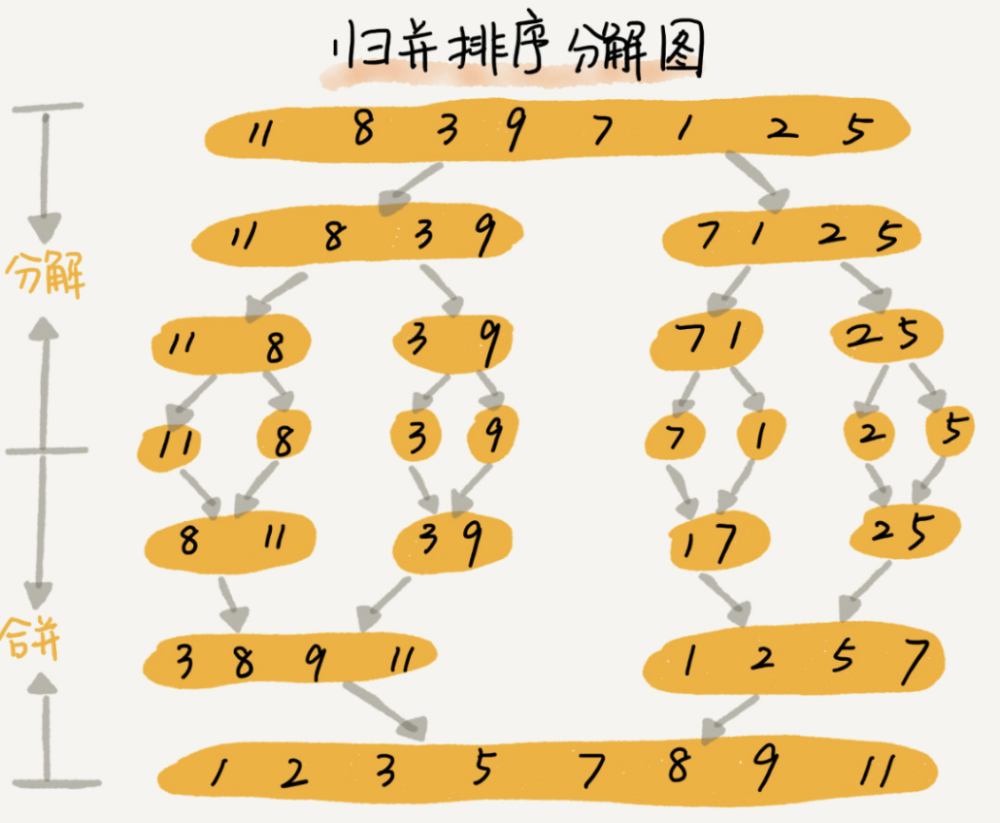
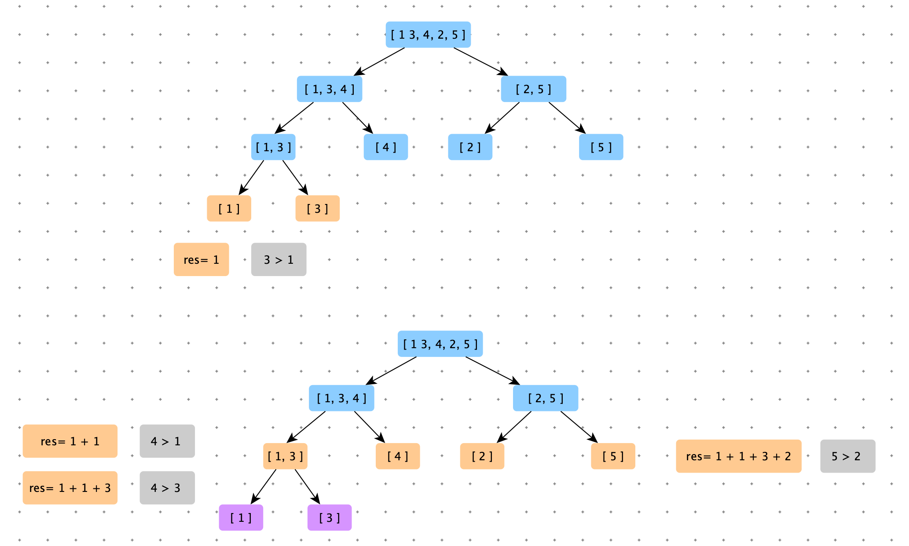
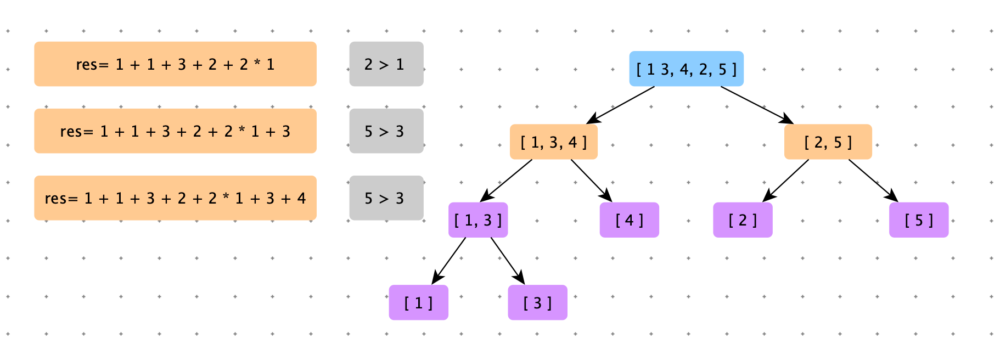
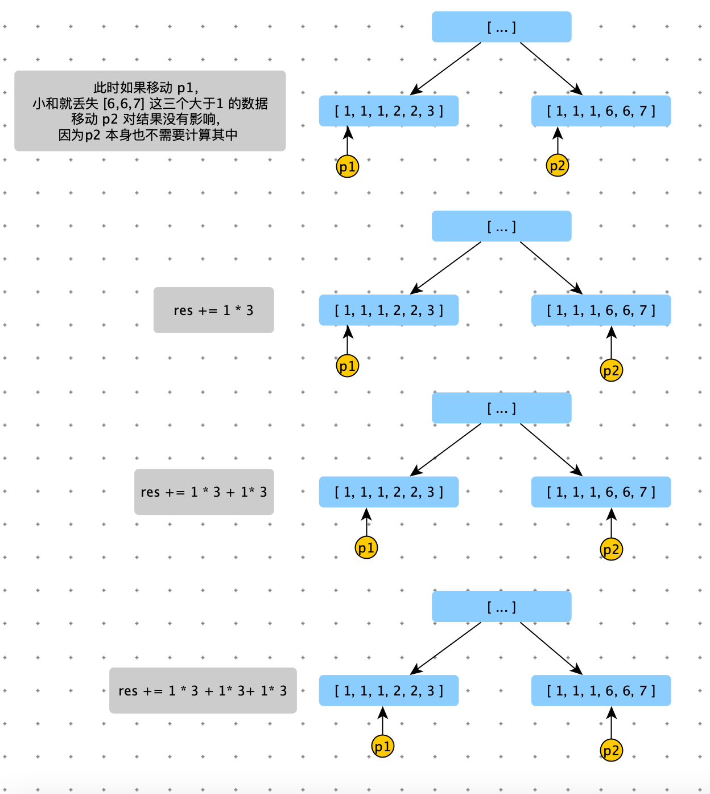

[TOC]

# 归并排序（Merge Sort）




关键点：

1. 分治思想

```python
def merge_sort(nums, start, end):
    if start >= end: return
    mid = (start + end) >> 1
    merge_sort(nums, start, mid)
    merge_sort(nums, mid + 1, end)
    merge(nums, start, mid, end)


def merge(nums, start, mid, end):
    if start >= mid or mid >= end: return
    left_nums = nums[start: mid]
    right_nums = nums[mid: end]
    # 添加哨兵
    left_nums.append(sys.maxsize)
    right_nums.append(sys.maxsize)

    l = r = 0
    for i in range(start, end):
        if (left_nums[l] <= right_nums[r]):
            nums[i] = left_nums[l]
            l += 1
        else:
            nums[i] = right_nums[r]
            r += 1

```

> 递推公式：
>
> merge_sort(low , high) = merge( merge_sort(low , mid),merge_sort(mid+1,high) )
>
> 终止条件
>
> low >= high

merge 方法时将==**两个有序数据，合并成一个有序数组**==。

1. 归并排序是原地排序算法吗？

   在merge 过程中借助了新数组，空间复杂度为：O(n)，==不是原地排序算法==。

2. 归并排序是稳定排序算法吗？

   归并排序是否稳定，关键看 merge 函数。if left_nums[l] == right_nums[r] 优先放 left_nums 中元素，那么就是==稳定排序==。

3. 归并排序的时间复杂度多少？

   $O(nlog{n})$

   - T(a) 求解问题 a 的所需的时间

   - T(b) 求解子问题 b 的所需的时间

   - T(c) 求解子问题 c 的所需的时间

   - K 将两个子问题 b ，c 结果merge 所消耗的时间。

   $$
   \begin{align}
   T(a) =& T(b) + T(c) + K \\
   \\
   T(1) =& C \\
   T(n) =& 2*T(\frac{n}{2}) + n \\
   		 =& 2*(2*T(\frac{n}{4})+\frac{n}{2}) + n = 4*T(\frac{n}{4}) + 2*n \\
   		 =& 4*(2*T(\frac{n}{8})+\frac{n}{2}) + 2*n =  8*T(\frac{n}{8}) + 3*n \\
   	 =& 8*(2*T(\frac{n}{16})+\frac{n}{2}) + 3*n =  16*T(\frac{n}{16}) + 4*n \\
   		 =& ....... \\
   	 =& 2^k * T(n/2^k) + k*n \\
   		 =& ....... \\
   \end{align}
   $$

   

```python
   T(a) = T(b) + T(c) + K
```


   归并排序的执行效率与要排序的原始数组的有序程度无关，所以其时间复杂度非常稳定。最好情况，最好情况，平均情况都是：O(nlogn).

4. 归并排序的空间复杂度多少？

   O(n)：在 merge 过程，需要借助额外的存储空间。

   注意：**空间复杂度不像时间复杂度一样，每次迭代都需要累加，临时开辟的内存空间使用完毕后，就会被释放掉。**


归并排序为什么会成为 O(nlogn)?

像冒泡排序，选择排序，插入排序。

第一次比较 N -1 次，选出一个值

第二次比较 N - 2 次，选出一个值

第三次比较 N - 3 次，选出一个值

...

每轮比较是独立的，也就是说前边一轮的比较过程，被丢弃了，后一轮无法使用前一轮的比较过程。

归并排序，在每次比较完毕，就会组织出一个有序的片段，下一轮比较中，利用了有序片段，也就是说利用之前比较的结果。所以归并排序的时间复杂度下降到 O(nlogn)


# 面试题

## 小和问题

> 在一个数组中，每一个数左边比当前数小的数累加起来，叫做这个数组的小和。求一个数组的小和。
>
> 【例子】【1	3	4	2	5】 
>
> 1 左边比 1 的小的数，没有；
>
> 3 左边比 3 的小的数，1；
>
> 4 左边比 4 的小的数，1、3；
>
> 2 左边比 2 的小的数，1；
>
> 5 左边比 5 的小的数，1、3、4、2；
>
> 所以小和为：1 + 1 +3 + 1 + 1 + 3 + 4 +2 = 16

上边的小和由 

4 个 1（因为：1 后边有 4 个数比 1 大的数）

2 个 3（因为：3 后边有 2 个数比 3 大的数）

1 个 4（因为：4 后边有 1 个数比 4 大的数）

1 个 2（因为：2 后边有 1 个数比 2 大的数）

组成。

因此问题可以转化为：求 k 数后边有几个数比 k 大？


类似归并排序。

在 merge 时，左节点的数据与右节点的数据一一比较（此时左节点和右节点上的数据都是有序的），跟归并排序是是一样的。如果中右节点的数据 b( 所在数据位置为 k ) 大于左节点的数据 a，那么此 b 数据之后的所有的数据都大于数据 a，此时累加小和：res += b * ( r- k + 1 ）。


此种方法：数据不会重复计算，也不会漏算。

做节点的数据与右节点的数据比较完毕后（只比较一次），就合并成一个数据了，之后他们之间不会比较，之后合更大的右节点比较。







<font color=red>注意：在左右节点数据比较时，如果相等，先移动有节点的数据。</font>



```python
def small_sum(nums):
    if not nums or len(nums) < 2: return 0
    return process(nums, 0, len(nums) - 1)


# num[l..r] 纪要排好，也要求小和
def process(nums, l, r):
    if l == r: return 0

    mid = (l + r) >> 1
    return process(nums, l, mid) + process(nums, mid + 1, r) + merge(nums, l, mid, r)


def merge(nums, l, mid, r):
    help = []
    p1 = l
    p2 = mid + 1
    res = 0
    # p1 和 p2 同时不越界
    while p1 <= mid and p2 <= r:
      	
        # 这里不能带等号
        if nums[p1] < nums[p2]:
          	# 由于 nums（子数组） 是有序的，比 num[p2] 后边所有的数据，都大于 nums[p1] 
            res += (r - p2 + 1) * nums[p1]
            help.append(nums[p1])
            p1 += 1
        else:
            help.append(nums[p2])
            p2 += 1
		# p1 不越界
    while p1 <= mid:
        help.append(nums[p1])
        p1 += 1

    # p2 不越界
    while p2 <= r:
        help.append(nums[p2])
        p2 += 1

    # 将 help 数组拷贝到 nums，是nums 在 l 到 r 这一段有序
    for i in range(len(help)):
        nums[l + i] = help[i]
    return res

# 暴力破解
def small_sum2(nums):
    if not nums or len(nums) < 2: return 0
    n = len(nums)
    res = 0
    for i in range(n):
        for j in range(i + 1, n):
            if nums[j] > nums[i]:
                res += nums[i]
    return res

import random
def random_array_generator(max_size, max_value):
    size = int(random.random() * max_size)
    return [int(random.random() * max_value) - int(random.random() * max_value) for _ in range(size)]

# 对数器
def check():
    n = 5000
    max_size = 100
    max_value = 100

    for i in range(n):
        nums = random_array_generator(max_size, max_value)
        nums2 = nums[:]
        expect = small_sum2(nums2)
        actual = small_sum(nums)
        if expect != actual:
            print("expect", expect, "actual", actual, "nums:", nums)
            break
    print("game Over!")


check()
```


## 逆序对问题

> 在一个数组中，左边的数如果比右边的数大，则这两个数构成一个逆序对，请打印所有的逆序对。


```python
def get_desc_order_pair(nums):
    if not nums or len(nums) < 2: return []
    res = []
    process(nums, 0, len(nums) - 1, res)
    return res


def process(nums, l, r, res):
    if l == r: return
    mid = (l + r) >> 1

    process(nums, l, mid, res)
    process(nums, mid + 1, r, res)
    merge(nums, l, mid, r, res)


def merge(nums, l, mid, r, res):
    help = []
    p1 = l
    p2 = mid + 1

    while p1 <= mid and p2 <= r:
        if nums[p1] <= nums[p2]:
            help.append(nums[p1])
            p1 += 1
        else:
            for i in range(p1, mid + 1):
                res.append((nums[i], nums[p2]))
            help.append(nums[p2])
            p2 += 1

    while p1 <= mid:
        help.append(nums[p1])
        p1 += 1

    while p2 <= r:
        help.append(nums[p2])
        p2 += 1

    for i in range(len(help)):
        nums[l + i] = help[i]


def get_desc_order_pair2(nums):
    if not nums or len(nums) < 2: return []
    res = []
    n = len(nums)
    for i in range(n):
        for j in range(i + 1, n):
            if nums[i] > nums[j]:
                res.append((nums[i], nums[j]))
    return res


import random
def random_array_generator(max_size, max_value):
    size = int(random.random() * max_size)
    return [int(random.random() * max_value) - int(random.random() * max_value) for _ in range(size)]

def check():
    n = 5000
    max_size = 10
    max_value = 10
    for i in range(n):
        nums = random_array_generator(max_size, max_value)
        nums2 = nums[:]
        expect = get_desc_order_pair2(nums2).sort()
        actual = get_desc_order_pair(nums).sort()

        if expect != actual:
            print("expect:", expect, "actual:", actual, "nums:", nums)
    print("Game Over!")

check()
```

