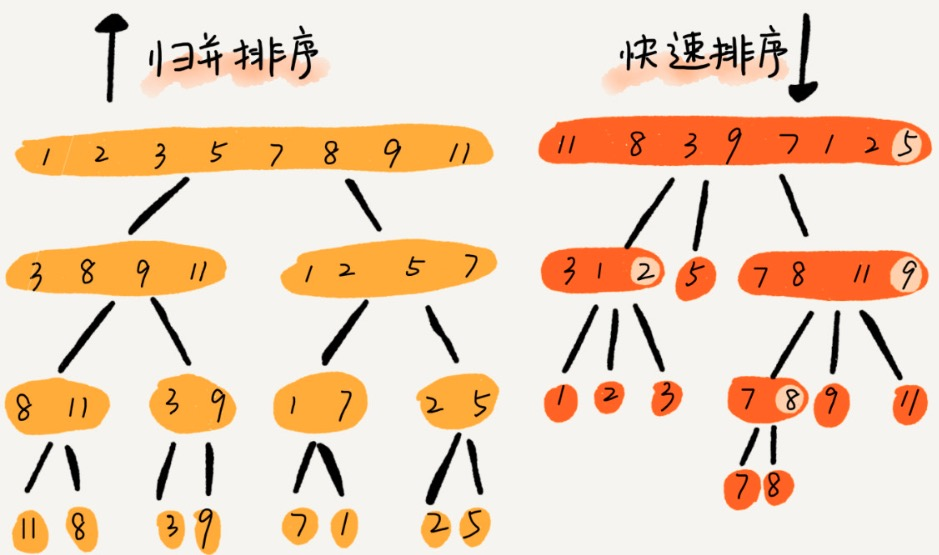
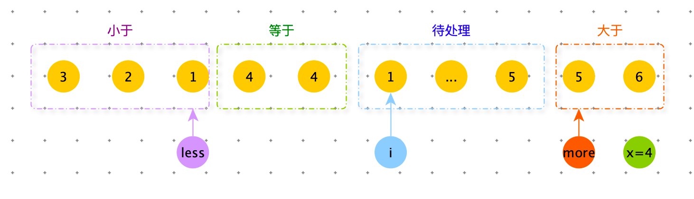
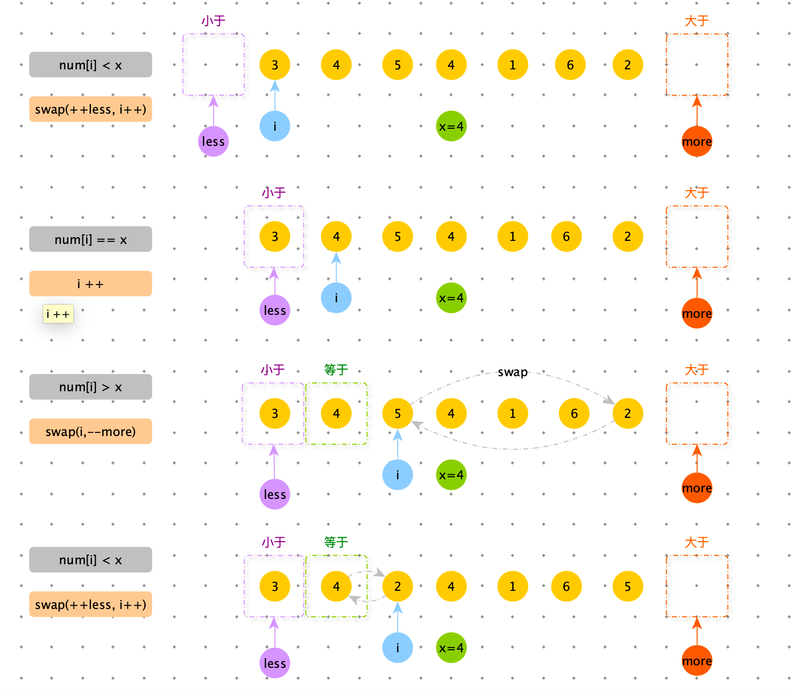
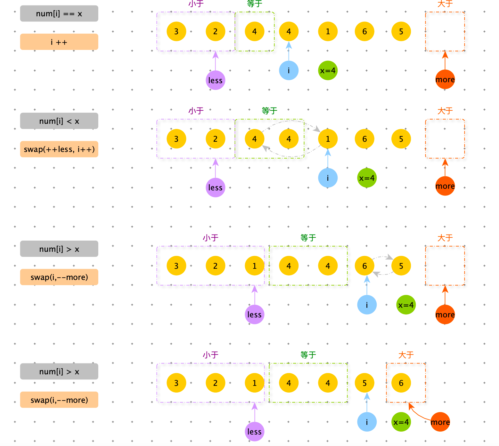
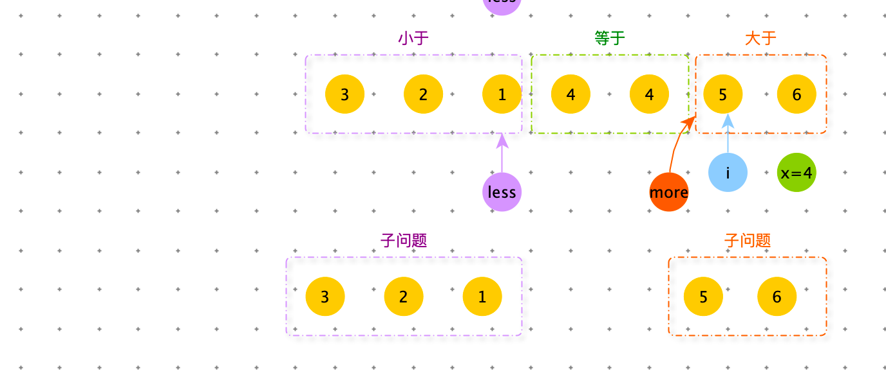

[TOC]

# 快速排序(quick sort)

## 快排第一版


关键点：

1. 分治思想
2. 基本思想：
   1. 数组下标从 low 到 high ，从 low 和 high 中任意选择一个数据作为 pivot （区分点）,一般情况下，可以选择数组最后一个元素。
   2. low --> high 遍历数据，小于 pivot 的数据放左边，大于pivot 的数据放右边。最后 pivot 放中间。
   3. 分治：划分为两个子问题：[low,pivot -1 ] 和 [pivot-1,hight] 两个子数组。

时间复杂度：$O(N log{N})$

空间复杂度：$O(log{N})$

```python
def quick_sort(arr, low, high):
    if low >= high: return
    m = partition(arr, low, high)
    quick_sort(arr, low, m - 1)
    quick_sort(arr, m + 1, high)


def partition(arr, low, high):
    x = arr[high]
    i = low - 1
    for j in range(low, high):
        if nums[j] <= x:
            i += 1
            arr[i], arr[j] = arr[j], arr[i]
    # 将 high 的数换到中间
    arr[i + 1], arr[high] = arr[high], arr[i + 1]
    return i + 1


nums = [4, 5, 6, 1, 3, 2]
quick_sort(nums, 0, len(nums) - 1)
print(nums)
```

> 递推公式
>
> quick_sort (low , high) = quick_sort (low , m-1) + quick_sort (m+1 , high)
>
> 终止条件
>
> low >= high 

注意在 partition 时，为了是原地排序，利用了选择排序的思想，通过游标 i 将数组划分为两部分，A[low,i-1] 中的元素小于 pivot ，是==已处理区间==，A[i,high-1] 是==未处理区间==。每次从未处理区间获取一个元素 A[ j ] ，if A[ j ] < pivot 将其加入到已处理区间的尾部，就是A [ i ] 的位置。

注意：插入操作需要搬移数据，非常耗时，可以通过交换，在 O(1) 时间复杂度内完成插入操作。将 A[i] 与 A[j] 交换。所以==**快排是不稳定排序**==


归并排序和快速排序，都使用了分治思想，递归公式和递归代码非常相似。

区别：partition 和 merge 方法。



归并排序的处理过程是：==**由下向上**==，子问题处理完毕后，再合并。

快速排序的处理过程是：==**由上向下**==，先分区，然后再处理子问题。

归并排序非原地排序，浪费了O(n) 的空间。快排通过巧妙的原地分区函数，可以实现原地排序，解决了归并排序占用内存过多的问题。


1. 快排是原地排序算法吗？

   ==是原地排序算法==。

2. 快排是稳定排序算法吗？

   ==**快排是不稳定排序**==

3. 快排的时间复杂度多少？
   $$
   \begin{align}
   T(1) =& C;\\
   T(n) =& 2*T(\frac{n}{2})+n; n>1
   \end{align}
   $$
   上边公式要成立，要选择合适的 pivot，正好将大区间一分为二。实际上很难。

   比如：原数组已经有序了[1,3,5,6,8]，每次选择最后一个元素作为 pivot，那么每次选得两个分区都是不均等的，那么整个排序过程需要大约 n 次分区操作， 每次分区平均要扫描 n/2 个元素。那么此时快排的时间复杂度从 O(nlogn) 退化为   $O( n^2 )$

   最好情况：O(nlogn) 

   最坏情况：$O( n^2 )$

   平均情况：从递归树考虑，一棵普通的二叉树，深度是O(nlogn) ，那么时间复杂度为：O(nlogn) 。


空间复杂度（平均）：O(logn) 

空间复杂度（最差）：O(N) 

## 优化快排

快排在最坏情况下会退化为 $O(n^2)$ ,那么如何避免呢？

出现最坏的情况，主要原因：==**分区点选择不够合理**==。

目标：理想的分区点：==被分开的两个子区间，数据量差不多==。


### 分区点选择

#### 三数取中法

从区间首，尾，中间，分别取一个数，比较大小后，去中值。

数据量比较大，可以衍生出：“五数取中”，“十数取中”等。

```python
def quick_sort(arr, low, high):
    if low >= high: return
    m = partition_mid(arr, low, high)
    quick_sort(arr, low, m - 1)
    quick_sort(arr, m + 1, high)
    
 
def partition_mid(arr, low, high):
    # 三选一
    mid = (low + high) >> 2
    x_0 = arr[low]
    x_1 = arr[mid]
    x = arr[high]

    min_x = min([x, x_1, x_0])
    max_x = max([x, x_1, x_0])
    if max_x > x_0 and x_0 > min_x:
        x = x_0
        arr[high], arr[low] = arr[low], arr[high]
    if max_x > x_1 and x_1 > min_x:
        x = x_1
        arr[high], arr[mid] = arr[mid], arr[high]

    i = low - 1
    for j in range(low, high):
        if arr[j] <= x:
            i += 1
            arr[i], arr[j] = arr[j], arr[i]
    arr[i + 1], arr[high] = arr[high], arr[i + 1]
    return i + 1
```


#### 随机法

从排序区间中，随机取一个数，作为分区点。

才概率角度来看，这种方法大概率不会取最好的分区点，但也大概率也不会取到最差的分区点。

```python
import random

def quick_sort(arr, low, high):
    if low >= high: return
    m = partition_random(arr, low, high)
    quick_sort(arr, low, m - 1)
    quick_sort(arr, m + 1, high)

def partition_random(arr, low, high):
    index = random.randint(low, high)
    x = arr[index]
    arr[high], arr[index] = arr[index], arr[high]
    i = low - 1
    for j in range(low, high):
        if arr[j] <= x:
            i += 1
            arr[i], arr[j] = arr[j], arr[i]
    arr[i + 1], arr[high] = arr[high], arr[i + 1]
    return i + 1
```


## 快排第三版


1. mid 随机选取，x
2. 在 partition 阶段，用三个指针，将数组划分为四个区：小于 num[mid] 区，等于 num[mid]  区,待处理区，大于 num[mid] 区
3.  当 num[i] < x 时，num[i] 与 num[less ++] 交换，less++ 就是等于区的最左端，小于区向右扩展一位，等于区向右扩展一位，当前指针 i 向右走一步。
4. 当 num[i] == x 时 ，当前指针 i 向右走一步（相当于等于区向右扩展一位）
5. 当 num[i] > x 时，num[i] 与 num[more--] 交换，more -- 是大于区的最左端（相当于大于区域扩大一位）。交换后，当前指针指向的数据是之前没见过的数据，需要继续与 x 比较，无需向左走。
6. 处理完毕后，less 和 more 就是子数组的边界。




例子：nums=【3	4	5	4	1	6	2】








```python
import random

def quick_sort(nums, low, high):
    if low >= high: return

    m1, m2 = partition2(nums, low, high)
    quick_sort2(nums, low, m1)
    quick_sort2(nums, m2, high)

def partition(nums, low, high):
    less = low - 1
    more = high + 1
    x = nums[random.randint(low, high)]

    while low < more:
        if nums[low] < x:
            less += 1
            swap(nums, less, low)
            low += 1
        elif nums[low] == x:
            low += 1
        else:
            more -= 1
            swap(nums, more, low)

    return less, more

def swap(nums, i, j):
    nums[i], nums[j] = nums[j], nums[i]

def swap(nums, i, j):
    nums[i], nums[j] = nums[j], nums[i]

def random_array_generator(max_size, max_value):
    size = int(random.random() * max_size)
    return [int(random.random() * max_value) - int(random.random() * max_value) for _ in range(size)]

def check():
    n = 10000
    max_size = 10
    max_value = 10

    for i in range(n):
        nums = random_array_generator(max_size, max_value)
        nums2 = nums[:]

        quick_sort(nums, 0, len(nums) - 1)
        nums2.sort()

        if nums2 != nums:
            print("ERROR:nums", nums, "nums2", nums2)
    print("Game Over!")
    
check()
```


## 分析 qsort 函数：综合排序

qsort 是 C 语言的排序函数。

1. 当数量小于 4 时，会使用插入排序O(n^2)

   1. 使用哨兵，减少判断。
   2. 数量小时，O(n^2) 算法未必运行时间长。只是描述趋势，省略很多系数和低阶。
   3. 使用非递归，简单实现。效率更高。

2. 当数据量大于4，小于 x 时，会使用归并排序。

   1. 数据量较小，即便是空间复杂度翻一倍，影响也不大。

3. 当数据量大于 x 时，会使用快速排序。

   1. 使用三数取中法，选择分区点。
   2. 在堆上手动模拟递归压栈、出栈过程，而非递归，防止堆栈溢出。


工程上对排序的改进

1. 充分利用 O(N*logN) 和 $O(N^2)$ 排序各自的优势。
2. 稳定性的考虑


# 题目

## 查找第 K 小元素

例题：在 O(n) 的时间复杂度内查找一个无序数组中的第 K 小元素。

```python
def find_k(arr, low, high, k):
    if low >= high: return
    m = partition(arr, low, high)

    if m == k - 1:
        return nums[m]
    # 在[low,m-1] 区间内查找
    if m > (k - 1):
        return find_k(arr, low, m - 1, k)
    else:
         # 在[m+1,high] 区间内查找
        return find_k(arr, m + 1, high, k)
      
def partition(arr, low, high):
    x = arr[high]
    i = low - 1
    for j in range(low, high):
        if nums[j] <= x:
            i += 1
            arr[i], arr[j] = arr[j], arr[i]
    arr[i + 1], arr[high] = arr[high], arr[i + 1]
    return i + 1
      
```

