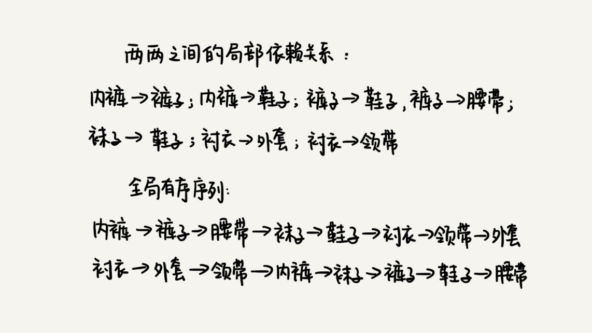

拓扑排序解决的问题：凡事需要通过局部顺序来推导全局顺序的问题，都可以通过拓扑排序来解决。

例子：



拓扑排序的结果不是唯一的。

如果 a 先于 b 执行，也就是说 b 依赖于 a，可以构建一条边：a -> b，如此可以构建一个有向图，还是一个有向无环图。一旦图中出现了环（死锁），拓扑排序就无法工作了。<font color='red'>拓扑排序本身就是基于有向无环图的一个算法。</font>

## 定义图

```python
class Graph:
    def __init__(self, v):
        self.v = v
        self.adj = [[] for i in range(v)]

    def add_edge(self, s, t):
        self.adj[s].append(t)
```


## Kahn 算法

Kahn 用了贪心算法思想。

1. 执行所有入度为 0 的结点。
2. 将执行结点删除（把这个顶点可达的顶点的入度都减 1）
3. 循环第一二步

时间复杂度：O( V + E )

空间复杂度：O( V )

```python
    def kahn(self):
        # 统计入度
        in_degree = [0] * self.v
        for i in range(self.v):
            for j in range(len(self.adj[i])):
                n = self.adj[i][j]
                in_degree[n] += 1

        # 入度为 0 执行
        queue = [i for i in range(self.v) if in_degree[i] == 0]

        while queue:
            i = queue.pop()
            print("->", i)
            for j in range(len(self.adj[i])):
                k = self.adj[i][j]
                in_degree[k] -= 1
                if in_degree[k] == 0:
               
              queue.append(k)
```


## DFS 算法

深度优先遍历。

1. 通过邻接表构建逆邻接表
2. 递归处理每个顶点：先把它依赖的所有顶点输出了，然后再输出自己。

时间复杂度：O( V + E )

空间复杂度： O( V + E )

```python
    def topo_sort_by_dfs(self):
        # 构建逆邻接表，边 s -> t 表示，s 依赖于 t，t 先于 s
        inverse_adj = [[] for i in range(self.v)]
        for i in range(self.v):
            for j in range(len(self.adj[i])):
                w = self.adj[i][j]
                inverse_adj[w].append(i)

        # 深度优先遍历
        visited = [False] * self.v
        for i in range(self.v):
            if visited[i]: continue
            visited[i] = True
            self.dfs(i, inverse_adj, visited)

    def dfs(self, vertex, inverse_adj, visited):
        for i in range(len(inverse_adj[vertex])):
            w = inverse_adj[vertex][i]
            if visited[w]: continue
            visited[w] = True
            self.dfs(w, inverse_adj, visited)
        print("->", vertex)
```

