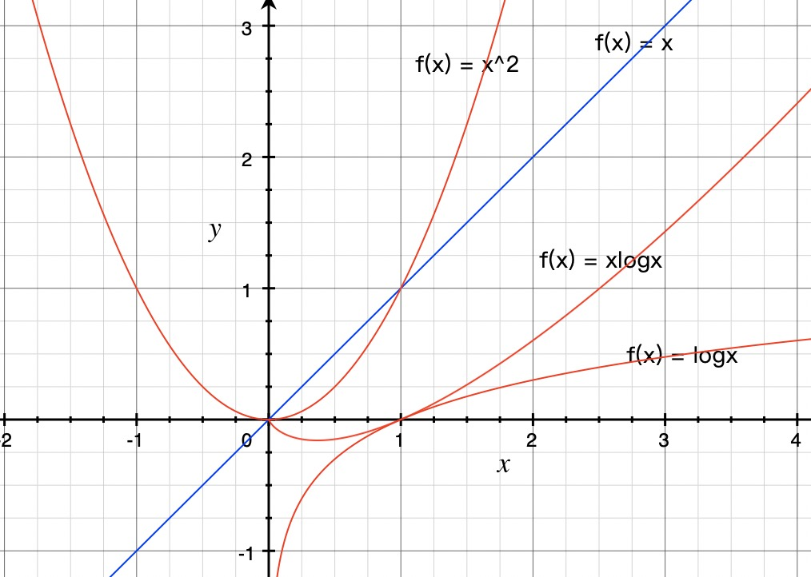

[TOC]

复杂度分析是算法的精髓。

## 一、概述

- Ο，读音：big-oh；表示上界，**小于等于**。

- Ω，读音：big omega、欧米伽；表示下界，**大于等于**。

- Θ，读音：theta、西塔；既是上界也是下界，称为确界，等于。

- ο，读音：small-oh；表示上界，小于。

- ω，读音：small omega；表示下界，大于。


Ο 是渐进上界，Ω 是渐进下界。Θ 需同时满足大 Ο 和 Ω，故称为确界。Ο 极其有用，因为它表示了最差性能。

Ο(n) 最差情况

Ω(n) 最好情况

Θ(n) 平均情况


## 事后统计法

跑代码，统计，监控。

局限性

1. 测试结果非常依赖测试环境。
2. 测试结果受数据规模的影响很大。

## 大 O 复杂度表示法

所有代码的执行时间 T(n) 与每行的执行次数成正比。

$T(n)= O(f(n))$        

- T(n)： 代码执行的时间
- n：数据规模的大小。
- f(n)：每行代码的执行执行次数和。
- O：表示T(n) 与 f(n) 成正比。、

大 O 表示的并不是实际的执行时间，而是==**代码执行时间随数据规模增长的变化趋势**==。

所以也叫作：==**渐进时间复杂度**== 简称：==时间复杂度==

当 n 很大时，公式中低阶，常数，系数，对增长趋势影响比较小，可以忽略。

## 时间复杂度分析

技巧

1. 只关注循环执行次数最多的一段代码
2. 加法法则：总复杂度等于量级最大的那段代码的复杂度。
3. 乘法法则：嵌套代码的复杂度等于嵌套内外代码复杂

度的乘积。


### 常见复杂度

- 常数阶 O(1)
- 对数阶 O(log n)
- 线性阶 O(n)
- 线性对数阶 O(n log n)
- 平方阶 $O(n^2)$ 、 立方阶 $O(n^3)$ ...... k 次方阶 $O(n^k)$
- ==指数阶== $O(2^n)$
- ==乘方阶== $O(n!)$

将上述可以分为两类：

- 多项式量级
- 非多项式量级：$O(2^n)$  和 $O(n!)$  。这类算法问题叫做 NP(Non-Dterministic Polynomial，非确定多项式) 问题。

### 多项式量级

1. O(1)：只要算法中不存在循环，递归语句，即使有成千上万行代码，其时间复杂度也是O(1)

2. O(log n)、O(n log n)

   例一：

   ```python
   i = 1
   while i <= n:
     	i= i*2
   ```

   该算法类似 二分查找，每次缩小一半：O(log n)

   上边运算运行了x 次。 

   $ 2^0,2^1,2^2,...,2^k,...,2^x > n $

   $ 2^x > n $ (终止条件)

   那么 $x> log_2n$ 所以时间复杂度为：$O(log_2n)$

   例二：

   ```python
   i = 1
   while i <= n:
     	i= i*3
   ```

   时间复杂度为：$O(log_3n)$

   无论以 2 为底，以 3 为底，还是以 10 为底，时间复杂度都记作 O(log n)

   理论依据

   $log_3n=log_32*log_2n$

   而 $log_32$ 为常量。**采用大 O 标记复杂度时，可以忽略==常数==系数**：$O(Cf(n))= O(f(n))$

   所以：$O(log_2n) = O(log_3n)$ 

   所以：可以忽略底数，统一表示为：$O(logn)$

   注意：O(nlogn) 中 n 系数，是非常数，不能忽略。

3. O(m+n)、O(m*n)

   ```python
   def cal(m,n):
     s = 0
     for i in range(m):
       s += i
     for j in range(n):
       s += j
     return s
   ```

   由于无法评估 m 和  n 谁的量级大，所以不能利用加法原则，省略掉其中一个。

   所以时间复杂度：O(m+n)

   乘法亦是如此：$T_1(m) * T_2(n) = O(f(m) * f(n)) $ 不能省略系数。

## 空间复杂度分析

渐进空间复杂度（asymptotic space complexity）：表示算法的存储空间与数据规模之间的增长关系。

```python
def print(n):
  a = list()
  for i in range(n):
    a.append(i*i)
  for i in range(n-1,-1,-1):
    print a[i]
```

存储变量 i ，是常量阶，跟数据规模 n 无关，可以忽略。

数组 a 的大小为 n ，所以整段代码的空间复杂度为：O(n)

常见的空间复杂度：O(1),O(n),O(n^2) 

O(logn) 和 O(nlogn)  不常见。

 

**复杂度分析并不难，关键在于多练。**


## 最好/最坏情况时间复杂度

Best case time complexity

Worst case time complexity

```python
def find(array,x):
  pos = -1
  for i in range(len(array)):
    if array[i] == x:
      pos = i
      break
  return pos
```

这段代码的时间复杂度是：O(n)

**最好情况时间复杂度：在最理想的情况的情况下，执行这段代码的时间复杂度。**

如果 x 在array 的第一位，那么程序只需 O(1)

**最坏情况时间复杂度：在最糟糕的情况的情况下，执行这段代码的时间复杂度。** 

如果 x 在array 的最后一位，那么程序只需 O(n)

## 平均情况时间复杂度

average case time complexity

最好情况和最坏情况的发生的概率很小，大多数情况是平均情况。

如上边例子：x 在数组中的位置：有n + 1 中情况：在数组 [0,n-1] 中和不在数组中。

将每一个位置所需的时间求和，然后就均值： 

$\frac{1+2+3+...+n+n}{n+1} = \frac{n(n+3)}{2(n+1)}$ 

根据大 O 省略常量系数，低阶，常量：所以上例中平均情况的时间复杂度为：O(n)


**上边计算有一个问题：每种情况出现的概率不一样，这种情况没有考虑。**

假设： x 在 array 中的概率是：$\frac{1}{2}$ 

x 不在 array 中概率是：$\frac{1}{2}$ 

那么 x 在array 中 [0,n-1] 每个位置的概率：$\frac{1}{2n}$

平均情况计算过程：

$$1*\frac{1}{2n}+2*\frac{1}{2n}+3*\frac{1}{2n}+...+n*\frac{1}{2n}+n*\frac{1}{2}=\frac{3n+1}{4}$$

这个值就是：加权平均值，或者期望值。

**平均时间复杂度全称：加权平均时间复杂度或者期望时间复杂度。**

## 均摊时间复杂度

Amortized time complexity

```python
array = [None]*n
count = 0

def insert(val):
  if count == len(array):
    s = 0
    for i range(n):
      s += array[i]
    array[0] = s
    count = 1
  array[n] = val
  count += 1
```

分析这段代码的时间复杂度：

最好情况：count  !=  n，O(1)

最坏情况：count  == n，O(n)    n == count

平均情况：

概率论解释：

前 count  != n 有 n 中情况，当 n =  count，一种溢出。所以每种情况出现的概率是:$\frac{1}{n+1}$

$$1*\frac{1}{n+1}+1*\frac{1}{n+1}+...+n*\frac{1}{n+1}=O(1)$$


摊还分析法：

n 个最好情况后出现一次最坏情况。非常有规律。

那么将最坏情况的耗时O(n)，平均分摊给最好情况O(1)，那么平均为O(2) = O(1)


摊还分析法：使用场景比较特殊。

**摊还时间复杂度就是一种特殊的平均时间复杂度。**

常见场景：

1. 动态数组，动态扩容。