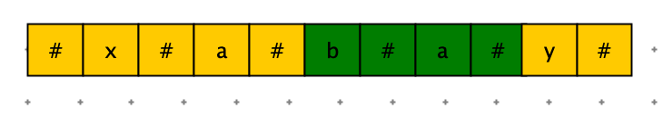
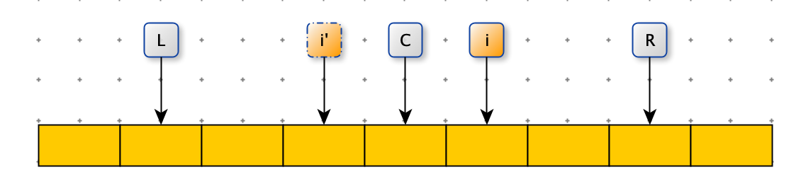
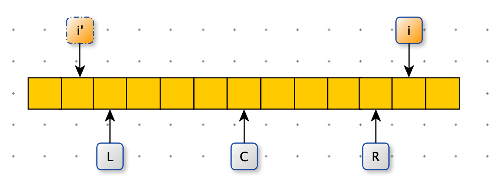
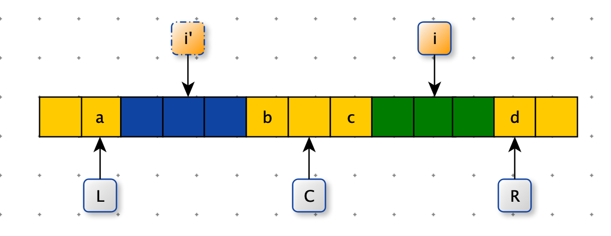
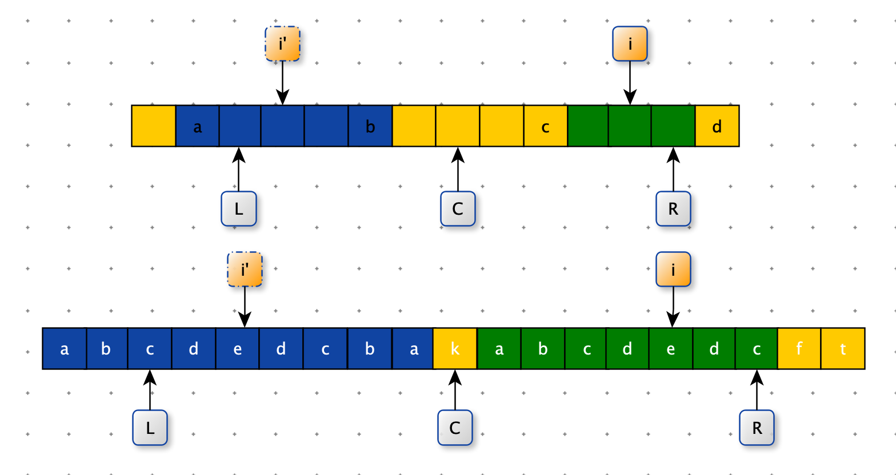
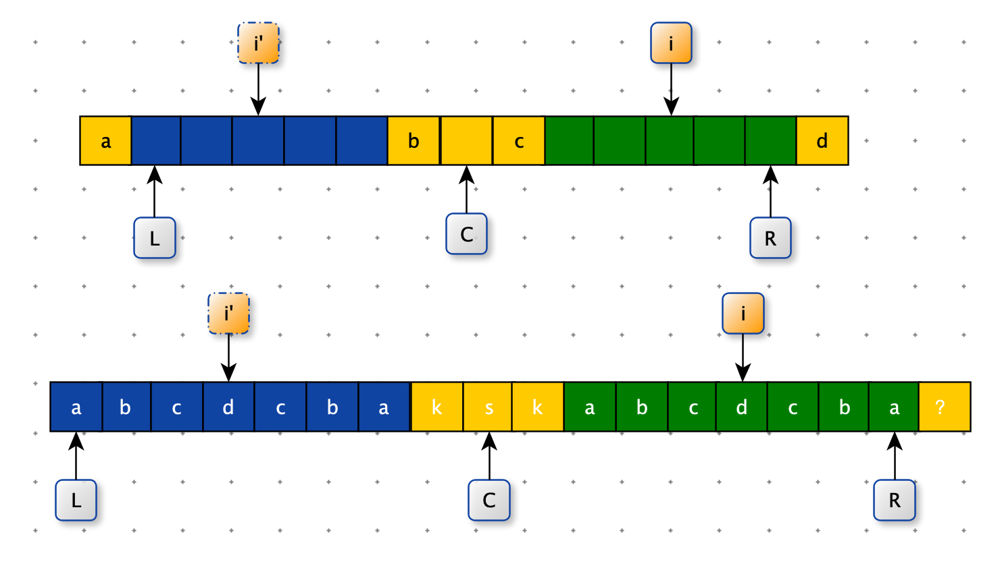
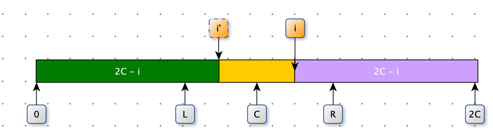

[TOC]

# Manacher

Manacher 算法解决问题：

字符串 str 中，最长回文子串的长度如何求解？

如何做的时间复杂度 O(n) 完成？


**暴力求解**

字符串abbc变换成  #a#b#b#c#

这样巧妙的避免了回文串的奇数和偶数。


时间复杂度：$O(n^2)$

空间复杂度：O(1)

```python
def manacher_str(s):
    return "#" + "#".join(s) + "#"

def longest_palindrome_subseq_size(s):
    res = 0
    s = manacher_str(s)
    n = len(s)
    for i in range(n):
        tmp = 0
        l = r = i
        while r < n and l >= 0:
            if s[l] != s[r]:
                break
            r += 1
            l -= 1
            tmp += 1
        res = max(res, tmp)
    return res - 1
  
print(longest_palindrome_subseq_size("xabay"))
```


**Manacher 算法**

概念：

1. 回文半径数组 radius
   1. 回文半径数组记录：以每个位置的字符为中心的回文半径。
2. 最右回文右边界 R
3. 最右回文的对称中心 C
4. 最右回文左边界 L

绿色部分是回文半径：4。4 -1 是回文串的长度




L，C，R 与当前需要处理 i 有如下关系



i' 是 i 关于 C 位置的对成点

在要计算 i 时，i 之前的 radius 已经计算过。manacher 算法就是尽量利用之前已经计算好的数据，减少扩展的次数。


L，C，R 与当前需要处理 i 有如下关系

1. 当 i 大于 R 时，无法利用之前的数据，直接扩展。



2. 当 i 在 L 和 R 之间

   1. i’ 的回文半径也在 L 和 R 之间

   <font color=green>由于对称性 i 的回文半径等于 i‘ 的回文半径</font>

   a != b

   b = c

   a = d

   所以：c != d



 2. i’ 的回文半径超出 L

    <font color=green>由于对称性 i 的回文半径 =  R - i </font>

    a = b：a 和 b 对称（i’）

    b = c：b 和 c 对称

    a !=d，如果a =d 那么，L 和 R 就不是现在位置，需要扩大

    所以：c != d

    



	3. i’ 的回文半径与 L 重合

<font color=green>由于对称性 i 的回文半径最小为 R - i，在 R - i 基础上扩展 </font>



上边的例子：？如果为 k 那么可以在现有的基础上在扩展，如果不等于 k ，那么 i 的回文半径：R - i 


manacher 伪代码

```python
def manacher_demo(s):
    # 处理字符串
    s -> str #a#b#c#

    pArr=[]
    R = ?
    C = ?

    for i in range(len(str)):
        if i in R 外部：
            从 i 开始往两边暴力扩展;
            更新 R
            更新 C
        else:
            if i' 回文区彻底在 [L,R] 内：
                pArr[i]=pArr[i']
            elif i' 回文区有一部分在 [L,R] 内 :
                pArr[i] = R - i
            else:
                从 R 之外的字符开始，往外扩，然后确定 pArr[i] 的答案；
                第一步扩失败了，R 不变
                否则 R 变大
```





i' = 2C - i


```python
import sys

def manacher_str(s):
    return "#" + "#".join(s) + "#"

def manacher_demo(s):
    if not s: return 0
    # 中心
    C = -1
    # 最右回文右边界 + 1
    R = -1
    res = sys.maxsize
    p_arr = [0] * len(s)
    s = manacher_str(s)
    n = len(s)

    # 每一个位置都求回文半径
    for i in range(n):
        # i 至少的回文区域(不需要验证)，先给 p_arr[i]
        # 2C - i = i'
        p_arr[i] = min(p_arr[2 * C - i], R - i) if R > i else 1

        # 从不需要验证的区域，向外验证
        while i + p_arr[i] < n and i - p_arr[i] > -1:
            if p_arr[i + p_arr[i]] != s[i - p_arr[i]]:
                break
            p_arr[i] += 1

        if i + p_arr[i] > R:
            R = i + p_arr[i]
            C = i

        res = max(res, p_arr[i])
    return res - 1
```


# 使用 Manacher 结构，解决其他问题

由一个代表题目，引出一种结构

**题目**

> 有一个整型数组 arr 和一个大小为 w 的窗口，从数组的最左边滑到最右边，窗口每次向右滑一个位置。
>
> 例如：数组为【4,3,5,4,3,3,6,7】,滑动窗口大小为 3 时：
>
> 【4,3,5】,4,3,3,6,7           窗口中最大值为 5
>
> 4,【3,5,4】,3,3,6,7           窗口中最大值为 5
>
> 4,3,【5,4,3】,3,6,7           窗口中最大值为 5
>
> 4,3,5,【4,3,3】,6,7           窗口中最大值为 4
>
> 4,3,5,4,【3,3,6】,7           窗口中最大值为 6
>
> 4,3,5,4,3,【3,6,7】           窗口中最大值为 7
>
> 如果数组长度为 n，窗口大小为 w，则一共产生 n - w + 1 个窗口的最大值。
>
> 请实现一个函数。输入：整数数组arr，滑动窗口大小为 w。
>
> 输出：一个长度为 n - w + 1的数组 res。本例结果是：【5,5,5,4,6,7】