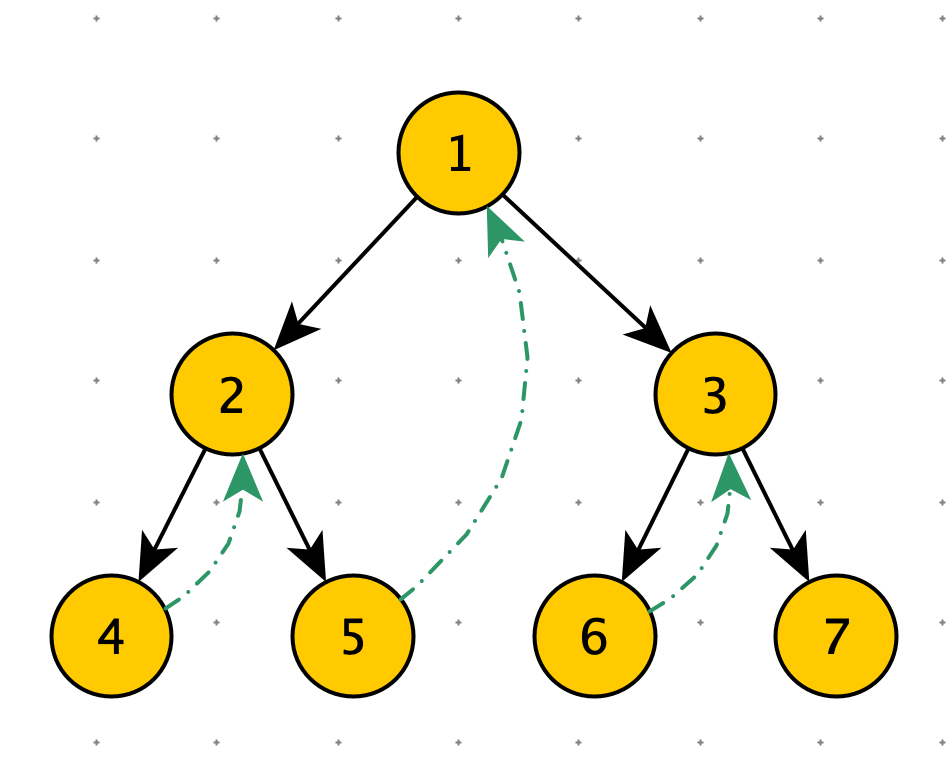

[TOC]

# 二叉树常规遍历

递归遍历

时间复杂度：O(N)

空间复杂度：O(N)

```python
print("二叉树遍历")
class Node:
    def __init__(self, data):
        self.data = data
        self.left = None
        self.right = None
'''
先序遍历
根 -> 左 —> 右
'''
def preorder(node):
    if node:
        print(node.data)
        preorder(node.left)
        preorder(node.right)

'''
中序遍历
左 -> 根 —> 右
'''
def inorder(node):
    if node:
        inorder(node.left)
        print(node.data)
        inorder(node.right)

'''
后序遍历
左 -> 右 —> 根
'''
def postorder(node):
    if node:
        postorder(node.left)
        postorder(node.right)
        print(node.data)
        
'''
层遍历
'''
def layerOrder(node):
    if node is Node: return
    queue = [node]
    while queue:
        t = queue.pop(0)
        print(t.data)
        if t.right: queue.append(t.right)
        if t.left: queue.append(t.left)

root = Node(5)
node1 = Node(6)
node2 = Node(7)
node3 = Node(8)

root.left = node1
root.right = node2
node1.left = node3

print("先序遍历")
preorder(root)
print("中序遍历")
inorder(root)
print("后序遍历")

postorder(root)
```


# 二叉树神级遍历

## Morris 算法

​		普通的递归和非递归解法，其实使用了栈结构，在处理完二叉树某个节点后，可以回到上层去。为什么从下层回到上一层如此之难呢？因为标准的二叉树结构没有 parent 指针。

​		Morris 算法避免使用栈结构，而是通过让底层节点指向 null 的空闲指针指回上层某个节点，从而完成下层到上层的移动。


如下图：绿色虚线就是 Morris 临时建的指针，便于从下层回上层。

创建指针的时机：cur 当前节点，如果有左子树，找到左子树的最右节点，使最右节点指向自己。

删除这些指针的时机：most_right.right == cur。说明已经回到上一层了。





Morris 算法过程

1. cur --> head
2. if  cur 无左树：cur = cur.right
3. if cur 有左树，找到左树的最右节点：most_right
   1. if  most_right.right == null：
      1. most_right.right = cur
      2. cur = cur.left
   2. if most_right.right == cur：
      1. most_right.right =null
      2. cur = cur.right


时间复杂度：O(N)

空间复杂度：O(1)

```python
class TreeNode:
    def __init__(self, val=0, left=None, right=None):
        self.val = val
        self.left = left
        self.right = right

def morris(head):
    if not head:
        return

    cur = head
    while cur:
      	print(cur.val)
        most_right = cur.left
        # cur 有左树
        if most_right:
            # 查找左树的的最右节点
            # cur 第一次到达最右节点，那么 most_right.right == null
            # cur 第二次到达最右节点，那么 most_right.right == cur
            while most_right.right and most_right.right != cur:
                most_right = most_right.right
            # 从 while 中出来：most_right 是 cur 左树上的最右节点

            if not most_right.right:
                most_right.right = cur
                cur = cur.left
                continue
            else:
                # 此时 most_right.right == cur
                most_right.right = None

        cur = cur.right
```

Morris 顺序：$1 \rightarrow 2 \rightarrow 4 \rightarrow 2 \rightarrow 5 \rightarrow 1 \rightarrow 3 \rightarrow 6 \rightarrow 3 \rightarrow 7$


cur 在有所有有左子树的节点，都经过两次，没有左子树的结点，只经历一次


Morris 算法先序遍历

先序遍历在 cur 第一次经历节点时打印，第二次经历时不打印

$1 \rightarrow 2 \rightarrow 4 \rightarrow 5 \rightarrow  3 \rightarrow 6 \rightarrow 7$

```python
def morris_pre(head):
    if not head:
        return

    cur = head
    while cur:
        most_right = cur.left
        # cur 有左树
        if most_right:
            while most_right.right and most_right.right != cur:
                most_right = most_right.right
            # 从 while 中出来：most_right 是 cur 左树上的最右节点

            # cur 有左树时，most_right.right == null 表示第一次经历节点
            if not most_right.right:
                print(cur.val)
                most_right.right = cur
                cur = cur.left
                continue
            else:
                # 此时 most_right.right == cur
                # cur 有左树时，most_right.right == null 表示第二次经历节点
                most_right.right = None
        else:
            # cur 无左树时，只有一次经过，就是本次
            print(cur.val)

        cur = cur.right
        
head = TreeNode(1)
head.left = TreeNode(2)
head.right = TreeNode(3)
head.left.left = TreeNode(4)
head.left.right = TreeNode(5)
head.right.left = TreeNode(6)
head.right.right = TreeNode(7)

print("先序遍历")
morris_pre(head)
```


Morris 算法中序遍历

先序遍历在 cur 第二次经历节点时打印，第一次经历时不打印

$2 \rightarrow 4 \rightarrow 5 \rightarrow 1 \rightarrow  6 \rightarrow 3 \rightarrow 7$

```python
def morris_in(head):
    if not head:
        return

    cur = head
    while cur:
        most_right = cur.left
        # cur 有左树
        if most_right:
            while most_right.right and most_right.right != cur:
                most_right = most_right.right
            # 从 while 中出来：most_right 是 cur 左树上的最右节点

            # cur 有左树时，most_right.right == null 表示第一次经历节点
            if not most_right.right:
                most_right.right = cur
                cur = cur.left
                continue
            else:
                # 此时 most_right.right == cur
                # cur 有左树时，most_right.right == null 表示第二次经历节点
                print(cur.val)
                most_right.right = None
        else:
            # cur 无左树时，只有一次经过，就是本次
            print(cur.val)

        cur = cur.right
        
print("中序遍历")
morris_in(head)
```


Morris 算法后序遍历

```python
```

