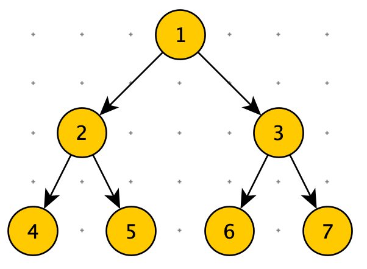
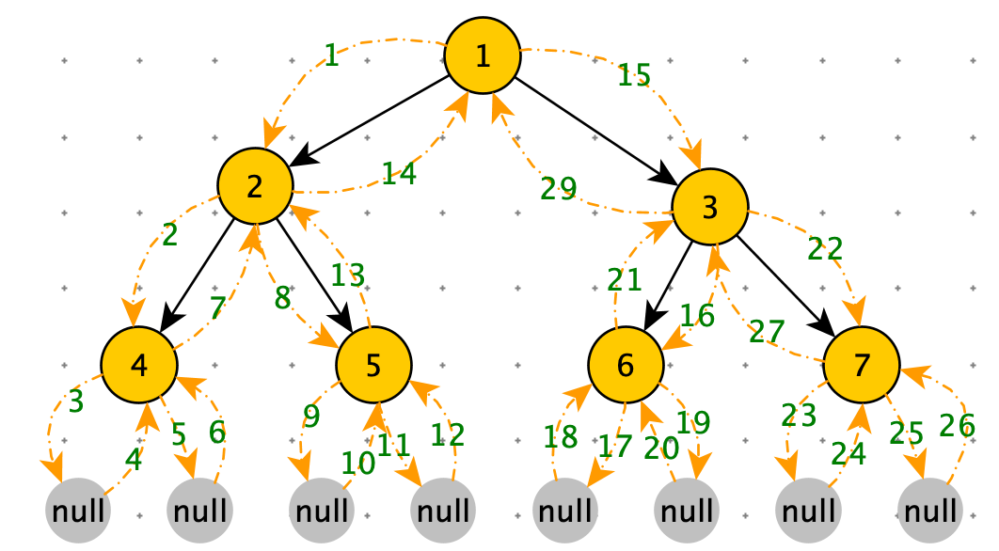

[TOC]

# 遍历

## 递归序



```python
def f(node):
    if not node:
      return
    # 1. node 第一次来到 f 函数
    f(node.left)
    # 2. 去 node 的左树转一圈，又来到 f 函数。这里可以获取从 node 左树收集的信息
    f(node.right)
    # 3. 去 node 的右树转一圈，又来到 f 函数。这里可以获取从 node 左树和右树收集的信息
```

<font color=red>node 会在来到 f 方法三次，分别在1. 2. 3. 位置</font>

递归序



递归序：

$1\rightarrow 2\rightarrow 4\rightarrow 4\rightarrow 4\rightarrow 2\rightarrow 5\rightarrow 5\rightarrow 5\rightarrow 2\rightarrow 1\rightarrow 3\rightarrow 6\rightarrow 6\rightarrow 6\rightarrow 3\rightarrow 7\rightarrow 7\rightarrow 7\rightarrow 3\rightarrow 1$

每一个节点出现三次


先序遍历：<font color=orange>头</font>，左，右

​		递归序第一次到达节点就打印：

​		$1\rightarrow 2\rightarrow 4\rightarrow 5\rightarrow 3\rightarrow 6\rightarrow  7$

​		1 是头

​		$2\rightarrow 4\rightarrow 5$ 是左子树

​		$3\rightarrow 6\rightarrow 7$ 是右子树	

中序遍历：左，<font color=orange>头</font>，右

​		递归序第二次到达节点就打印：

​		$4\rightarrow 2\rightarrow 5\rightarrow 1\rightarrow 6\rightarrow 3\rightarrow  7$

​		1 是头

​		$4\rightarrow 2\rightarrow 5$ 是左子树

​		$6\rightarrow 3\rightarrow 7$ 是右子树	

后序遍历：左，右，<font color=orange>头</font>

​		递归序第三次到达节点就打印：

​		$4\rightarrow 5\rightarrow 2\rightarrow 6\rightarrow 7\rightarrow 3\rightarrow 1$

- 1 是头
- $4\rightarrow 2\rightarrow 5$ 是左子树
- $7\rightarrow 3\rightarrow 1$ 是右子树	


## 先序，中序，后序

```python
print("二叉树遍历")
class Node:
    def __init__(self, data):
        self.data = data
        self.left = None
        self.right = None

def f(node):
    if not node:
      return
    # 1.这里打印是先序
    preorder(node.left)
    # 2.这里打印是中序
    preorder(node.right)
    # 3. 这里打印是后序
        
        '''
先序遍历
根 -> 左 —> 右
'''
def preorder(node):
    if node:
        print(node.data)
        preorder(node.left)
        preorder(node.right)

'''
中序遍历
左 -> 根 —> 右
'''
def inorder(node):
    if node:
        inorder(node.left)
        print(node.data)
        inorder(node.right)

'''
后序遍历
左 -> 右 —> 根
'''
def postorder(node):
    if node:
        postorder(node.left)
        postorder(node.right)
        print(node.data)
        
'''
层遍历
'''
def layerOrder(node):
    if node is Node: return
    queue = [node]
    while queue:
        t = queue.pop(0)
        print(t.data)
        if t.right: queue.append(t.right)
        if t.left: queue.append(t.left)

root = Node(5)
node1 = Node(6)
node2 = Node(7)
node3 = Node(8)

root.left = node1
root.right = node2
node1.left = node3

print("先序遍历")
preorder(root)
print("中序遍历")
inorder(root)
print("后序遍历")

postorder(root)
```

