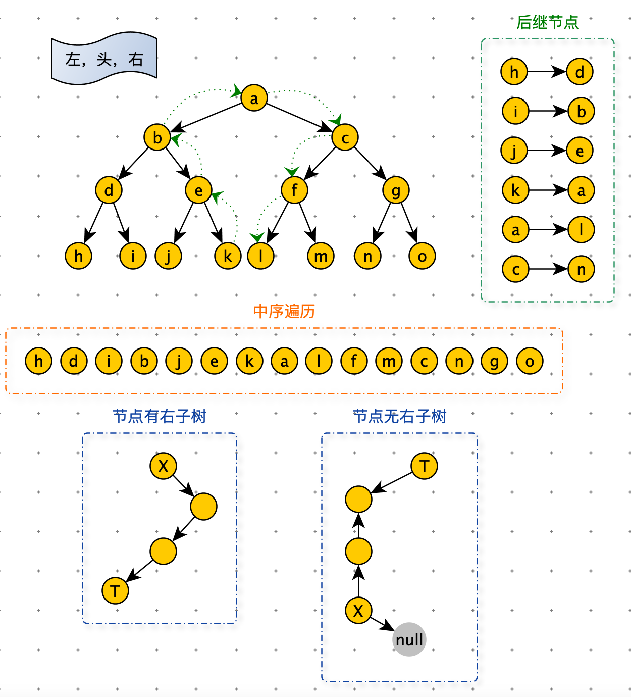

[TOC]

# 遍历

## 递归序



```python
def f(node):
    if not node:
      return
    # 1. node 第一次来到 f 函数
    f(node.left)
    # 2. 去 node 的左树转一圈，又来到 f 函数。这里可以获取从 node 左树收集的信息
    f(node.right)
    # 3. 去 node 的右树转一圈，又来到 f 函数。这里可以获取从 node 左树和右树收集的信息
```

<font color=red>node 会在来到 f 方法三次，分别在1. 2. 3. 位置</font>

递归序


递归序：

$1\rightarrow 2\rightarrow 4\rightarrow 4\rightarrow 4\rightarrow 2\rightarrow 5\rightarrow 5\rightarrow 5\rightarrow 2\rightarrow 1\rightarrow 3\rightarrow 6\rightarrow 6\rightarrow 6\rightarrow 3\rightarrow 7\rightarrow 7\rightarrow 7\rightarrow 3\rightarrow 1$

每一个节点出现三次


先序遍历：<font color=orange>头</font>，左，右

​		递归序第一次到达节点就打印：

​		$1\rightarrow 2\rightarrow 4\rightarrow 5\rightarrow 3\rightarrow 6\rightarrow  7$

​		1 是头

​		$2\rightarrow 4\rightarrow 5$ 是左子树

​		$3\rightarrow 6\rightarrow 7$ 是右子树	

中序遍历：左，<font color=orange>头</font>，右

​		递归序第二次到达节点就打印：

​		$4\rightarrow 2\rightarrow 5\rightarrow 1\rightarrow 6\rightarrow 3\rightarrow  7$

​		1 是头

​		$4\rightarrow 2\rightarrow 5$ 是左子树

​		$6\rightarrow 3\rightarrow 7$ 是右子树	

后序遍历：左，右，<font color=orange>头</font>

​		递归序第三次到达节点就打印：

​		$4\rightarrow 5\rightarrow 2\rightarrow 6\rightarrow 7\rightarrow 3\rightarrow 1$

- 1 是头
- $4\rightarrow 2\rightarrow 5$ 是左子树
- $7\rightarrow 3\rightarrow 1$ 是右子树	


## 先序，中序，后序

```python
print("二叉树遍历")
class Node:
    def __init__(self, data):
        self.data = data
        self.left = None
        self.right = None

def f(node):
    if not node:
      return
    # 1.这里打印是先序
    preorder(node.left)
    # 2.这里打印是中序
    preorder(node.right)
    # 3. 这里打印是后序
        
        '''
先序遍历
根 -> 左 —> 右
'''
def preorder(node):
    if node:
        print(node.data)
        preorder(node.left)
        preorder(node.right)

'''
中序遍历
左 -> 根 —> 右
'''
def inorder(node):
    if node:
        inorder(node.left)
        print(node.data)
        inorder(node.right)

'''
后序遍历
左 -> 右 —> 根
'''
def postorder(node):
    if node:
        postorder(node.left)
        postorder(node.right)
        print(node.data)

root = Node(5)
node1 = Node(6)
node2 = Node(7)
node3 = Node(8)

root.left = node1
root.right = node2
node1.left = node3

print("先序遍历")
preorder(root)
print("中序遍历")
inorder(root)
print("后序遍历")

postorder(root)
```


## 层遍历

```python
'''
层遍历
'''
def layerOrder(node):
    if node is Node: return
    queue = [node]
    while queue:
        t = queue.pop(0)
        print(t.data)
        if t.right: queue.append(t.right)
        if t.left: queue.append(t.left)
```


### 求二叉树的最大宽度

使用 map 存储节点所属的层

```python
class TreeNode:
    def __init__(self, val=0, left=None, right=None):
        self.val = val
        self.left = left
        self.right = right

def max_width(head):
    if not head: return
    queue = [head]
    # 节点：节点所属的层
    level_map = {head: 1}
    # 当前节点所属的层
    cur_level = 1
    # 当前层的节点数
    cur_level_nodes = 0
    res = 0
    # 层遍历
    while queue:
        cur = queue.pop(0)
        cur_node_level = level_map.get(cur)
        if cur.left:
            level_map[cur.left] = cur_node_level + 1
            queue.append(cur.left)
        if cur.right:
            level_map[cur.right] = cur_node_level + 1
            queue.append(cur.right)

        if cur_node_level == cur_level:
            cur_level_nodes += 1
        else:
            # 新一层出现时结算最大宽度
            res = max(res, cur_level_nodes)
            cur_level_nodes = 1
            cur_level += 1
    # 比对最后一层
    return max(res, cur_level_nodes)


head = TreeNode(1)
head.left = TreeNode(2)
head.right = TreeNode(3)
head.left.left = TreeNode(4)
head.left.right = TreeNode(5)
head.right.left = TreeNode(6)
head.right.right = TreeNode(7)

head.left.right.left = TreeNode(8)
head.left.right.right = TreeNode(9)

print(max_width(head))
```


可以通过设置 flag 变量的方式，来发现某一层的结束

<font color=green>当 cur 是最右节点时，next_end 正好是下一层的最右节点</font>


```python
def max_width_no_map(head):
    if not head: return
    queue = [head]
    # 当前层，最右节点
    cur_end = head
    # 下一层，最右节点
    next_end = None
    # 当前层的节点数
    cur_level_nodes = 0
    res = 0
    # 层遍历
    while queue:
        cur = queue.pop(0)
        if cur.left:
            queue.append(cur.left)
            next_end = cur.left
        if cur.right:
            queue.append(cur.right)
            next_end = cur.right

        cur_level_nodes += 1
        # 当 cur 是最右节点时，next_end 正好是下一层的最右节点
        if cur == cur_end:
            res = max(res, cur_level_nodes)
            cur_level_nodes = 0
            cur_end = next_end
    return res
```


## 二叉树的序列化与反序列化

1. 用先序，中序，后序，层遍历，来实现二叉树的序列化
2. 用什么方式序列化，就用什么样的方式反序列化


<font color=red>序列化时补全空节点</font>

如图两个二叉树，无论先序，中序，后序，层遍历，序列化后的结果都是一样的。所以没有办法反序列化。

解决方案：<font color=red>序列化时补全空节点</font>


**前序遍历序列化**

```python
def pre_serial(head):
    res = []
    pres(head, res)
    return res

def pres(head, res):
  	# 补充 None
    if not head:
        res.append(None)
    else:
      	# 先序
        res.append(head.val)
        pres(head.left, res)
        # 如果在这里 res.append(head.val)，中序
        pres(head.right, res)
         # 如果在这里 res.append(head.val)，后序

head = TreeNode(1)
head.left = TreeNode(1)
head.left.right = TreeNode(1)

print(pre_serial(head))
# [1, 1, None, 1, None, None, None]
```


**前序遍历反序列化**

```python
def build_by_pre_queue(pre_list):
    if not pre_list: return
    return preb(pre_list)

def preb(pre_list):
    val = pre_list.pop(0)
    if not val: return
    node = TreeNode(val)
    node.left = preb(pre_list)
    node.right = preb(pre_list)
    return node'
  
  
def inb(pre_list):
    val = pre_list.pop(0)
    if not val: return
    left_node = preb(pre_list)
    node = TreeNode(val)
    node.left = left_node
    node.right = preb(pre_list)
    return node
  
def postb(pre_list):
    val = pre_list.pop(0)
    if not val: return
    left_node = preb(pre_list)
    right_node = preb(pre_list)

    node = TreeNode(val)
    node.left = left_node
    node.right = right_node
    return node
```


**按层序列化**

```python
def level_serial(head):
    res = []
    if not head:
        res.append(None)
        return res
    # 在加入队列时，序列化
    res.append(head.val)
    queue = [head]
    while queue:
        node = queue.pop(0)
        if node.left:
            res.append(node.left.val)
            queue.append(node.left)
        else:
            res.append(None)

        if node.right:
            res.append(node.right.val)
            queue.append(node.right)
        else:
            res.append(None)
    return res
  

```


**按层反序列化**

```python
def build_by_level_queue(level_list):
    if not level_list: return
    head = generate_node(level_list.pop(0))
    queue = []
    if head:
        queue.append(head)
    while queue:
        node = queue.pop(0)
        node.left = generate_node(level_list.pop(0))
        node.right = generate_node(level_list.pop(0))
        if node.left:
            queue.append(node.left)
        if node.right:
            queue.append(node.right)

    return head

def generate_node(val):
    if val:
        return TreeNode(val)
```


## 如何设计一个打印整棵树的打印函数

遍历顺序：$右 \rightarrow 头 \rightarrow 左$


```python
class TreeNode:
    def __init__(self, val=0, left=None, right=None):
        self.val = val
        self.left = left
        self.right = right

def print_tree(head):
    print("binary tree")
    print_in_order(head, 0, "H", 17)
    print()

def print_in_order(head, height, to, length):
    if not head: return
  	# 处理右节点
    print_in_order(head.right, height + 1, "v", length)

   	# 对头节点的处理
    val = to + str(head.val) + to
    len_m = len(val)
    # 数字左边剩余长度
    len_l = (length - len_m) / 2
    # 数字右边剩余长度
    len_r = length - len_m - len_l
    # 通过补齐空格的数字
    val = get_space(len_l) + val + get_space(len_r)
    # get_space(height * length) 根据层数，控制打印的空格数
    print(get_space(height * length) + val)

    # 处理左节点
    print_in_order(head.left, height + 1, "^", length)

def get_space(num):
    return " " * int(num)


head = TreeNode(1)
head.left = TreeNode(2)
head.right = TreeNode(3)
head.left.left = TreeNode(4)
head.left.right = TreeNode(5)
head.right.left = TreeNode(6)
head.right.right = TreeNode(7)

head.left.right.left = TreeNode(8)
head.left.right.right = TreeNode(9)

print_tree(head)
```


