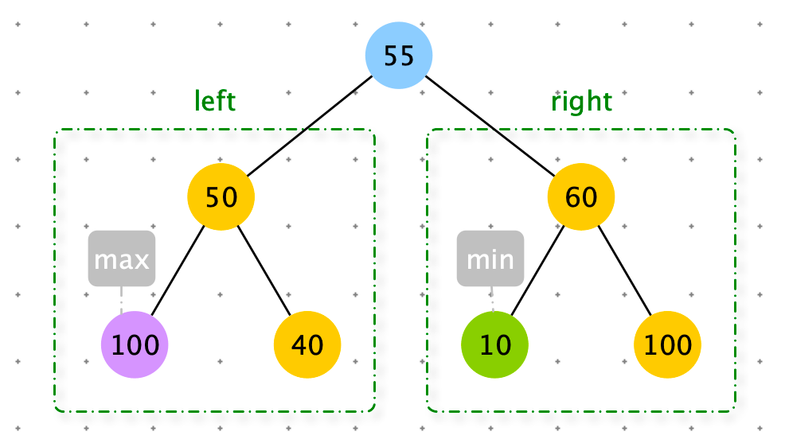
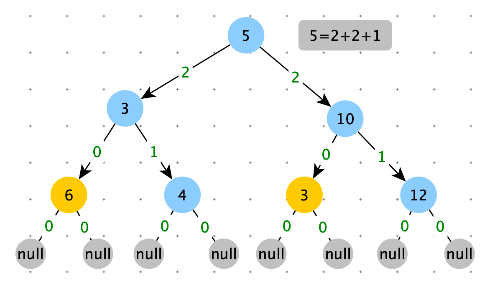
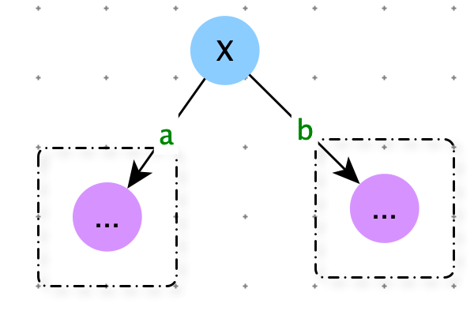
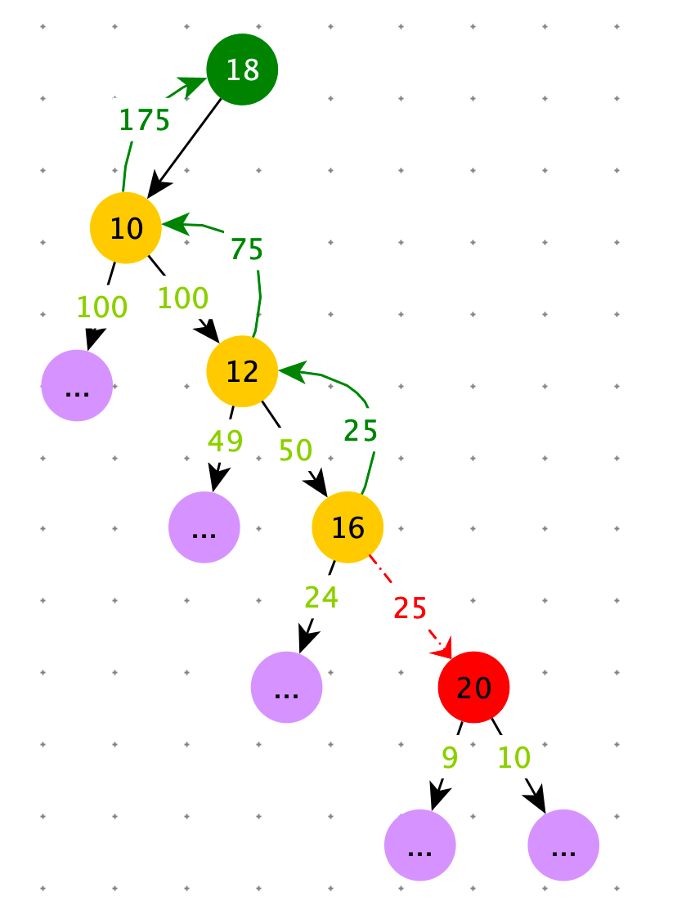
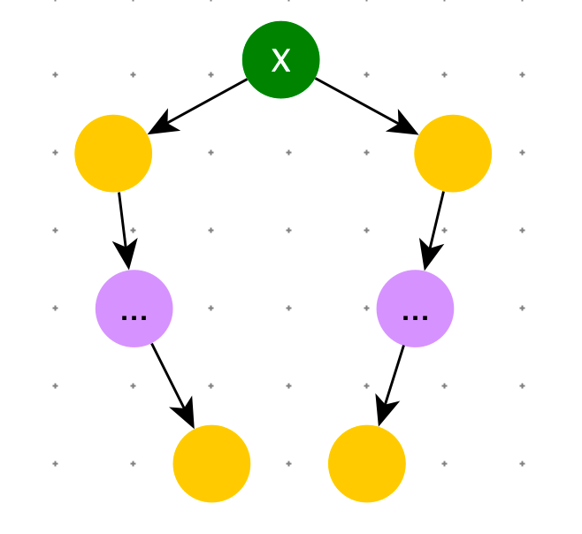
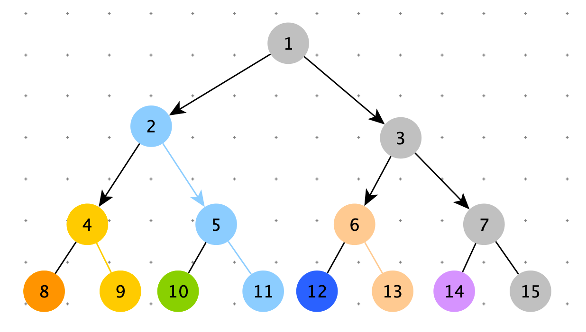

[TOC]

1. 可以解决面试中绝大多数的二叉树问题尤其是树型 dp 问题
2. 本质是利用递归遍历二叉树的遍历性


前提：假设以 X 为头结点

1. 可以从左子树获取信息
2. 可以从右子树获取信息
3. 利用这些信息，求解 X


树型DP（Dynamic programming），满足最优子结构性质的问题，都可以用树型 DP 求解。


# 二叉树的递归套路


1. 假设以 X 节点为头，假设可以向 X 左树和 X 右树要任何信息
2. <font color=red>**在上一步的假设下，讨论以 X 为头节点的树，得到答案的可能性（最重要）**</font>
3. 列出所有可能性后，确定到底需要向左树和右树要什么样的信息
4. 把左树信息和右树信息求全集，就是任何一棵子树都需要返回的信息 S
5. 递归函数都返回 S，每一颗子树都这么要求
6. 写代码，在代码中考虑如何把左树的信息和右树信息整合出整棵树的信息


# 递归套路深度实践


## 判断搜索二叉树

> 给定一棵二叉树的头节点 head，返回这棵二叉树是不是搜索二叉树 ?

套路条件

1. 左树是搜索二叉树
2. 右树是搜索二叉树
3. 左树的最大值 < x
4. 右树的最小值 > x

满足上述 3 个条件，就是搜索二叉树

```python
{
  isBST;
  max_value;
  min_value;
}
```


```python
class TreeNode:
    def __init__(self, val=0, left=None, right=None):
        self.val = val
        self.left = left
        self.right = right

class Info:
    def __init__(self, is_bst, max_value, min_value):
        self.is_bst = is_bst
        self.max_value = max_value
        self.min_value = min_value

def is_bst(head):
    return process(head).is_bst

def process(x):
    if not x: return

    left_data = process(x.left)
    right_data = process(x.right)

    min_value = x.val
    max_value = x.val

    if left_data:
        min_value = min(min_value, left_data.min_value)
        max_value = max(max_value, left_data.max_value)

    if right_data:
        min_value = min(min_value, right_data.min_value)
        max_value = max(max_value, right_data.max_value)

    is_bst = True
    # 排除
    if left_data and (not left_data.is_bst or left_data.max_value >= x.val):
        is_bst = False
    if right_data and (not right_data.is_bst or x.val >= right_data.max_value):
        is_bst = False

    return Info(is_bst, max_value, min_value)
```


## 判断平衡二叉树

> 给定一棵二叉树的头节点 head，返回这棵二叉树是不是平衡二叉树 ?


平衡二叉树定义：每个节点的左子树和右子树的高度相差不超过 1


节点 X 为头结点，X 是平衡二叉树的所有可能性：

1. 左子树是平衡二叉树
2. 右子树是平衡二叉树
3. | 左树高 - 右树高 | <= 1

满足上述 3 个条件，就是平衡二叉树


```python
class TreeNode:
    def __init__(self, val=0, left=None, right=None):
        self.val = val
        self.left = left
        self.right = right

class Info:
    def __init__(self, is_balaced, height):
        self.is_balaced = is_balaced
        self.height = height

def is_balanced(head):
    return process(head).is_balaced

def process(head):
    # 空树是平衡二叉树
    if not head:
        return Info(True, 0)
    # 向左树和右树收集信息
    left_info = process(head.left)
    right_info = process(head.right)

    # 根据子树的信息，组合出自己的信息
    height = max(left_info.height, right_info.height) + 1
    is_balance = True
    if not left_info.is_balaced or right_info.is_balaced or abs(left_info.height - right_info.height) > 2:
        is_balance = False
    return Info(is_balance, height)
```


## 判断完全二叉树

> 如何判断一个二叉树是完全二叉树?

层遍历

1. 任何节点有右孩子，没有左孩子，return False
2. 在满足条件 1 的情况下，如果遇到了第一个左右孩子不双全，之后所有的节点必须是叶节点。否则：return False 


```python
class TreeNode:
    def __init__(self, val=0, left=None, right=None):
        self.val = val
        self.left = left
        self.right = right

def is_cbt(head):
    if not head: return True

    queue = [head]
    leaf = False
    while queue:
        node = queue.pop(0)
        left = node.left
        right = node.right

        if (leaf and (left or right)) \
                or (not left and right):
            return False

        if left:
            queue.append(left)
        if right:
            queue.append(right)

        if not left or not right:
            leaf = True
    return True
```


## 判断满二叉树

> 如何判断一棵二叉树是否是满二叉树？

方案一：

1. 树的最大深度：deth
2. 树的节点数：n
3. 满足 $n =2^{deth}-1$ 就是 满二叉树，否则就不是


方案二：套路

```python
{
  int height;
  int nodes_count;
}
```

```python
class TreeNode:
    def __init__(self, val=0, left=None, right=None):
        self.val = val
        self.left = left
        self.right = right

class Info:
    def __init__(self, height, node_count):
        self.height = height
        self.node_count = node_count

def is_full(head):
    if not head: return True
    data = process(head)
    return data.node_count == (1 >> data.height - 1)

def process(x):
    if not x: return Info(0, 0)

    left_data = process(x.left)
    right_data = process(x.right)

    height = max(left_data.height, right_data.height) + 1
    node_count = left_data.node_count + right_data.node_count + 1
    return Info(height, node_count)
```


## 二叉树的最大距离

> 给定一棵二叉树的头节点 head，任何两个节点之间都存在距离，返回整棵二叉树的最大距离。

整棵数据的最大距离：从节点 9 到 节点 10（节点 10 到 节点 9）


**分析**

以 X 节点为头节点：最大距离的情况

- 与 X 无关，最大距离不经过 X 节点
  - max （左树最大距离，右树最大距离）
- 与 X 有关，最大距离经过 X 节点
  - 左树到 X 节点的最大距离 + 右树到 X 节点的最大距离 + 1

左树到 X 节点的最大距离：左树的高度

右树到 X 节点的最大距离：右树的高度


总结递归过程需要的信息

- 子树的高度
- 子树内的最大距离


```python
class TreeNode:
    def __init__(self, val=0, left=None, right=None):
        self.val = val
        self.left = left
        self.right = right

class Info:
    def __init__(self, height, distance):
        self.height = height
        self.distance = distance

def max_distance(head):
    return process(head).distance

def process(head):
    if not head:
        return Info(0, 0)

    left_info = process(head.left)
    right_info = process(head.right)

    # node 的高度
    height = max(left_info.height, right_info.height) + 1
    # node 的最大距离
    distance = max(max(left_info.distance, right_info.distance), left_info.height + right_info.height + 1)
    return Info(height, distance)
```


## 最大的二叉搜索子树

> 给定一棵二叉树的头节点 head，返回这棵二叉树中最大的二叉搜索子树的节点数

二叉搜索树

1. 整棵树上没有重复值
2. 左节点 < 头结点 < 右节点


**分析**

以 X 节点为头节点

- 与 X 无关，最大的二叉搜索子树，可能在左树上，也可能在右树上
  - maxSubBSTSize = max （left_sub_tree.maxSubBSTSize，right_sub_tree.maxSubBSTSize）
- 与 X 有关，以 X 为头的二叉搜索树
  - 左树是二叉搜索树
  - 右树是二叉搜索树
  -  左树.value < X.value < 右树.value
    - 那么： maxSubBSTSize = left_sub_tree.maxSubBSTSize + right_sub_tree.maxSubBSTSize + 1


注意：下图左树是二叉搜索树，右树也是二叉搜索树。X.value > X.left.value and X.value < right.value 但是以 X 为根节点的树不是二叉搜索树。判断条件必须：X.value > left_info.max_value  and  X.value < right_info.min_value




总结递归过程需要的信息

- 是否是二叉搜索树
- maxSubBSTSize

```python
class TreeNode:
    def __init__(self, val=0, left=None, right=None):
        self.val = val
        self.left = left
        self.right = right

class Info:
    def __init__(self, is_all_bst, max_sub_sbt_size, min_value, max_value):
        self.is_all_bst = is_all_bst
        self.max_sub_sbt_size = max_sub_sbt_size
        self.min_value = min_value
        self.max_value = max_value

def max_sub_bst_size(head):
    if not head: return 0
    return process(head).max_sub_sbt_size

def process(X):
    if not X: return
    left_info = process(X.left)
    right_info = process(X.right)

    min_value = X.vale
    max_value = X.vale

    max_sub_sbt_size = 0
    if left_info:
        min_value = min(min_value, left_info.min_value)
        max_value = max(max_value, left_info.max_value)
        max_sub_sbt_size = left_info.max_sub_sbt_size

    if right_info:
        min_value = min(min_value, right_info.min_value)
        max_value = max(max_value, right_info.max_value)
        max_sub_sbt_size = max(max_sub_sbt_size, left_info.max_sub_sbt_size)

    is_all_bst = False
    if left_info.is_all_bst if left_info else True \
    and right_info.is_all_bst if right_info else True\
    and left_info.max_value < X.vale if left_info else True \
    and right_info.min > X.vale if right_info else True:
        is_all_bst = True
        max_sub_sbt_size = left_info.max_sub_sbt_size if left_info else 0
        + right_info.max_sub_sbt_size if right_info else 0
        + 1
    return Info(is_all_bst, max_sub_sbt_size, min_value, max_value)
```


> 给定一棵二叉树的头节点 head，返回这棵二叉树中最大的二叉搜索子树的头节点

```python
class TreeNode:
    def __init__(self, val, left=None, right=None):
        self.val = val
        self.left = left
        self.right = right

class Info:
    def __init__(self, is_all_sbt, max_value, min_value, max_head: TreeNode, max_sub_sbt_size):
        self.is_all_sbt = is_all_sbt
        self.max_value = max_value
        self.min_value = min_value
        self.max_head = max_head
        self.max_sub_sbt_size = max_sub_sbt_size

def max_sub_bst_head(head):
    if not head: return
    return process(head).max_head

def process(node: TreeNode):
    if not node: return

    left_info = process(node.left)
    right_info = process(node.right)

    max_sub_sbt_size = 0
    max_value = node.val
    min_value = node.val
    max_head = node

    if left_info:
        max_value = left_info.max_value
        min_value = left_info.min_value
        max_head = left_info.max_head
        max_sub_sbt_size = left_info.max_sub_sbt_size

    if right_info:
        max_head = right_info if max_sub_sbt_size < right_info.max_sub_sbt_size else max_head
        max_value = max(max_value, right_info.max_value)
        min_value = min(min_value, right_info.min_value)
        max_sub_sbt_size = max(left_info.max_sub_sbt_size, right_info.max_sub_sbt_size)

    is_all_sbt = False
    # 空树也是 SBT
    # (not left_info or (left_info.is_all_sbt and left_info.max_value < node.val)) ：左树为空 or (左树是SBT and left_info.max_value < node.val)
    # (not right_info or (right_info.is_all_sbt and right_info.min_value > node.val))：右树为空 or (右树是SBT and right_info.min_value > node.val)
    if (not left_info or (left_info.is_all_sbt and left_info.max_value < node.val)) and (
            not right_info or (right_info.is_all_sbt and right_info.min_value > node.val)):
        is_all_sbt = True
        max_head = node

    return Info(is_all_sbt, max_value, min_value, max_head, max_sub_sbt_size)
```


## 派对的最大快乐值

> 公司的每个员工都符合 Employee 类的描述。整个公司的人员结构可以看作是一个标准的，没有环的<font color=orange>多叉树</font>。树的头节点是公司唯一的老板。除老板以外的每个员工都有唯一的直接上级。叶节点是没有任何下属的基层员工（subordinates 列表为空），除基层员工外，每个员工都有一个或者多个直接下级。
>
> 这个公司现在要办 party，你可以决定哪些员工来，哪些员工不来，规则
>
> 1. 如果某个员工来了，那么这个员工的所有直接下级都不能来。
> 2. 派对的整体快乐值是所有到场员工快乐值的累加和
> 3. 你的目标是让派对的整体快乐值尽量大。
>
> 给定一棵多叉树的头节点 boss，请返回派对的最大快乐值。

```python
class Employee:
    def __init__(self, happy, subordinates):
        self.happy = happy
        self.subordinates = subordinates
```


**分析**

以 X 节点为头节点

- X 来，这他的下属肯定不能来
  - Happy = X.happy + a不来整棵树的Happy + b不来整棵树的Happy + c不来整棵树的Happy
- X 不来，他的下属可能来，也可能不来
  - Happy = 0 + max( a 来，a 不来 ) + max( b 来，b 不来 ) + max( c 来，c 不来 )   


总结递归过程需要的信息:

X 来的 happy 值

X 不来的happy 值


```python
class Employee:
    def __init__(self, happy, subordinates):
        self.happy = happy
        self.subordinates = subordinates

class Info:
    def __init__(self, yes, no):
        # X 来，整棵树 happy 值
        self.yes = yes
        # X 不来，整棵树 happy 值
        self.no = no

def max_happy(head):
    if not head: return 0
    return process(head).max_sub_sbt_size

def process(X):
    if not X: return Info(X.happy, 0)

    yes = X.happy
    no = 0
    # 遍历
    for item in X.subordinates:
        info = process(item)
        # X 来的 happy 值
        yes += info.no
        # X 不来的 happy 值
        no += max(info.yes, info.no)

    return Info(yes, no)
```


# 搜索二叉树的最大拓扑结构

> 给定一棵二叉树的头节点 head，已知所有节点的值都不一样，返回其中最大的且符合搜索二叉树的最大拓扑结构的大小。
>
> 拓扑结构：不是子树，只要能连起来的结构都算。


概念：拓扑贡献度

下图蓝色拓扑结构是一棵以节点 “5” 为根节点的搜索二叉树的拓扑贡献度为 5 = node.left.拓扑贡献度 +  node.right.拓扑贡献度 + 1

以节点 “3” 为根节点的搜索二叉树的拓扑贡献度为 2

以节点 “10” 为根节点的搜索二叉树的拓扑贡献度为 2

...



**解法一：暴力算法**

计算以每个节点为根节点拓扑贡献度，取最大值。

```python
class TreeNode:
    def __init__(self, val, left=None, right=None):
        self.val = val
        self.left = left
        self.right = right

def bst_topo_size(head: TreeNode):
    if not head: return 0
	
  	# 计算以 head 为根节点的拓扑贡献度
    res = max_topo(head, head)
    # 计算以 head.left 为根节点的拓扑贡献度
    res = max(res, bst_topo_size(head.left))
    # 计算以 head.right 为根节点的拓扑贡献度
    res = max(res, bst_topo_size(head.right))
    # 最大值
    return res

def max_topo(head: TreeNode, node: TreeNode):
    if head and node and is_bst_node(head, node, node.val):
        return max_topo(head, node.left) + max_topo(head, node.right) + 1
    return 0

def is_bst_node(head: TreeNode, node: TreeNode, value):
    if not head: return False
    if head == node: return True
    return is_bst_node(head.left if head.val > value else head.right, node, value)
```


**解法二：树型 DP**

以节点 “X” 为根节点的搜索二叉树的拓扑贡献度：

- 如果 X.val < X.left.val 并且 X.val > X.right.val （满足搜索二叉树），a + b + 1
- 否则 1
- 最终结果：max( X.拓扑贡献度 , max( X.left.拓扑贡献度, X.right.拓扑贡献度) )




如下图：要计算当前节点18 左子树的拓扑贡献度。如果左节点大于 18 ，拓扑贡献度为 0。现在左节点是 10 < 18，左节点有效。左节点的左子树都小于10，所以左节点的左子树拓扑贡献度100，直接收下。左节点的右子树的值都大于10，也有可能大于18，所以需要探查左节点的右边界，一旦遇到大于18的节点，需要删除结点，减去对应的贡献度，并从下向上依次修复对应的拓扑贡献度。


在以往的树型 DP 的问题中，从左子树获取的 left_info 和从右子树获取的 right_info ,用完就丢弃了。本地我们需要使用之前每个节点的 left_info 和 right_info，并且要修改历史的 left_info 和 right_info。因此我们使用 map 存储之前计算过 Info 信息，key ：节点，value ： left_info 和 right-info。





以 X 为根节点求拓扑贡献度时，需要处理 X.left 的右边边界和 X.right 的左边界。



时间复杂度：O(N)

如下图，看一下每个节点右边界：

- 节点 1  --> 2，5，11
- 节点 2  --> 4，9
- 节点 4  --> 8
- 节点 5 --> 10
- 节点 3 --> 6，13
- 节点 6 --> 12
- 节点 7 --> 14

在处理整棵树每个节点的右边界时，没有重复，是 O(N)

同理在处理整棵树每个节点的左边界时，也是 O(N)，所以整体算法的时间复杂度为：O(N)




```python
class Record:
    def __init__(self, left: TreeNode, right: TreeNode):
        self.left = left
        self.right = right


def bst_topo_size2(head: TreeNode):
    map = {}
    return pos_order(head, map)


def pos_order(head: TreeNode, map):
    if not head: return 0

    left_info = pos_order(head.left, map)
    right_info = pos_order(head.right, map)
    modify_map(head.left, head.val, map, True)
    modify_map(head.right, head.val, map, False)
    # 修改后的值
    left_record = map.get(head.left, None)
    right_record = map.get(head.right, None)

    left_bst = 0 if not left_record else left_record.left + left_record.right + 1
    right_bst = 0 if not right_record else right_record.left + right_record.right + 1
    map[head] = Record(left_bst, right_bst)
    return max(left_bst + right_bst + 1, max(left_info, right_info))


# 返回值是要减掉的贡献记录
def modify_map(node: TreeNode, val, map, is_left):
    if not node or node not in map: return 0

    record = map.get(node)
    # 左节点或者右节点不满足搜索二叉树
    if (is_left and node.val > val) or (not is_left and node.val < val):
        map.pop(node)
        # node 要被删除，所以他的贡献记录需要删掉
        return record.left + record.right + 1
    else:
        minus = modify_map(node.right if is_left else node.left, val, map, is_left)
        if is_left:
            record.right -= minus
        else:
            record.left -= minus
        map[node] = record
        return minus
```


**对数器：**

```python
import random

def generator_random_arr(max_size):
    num = range(int(random.random() * max_size) + 1)
    n = len(num)
    return random.sample(num, int(random.random() * n) + 1)

def insert(root, data):
    temp = root
    while temp:
        p = temp
        temp = temp.left if data < temp.val else temp.right

    if data < p.val:
        p.left = TreeNode(data)
    else:
        p.right = TreeNode(data)

def generator_bst(arr):
    root = None
    for item in arr:
        if not root:
            root = TreeNode(item)
            continue

        insert(root, item)
    return root

def check():
    max_size = 10
    for i in range(1000):
        arr = generator_random_arr(max_size)
        root1 = generator_bst(arr)
        root2 = generator_bst(arr)

        res1 = bst_topo_size(root1)
        res2 = bst_topo_size2(root2)

        # print("int", res1, res2)
        if res1 != res2:
            print("ERROR", res1, res2, arr)
    print("OVER")

check()
```


