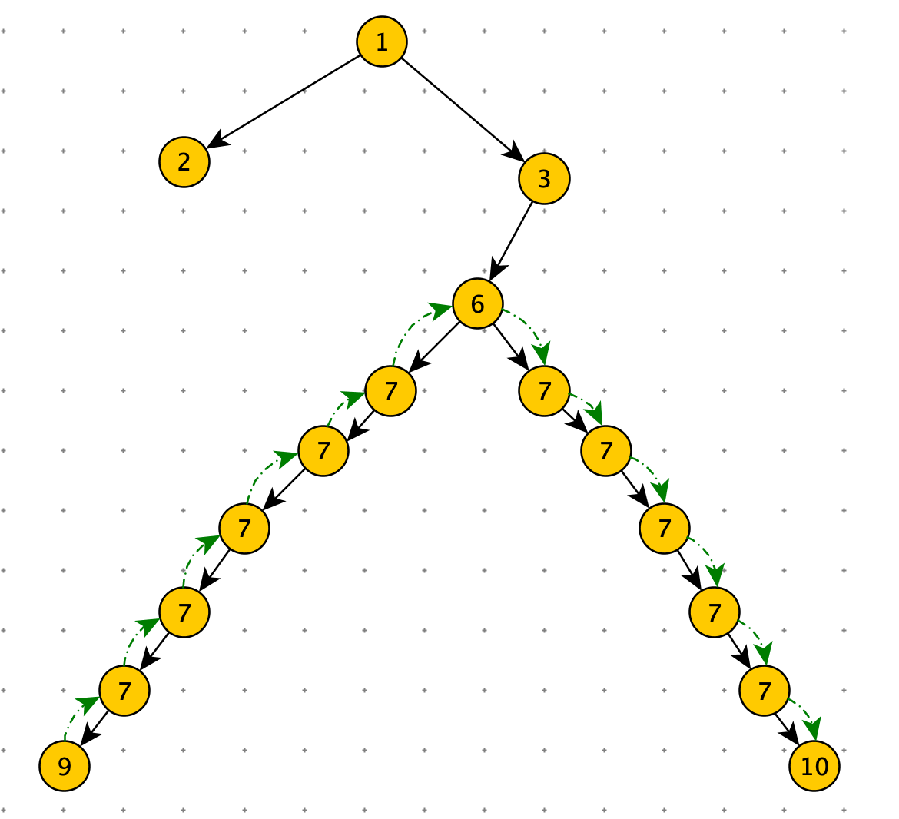
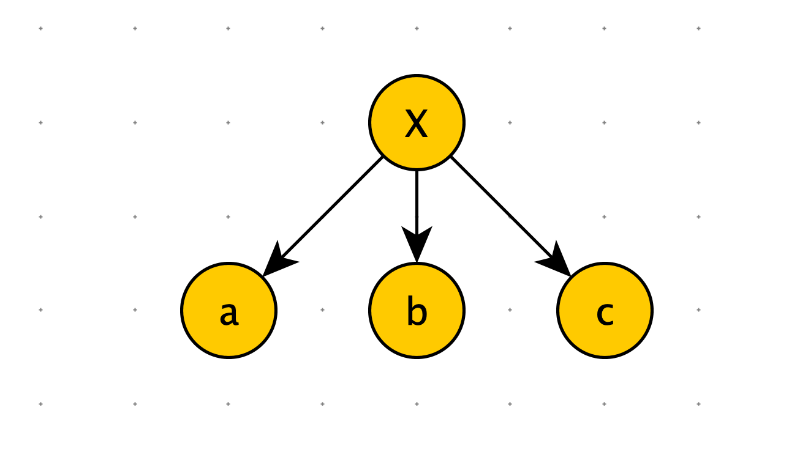

[TOC]

1. 可以解决面试中绝大多数的二叉树问题尤其是树型 dp 问题
2. 本质是利用递归遍历二叉树的遍历性


前提：假设以 X 为头结点

1. 可以从左子树获取信息
2. 可以从右子树获取信息
3. 利用这些信息，求解 X


# 二叉树的递归套路


1. 假设以 X 节点为头，假设可以向 X 左树和 X 右树要任何信息
2. <font color=red>**在上一步的假设下，讨论以 X 为头节点的树，得到答案的可能性（最重要）**</font>
3. 列出所有可能性后，确定到底需要向左树和右树要什么样的信息
4. 把左树信息和右树信息求全集，就是任何一棵子树都需要返回的信息 S
5. 递归函数都返回 S，每一颗子树都这么要求
6. 写代码，在代码中考虑如何把左树的信息和右树信息整合出整棵树的信息


# 递归套路深度实践


## 判断平衡二叉树

> 给定一棵二叉树的头节点 head，返回这棵二叉树是不是平衡二叉树


平衡二叉树定义：每个节点的左子树和右子树的高度相差不超过 1


节点 X 为头结点，X 是平衡二叉树的所有可能性：

1. 左子树是平衡的
2. 右子树是平衡的
3.  | 左子树的高度 - 右子树的高度 | < 2


```python
class TreeNode:
    def __init__(self, val=0, left=None, right=None):
        self.val = val
        self.left = left
        self.right = right

class Info:
    def __init__(self, is_balaced, height):
        self.is_balaced = is_balaced
        self.height = height

def is_balanced(head):
    return process(head).is_balaced

def process(head):
    # 空树是平衡二叉树
    if not head:
        return Info(True, 0)
    # 向左树和右树收集信息
    left_info = process(head.left)
    right_info = process(head.right)

    # 根据子树的信息，组合出自己的信息
    height = max(left_info.height, right_info.height) + 1
    is_balance = True
    if not left_info.is_balaced or right_info.is_balaced or abs(left_info.height - right_info.height) > 2:
        is_balance = False
    return Info(is_balance, height)
```


## 判断平衡二叉树

> 给定一棵二叉树的头节点 head，任何两个节点之间都存在距离，返回整棵二叉树的最大距离。

整棵数据的最大距离：从节点 9 到 节点 10（节点 10 到 节点 9）



**分析**

以 X 节点为头节点：最大距离的情况

- 与 X 无关，最大距离不经过 X 节点
  - max （左树最大距离，右树最大距离）
- 与 X 有关，最大距离经过 X 节点
  - 左树到 X 节点的最大距离 + 右树到 X 节点的最大距离 + 1

左树到 X 节点的最大距离：左树的高度

右树到 X 节点的最大距离：右树的高度


总结递归过程需要的信息

- 子树的高度
- 子树内的最大距离


```python
class TreeNode:
    def __init__(self, val=0, left=None, right=None):
        self.val = val
        self.left = left
        self.right = right

class Info:
    def __init__(self, height, distance):
        self.height = height
        self.distance = distance

def max_distance(head):
    return process(head).distance

def process(head):
    if not head:
        return Info(0, 0)

    left_info = process(head.left)
    right_info = process(head.right)

    # node 的高度
    height = max(left_info.height, right_info.height) + 1
    # node 的最大距离
    distance = max(max(left_info.distance, right_info.distance), left_info.height + right_info.height + 1)
    return Info(height, distance)
```


## 最大的二叉搜索子树

> 给定一棵二叉树的头节点 head，返回这棵二叉树中最大的二叉搜索子树的节点数

二叉搜索树

1. 整棵树上没有重复值
2. 左节点 < 头结点 < 右节点


**分析**

以 X 节点为头节点

- 与 X 无关，最大的二叉搜索子树，可能在左树上，也可能在右树上
  - maxSubBSTSize = max （left_sub_tree.maxSubBSTSize，right_sub_tree.maxSubBSTSize）
- 与 X 有关，以 X 为头的二叉搜索树
  - 左树是平衡二叉树
  - 右树是平衡二叉树
  -  左树.value < X.value < 右树.value
    - 那么： maxSubBSTSize = left_sub_tree.maxSubBSTSize + right_sub_tree.maxSubBSTSize + 1


总结递归过程需要的信息

- 是否是二叉搜索树
- maxSubBSTSize

```python
class TreeNode:
    def __init__(self, val=0, left=None, right=None):
        self.val = val
        self.left = left
        self.right = right


class Info:
    def __init__(self, is_all_bst, max_sub_sbt_size, min_value, max_value):
        self.is_all_bst = is_all_bst
        self.max_sub_sbt_size = max_sub_sbt_size
        self.min_value = min_value
        self.max_value = max_value


def max_sub_bst_size(head):
    if not head: return 0
    return process(head).max_sub_sbt_size


def process(X):
    if not X: return
    left_info = process(X.left)
    right_info = process(X.right)

    min_value = X.vale
    max_value = X.vale

    max_sub_sbt_size = 0
    if left_info:
        min_value = min(min_value, left_info.min_value)
        max_value = max(max_value, left_info.max_value)
        max_sub_sbt_size = left_info.max_sub_sbt_size

    if right_info:
        min_value = min(min_value, right_info.min_value)
        max_value = max(max_value, right_info.max_value)
        max_sub_sbt_size = max(max_sub_sbt_size, left_info.max_sub_sbt_size)

    is_all_bst = False
    if left_info.is_all_bst if left_info else True \
    and right_info.is_all_bst if right_info else True\
    and left_info.max_value < X.vale if left_info else True \
    and right_info.min > X.vale if right_info else True:
        is_all_bst = True
        max_sub_sbt_size = left_info.max_sub_sbt_size if left_info else 0
        + right_info.max_sub_sbt_size if right_info else 0
        + 1
    return Info(is_all_bst, max_sub_sbt_size, min_value, max_value)
```


```python
class TreeNode:
    def __init__(self, val=0, left=None, right=None):
        self.val = val
        self.left = left
        self.right = right


class Info:
    def __init__(self, is_all_bst, max_sub_sbt_size):
        self.is_all_bst = is_all_bst
        self.max_sub_sbt_size = max_sub_sbt_size


def max_sub_bst_size(head):
    if not head: return 0
    return process(head).max_sub_sbt_size


def process(X):
    if not X: return
    left_info = process(X.left)
    right_info = process(X.right)

    max_sub_sbt_size = 0
    if left_info:
        max_sub_sbt_size = left_info.max_sub_sbt_size

    if right_info:
        max_sub_sbt_size = max(max_sub_sbt_size, left_info.max_sub_sbt_size)

    is_all_bst = False
    if left_info.is_all_bst if left_info else True \
    and right_info.is_all_bst if right_info else True\
    and X.left.value < X.vale if X.left else True \
    and X.right.value > X.vale if X.right else True:
        is_all_bst = True
        max_sub_sbt_size = left_info.max_sub_sbt_size if left_info else 0
        + right_info.max_sub_sbt_size if right_info else 0
        + 1
    return Info(is_all_bst, max_sub_sbt_size)
```


> 给定一棵二叉树的头节点 head，返回这棵二叉树中最大的二叉搜索子树的头节点


## 派对的最大快乐值

> 公司的每个员工都符合 Employee 类的描述。整个公司的人员结构可以看作是一个标准的，没有环的<font color=orange>多叉树</font>。树的头节点是公司唯一的老板。除老板以外的每个员工都有唯一的直接上级。叶节点是没有任何下属的基层员工（subordinates 列表为空），除基层员工外，每个员工都有一个或者多个直接下级。
>
> 这个公司现在要办 party，你可以决定哪些员工来，哪些员工不来，规则
>
> 1. 如果某个员工来了，那么这个员工的所有直接下级都不能来。
> 2. 派对的整体快乐值是所有到场员工快乐值的累加和
> 3. 你的目标是让派对的整体快乐值尽量大。
>
> 给定一棵多叉树的头节点 boss，请返回派对的最大快乐值。

```python
class Employee:
    def __init__(self, happy, subordinates):
        self.happy = happy
        self.subordinates = subordinates
```




**分析**

以 X 节点为头节点

- X 来，这他的下属肯定不能来
  - Happy = X.happy + a不来整棵树的Happy + b不来整棵树的Happy + c不来整棵树的Happy
- X 不来，他的下属可能来，也可能不来
  - Happy = 0 + max( a 来，a 不来 ) + max( b 来，b 不来 ) + max( c 来，c 不来 )   


总结递归过程需要的信息:

X 来的 happy 值

X 不来的happy 值


```python
class Employee:
    def __init__(self, happy, subordinates):
        self.happy = happy
        self.subordinates = subordinates

class Info:
    def __init__(self, yes, no):
        # X 来，整棵树 happy 值
        self.yes = yes
        # X 不来，整棵树 happy 值
        self.no = no

def max_happy(head):
    if not head: return 0
    return process(head).max_sub_sbt_size

def process(X):
    if not X: return Info(X.happy, 0)

    yes = X.happy
    no = 0
    # 遍历
    for item in X.subordinates:
        info = process(item)
        # X 来的 happy 值
        yes += info.no
        # X 不来的 happy 值
        no += max(info.yes, info.no)

    return Info(yes, no)
```

