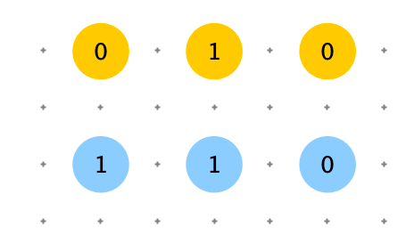
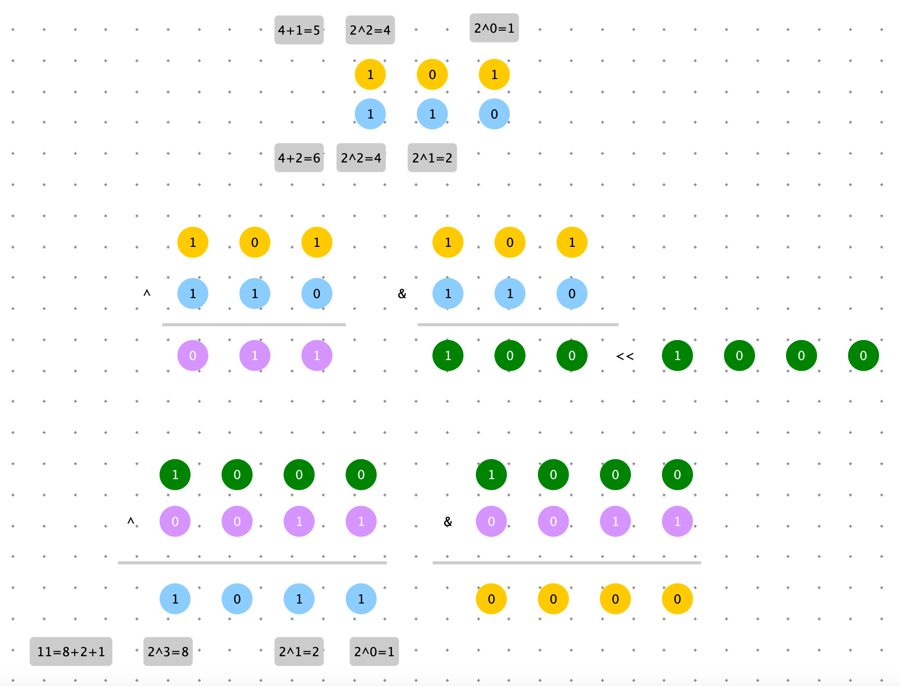
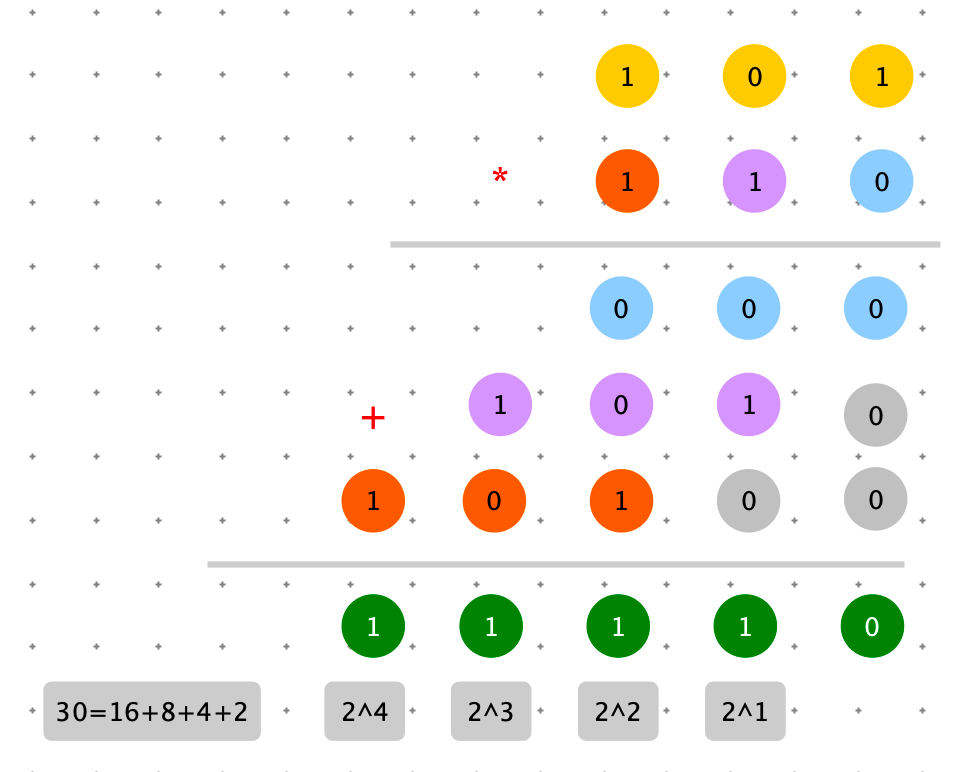
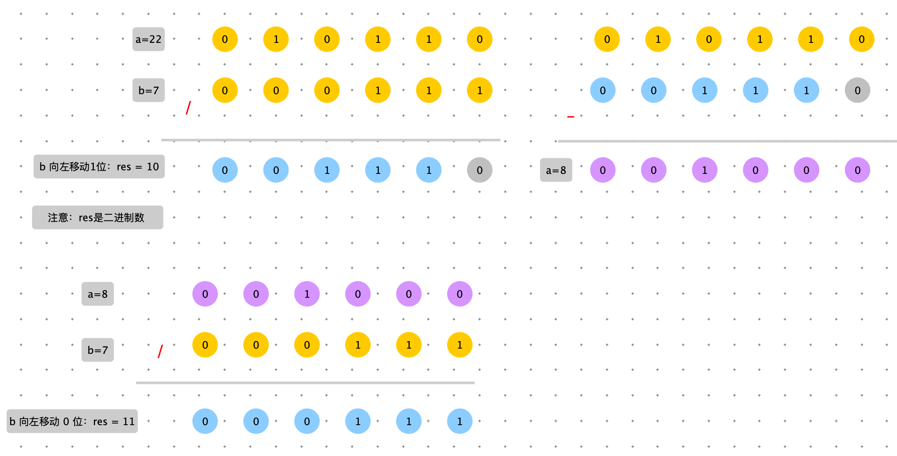
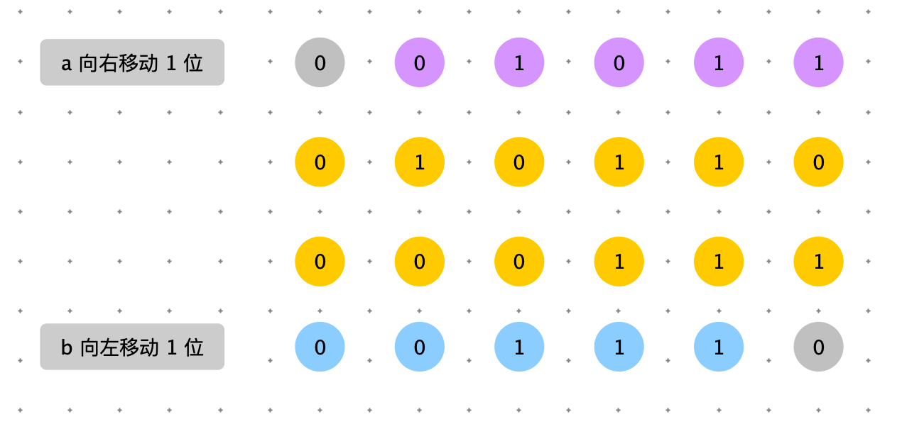

[TOC]


# 二进制的表示

python 中通过 “0b” 或者 “-ob” 字符串表示二进制。

```python
print 0b101
```

输出：

> 5


```python
bin(5)
```

输出：

> 0b101


# 位操作

计算机中所有计算都是二进制的计算。所以需要设计几种基础的计算方法。


**单个数运算**

例如： 0b0000001 对单个二进制数据，我们可以左移，右移。移动后空余的位用 0 去补充。

左移使数变大，0b0000001（十进制等于1） 左移 1位后0b0000010（十进制等于2），左移以一位相当于乘以 2

右移使数变小，0b0000001（十进制等于1） 左移 1位后0b0000000（十进制等于0），左移以一位相当于除以 2

非运算：就是将二进制数每一位，0 变成 1 ，1 变成 0


**两个数运算**

如果两个二进制数进行运算，有下图三种情况：对应位两个数不同，对应位两个数都是 1 ， 对应位两个数都是 0。




可以将 0 看为 false，1 看为 true。

& 与 && 、| 与 || 运算相同。

&（与） 对应位上：必须两个都为 1 结果才是 1

|（或） 对应位上：只要有一个 1 就是 1


位运算还定义了~（异或）：相同为 0 ，不同为 1

异或：也可以理解为不进位求和。


## 左移

```python
bin(0b11 << 1)
```

输出

> 0b110

相当于 3 * 2

## 右移

```python
bin(0b11 >> 1)
```

输出

>  0b1

相当于 3 / 2

注意：


## 非

```python
bin(~0b1010)
```

输出

> -0b1011

0 变 1，1 变 0.

==唯一需要注意的是取非时符号位也会变换.==


## 或

```python
bin(0b110 | 0b101)
```

输出

> 0b111

对应位上：只要有一个 1 就是 1


负数：~正数 + 1 

```python
>>> a = 12
>>> b = ~a + 1
>>> b
-12
```


## 与

```python
bin(0b110 & 0b011)
```

输出

> 0b10

对应位上：只要有一个 0 就是 0


## 异或

```python
bin(0b110 ^ 0b011)
```

输出

> 0b101

A 与 B 不同为1时，A、B的预算结果才为1，否则为 0 


异或常用于将所有的位反转：

```python
bin( 0b1010 ^ 0b1111 )
```

输出

> 0b101


应用场景：

推论：与自身异或，结果为0。

场景：判断两个数是否相等  <==>   异或为 0 。


# 应用

## 以二进制形式打印

以 int32 为例，最高位是符号位，那么从第 31 位开始。


```python
def print_bit(num):
    for i in range(31, -1, -1):
        print("0" if num & (1 << i) == 0 else "1", end="")
    print()

print_bit(4)
```


## bit array

```python
class bitArray:
    def __init__(self, n):
        self.n = n

    # 将 position 为设置为 1
    def set_one(self, position):
        self.n |= 1 << (position - 1)

    # 将 position 为设置为 0
    def set_zero(self, position):
        self.n &= ~(1 << (position - 1))

    # 判断 position 上，是否为 1
    def contains(self, position):
        return (self.n >> (position - 1)) & 1 == 1


bit = bitArray(0)
bit.set_one(2)
bit.set_one(4)
print(bin(bit.n))

bit.set_zero(2)
print(bin(bit.n))
```


## bit map


```java
public class BitMap {
    private long[] bits;

  	// long 类型战 64 bit。
  	// 通过 max 值，计算出需要 bits 数组的大小
    public BitMap(int max) {
      	// 右移 1 位相当于除以 2，2^6 = 64
        // (max + 64) >> 6  -->  (max + 64) /64
        bits = new long[((max + 64) >> 6)];
    }

  	// num >> 6 找到 bits 数组中对应的数
  	// num & 63 找到 num 对应的位，设置为 1.num & 63 与 num % 63 类似
  	// 左移 (num & 63) 位： 100000
  	//  1 | 0 = 1,1 | 1 = 1 所以使用 |
    public void add(int num) {
        bits[num >> 6] |= (1L << (num & 63));
    }
  
  	// num >> 6 找到 bits 数组中对应的数
  	// num & 63 找到 num 对应的位，设置为 1.num & 63 与 num % 63 类似
  	// 左移 (num & 63) 位： 100000; ~ 0111111
  	//  1 & 0 = 0,0 & 0 = 0 所以使用 &
    public void delete(int num) {
        bits[num >> 6] &= ~(1L << (num & 63));
    }

  	
    public boolean contains(int num) {
        return (bits[num >> 6] & (1L << (num & 63))) != 0;
    }

    public static void main(String[] args) {
        // 32bit * 10 --> 320 bits
        int[] arr = new int[10];

        // 想取得第 178 个 bit 的状态
        int i = 178;

        // 先获取数组的下标
        int numIndex = 178 / 32;
        int bitIndex = 178 % 32;
        System.out.println("bitIndex:" + bitIndex);

        // 拿到 178 位的状态
        int s = ((arr[numIndex] >> (bitIndex)) & 1);
        // int s = ((arr[i / 32] >> (i % 32)) & 1);

        // 请将第 178 位的状态改为 1
        arr[numIndex] = arr[numIndex] | (1 << (bitIndex));

        // 请将第 178 位的状态改为 0
        arr[numIndex] = arr[numIndex] & (~(1 << (bitIndex)));
    }
}
```


## 使用位运算实现 + - * /


### 加法

下图中例子是：5 + 6 的例子：a = 5，b = 6

异或运算可以表示不进位相加。因此第一步可以进行异或运算：a ^ b

a ^ b 还差进位数据，res = a ^ b + 进位信息。

怎么获取进位数据呢？可以使用与运算（1与1才是 1），进与运算结果左移 1 位就是原加法的进位信息。

1. res = a ^ b
2. k = a & b ;  k = 0 表示无进位数据。直接退出
3. res = res + k
4. 重复步骤 1 ，2，3 直至 k = 0





```java
    public static int add(int a, int b) {
        int res = a ^ b;
        int k = (a & b) << 1;
        if (k != 0) {
            res = add(res, k);
        }
        return res;
    }
```


### 减法

加法可以用加法实现，应为 b 的负数为 ~b + 1


```java
		public static int minus(int a, int b) {
        return add(a, negNum(b));
    }
```


### 乘法

二进制乘法，与小学学习的乘法竖式类似。每一位相乘，如果该位是 0，那么这次乘法结果为 0，如果该位是 1，那么这次乘法结果为上边那个数。得到 3 个数求和。



```java
    public static int multi(int a, int b) {
        int res = 0;
        while (b != 0) {
            int k = b & 1;
            if (k == 1) {
                res = add(res, a);
            }
            a = a << 1;
            b = b >>> 1;
        }

        return res;
    }
```


### 除法

a / b = c

假设 c = 1 1 0 1 0

$c=2^4 + 2^3 + 2^1 $

那么 $a=b*2^4+b*2^3+b*2^1   \Longrightarrow \frac{a}{b}=2^4 + 2^3 + 2^1=c$  

因此：我们要求：4,3,1，也就求出 c 了 $c=2^4 + 2^3 + 2^1$

$b*2^4$ 的含义就是 b 左移 4 位。怎么确定 4 呢？$b*2^4$ 必定小于 a，因此 b 左移接近 a 时，移动的位数，就要要求的数值。

移动完毕后：$ a = a - b*2^4$，继续寻找下一个移动位数。


 a = 22 ; b = 7 ; res = 3

<font color =orange>余数丢掉了</font>




注意：<font color=red>如果 a  很大，b 在尝试左移的过程中，很容易移出符号位，导致变为负数，无法与 a 比较。在找位数时，a 右移的位数与 b 左移的效果是等价的，a 右移不存在移出符号位的风险 </font>



```java
    private static boolean isNeg(int n) {
        return n < 0;
    }

    private static int negNum(int n) {
        return add(~n, 1);
    }

    public static int div(int a, int b) {
        int x = isNeg(a) ? negNum(a) : a;
        int y = isNeg(b) ? negNum(b) : b;

        int res = 0;
        for (int i = 30; i >= 0; i = minus(i, 1)) {
            if ((x >> i) >= y) {
                res |= (x << i);
                x = minus(x, y << i);
            }
        }
        return isNeg(a) ^ isNeg(b) ? negNum(res) : res;
    }
```


<font color=red>上述算法是将 a，b 取绝对值后，再计算，但是 Integer.MIN_VALUE 没有绝对值。int 范围 $ -2^{31} $ ~  $ 2^{31}-1 $   </font>

因此对于：dividend 和 divisor 等于 Integer.MIN_VALUE 需要特殊处理。

```java
    public static int divide(int dividend, int divisor) {
        if (dividend == Integer.MIN_VALUE && divisor == Integer.MIN_VALUE) {
            return 1;
        }
        if (divisor == Integer.MIN_VALUE) {
            return 0;
        }
        if (dividend == Integer.MIN_VALUE) {
            if (divisor == negNum(1)) {
                return Integer.MIN_VALUE;
            }
            int ans = div(add(dividend, 1), divisor);
            return add(ans, div(minus(dividend, multi(ans, divisor)), divisor));
        }

        return div(dividend, divisor);
    }
```


> 给定两个有符号 32 位整数 a 和 b，返回 a 和 b 中比较大的。
>
> 【要求】：不用做任何比较判断。


```java

```


> 判断一个 32 位正数是不是 2 的幂，4 的幂。

找规律

$2^0$ 对应二进制：0	0	0	0	0	0	0	1

$2^1$ 对应二进制：0	0	0	0	0	0	1	0

$2^2$ 对应二进制：0	0	0	0	0	1	0	0

$2^3$ 对应二进制：0	0	0	0	1	0	0	0

$2^4$ 对应二进制：0	0	0	1	0	0	0	0

....

规律：

1. 二进制数只有 1 个 1
2. 1 所在的位置就是所在 幂次
3. n & (n-1) == 0


```java
  public static boolean isTwo(int n) {
        return (n & (n - 1)) == 0;
    }
```


$4^0$ 对应二进制：0	0	0	0	0	0	0	1

$4^1$ 对应二进制：0	0	0	0	0	1	0	0

$4^2$ 对应二进制：0	0	0	1	0	0	0	0

$4^3$ 对应二进制：0	1	0	0	0	0	0	0


规律：

1. 二进制数只有 1 个 1
2. 这个数必须是一个2 的幂
3. 与上 0101010101... 不等于 0


```java
 public static boolean is4Power(int n) {
        // 0x55555555 就是：0101010101...
        return (n & (n - 1)) == 0 && (n & 0x55555555) != 0;
    }
```


