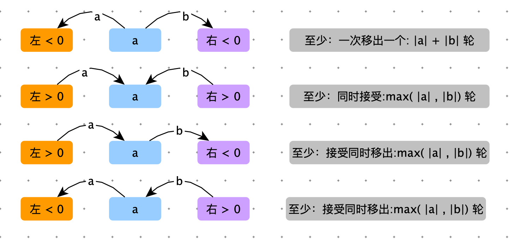
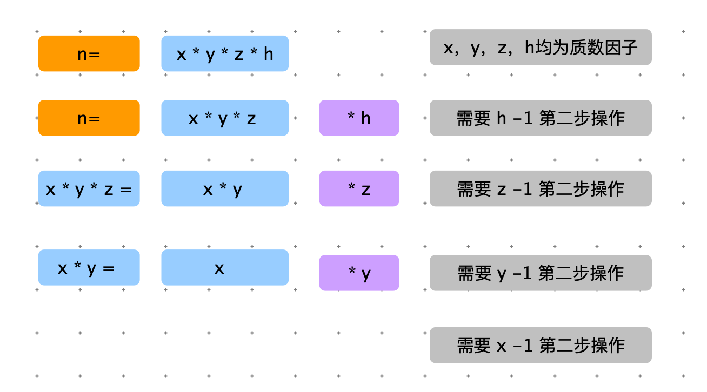

# 业务题

|      | 业务为主 | 技巧为主 |
| ---- | -------- | -------- |
| 笔试 | 55%      | 45%      |
| 面试 | 30%      | 70%      |

HR 会根据学历刷人，技术主管一般看技术面。所以可以通过内推方式，获取技术主管面试机会。笔试满分 100，过 30 分就有面试机会。笔试偏业务，只要不嫌烦，理解题意应该都能打出来。

面试聊的是技巧。


## magic 操作

> 给一个包含 n 个正整数元素的集合 a，一个包含 m 个正整数的集合 b。给定 magic 操作为：从一个集合中取出一个元素，放到另一个集合里，且操作过后每个集合的平均值都大于操作之前。
>
> 问：最多可以进行多少次 magic 操作？

注意：

1. 不可以把一个集合的元素取空，这样就没有平均值了。
2. 值为 x 的元素从集合 b 取出放入集合 a，但集合 a 中已经有了值为 x 的元素，则 a 的平均值不变（因为集合元素不会重复），b 的平均值可能会变化（因为 x 被取走了）


**分析：**

1. 如果集合 a 和集合 b，平均数相等，那么不需要 magic 操作，返回 0
2. 如果平均数不相等，假设 a 的平均数大，那么将 a 中那些大于 avg_b 小于 avg_a 的数据放入集合 b 中，那么集合 a 和集合 b 的平均数都会变大。
3. <font color=green>贪心策略：集合 a 中有多个数据满足条件2，将小的数据优先放入集合 b 中。这样结果是，集合 a 和集合 b 的平均数增长的比较慢，将有更多数据可能从集合a 移动到集合 b。</font>


```python
def max_ops(array1, array2):
    sum1 = sum(array1)
    sum2 = sum(array1)

    avg1 = sum1 / len(array1)
    avg2 = sum2 / len(array2)
    if avg1 == avg2: return 0

  	# 这是一个技巧，将大数组和小数组，指定一个指针，后续就省去很多 if 判断（判断 array1 和 array2 谁大谁小）
    if avg1 > avg2:
        more_sum = sum1
        more_arr = array1
        less_sum = sum2
        less_arr = array2
    else:
        more_sum = sum2
        more_arr = array2
        less_sum = sum1
        less_arr = array1

    more_arr.sort()
    more_n = len(more_arr)
    less_n = len(less_arr)
    set_less = set(less_arr)
    res = 0
    for i in range(len(more_arr)):
        if more_arr[i] < (more_sum / more_n) and more_arr[i] > (less_sum / less_n) and more_arr[i] in set_less:
            more_sum -= more_arr[i]
            more_n -= 1
            less_sum += more_arr[i]
            less_n += 1
            res += 1
    return res
```


## 超级洗衣机

>有 n 个打包机器从左到右一字排开，上方有一个自动装置会抓取一批物品到每个打包机上，放到每个机器上的这些物品数量有多有少，由于物品数量不相同，需要工人将每个机器上的物品进行移动，从而达到物品数量相等才能打包。每个物品重量太大、每次只能搬动一个物品进行移动，为了省力，只在相邻的机器上移动。请计算在搬动最小轮数的前提下，使每个机器上的物品数量相等。如果不能使每个机器上的物品相等返回 -1.
>
>例如：[1,	0,	5] 表示有 3 台机器，每个机器上分别有 1、0、5 个物品，经过这些轮后：
>
>第一轮：1	0  $\leftarrow$ 5  =>  1	1	4
>
>第二轮：1 $\leftarrow$	1  $\leftarrow$ 4  =>  2	1	3
>
>第三轮：2 $\leftarrow$	1  $\leftarrow$ 3  =>  2	2	2
>
>移动了 3 轮，每个机器上的物品相等，所以返回 3
>
>例如：[2,	2,	3] 表示有 3 台机器，每个机器上分别有 2、2、3 个物品
>
>这些物品不管怎么移动，都不能时三台机器上物品数量相等，返回 -1


分析：

注意：一轮：一台机器可以移动出一件物品，可以接受左右相邻机器的物品（2件），可以接受一件物品，移出一件物品。



```python
def min_ops(nums):
    nums_sum = sum(nums)
    n = len(nums)

    if nums_sum % n != 0: return -1
    avg = int(nums_sum / n)

    left_sum = 0
    res = 0
    for i in range(n):
        left_rest = left_sum - i * avg
        right_rest = nums_sum - nums[i] - left_sum - (n - i - 1) * avg

        if left_rest < 0 and right_rest < 0:
            res = max(res, abs(left_rest) + abs(right_rest))
        else:
            res = max(res, max(abs(left_rest), abs(right_rest)))

        left_sum += nums[i]
    return res

print(min_ops([1, 0, 5]))
```

此题 leetcode 517. 超级洗衣机是一样的

> 假设有 **n** 台超级洗衣机放在同一排上。开始的时候，每台洗衣机内可能有一定量的衣服，也可能是空的。
>
> 在 **每一步操作** 中，你可以选择 **任意 m** （1 ≤ m ≤ n） 台洗衣机，与此 **同时** 将每台洗衣机的 **一件衣服** 送到相邻的一台洗衣机。
>
> 给定一个非负整数数组代表从左至右每台洗衣机中的衣物数量，请给出能让所有洗衣机中剩下的衣物的数量相等的 **最少的操作步数** 。如果不能使每台洗衣机中衣物的数量相等，则返回 -1。


中级班第四讲：后续再听听

分解质数因子

> 假设 s 和 m 初始化：s = ”a“；m = s
>
> 再定义两种操作：
>
> 第一种操作：
>
> 1. m = s
> 2. s = s + s
>
> 第二种操作：s = s + m
>
> 求最小的操作步骤数，可以将 s 拼接到长度等于 n


分析：

1. 如果 n 是质数，那么只能使用步骤 2 进行操作，操作步骤为 n - 1。第一步无论执行第一种操作和第二种操作，结果都是：m = ”a“，s= ”2a“，如果后续操作只要执行第一种操作，那么m 和 s 都将变成偶数。因此 n 为质数，只能执行第二步操作。
2. 如果 n 不是质数，如果要看 n 的子问题，可以将 n 分解成质数因子。n = x * y * z * h。如果 x、y、z、h 中有合数，这个合数还是可以再分解成质数。

因此：原问题就转化为：求 n 的质数因子，返回 sum(质数因子) - len(质数因子)




```python
def div_sum_and_count(n):
    sum = 0
    count = 0
    for i in range(2, n):
        while n % i == 0:
            sum += i
            count += 1
            n /= i
    return (sum, count)

def min_ops(n):
    if n < 2: return 0
    if is_prime(n):
        return n - 1
    sum, count = div_sum_and_count(n)
    return sum - count

def is_prime(n):
    for i in range(2, n):
        if n % i == 0: return False
    return True
```


> 给定一个字符串，如果该字符串符合人们日常书写一个整数的形式，放回 int 类型的这个数；如果不符合或者越界返回 -1 或者报错。

业务条件

1. 除了”-“ 之外，其他字符必须为数字。
2. 如果有 ”-“，必须在最左边，且后续有数字，且不是 0。
3. 如果开头为0，后续必无字符。


```java
    public static int convert(String str) {
        if (str == null || str.trim().equalsIgnoreCase("")) {
            return 0;
        }
        char[] chars = str.toCharArray();
        if (!isValid(chars)) {
            throw new RuntimeException(str + "is not num");
        }
      
        int minr = Integer.MIN_VALUE % 10;
        int minq = Integer.MIN_VALUE / 10;
        boolean isNegive = chars[0] == '-';

        int res = 0;
        for (int i = isNegive ? 1 : 0; i < chars.length; i++) {
            int cur = '0' - chars[i];
            if (res < minq || (res == minq && cur < minr)) {
                throw new RuntimeException(str + "can not covert");
            }

            res = res * 10 + cur;
        }
        if(!isNegive && res==Integer.MIN_VALUE){
            throw new RuntimeException(str + "can not covert");
        }


        return isNegive ? res : -res;
    }

    public static boolean isValid(char[] str) {
        if (str[0] != '-' && (str[0] < '0' || str[0] > '9')) {
            return false;
        }

        if (str[0] == '-' && (str.length == 1 || str[1] == '0')) {
            return false;
        }

        if (str[0] == '0' && str.length > 1) {
            return false;
        }

        for (int i = 1; i < str.length; i++) {
            if (str[i] < '0' || str[i] > '9') {
                return false;
            }
        }
        return true;
    }

    public static void main(String[] args) {
        System.out.println(convert("-796"));
        System.out.println(convert("796"));
    }
```


>小 Q 正在给一条长度为 n 的道路设计路灯安置方案。
>
>为了让问题更简单，小 Q 把道路视为 n 个方案，需要照亮的地方用 “.” 表示，不需要照亮的障碍物格子用 “X” 表示。小 Q 现在需要在道路上设置一些路灯，对于安置在 pos 位置的路灯，这栈路灯可以照亮 pos -1 ，pos ，pos + 1 这三个位置。小 Q 希望能安置尽量少的路灯照亮所有 “.” 区域，希望你能帮他计算一下最少需要多少栈路灯。


<font color=red>分析清除每种情况：应该怎么处理。</font>

- 如果 s[i] ==“X”, 不需要点灯：i + 1
- 如果 s[i] ==“.”，需要点灯
  - 如果 s[i+1]==“X”，下一个位置不需要点灯，直接跳过：i += 2
  - 如果 s[i+1]==“.”，由于已经点灯了，可以照 3 格，直接跳过 3 格：i += 3


```python
# 至少需要多少灯，可以把 . 都点亮
def min_light(s):
    i = 0
    light = 0
    n = len(s)
    # 当来 i 位置，一定要保证之前的灯，彻底不会影响到 i 位置
    while i < n:
        if s[i] == "X":
            i += 1
            continue
        light += 1
        if i + 1 == n:
            break

        i += 2 if s[i + 1] == "X" else 3
    return light
  
print(min_light(".XX..X...X.."))
# 4
```


> 在数据加密和数据压缩中常需要对特殊的字符串进行编码。给定的字母表 A 由 26 个小写字母组成，即 A={a，b ... z}。该字母表产生的长序字符串是指定字母从左到右出现的次序与字母在字母表中出现的次序相同，且每个字符最多出现1次。例如：a，b，ab，bc，xyz 等字符串是升序字符串。对字母表 A 产生的所有长度不超过 6 的升序字符串按照字典排列编码如下：a(1)，b(2)，c(3)......,z(26)，ab(27)，ac(28) ...... 对于任意长度不超过 16 的升序字符串，迅速计算出它在上述字典中的编码。
>
> 输入：a	；输出：1 
>
> 输入：b	；输出：2 
>
> 输入：ab  ；输出：26 

分析：给定一个字符串，要求改字符串在字典编码表的位置。


```java
public class KTH {
    /**
     * 必须以 i 号（ASCII 码）字符开头、总长度为 len 的字符串有多少个
     *
     * @param i   i 号（ASCII 码）字符开头
     * @param len 总长度为 len 的字符串
     * @return 子序列树
     */
    public static int g(int i, int len) {
        // 长度为 1 的，只有一个字符，就是 i ，只有 1 个字符串
        if (len == 1) {
            return 1;
        }

        int sum = 0;
        for (int j = i + 1; j <= 26; j++) {
            sum += g(j, len - 1);
        }
        return sum;
    }

    /**
     * 长度为 len 有多少个子序列
     *
     * @param len 长度
     * @return 子序列树
     */
    public static int f(int len) {
        int sum = 0;
        for (int i = 1; i <= 26; i++) {
            sum += g(i, len);
        }
        return sum;
    }

    public static int tkh(String s) {
        if (s == null || s.trim().length() == 0) {
            return 0;
        }

        int len = s.length();
        int sum = 0;

        // 长度为 1,2...(len - 1) 子序列数
        for (int i = 1; i < len; i++) {
            sum += f(i);
        }

        char[] chars = s.toCharArray();
        // 长度为 len，第一个字符小于 char[0] 的子序列数
        int first = chars[0] - 'a' + 1;
        for (int i = 1; i < first; i++) {
            sum += g(i, len);
        }

        int pre = first;
        for (int i = 1; i < len; i++) {
            int cur = chars[i] - 'a' + 1;
            for (int j = pre + 1; j < cur; j++) {
                sum += g(j, len - i);
            }
            pre = cur;
        }
        return sum + 1;
    }

    public static void main(String[] args) {
        System.out.println(tkh("djv"));
    }
}
```


