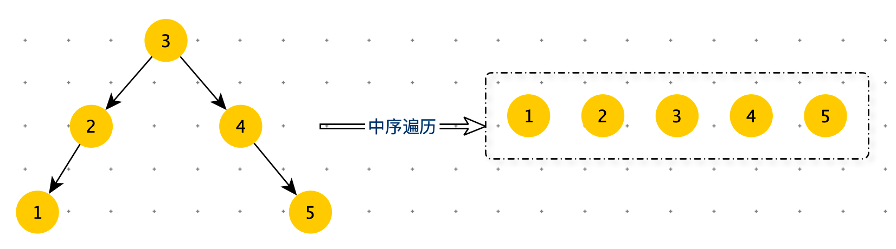
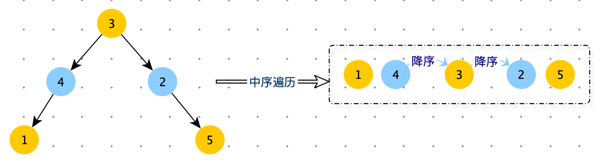
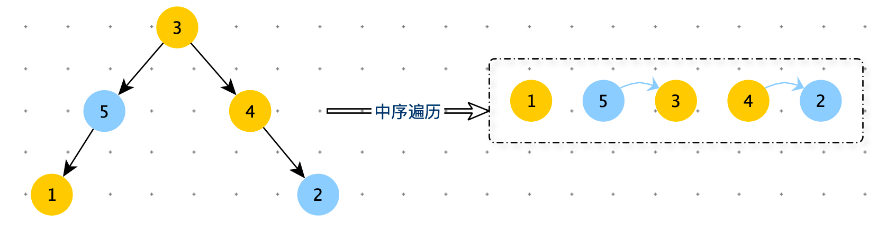
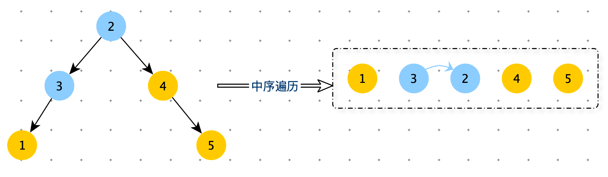

[TOC]

> 求完全二叉树的节点数。


# 调整搜索二叉树中两个错误的节点

> 一棵二叉树原本是搜索二叉树，但是其中有两个节点调换了位置，使得这棵二叉树不再是搜索二叉树，请找到这两个错误节点并返回。
>
> 已知二叉树中所有节点的值都不一样，给定二叉树的头节点 head，返回一个长度为 2 的二叉树节点类型数组 errs，errs[0] 表示一个错误节点，errs[1] 表示另一个错误节点。
>


**解法一：递归**

如下图对搜索二叉树进行中序遍历，可以得到一个升序数组。如果搜索二叉树中有两个节点调换为了位置，那么得到的数组，升序一定被破坏了。



如下图：如果节点 2 与节点 4 调换了位置，得到的数组中有两个逆序对。

- 第一个错误节点：第一次下降的前一个节点。
- 第二个错误节点：最后一次下降的一个节点。



如下图：如果节点 2 与节点 5 调换了位置，得到的数组中有两个逆序对。

- 第一个错误节点：第一次下降的前一个节点。
- 第二个错误节点：最后一次下降的一个节点。



如下图：如果节点 2 与节点 3 调换了位置，得到的数组中有一个逆序对。

数组无论有两个逆序对还是只有一个逆序对，错误节点都满足下边的规律。

- 第一个错误节点：第一次下降的前一个节点。
- 第二个错误节点：最后一次下降的一个节点。




```python
class TreeNode:
    def __init__(self, val=0, left=None, right=None):
        self.val = val
        self.left = left
        self.right = right

def find_error_nodes(root: TreeNode):
    return inorder(root, None, None)

def inorder(node, first, second):
    if node:
        first, second = inorder(node.left, first, second)
        if node.left and node.left.val > node.val:
            second = node
            if not first: first = node.left
        first, second = inorder(node.right, first, second)
        if node.right and node.right.val < node.val:
            second = node.right
            if not first: first = node
    return [first, second]
```


也可以这样写，使用一个全局变量 pre 记录中序遍历上次的结点

```python
global pre
pre = None

def find_error_node(root: TreeNode):
    global pre
    pre = None
    err = [None, None]
    inorder3(root, err)
    return err

def inorder3(node, err):
    global pre
    if node:
        inorder3(node.left, err)
        if pre and pre.val > node.val:
            err[1] = node
            if not err[0]: err[0] = pre

        pre = node
        inorder3(node.right, err)
```


**解法二：非递归**

```python
def find_error_nodes2(root: TreeNode):
    if not root: return
    stack = []
    first = None
    second = None
    pre = None
    while root or stack:
        # 从根节点开始，一直找它的左子树
        if root:
            stack.append(root)
            root = root.left
        else:
            # while结束表示当前节点node为空，即前一个节点没有左子树了
            root = stack.pop()
            if pre and pre.val > root.val:
                second = root
                if not first: first = pre

            pre = root
            # 开始查看它的右子树
            root = root.right
    return [first, second]
```


> 进阶：
>
> 如果在原问题中得到了两个错误节点，我们当然可以通过交换两个节点值的方式让整棵二叉树重新成为搜索二叉树。但是现在要求你不能这么做，而是在结构上完全交换两个节点的位置，请实现调整的函数。

**修改节点值**

```python
def modify_error_nodes(root: TreeNode):
    first, second = find_error_node2(root)
    first.val, second.val = second.val, first.val
```


**节点交换位置**

```python
```

