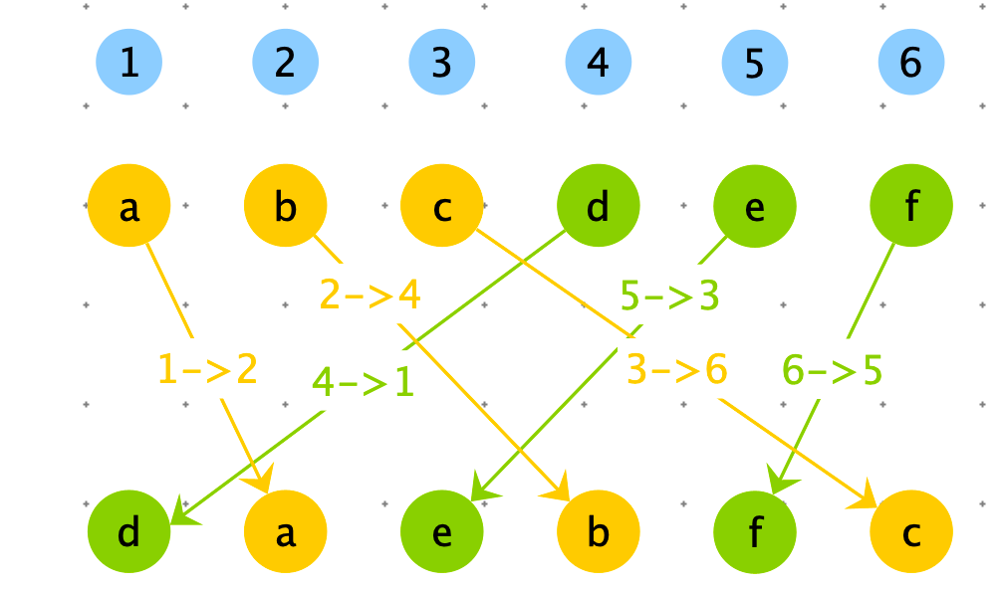
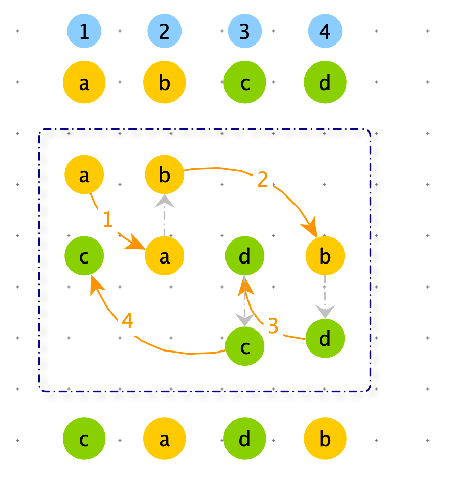
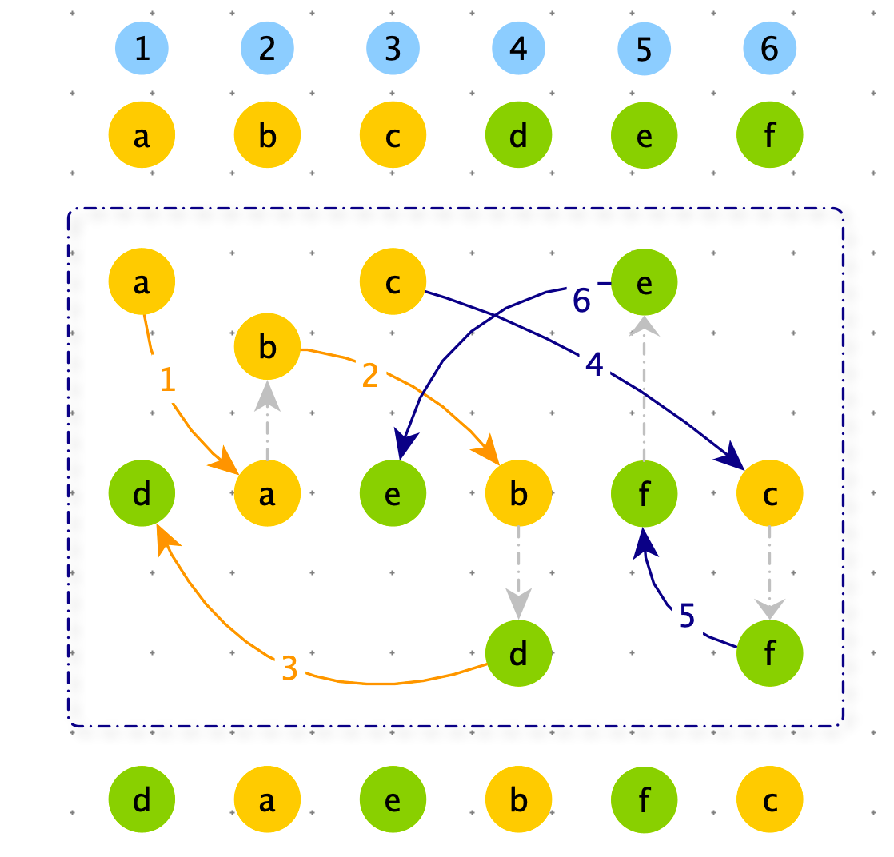
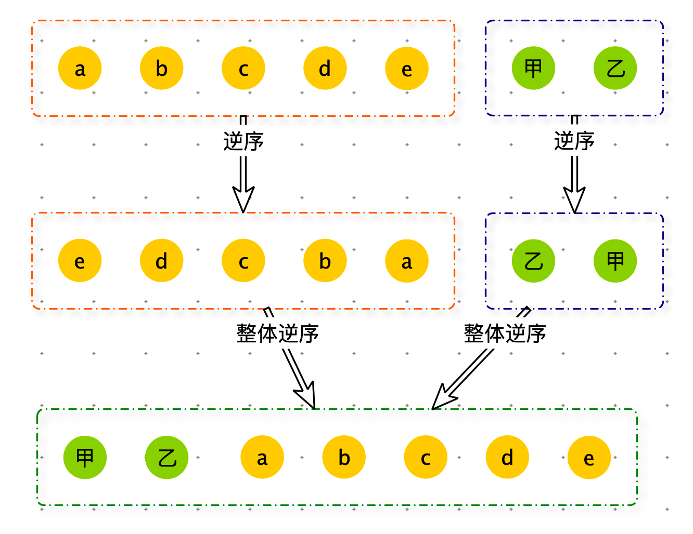
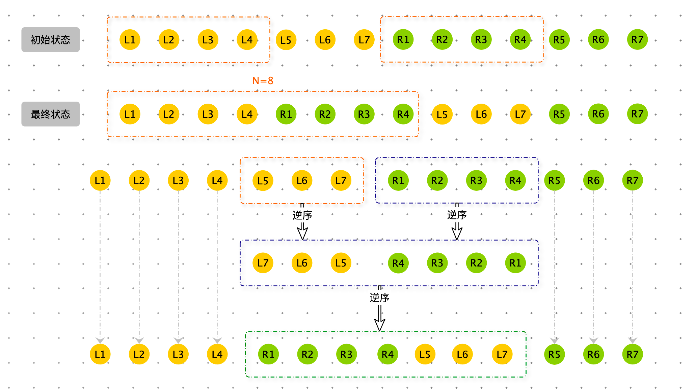
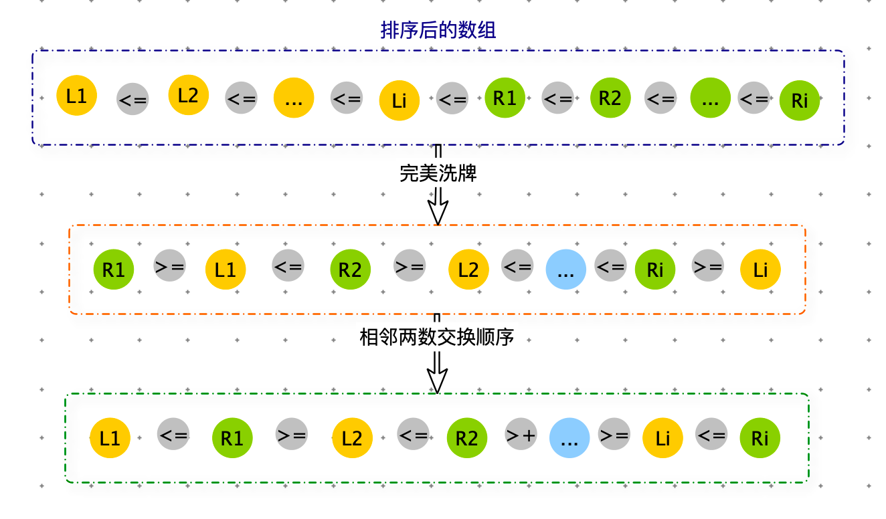
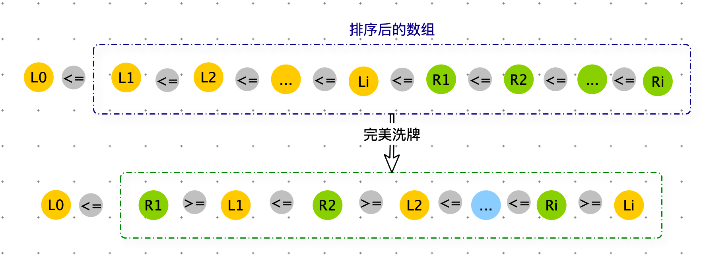
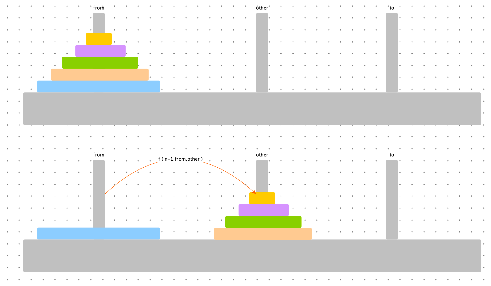
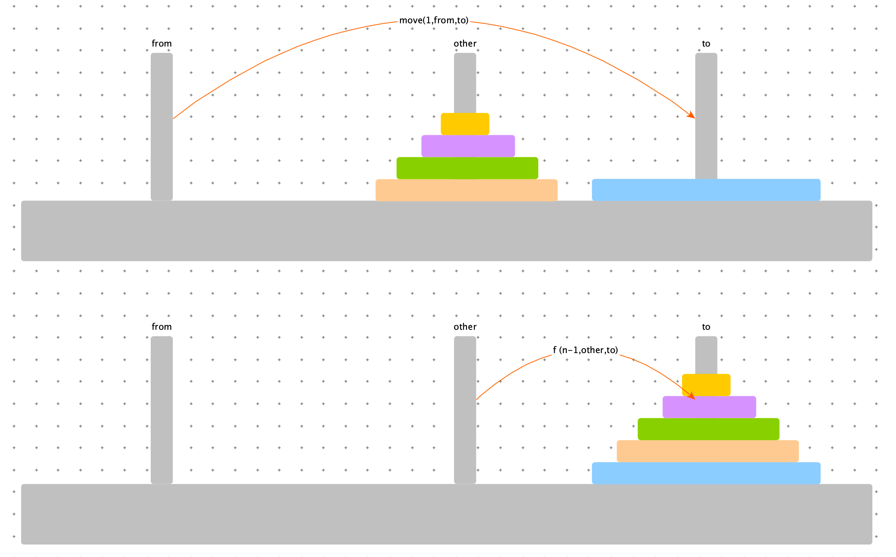
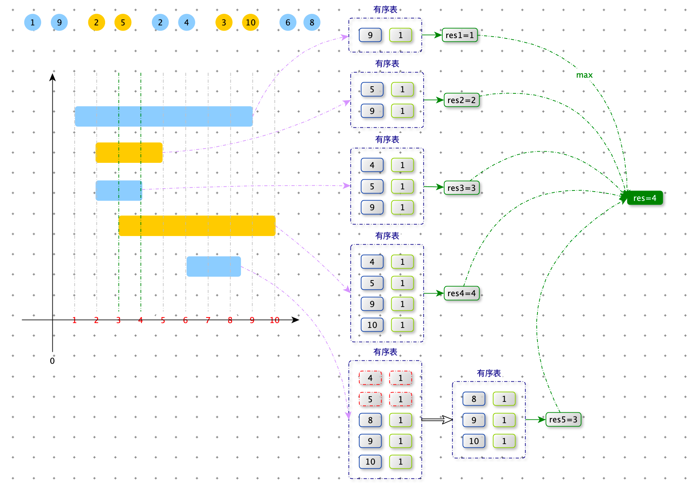

[TOC]

# 完美洗牌

> 给定一个长度为偶数的数组 arr，长度记为 2*N。前 N 个为左部分，后 N 个为右部分。arr 就可以表示为 【L1，L2，...，Ln，R1，R2，...，Rn】，请将数组调整成  【R1，L1，R2，L2，...，Ln，Rn】的样子。
>
> 空间复杂度要求：O(1)


分析：

假设数组下标从 1 开始，我们可以根据数据的原始下标，通过公式推导出调整后的下标。

$f(i)=\begin{cases} 2*i & i <=N & 左半区 \\ 2*(i-N)-1 & i>N & 右半区 \end{cases}$




```python
def modify_index(i, length):
    if i <= int(length / 2): return 2 * i
    return 2 * (i - int(length / 2)) - 1

def modify_index2(i, length):
    return (2 * i) % (length + 1)
```


如果我们找到一个数据开始，如下图一样可以循环处理下去，就能完成调整。




一个数组可能由很多环，我们需要处理完毕所有环。如果能找到所有环的触发点，问题就迎刃而解了。

下图的两个环，触发点分别是：a 和 c




<font color=red>**结论：当 $N=3^k-1$ （k > 0）时，不同环的所有的触发点是：$3^0,3^1,3^2,...,3^k$**</font>

例如：

- 当 N = 2 时，触发点：1
- 当 N = 8 时，触发点：1，3
- 当 N = 26 时，触发点：1，3，9


对于arr 的长度为： $N=3^k-1$  ，通过以上方法解决了。


```python
# 从 start 位置开始，向右 length 长度这一段，做下标续连推
# 出发位置（trigger）：1，,3，9...
def cycles(arr, start,length, k):
    # 找到每一个出发位置 trigger，一共 k 个
    # 每个 trigger 都进行下标连续推
    # 出发位置是从 1 开始计算的，而数组下标是 0 开始计算的
    i = 0
    trigger = 1
    while i < k:
        pre_value = arr[trigger + start - 1]
        cur = modify_index2(trigger, length)
        while cur != trigger:
            tmp = arr[cur + start - 1]
            arr[cur + start - 1] = pre_value
            pre_value = tmp
            cur = modify_index2(cur, length)

        arr[cur + start - 1] = pre_value
        trigger *= 3
        i += 1
```


arr 的 长度为普通长度怎么办？

要处理普通长度数组的调整，我们需要先了解一种调整结构。

将数组【a，b，c，d，e，甲，乙】调整为 【甲，乙，a，b，c，d，e】步骤如下图。



```python
# arr[left:mid+1] 为左部分，arr[mid+1:right+1] 为右部分,左右部分互换
def rotate(arr, left, mid, right):
    reverse(arr, left, mid)
    reverse(arr, mid + 1, right)
    reverse(arr, left, right)


def reverse(arr, left, right):
    while left < right:
        arr[left], arr[right] = arr[right], arr[left]
        left += 1
        right -= 1
```


开始处理通常偶数

假设 N = 14， 距离 $$N=3^k-1$$ 的数是 8，那么我们先处理前八位。我们需要将【L1，L2，L3，L4】和 【R1，R2，R3，R4】挨着。也就是：

原始数组：【L1，L2，L3，L4，L5，L6，L7，R1，R2，R3，R4，R5，R6，R7】

调整为：	【L1，L2，L3，L4，R1，R2，R3，R4，L5，L6，L7，R5，R6，R7】

此时我们按照： $N=3^k-1=8$ 处理，  当 N = 8 时，触发点：1，3。

处理完毕前8位，再处理剩余后六位：【L5，L6，L7，R5，R6，R7】

N = 6  距离 $$N=3^k-1$$ 的数是 2，依次递归处理完毕。




```python
def shuffle(arr):
    if not arr or len(arr) % 2 != 0: return
    proces(arr, 0, len(arr) - 1)


# 在 arr[left:right+1] 上做完美洗牌的调整
def proces(arr, left, right):
    # 切成一块一块的解决，每一块的长度满足 3^k-1
    while right > left - 1:
        length = right - left + 1
        base = 3
        k = 1

        # 计算小于等于 length 并且离 length 最近的，满足 3^k-1 的数
        # 也就是找到最大的 k，满足 3^k <= length
        while base <= int((length + 1) / 3):
            base *= 3
            k += 1

        # 当前要解决长度为 base - 1 的块，一半就是再除2
        half = int((base - 1) / 2)
        # left 和 right 的中点位置
        mid = int((left + right) / 2)
        # 要旋转的左部分为[L + half...mid], 右部分为arr[mid + 1..mid + half]
        # 注意在这里，arr下标是从 0 开始的
        rotate(arr, left + half, mid, mid + half)
        # 旋转完成后，从L开始算起，长度为base-1的部分进行下标连续推
        cycles(arr, left, base - 1, k)
        # 解决了前base - 1 的部分，剩下的部分继续处理
        left = left + base - 1
```


**对数器**

```python
import random

def wiggle_sort2(arr):
    if not arr: return
    # 假设这里是堆排序
    arr.sort()
    if len(arr) & 1 == 1:
        proces(arr, 1, len(arr) - 1)

    shuffle(arr)
    for i in range(0, len(arr), 2):
        tmp = arr[i]
        arr[i] = arr[i + 1]
        arr[i + 1] = tmp

def check():
    for i in range(100):
        arr = [int(random.random() * 100) for _ in range(int(random.random() * 10) + 1)]
        arr1 = arr[:]
        arr2 = arr[:]
        shuffle(arr1)
        shuffle2(arr2)
        if arr1 != arr2:
            print("ERROR", arr, arr1, arr2)
    print("OVER")
```


# wiggle sort

> 给出一个无序的数组，在原地将数组排列成符合以下规律：nums[0] <= nums[1] >= nums[2] <= nums[3]....
>
> Given nums = [3, 5, 2, 1, 6, 4], one possible answer is [1, 6, 2, 5, 3, 4].
>
> 空间复杂度要求：O(1)

第一步先排序：

​		使用堆排序（三大排序算法：快排，堆排序，归并排序中只有堆排序的空间复杂度为：O(1)）

第二步：

​		如果 N 是偶数：进行完美洗牌，完美洗牌后大数在第一位，需要将相邻两数两两交换顺序。




​		如果 N 是奇数：对arr[1:] 进行完美洗牌。



```python
def wiggle_sort(arr):
    if not arr: return
    # 假设这里是堆排序
    arr.sort()
    if len(arr) % 2 == 0:
        return shuffle(arr)
    return proces(arr, 1, len(arr) - 1)
```


# 汉诺塔中间状态

> 汉诺塔游戏的要求把所有的圆盘从左边都移到右边的柱子上，给定一个整型数组arr，其中只含有1、2、3，代表所有圆盘目前的状态，1 代表左柱，2代表中柱，3 代表右柱，arr[i] 的值代表第 i + 1 个圆盘的位置。
>
> 比如：arr = [3,3,2,1] ，代表第 1 个圆盘在右柱上，第 2 个圆盘在右柱上，第 3 个圆盘在中柱上，第 4 个圆盘在左柱上。
>
> 如果 arr 代表的状态是最优移动轨迹过程中出现的状态，返回 arr 这种状态是最优移动轨迹中第几状态；如果 arr 代表的状态不是最优移动轨迹过程中出现的状态，则返回 -1。


**解法一：暴力递归**

分析：

结论：n 层汉诺塔一共需要 $2^n-1$ 次移动圆盘。

汉诺塔问题分三步：

1. 将 0 ~ n -1 号圆盘从 from 柱子移动到 other 柱子，需要 $2^{n-1}-1$ 次移动圆盘。
2. 将 n 号圆盘从 from 柱子移动到 to 柱子，需要 1 次移动圆盘。
3. 将 0 ~ n - 1 号圆盘从 other 柱子移动到 to 柱子，需要 $2^{n-1}-1$ 次移动圆盘。


可能性分析：

- 假设 n 号圆盘在 from 柱子上，说明第一大步还没走完，此时最优移动轨迹中的第几状态，取决于第一大步移动了多少次圆盘。
- 假设 n 号圆盘在 other 柱子上，从下图可知 n 号圆盘不可能出现在 other 柱子上，说明次走法的不是最优移动轨迹，返回 -1。
- 假设 n 号圆盘在 to 柱子上，说明第一大步和第二大步已经走完，此时最优移动轨迹中的第几状态 = 第一大步所有的移动次数 + 第二大步所有的移动次数 + 第三大步真实移动次数 = $(2^{n-1}-1) + 1 + rest  = 2{n-1}+rest$。






时间复杂度：O(N)

```python
def step(arr):
    if not arr: return 0
    return f(arr, len(arr) - 1, 1, 2, 3)

# 目标：把 arr[0~i] 的圆盘，从 from 全部挪到 to 上
# 返回：根据 arr 中状态 arr[0~i] ,它是最优解的第几步？
# 时间复杂度：O(N)
def f(arr, i, fro, other, to):
    if i == -1: return 0
    if arr[i] != fro and arr[i] != to:
        return -1
    if arr[i] == fro:
        # 第一大步没走完，arr[0~i-1] from --> other
        return f(arr, i - 1, fro, to, other)
    # 第三步完成的程度
    rest = f(arr, i - 1, other, fro, to)
    if rest == -1:
        return rest
    return (1 << i) + rest
```


**解法二：非递归**


```python
def step1(arr):
    if not arr: return 0
    fro = 1
    other = 2
    to = 3
    i = len(arr) - 1
    res = 0
    while i >= 0:
        if arr[i] != fro and arr[i] != to: return -1
        if arr[i] == fro:
            res += 1 << i
            tmp = fro
            fro = other
        else:
            tmp = to
            to = other
        other = tmp
        i -= 1
    return res
```


**对数器**

```python
import random

def check():
    for _ in range(1000):
        arr = [int(random.random() * 3) + 1 for _ in range(int(random.random() * 100))]
        res = step(arr)
        res1 = step(arr)
        if res != res1:
            print("ERROR","res=",res,"res1=",res1,arr)
    print("Nice")

check()
```


LFU 缓存

> 一个缓存结构需要实现如下功能：
>
> Void set(int key,int value)：加入或者修改 key 对应的 value
>
> int get(int key)：查询 key 对应的 value 值
>
> 但是缓存最多放 K 条记录，如果新的 K + 1 条记录需要加入，就需要根据策略删掉一条记录，然后才能把新记录加入。
>
> 这个策略为：在缓存结构的 K 条记录中，哪一个 key 从进入缓存结构的时刻开始，被调用set 或者 get 次数最少，就删掉这个key 的记录；如果调用次数最少的 key 有多个，上次调用发送最早的 key 被删除。
>
> 这个就是 LFU 缓存替换算法。实现这个结构，K 作为参数。


# 线段重叠

> 一条直线上有 n 个线段，第 i 个线段的坐标为$(x_1[i],x_2[i])$。请你计算出直线上重叠线段数量最多的地方，有多少个线段相互重叠？


分析：

首先需要根据线段的起始点排序，便于后续处理。

线段重叠问题需要根据当前线段的 start 和 end 排除哪些没有重合的线段。

我们可以将线段的 end ，放入一个有序表里，将有序表中小于 start 的数据都删除（那些已加入有序表线段的 end 小于当前线段的 start，肯定与当前线段不重叠）。有序表中所有end 个数就是线段相互重叠数（由于 end 有可能重复，而有序表的 key 不能重复，所有用有序表 value 作为 end 个数）。



时间复杂度：$O(NlogN)$

空间复杂度：$O(N)$

```java
    public static int maxLevelCount1(int[][] arr) {
        if (arr == null || arr.length == 0) {
            return 0;
        }
        // 排序
        Arrays.sort(arr, (e1, e2) -> (e1[0] - e2[0]));

        int res = 0;
        // map 中 value 的和
        int sum = 0;

        // key：是 arr 的 end；value：end 的出现次数
        TreeMap<Integer, Integer> map = new TreeMap<>();
        for (int i = 0; i < arr.length; i++) {
            int start = arr[i][0];
            int end = arr[i][1];

            int count = map.getOrDefault(end, 0) + 1;
            map.put(end, count);
            // map 中 value 的和增加了 1
            sum += 1;

            // 将 map 中所有 key( end ) 小于等于 start 的删除掉
            while (true) {
                Map.Entry<Integer, Integer> entry = map.floorEntry(start);
                if (entry == null) {
                    break;
                }
                map.remove(entry.getKey());

                // map 中 value 的和减少 entry.getValue()
                sum -= entry.getValue();
                start = entry.getKey();
            }

            res = Math.max(res, sum);
        }

        return res;
    }
```


> 平面内有 n 个矩形，第 i 个矩形的左下角坐标为$(x_1[i],y_1[i])$，右上角坐标为：$(x_2[i],y_2[i])$。如果两个或多个矩形有公共区域，则认为他们是相互重叠的（不考虑边界和角落）。请你计算出平面内重叠矩形数量最多的地方，有多少个矩形相互重叠？


