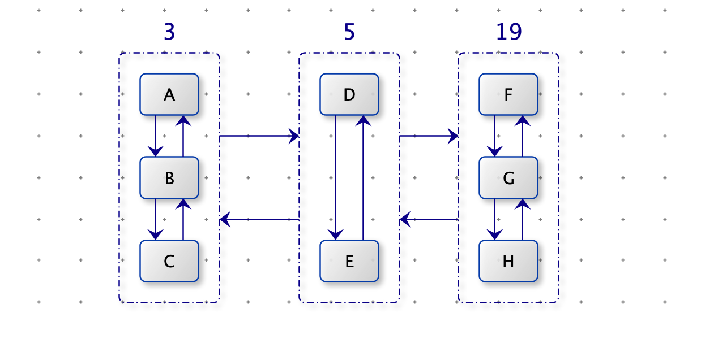
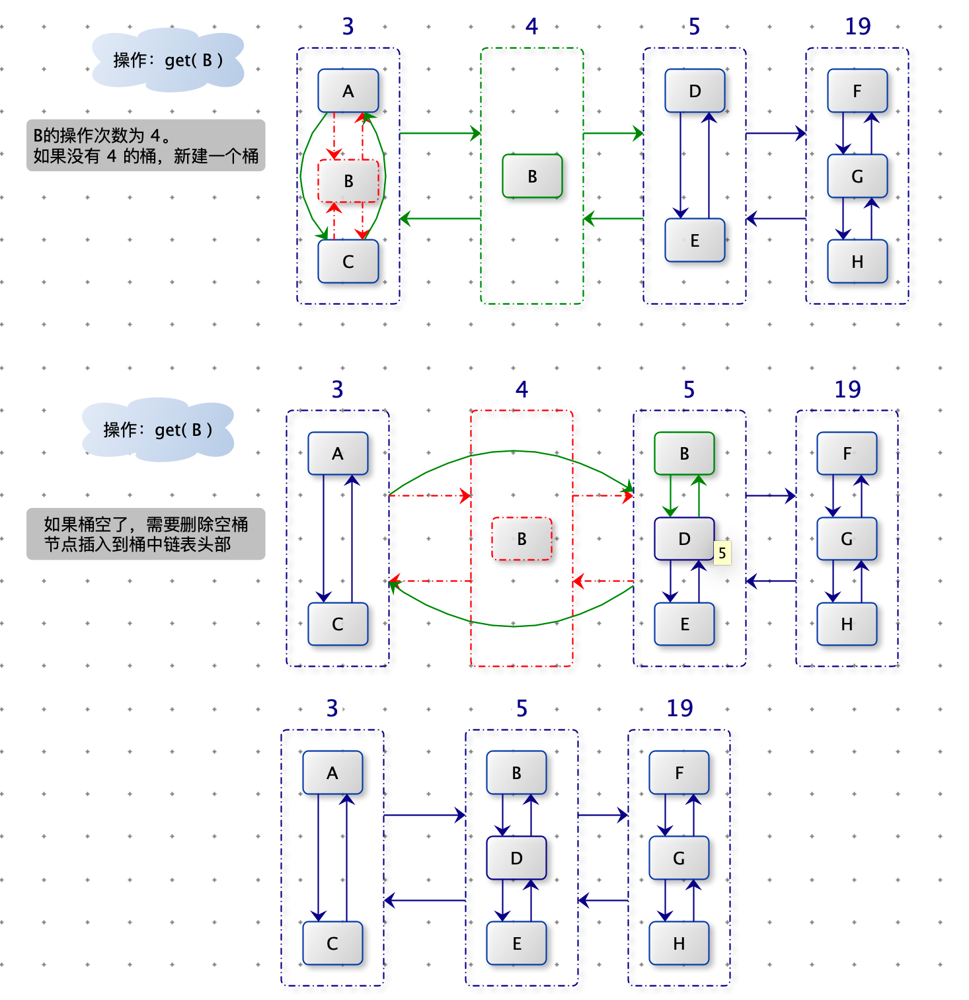
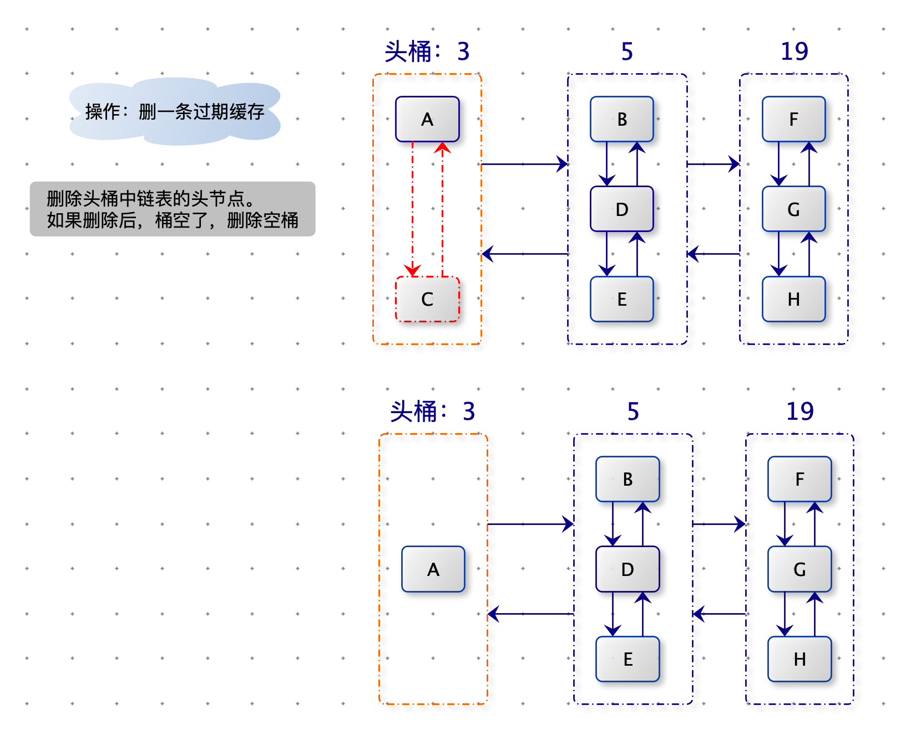
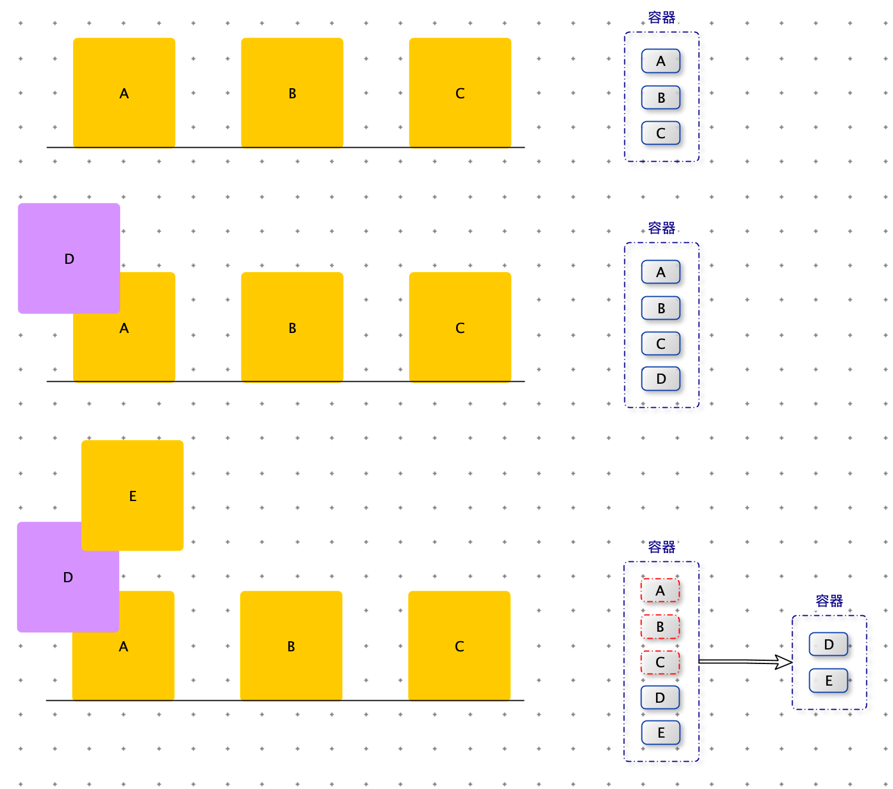
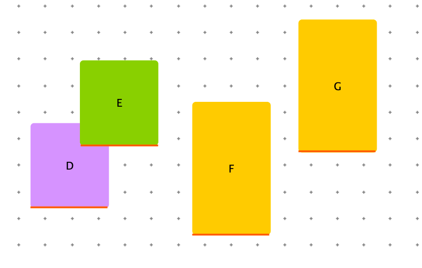

[TOC]

# 完美洗牌

> 给定一个长度为偶数的数组 arr，长度记为 2*N。前 N 个为左部分，后 N 个为右部分。arr 就可以表示为 【L1，L2，...，Ln，R1，R2，...，Rn】，请将数组调整成  【R1，L1，R2，L2，...，Ln，Rn】的样子。
>
> 空间复杂度要求：O(1)


分析：

假设数组下标从 1 开始，我们可以根据数据的原始下标，通过公式推导出调整后的下标。

$f(i)=\begin{cases} 2*i & i <=N & 左半区 \\ 2*(i-N)-1 & i>N & 右半区 \end{cases}$


```python
def modify_index(i, length):
    if i <= int(length / 2): return 2 * i
    return 2 * (i - int(length / 2)) - 1

def modify_index2(i, length):
    return (2 * i) % (length + 1)
```


如果我们找到一个数据开始，如下图一样可以循环处理下去，就能完成调整。


一个数组可能由很多环，我们需要处理完毕所有环。如果能找到所有环的触发点，问题就迎刃而解了。

下图的两个环，触发点分别是：a 和 c


<font color=red>**结论：当 $N=3^k-1$ （k > 0）时，不同环的所有的触发点是：$3^0,3^1,3^2,...,3^k$**</font>

例如：

- 当 N = 2 时，触发点：1
- 当 N = 8 时，触发点：1，3
- 当 N = 26 时，触发点：1，3，9


对于arr 的长度为： $N=3^k-1$  ，通过以上方法解决了。


```python
# 从 start 位置开始，向右 length 长度这一段，做下标续连推
# 出发位置（trigger）：1，,3，9...
def cycles(arr, start,length, k):
    # 找到每一个出发位置 trigger，一共 k 个
    # 每个 trigger 都进行下标连续推
    # 出发位置是从 1 开始计算的，而数组下标是 0 开始计算的
    i = 0
    trigger = 1
    while i < k:
        pre_value = arr[trigger + start - 1]
        cur = modify_index2(trigger, length)
        while cur != trigger:
            tmp = arr[cur + start - 1]
            arr[cur + start - 1] = pre_value
            pre_value = tmp
            cur = modify_index2(cur, length)

        arr[cur + start - 1] = pre_value
        trigger *= 3
        i += 1
```


arr 的 长度为普通长度怎么办？

要处理普通长度数组的调整，我们需要先了解一种调整结构。

将数组【a，b，c，d，e，甲，乙】调整为 【甲，乙，a，b，c，d，e】步骤如下图。


```python
# arr[left:mid+1] 为左部分，arr[mid+1:right+1] 为右部分,左右部分互换
def rotate(arr, left, mid, right):
    reverse(arr, left, mid)
    reverse(arr, mid + 1, right)
    reverse(arr, left, right)


def reverse(arr, left, right):
    while left < right:
        arr[left], arr[right] = arr[right], arr[left]
        left += 1
        right -= 1
```


开始处理通常偶数

假设 N = 14， 距离 $$N=3^k-1$$ 的数是 8，那么我们先处理前八位。我们需要将【L1，L2，L3，L4】和 【R1，R2，R3，R4】挨着。也就是：

原始数组：【L1，L2，L3，L4，L5，L6，L7，R1，R2，R3，R4，R5，R6，R7】

调整为：	【L1，L2，L3，L4，R1，R2，R3，R4，L5，L6，L7，R5，R6，R7】

此时我们按照： $N=3^k-1=8$ 处理，  当 N = 8 时，触发点：1，3。

处理完毕前8位，再处理剩余后六位：【L5，L6，L7，R5，R6，R7】

N = 6  距离 $$N=3^k-1$$ 的数是 2，依次递归处理完毕。


```python
def shuffle(arr):
    if not arr or len(arr) % 2 != 0: return
    proces(arr, 0, len(arr) - 1)


# 在 arr[left:right+1] 上做完美洗牌的调整
def proces(arr, left, right):
    # 切成一块一块的解决，每一块的长度满足 3^k-1
    while right > left - 1:
        length = right - left + 1
        base = 3
        k = 1

        # 计算小于等于 length 并且离 length 最近的，满足 3^k-1 的数
        # 也就是找到最大的 k，满足 3^k <= length
        while base <= int((length + 1) / 3):
            base *= 3
            k += 1

        # 当前要解决长度为 base - 1 的块，一半就是再除2
        half = int((base - 1) / 2)
        # left 和 right 的中点位置
        mid = int((left + right) / 2)
        # 要旋转的左部分为[L + half...mid], 右部分为arr[mid + 1..mid + half]
        # 注意在这里，arr下标是从 0 开始的
        rotate(arr, left + half, mid, mid + half)
        # 旋转完成后，从L开始算起，长度为base-1的部分进行下标连续推
        cycles(arr, left, base - 1, k)
        # 解决了前base - 1 的部分，剩下的部分继续处理
        left = left + base - 1
```


**对数器**

```python
import random

def wiggle_sort2(arr):
    if not arr: return
    # 假设这里是堆排序
    arr.sort()
    if len(arr) & 1 == 1:
        proces(arr, 1, len(arr) - 1)

    shuffle(arr)
    for i in range(0, len(arr), 2):
        tmp = arr[i]
        arr[i] = arr[i + 1]
        arr[i + 1] = tmp

def check():
    for i in range(100):
        arr = [int(random.random() * 100) for _ in range(int(random.random() * 10) + 1)]
        arr1 = arr[:]
        arr2 = arr[:]
        shuffle(arr1)
        shuffle2(arr2)
        if arr1 != arr2:
            print("ERROR", arr, arr1, arr2)
    print("OVER")
```


# wiggle sort

> 给出一个无序的数组，在原地将数组排列成符合以下规律：nums[0] <= nums[1] >= nums[2] <= nums[3]....
>
> Given nums = [3, 5, 2, 1, 6, 4], one possible answer is [1, 6, 2, 5, 3, 4].
>
> 空间复杂度要求：O(1)

第一步先排序：

​		使用堆排序（三大排序算法：快排，堆排序，归并排序中只有堆排序的空间复杂度为：O(1)）

第二步：

​		如果 N 是偶数：进行完美洗牌，完美洗牌后大数在第一位，需要将相邻两数两两交换顺序。


​		如果 N 是奇数：对arr[1:] 进行完美洗牌。


```python
def wiggle_sort(arr):
    if not arr: return
    # 假设这里是堆排序
    arr.sort()
    if len(arr) % 2 == 0:
        return shuffle(arr)
    return proces(arr, 1, len(arr) - 1)
```


# 汉诺塔中间状态

> 汉诺塔游戏的要求把所有的圆盘从左边都移到右边的柱子上，给定一个整型数组arr，其中只含有1、2、3，代表所有圆盘目前的状态，1 代表左柱，2代表中柱，3 代表右柱，arr[i] 的值代表第 i + 1 个圆盘的位置。
>
> 比如：arr = [3,3,2,1] ，代表第 1 个圆盘在右柱上，第 2 个圆盘在右柱上，第 3 个圆盘在中柱上，第 4 个圆盘在左柱上。
>
> 如果 arr 代表的状态是最优移动轨迹过程中出现的状态，返回 arr 这种状态是最优移动轨迹中第几状态；如果 arr 代表的状态不是最优移动轨迹过程中出现的状态，则返回 -1。


**解法一：暴力递归**

分析：

结论：n 层汉诺塔一共需要 $2^n-1$ 次移动圆盘。

汉诺塔问题分三步：

1. 将 0 ~ n -1 号圆盘从 from 柱子移动到 other 柱子，需要 $2^{n-1}-1$ 次移动圆盘。
2. 将 n 号圆盘从 from 柱子移动到 to 柱子，需要 1 次移动圆盘。
3. 将 0 ~ n - 1 号圆盘从 other 柱子移动到 to 柱子，需要 $2^{n-1}-1$ 次移动圆盘。


可能性分析：

- 假设 n 号圆盘在 from 柱子上，说明第一大步还没走完，此时最优移动轨迹中的第几状态，取决于第一大步移动了多少次圆盘。
- 假设 n 号圆盘在 other 柱子上，从下图可知 n 号圆盘不可能出现在 other 柱子上，说明次走法的不是最优移动轨迹，返回 -1。
- 假设 n 号圆盘在 to 柱子上，说明第一大步和第二大步已经走完，此时最优移动轨迹中的第几状态 = 第一大步所有的移动次数 + 第二大步所有的移动次数 + 第三大步真实移动次数 = $(2^{n-1}-1) + 1 + rest  = 2{n-1}+rest$。


时间复杂度：O(N)

```python
def step(arr):
    if not arr: return 0
    return f(arr, len(arr) - 1, 1, 2, 3)

# 目标：把 arr[0~i] 的圆盘，从 from 全部挪到 to 上
# 返回：根据 arr 中状态 arr[0~i] ,它是最优解的第几步？
# 时间复杂度：O(N)
def f(arr, i, fro, other, to):
    if i == -1: return 0
    if arr[i] != fro and arr[i] != to:
        return -1
    if arr[i] == fro:
        # 第一大步没走完，arr[0~i-1] from --> other
        return f(arr, i - 1, fro, to, other)
    # 第三步完成的程度
    rest = f(arr, i - 1, other, fro, to)
    if rest == -1:
        return rest
    return (1 << i) + rest
```


**解法二：非递归**


```python
def step1(arr):
    if not arr: return 0
    fro = 1
    other = 2
    to = 3
    i = len(arr) - 1
    res = 0
    while i >= 0:
        if arr[i] != fro and arr[i] != to: return -1
        if arr[i] == fro:
            res += 1 << i
            tmp = fro
            fro = other
        else:
            tmp = to
            to = other
        other = tmp
        i -= 1
    return res
```


**对数器**

```python
import random

def check():
    for _ in range(1000):
        arr = [int(random.random() * 3) + 1 for _ in range(int(random.random() * 100))]
        res = step(arr)
        res1 = step(arr)
        if res != res1:
            print("ERROR","res=",res,"res1=",res1,arr)
    print("Nice")

check()
```


# LFU 缓存

> 一个缓存结构需要实现如下功能：
>
> void set(int key,int value)：加入或者修改 key 对应的 value
>
> int get(int key)：查询 key 对应的 value 值
>
> 但是缓存最多放 K 条记录，如果新的 K + 1 条记录需要加入，就需要根据策略删掉一条记录，然后才能把新记录加入。
>
> 这个策略为：在缓存结构的 K 条记录中，哪一个 key 从进入缓存结构的时刻开始，被调用 set 或者 get 次数最少，就删掉这个key 的记录；如果调用次数最少的 key 有多个，上次调用发送最早的 key 被删除。
>
> 这个就是 LFU 缓存替换算法。实现这个结构，K 作为参数。


**解法一：哈希表 + 有序表**

缓存中的数据是 k,v 对，所以用 map 存储数据。由于缓存数据需要根据：使用次数和使用时间进行淘汰，如果遍历数据查找需要淘汰的数据，耗时比较高。因此需要维护一个有序结构，方便查找要淘汰的数据。

- 有序数组：
  - 查找要淘汰数据的耗时为：O(1)，删除后需要移动数据，耗时为：O(K)
  - 每次操作都需要更新 count 和 time 并维护数组的有序，此时也需要查找并移动数据，耗时为为：O(K)
- 有序链表：
  - 查找要淘汰数据的耗时为：O(1)，（比如头结点或者尾结点）
  - 更新操作时，查找对应节点的耗时为：O(K)
- 有序表：
  - 查找并移除要淘汰的数据的耗时为：O(log K)
  - 更新操作的耗时时为：O(log K)
- 小顶堆：
  - 查找并移除要淘汰的数据的耗时为：O(1)，移除堆顶后需要堆化的耗时为：O(log K)。
  - 更新数据后，也需要堆化，耗时为：O(log K)。


时间复杂度：O(log K)

空间复杂度：O(K)

```java
import java.util.*;

public class LFU1 {
    public static class Node implements Comparable<Node> {
        public int key;
        public int value;
        // 这个节点发生get或者set的次数总和
        public int count;
        // 最后一次操作的时间
        public int time;
        
        public Node(int key, int value, int count, int time) {
            this.key = key;
            this.value = value;
            this.count = count;
            this.time = time;
        }

        // 缓存淘汰优先级
        // 最少使用（count 越小越容易被淘汰）
        // count 相同，时间越早越容易被淘汰（time 越小越容易被淘汰）
        @Override
        public int compareTo(Node o) {
            return count == o.count ? Integer.compare(time, o.time) : Integer.compare(count, o.count);
        }

        @Override
        public String toString() {
            return "Node{" + "key=" + key + ", value=" + value + ", count=" + count + ", time=" + time + '}';
        }
    }

    public static class LFUCache {
        // 缓存过期优先级
        TreeSet<Node> set = new TreeSet<>();
        Map<Integer, Node> map = new HashMap<>();
        int capacity;
        int time = 0; // 用来计算缓存时间

        public LFUCache(int capacity) {
            this.capacity = Math.max(capacity, 0);
        }

        public Integer get(int key) {
            if (!map.containsKey(key)) {
                return null;
            }
            Node node = map.get(key);
            set(key, node.value);
            return node.value;
        }

        public void set(int key, int value) {
            this.time += 1;
            // 更新
            if (map.containsKey(key)) {
                Node node = map.get(key);
                // 删除再插入（node 的count 和 time 变化了，TreeSet 认为是不同的数据）
                set.remove(node);
                node.time = this.time;
                node.count++;
                node.value = value;
                set.add(node);
                map.put(key, node);
                return;
            }

            // 新增
            // 如果内存满了，淘汰一条旧数据
            if (this.capacity == this.map.size()) {
                remove();
            }
            Node node = new Node(key, value, 1, this.time);
            map.put(key, node);
            set.add(node);
        }

        public void remove() {
            if (map.size() == 0) {
                return;
            }
            Node node = set.first();
            map.remove(node.key);
            set.remove(node);
        }
    }
}
```


**解法二：哈希表 + 小顶堆**

将有序表更换为小顶堆。

删除数据时，heap.pop()

更新数据后，堆化：heap.heapify(node)。更新数据使得 time 和 count 变大，因此只需要从 node 节点开始**向下堆化**。

时间复杂度：O(log K)

空间复杂度：O(K)

```java
import java.util.*;

public class LFU3 {
    public static class Node {
        public int key;
        public int value;
        // 这个节点发生get或者set的次数总和
        public int count;
        // 最后一次操作的时间
        public int time;

        public Node(int key, int value, int count, int time) {
            this.key = key;
            this.value = value;
            this.count = count;
            this.time = time;
        }

        @Override
        public String toString() {
            return "Node{" + "key=" + key + ", value=" + value + ", count=" + count + ", time=" + time + '}';
        }
    }


    public static class NodeComparator implements Comparator<Node> {

        // 缓存淘汰优先级
        // 最少使用（count 越小越容易被淘汰）
        // count 相同，时间越早越容易被淘汰（time 越小越容易被淘汰）
        @Override
        public int compare(Node o1, Node o2) {
            return o1.count == o2.count ? Integer.compare(o1.time, o2.time) : Integer.compare(o1.count, o2.count);
        }
    }

    public static class LFUCache {
        // 缓存过期优先级
        HeapGreater<Node> heap = new HeapGreater<>(new NodeComparator());


        Map<Integer, Node> map = new HashMap<>();
        int capacity;
        int time = 0; // 用来计算缓存时间

        public LFUCache(int capacity) {
            this.capacity = Math.max(capacity, 0);
        }

        public Integer get(int key) {
            if (!map.containsKey(key)) {
                return null;
            }
            Node node = map.get(key);
            set(key, node.value);
            return node.value;
        }

        public void set(int key, int value) {
            this.time += 1;
            // 更新
            if (map.containsKey(key)) {
                Node node = map.get(key);
                // 删除再插入（node 的count 和 time 变化了，TreeSet 认为是不同的数据）
                node.time = this.time;
                node.count++;
                node.value = value;
                heap.heapify(node);
                map.put(key, node);
                return;
            }

            // 新增
            // 如果内存慢了，淘汰一条旧数据
            if (this.capacity == this.map.size()) {
                remove();
            }
            Node node = new Node(key, value, 1, this.time);
            map.put(key, node);
            heap.push(node);
        }

        public void remove() {
            if (map.size() == 0) {
                return;
            }
            Node node = heap.pop();
            map.remove(node.key);
        }
    }
}
```


加强堆的部分代码

```java
import java.util.*;

public class HeapGreater<T> {
    private ArrayList<T> heap;
    private HashMap<T, Integer> indexMap;
    private int heapSize;
    private Comparator<? super T> comp;

    public HeapGreater(Comparator<? super T> c) {
        heap = new ArrayList<>();
        indexMap = new HashMap<>();
        heapSize = 0;
        comp = c;
    }

    public void push(T obj) {
        heap.add(obj);
        indexMap.put(obj, heapSize);
        heapInsert(heapSize++);
    }

    public T pop() {
        T ans = heap.get(0);
        swap(0, heapSize - 1);
        indexMap.remove(ans);
        heap.remove(--heapSize);
        heapify(0);
        return ans;
    }

    private void heapInsert(int index) {
        while (comp.compare(heap.get(index), heap.get((index - 1) / 2)) < 0) {
            swap(index, (index - 1) / 2);
            index = (index - 1) / 2;
        }
    }

    public void heapify(T obj) {
        heapify(indexMap.get(obj));
    }

    private void heapify(int index) {
        int left = index * 2 + 1;
        while (left < heapSize) {
            int best = left + 1 < heapSize && comp.compare(heap.get(left + 1), heap.get(left)) < 0 ? (left + 1) : left;
            best = comp.compare(heap.get(best), heap.get(index)) < 0 ? best : index;
            if (best == index) {
                break;
            }
            swap(best, index);
            index = best;
            left = index * 2 + 1;
        }
    }

    private void swap(int i, int j) {
        T o1 = heap.get(i);
        T o2 = heap.get(j);
        heap.set(i, o2);
        heap.set(j, o1);
        indexMap.put(o2, i);
        indexMap.put(o1, j);
    }
}
```


**解法三：哈希表 + 二维双向链表**

如下图就是一个二维双向链表。桶与桶之间是双向链表，桶内有一个双向链表。桶内双向链表上的数据拥有相同的操作次数，越靠近头部的数据，操作时间越近（从链表头部插入新数据，那么要过期数据从尾部移除）。所以要过期一个数据，删除操作数最小的桶（头桶）中链表的尾节点。




下图演示了桶之间链表和桶内链表的变化过程。

<font color=red>**原则：缺少操作数的桶，就新建桶。节点移走后出现空桶，将空桶删除。注意在这个过程中保持：桶之间的双向链表正确连接。**</font>

调用 get(B) ：B 的count 从 3 变为 4，没有操作数为 4 的桶，就新建桶，将新桶插入在桶 3 和 桶 5 之间。将节点 B 从桶 3 中移除，插入桶 4 中。

再次调用 get(B)：B 的 count 从 4 变为 5，有操作数为 5 的桶，将节点 B 从桶 4 中移除，插入桶 5 （注意是头节点）中。桶 4 移除节点 B 后，成为空桶，删除空桶。将桶 3 与 桶 5 直接连接。



当需要删除一条过期数据时，我们需要在头桶中，删除桶内链表的尾节点（尾结点是最早操作的数据）。




时间复杂度：O(1)

空间复杂度：O(K)

```java
import java.util.*;

public class LFU2 {
    public static class Node {
        public int key;
        public int value;
        // 这个节点发生get或者set的次数总和
        public int count;
        // 双向链表上一个节点
        public Node up;
        // 双向链表下一个节点
        public Node down;

        public Node(int key, int value, int count) {
            this.key = key;
            this.value = value;
            this.count = count;
        }

        @Override
        public String toString() {
            return "Node{" + "key=" + key + ", value=" + value + ", count=" + count + '}';
        }
    }

    public static class NodeList {
        // 桶内链表的头节点
        public Node head;
        // 桶内链表的尾节点
        public Node tail;
        // 桶之间的前一个桶
        public NodeList last;
        // 桶之间的后一个桶
        public NodeList next;


        public NodeList(Node node) {
            this.head = node;
            this.tail = node;
        }

        // 把一个新的节点加入这个桶，新的节点都放在顶端变成新的头部
        public void addNodeFromHead(Node newHead) {
            newHead.down = head;
            head.up = newHead;
            head = newHead;
        }

        // 判断这个桶是不是空的
        public boolean isEmpty() {
            return this.head == null;
        }

        // 删除 node 节点并保证 node 的上下环境重新连接
        public void deleteNode(Node node) {
            if (head == tail) {
                this.head = null;
                this.tail = null;
            } else if (node == head) {
                head = node.down;
                head.up = null;
            } else if (node == tail) {
                tail = node.up;
                tail.down = null;
            } else {
                node.up.down = node.down;
                node.down.up = node.up;
            }
            node.up = null;
            node.down = null;
        }
    }


    // 总得缓存结构
    public static class LFUCache {
        // 缓存的大小限制
        public int capacity;
        // 缓存中目前有多少个节点
        public int size = 0;

        public Map<Integer, Node> map = new HashMap<>();
        // 表示节点 node在 哪个桶里
        public Map<Node, NodeList> heads = new HashMap<>();
        // 整个桶链表的头节点
        private NodeList headList;

        public LFUCache(int k) {
            this.capacity = k;
        }

        // removeNodeList：刚刚减少了一个节点的桶
        // 这个函数的功能是，判断刚刚减少了一个节点的桶是不是已经空了。
        // 1）如果不空，什么也不做
        // 2)如果空了，removeNodeList 还是整个缓存结构最左的桶 (headList)。
        // 删掉这个桶的同时也要让最左的桶变成removeNodeList的下一个。
        // 3)如果空了，removeNodeList不是整个缓存结构最左的桶(headList)。
        // 把这个桶删除，并保证上一个的桶和下一个桶之间还是双向链表的连接方式
        // 函数的返回值表示刚刚减少了一个节点的桶是不是已经空了，空了返回true；不空返回false
        private boolean modifyHeadList(NodeList removeNodeList) {
            if (!removeNodeList.isEmpty()) {
                return false;
            }
            if (removeNodeList == headList) {
                headList = removeNodeList.next;
                if (headList != null) {
                    headList.last = null;
                }
            } else {
                removeNodeList.last.next = removeNodeList.next;
                if (removeNodeList.next != null) {
                    removeNodeList.next.last = removeNodeList.last;
                }
            }
            return true;
        }

        // node 这个节点的次数 +1 了，这个节点原来在 oldNodeList 里。
        // 把 node 从 oldNodeList 删掉，然后放到次数 +1 的桶中
        // 整个过程既要保证桶之间仍然是双向链表，也要保证节点之间仍然是双向链表
        private void move(Node node, NodeList oldNodeList) {
            // 从 oldNodeList 中删除
            oldNodeList.deleteNode(node);
            // preList表示次数 +1 的桶的前一个桶是谁
            // 如果 oldNodeList 删掉 node 之后还有节点（oldNodeList 不需要删除），oldNodeList 就是次数 +1 的桶的前一个桶
            // 如果 oldNodeList 删掉 node 之后空了，oldNodeList是需要删除的，所以次数 +1 的桶的前一个桶，是 oldNodeList 的前一个
            NodeList preList = modifyHeadList(oldNodeList) ? oldNodeList.last : oldNodeList;


            NodeList nextList = oldNodeList.next;
            // 如果 oldNodeList 没有后续了，那么肯定需要新建一个桶来盛放 node
            if (nextList == null) {
                NodeList newList = new NodeList(node);
                if (preList != null) {
                    preList.next = newList;
                }
                newList.last = preList;
                if (headList == null) {
                    headList = newList;
                }
                heads.put(node, newList);
            } else {
                // oldNodeList 有后续了，并且 oldNodeList 的后续count == node.count，直接将 node 添加到这个桶里。
                if (nextList.head.count == node.count) {
                    nextList.addNodeFromHead(node);
                    heads.put(node, nextList);
                } else {
                    // oldNodeList 的后续 count != node.count ，那么需要新建一个桶来放 node。
                    NodeList newList = new NodeList(node);
                    if (preList != null) {
                        preList.next = newList;
                    }
                    newList.last = preList;
                    newList.next = nextList;
                    nextList.last = newList;
                    if (headList == nextList) {
                        headList = newList;
                    }
                    heads.put(node, newList);
                }
            }
        }

        public void set(int key, int value) {
            // 更新
            if (map.containsKey(key)) {
                Node node = map.get(key);
                node.count++;
                node.value = value;
                move(node, heads.get(node));
            } else {
                // 新增
                // 如果缓存已满，需要淘汰一条旧数据
                if (size == capacity) {
                    // 从头部新增，从尾部删除。桶内双向链表的顺序，就是相同 count 的 time 值的排序。
                    // headList 是 count 值最小的桶，headList.tail 是 time 最小的节点。
                    Node node = headList.tail;
                    headList.deleteNode(node);
                    // 删除数据节点后，维护一下 桶，看看是否需要删除
                    modifyHeadList(headList);

                    map.remove(node.key);
                    heads.remove(node);
                    size--;
                }

                Node node = new Node(key, value, 1);
                if (headList == null) {
                    headList = new NodeList(node);
                } else {
                    // 新增节点 count = 1，如果 headList 的count 也是 1，直接将 node 加入 headList
                    if (headList.head.count == node.count) {
                        headList.addNodeFromHead(node);
                    } else {
                        // 如果如果 headList 的count 不是 1，需要新建一个 count = 1 的桶，作为 headList
                        NodeList newList = new NodeList(node);
                        newList.next = headList;
                        headList.last = newList;
                        headList = newList;
                    }
                }
                size++;
                map.put(key, node);
                heads.put(node, headList);
            }
        }

        public Integer get(int key) {
            if (!map.containsKey(key)) {
                return null;
            }

            Node node = map.get(key);
            node.count++;
            move(node, heads.get(node));
            return node.value;
        }
    }
}
```


**对数器**

```java
        public static boolean check(LFU1.LFUCache lfu1, LFU2.LFUCache lfu2, LFU3.LFUCache lfu3) {
            if (lfu1.map.size() != lfu2.heads.size() || lfu1.map.size() != lfu3.map.size()) {
                return false;
            }

            for (int key : lfu1.map.keySet()) {
                if (!lfu2.map.containsKey(key) || !lfu3.map.containsKey(key)) {
                    return false;
                }
                Node node = lfu1.map.get(key);
                LFU2.Node node2 = lfu2.map.get(key);
                LFU2.Node node3 = lfu2.map.get(key);

                if (node.value != node2.value || node.count != node2.count || node.value != node3.value || node.count != node3.count) {
                    return false;
                }
            }
            return true;

        }

        public static void check() {
            LFU1.LFUCache lfu1 = new LFU1.LFUCache(3);
            LFU2.LFUCache lfu2 = new LFU2.LFUCache(3);
            LFU3.LFUCache lfu3 = new LFU3.LFUCache(3);

            for (int i = 0; i < 100000; i++) {
                int command = (int) (Math.random() * 3) % 2;
                int key = (int) (Math.random() * 10);
                int value = (int) (Math.random() * 10);

                if (command == 0) {
                    lfu1.set(key, value);
                    lfu2.set(key, value);
                    lfu3.set(key, value);
                } else {
                    lfu1.get(key);
                    lfu2.get(key);
                    lfu3.get(key);
                }
                if (!check(lfu1, lfu2, lfu3)) {
                    System.out.println("ERROR:res1:" + key);
                }
            }

            System.out.println("Nice");
        }

        public static void main(String[] args) {
            check();
        }
```


# 线段重叠个数

> 一条直线上有 n 个线段，第 i 个线段的坐标为$(x_1[i],x_2[i])$。请你计算出直线上重叠线段数量最多的地方，有多少个线段相互重叠？


分析：

首先需要根据线段的起始点排序，便于后续处理。

线段重叠问题需要根据当前线段的 start 和 end 排除哪些没有重合的线段。

我们可以将线段的 end ，放入一个有序表里，将有序表中小于 start 的数据都删除（那些已加入有序表线段的 end 小于当前线段的 start，肯定与当前线段不重叠）。有序表中所有end 个数就是线段相互重叠数（由于 end 有可能重复，而有序表的 key 不能重复，所有用有序表 value 作为 end 个数）。


时间复杂度：$O(NlogN)$

空间复杂度：$O(N)$

```java
    public static int maxLevelCount1(int[][] arr) {
        if (arr == null || arr.length == 0) {
            return 0;
        }
        // 排序
        Arrays.sort(arr, (e1, e2) -> (e1[0] - e2[0]));

        int res = 0;
        // map 中 value 的和
        int sum = 0;

        // key：是 arr 的 end；value：end 的出现次数
        TreeMap<Integer, Integer> map = new TreeMap<>();
        for (int i = 0; i < arr.length; i++) {
            int start = arr[i][0];
            int end = arr[i][1];

            int count = map.getOrDefault(end, 0) + 1;
            map.put(end, count);
            // map 中 value 的和增加了 1
            sum += 1;

            // 将 map 中所有 key( end ) 小于等于 start 的删除掉
            while (true) {
                Map.Entry<Integer, Integer> entry = map.floorEntry(start);
                if (entry == null) {
                    break;
                }
                map.remove(entry.getKey());

                // map 中 value 的和减少 entry.getValue()
                sum -= entry.getValue();
                start = entry.getKey();
            }

            res = Math.max(res, sum);
        }

        return res;
    }
```


# 矩形重叠个数

> 平面内有 n 个矩形，第 i 个矩形的左下角坐标为$(x_1[i],y_1[i])$，右上角坐标为：$(x_2[i],y_2[i])$。如果两个或多个矩形有公共区域，则认为他们是相互重叠的（不考虑边界和角落）。请你计算出平面内重叠矩形数量最多的地方，有多少个矩形相互重叠？


分析：

<font color=red>**二维的图像题一般可以转化为一维的图像题**</font>

<font color=green>**任何一个重合区域的底，一定是某一个矩形的底。**</font>

对矩形底边排序，先出处理下方的矩形，依次向上处理。

在处理线段重叠问题时使用了有序表，此时我们假设有一个容器。将的底处在同一条直线的矩阵加入容器，如下图：【A，B，C】，依次向上处理。遇到 D，将 D 也加入容器。遇到 E 时，需要将容器中矩阵的上边小于 E 的底边的矩阵从容器中删除（因为上边都小于 E 的底边，不能与E这一层的矩阵有重叠）。





删除容器中上边小于 E 的底边的矩阵后，容器中剩下的矩阵大概如下的样子。矩阵中的矩形，都是在以 E 为辐射范围内可能重叠的矩形。

由于任何一个重合区域的底，一定是某一个矩形的底，因此我们可以将容器中矩形的底边看成在一条直线的线段，只要这些线段重叠，那么对应的矩形也是重叠。至此，我们将矩形重叠问题转化为线段重叠问题。




```java
    public static int rectangleCoverMax(int[][] matrix) {
        if (matrix == null || matrix.length == 0) {
            return 0;
        }
        // 按照底边排序
        Arrays.sort(matrix, (e1, e2) -> (e1[1] - e2[1]));

        int res = 0;
        // map 中 value 的和
        int count = 0;

        // key：是 arr 的 end；value：矩阵集合
        TreeMap<Integer, List<int[]>> map = new TreeMap<>();
        for (int i = 0; i < matrix.length; i++) {
            int x1 = matrix[i][0];
            int y1 = matrix[i][1];
            int x2 = matrix[i][2];
            int y2 = matrix[i][3];

            List<int[]> list = map.getOrDefault(y2, new ArrayList<>());
            list.add(new int[]{x1, x2});
            map.put(y2, list);
            count += 1;

            // 将 map 中所有 key( end ) 小于等于 start 的删除掉
            while (true) {
                Map.Entry<Integer, List<int[]>> entry = map.floorEntry(y1);
                if (entry == null) {
                    break;
                }
                count -= entry.getValue().size();
                map.remove(entry.getKey());

                // map 中 value 的和减少 entry.getValue()
                y1 = entry.getKey();
            }

            int[][] segment_matrix = new int[count][2];
            int j = 0;
            for (int key : map.keySet()) {
                for (int[] rec : map.get(key)) {
                    segment_matrix[j][0] = rec[0];
                    segment_matrix[j][1] = rec[1];
                }
                j += 1;
            }
            res = Math.max(res, segmentCoverMax(segment_matrix));
        }
        return res;
    }
```


