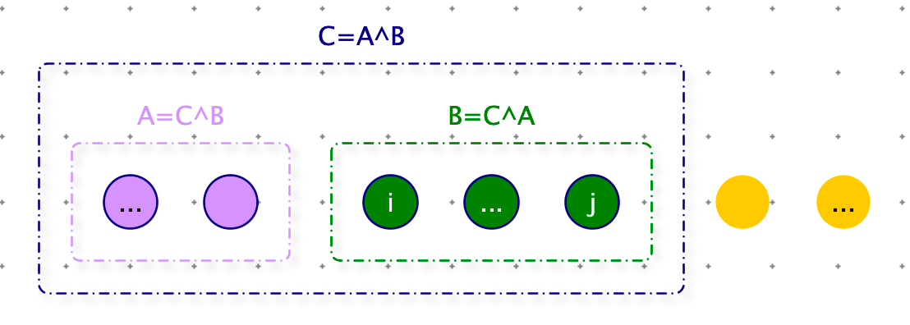
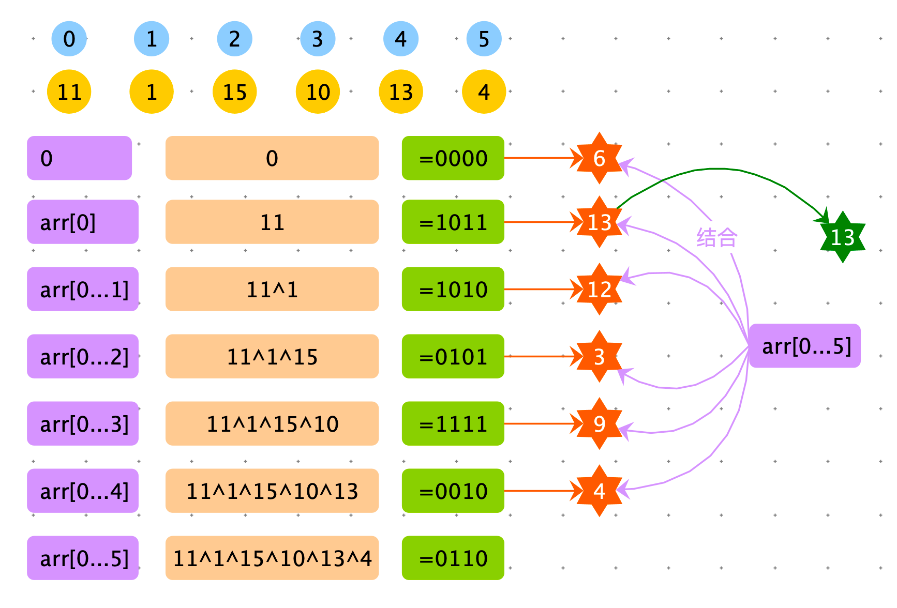
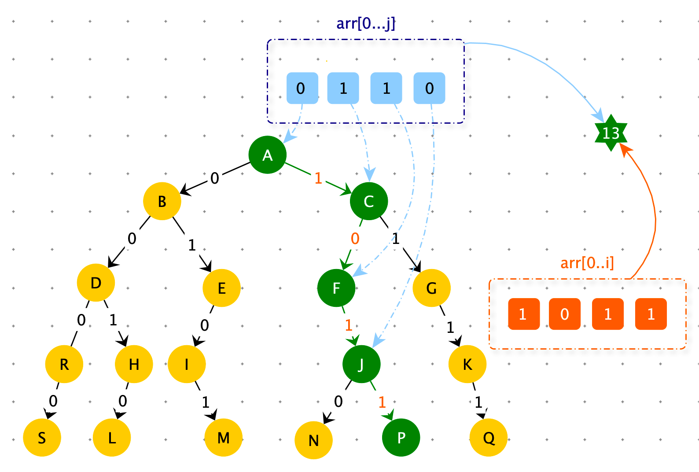

[TOC]

# 绘制目录结构

> 给你一个字符串类型的数组 arr，譬如：String[] arr={ “b\\cst”,”d\“,”a\d\e”,”a\b\c” } 你把这些路径中蕴含的目录结构给画出来，子目录直接列在父目录下边，并比父目录向右进 两格。就像下边一样
>
> a
>
> ​		b
>
> ​				c
>
> ​		d		
>
> ​				e
>
> b
>
> ​		cst
>
> d
>
> 同一级的需要字母顺序排列，不能乱。


```java
import java.util.TreeMap;

public class PrefixTree {
    public class Node {
        // children 需要根据 key 的字母顺序的排序
        public TreeMap<String, Node> children = new TreeMap<>();
    }

  	// 根节点
    private Node root = new Node();
  
  	// 前缀树添加数据
    public void add(String[] data) {
        if (data == null || data.length == 0) {
            return;
        }
        Node node = root;
        for (String item : data) {
            if (!node.children.containsKey(item)) {
                node.children.put(item, new Node());
            }
            node = node.children.get(item);
        }
    }

  	// 前缀树打印
    public void print(Node node, int level) {
        node.children.forEach((k, v) -> {
            System.out.println(getSpace(level) + k);
            print(v, level + 1);
        });
    }

  	// 问题打印
    public static void print(String[] arr) {
        if (arr == null || arr.length == 0) {
            return;
        }
        PrefixTree prefixTree = new PrefixTree();
        for (int i = 0; i < arr.length; i++) {
            prefixTree.add(arr[i].split("\\\\"));
        }
        prefixTree.print(prefixTree.root, 0);
    }

  	// 根据 level 获取空格
    public String getSpace(int level) {
        StringBuffer res = new StringBuffer(10 * level);
        for (int i = 0; i < level; i++) {
            res.append("        ");
        }
        return res.toString();
    }

    public static void main(String[] args) {
        String[] arr=new String[]{ "b\\cst","d\\","a\\d\\e","a\\b\\c" };
        PrefixTree.print(arr);
    }
}
```


子数组最大异或和

> 数组异或和的定义：把数组中所有数异或起来得到的值。
>
> 给定一个整型数组：arr，其中可能有正、有负、有零，求其子数组的最大异或和
>
> 【举例】
>
> arr = 【3】
>
> 数组中只有 1 个数，所以只有一个子数组，就是这个数组本身，最大异或和为 3
>
> arr = 【3，-28，-29，2】
>
> 子数组有很多，但是【-28，-29】这个子数组的异或和为 7，是所有子数组中最大的。

分析：

异或和没有单调性。两个小的数的异或和可能比两个大数的异或和大。


**解法一：暴力算法**

对每一个以 i 为开始和以 j 为结尾的子数组，都需要尝试计算异或和。获取全局最大的异或和，就是答案。

时间复杂度：$O(N^3)$

时间复杂度：O(1)

```python
import sys

def max_xor(arr):
    if not arr: return 0
    res = -sys.maxsize
    for i in range(len(arr)):
        for j in range(i, len(arr)):
             # 窗口:arr[i,j+1],计算窗口内数据的异或和
            xor = 0
            for k in range(i, j + 1):
                xor ^= arr[k]
            res = max(res, xor)
    return res
```


**解法二：前缀异或和**

前缀和的性质：

1. 归零率：A ^ A = 0
2. 恒等率：A ^ 0 = A

根据上述两个性质可以推导出：

$C = A \oplus  B \Longrightarrow  \\ C \oplus A = A \oplus  B \oplus A   \Longrightarrow \\ C \oplus  A = B \oplus  0 \Longrightarrow \\ A \oplus C = B$

根据前缀异或和可以计算出任意子数组的异或和。




时间复杂度：$O(N^2)$

时间复杂度：O(N)

```python
def max_xor1(arr):
    if not arr: return 0

  	# 前缀异或和
    prefix_sum = [arr[0]]
    for i in range(1, len(arr)):
        prefix_sum.append(arr[i] ^ prefix_sum[-1])

    res = -sys.maxsize
    for i in range(len(arr)):
        s = 0 if i == 0 else prefix_sum[i - 1]
        for j in range(i, len(arr)):
            # 窗口:arr[i,j+1]
            xor = prefix_sum[j] ^ s
            res = max(res, xor)
    return res
```


**解法三：前缀树 + 贪心**

在没有计算出每个结果前，无法知道下边哪个异或和大？

利用前缀树，确定了一种选择机制。如果知道 i ^(i -1) 的异或和，我们根据前缀树建立的机制知道它与哪一块儿（绿色部分）结合，异或和最大。

由解法二可知：$C = A \oplus  B \Longrightarrow A \oplus C = B $

即：$arr[2...5] = arr[0...5] \oplus  arr[0...2]$

- arr[0..5] 与 0 结合表示：arr[0...5] 子数组的异或和
- arr[0..5] 与 arr[0] 结合表示：arr[1...5] 子数组的异或和
- arr[0..5] 与 arr[0...1] 结合表示：arr[2...5] 子数组的异或和
- arr[0..5] 与 arr[0...2] 结合表示：arr[3...5] 子数组的异或和
- ...

与谁结合异或和大，应对的子数组就是要找的子数组。

目前不知道arr[0...5] 选择哪个？前缀树构建的规则可以解决此问题（贪心策略）。




<font color=red>**贪心策略：在 arr[0..j]  选择 arr[ 0..i ] 结合过程中，优先迎合高位变成 1（高位为1，对应值更大）。**</font>




```python
class NumTrie:
    def __init__(self):
        self.root = Node()

    def add(self, num):
        cur = self.root
        for move in range(31, -1, -1):
            path = (num >> move) & 1
            cur.nexts[path] = cur.nexts[path] if cur.nexts[path] else Node()
            cur = cur.nexts[path]

    def max_xor(self, num):
        cur = self.root
        res = 0
        for move in range(31, -1, -1):
            path = (num >> move) & 1
            best = path if move == 31 else path ^ 1
            best = best if cur.nexts[best] else best ^ 1
            tmp = 1
            if move == 31 and num < 0:
                tmp = -1
            res |= tmp * (path ^ best) << move
            cur = cur.nexts[best]

        return res
```


时间复杂度：$O(N)$

时间复杂度：O(N)

```python
def max_xor2(arr):
    if not arr: return 0
    res = -sys.maxsize

    trie = NumTrie()
    trie.add(0)
    xor = 0
    for i in range(len(arr)):
        xor ^= arr[i]
        res = max(res, trie.max_xor(xor))
        trie.add(xor)
    return res
  

```


**对数器**

```python
import random

def check():
    max_value = 10
    for i in range(100):
        arr = [int(random.random() * max_value) - int(random.random() * max_value) for _ in
               range(int(random.random() * max_value))]
        res = max_xor(arr)
        res1 = max_xor1(arr)
        res2 = max_xor2(arr)
        if res != res1 or res != res2:
            print(i, "ERROR", arr, "res=", res, "res1=", res1, "res2=", res2)
    print("NICE")
```

