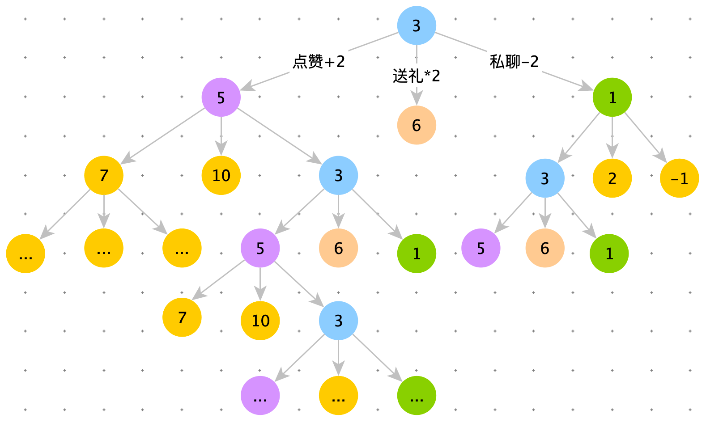
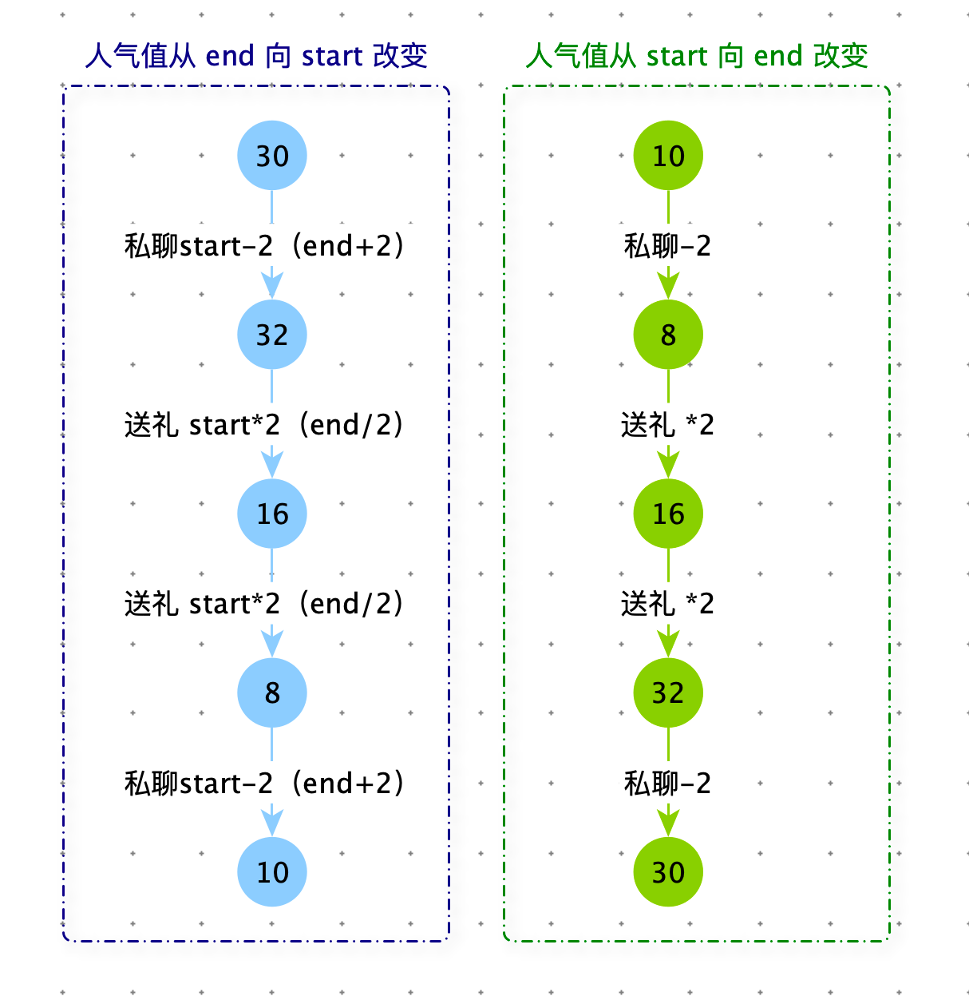
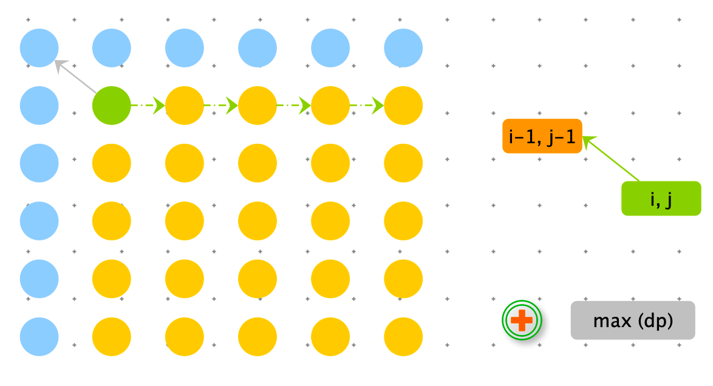
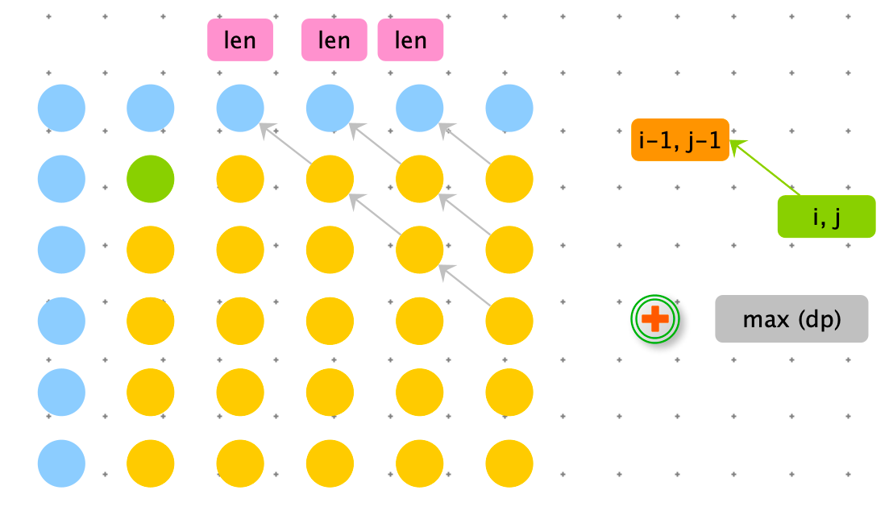
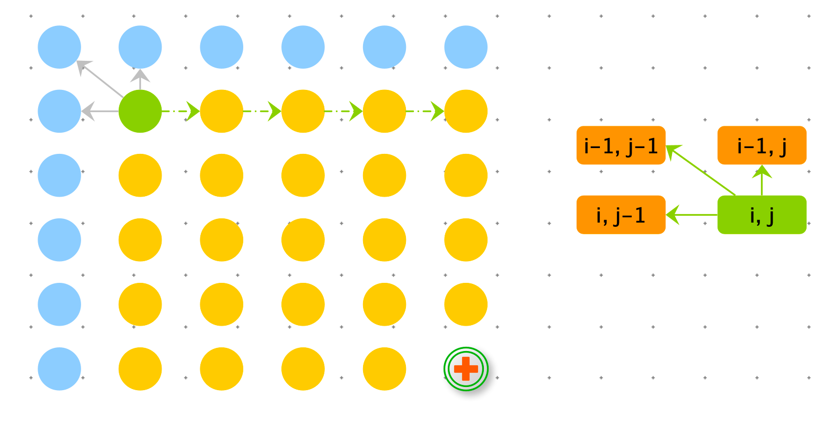
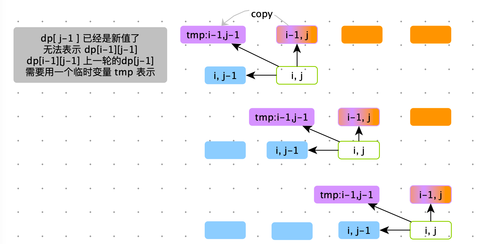
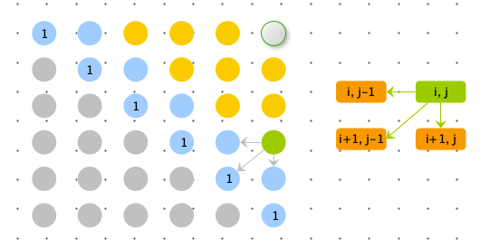
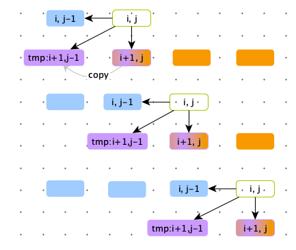
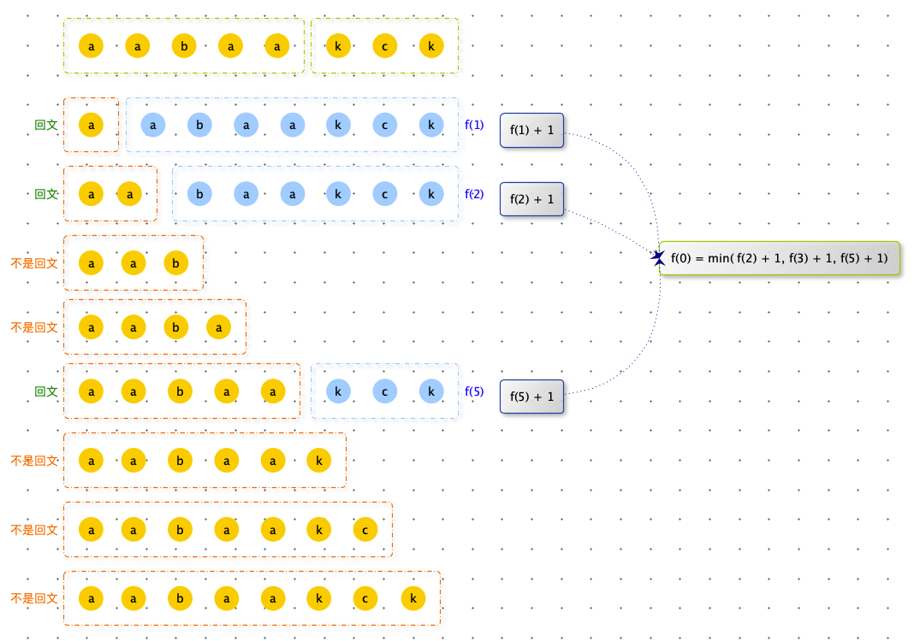
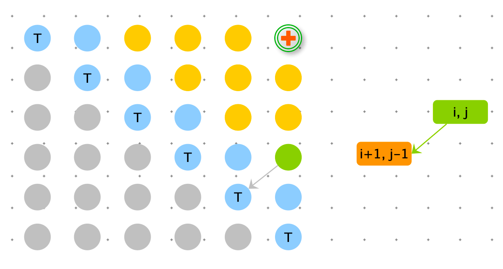

[TOC]

> CC 里面有一个土豪很喜欢一位女直播 kiki 唱歌，平时就经常给她点赞、送礼、私聊。最近 CC 直播平台在举行中秋之星直播唱歌比赛，假设一开始该女主播的初始人气值为 start，能够晋升下一轮人气需要刚好达到 end，土豪给主播增加人气可以采取一下三种方法：
>
> 1. 点赞；花费 x C币，人气 + 2
> 2. 送礼；花费 y C 币，人气 * 2
> 3. 私聊；花费 z C币，人气 - 2
>
> 其中 end 远大于 start 且 end 为偶数，请写一个程序帮助土豪计算一下，最少花费多少 C 币就能帮助该主播 kiki 将人气刚好达到 end，从而能够晋级下一轮？
>
> 限制 $0<x,y,z<=10000 ;\quad 0<start,end<1000000$
>
> 【例如】
>
> 输入：start = 3，end = 100，x = 1，y = 2，z = 6
>
> 输出：6


```python
def min_cost_coins(start, end, x, y, z):
    return process(start, end, x, y, z)

def process(start, end, x, y, z):
  	# basecase 当start 与 end 相等，就满足要求，不需要再花费 C 币了。
    if start == end:
        return 0
    # 尝试点赞
    a = process(start + 2, end, x, y, z) + x
    # 尝试送礼
    b = process(start * 2, end, x, y, z) + y
    # 尝试私聊
    c = process(start - 2, end, x, y, z) + z

    # 决策
    return min(a, b, c)
```

如下图：只靠 start == end 这个basecase 无法使递推收敛。需要根据题意挖掘其他 basecase，进行剪枝。

剪枝：

1. start 的值不能为负数
2. 平凡解：如果我通过只点赞使 start 到达 end，需要 A C币。那么最优解不能大于 A
3. start 的值可以大于 end 的值，然后通过私聊使 start 退回到 end，但是 start 不能大于 2 * end





```java
    //start偶数，end偶数  start<=end
    public static int minCcoins1(int add, int times, int del, int start, int end) {
        if (start > end) {
            return -1;
        }
        return process(0, start, end, add, times, del, ((end - start) / 2) * add);
    }

    /** start 人气向 end 改变
     * @param cost      之前已经花了多少钱【可变】
     * @param start     起始人气【可变】
     * @param end       目标人气 【固定】
     * @param add       点赞花费 C 币 【固定】
     * @param times     送礼花费 C 币 【固定】
     * @param del       私聊花费 C 币 【固定】
     * @param limitCoin 已经使用的币大到什么程度不需要再尝试了 【固定】
     * @return
     */
    public static int process(int cost, int start, int end, int add, int times, int del,
                              int limitCoin) {
        if (cost > limitCoin) {
            return Integer.MAX_VALUE;
        }
        if (start < 0) {
            return Integer.MAX_VALUE;
        }
        if (start > (2 * end)) {
            return Integer.MAX_VALUE;
        }
        if (start == end) {
            return cost;
        }

        int min = Integer.MAX_VALUE;
        //让人气-2的方式
        int p1 = process(cost + add, start + 2, end, add, times, del, limitCoin);
        if (p1 != Integer.MAX_VALUE) {
            min = p1;
        }
        //让人气+2的方式
        int p2 = process(cost + del, start - 2, end, add, times, del, limitCoin);
        if (p2 != Integer.MAX_VALUE) {
            min = Math.min(min, p2);
        }
        //让人气*2的方式
        int p3 = process(cost + times, start * 2, end, add, times, del, limitCoin);
        if (p3 != Integer.MAX_VALUE) {
            min = Math.min(min, p3);
        }
        return min;
    }

    public static void main(String[] args) {
        int add = 6;
        int times = 5;
        int del = 1;
        int start = 10;
        int end = 30;
        System.out.println(minCcoins1(add, times, del, start, end));
    }
```





```java
    //start偶数，end偶数  start<=end
    public static int minCcoins1(int add, int times, int del, int start, int end) {
        if (start > end) {
            return -1;
        }
        return process(0, start, end, add, times, del, 2 * end, ((end - start) / 2) * add);
    }

    /**
     * end 人气向 start 改变
     *
     * @param cost      之前已经花了多少钱【可变】
     * @param start     起始人气【固定】
     * @param end       目标人气 【可变】
     * @param add       点赞花费 C 币 【固定】
     * @param times     送礼花费 C 币 【固定】
     * @param del       私聊花费 C 币 【固定】
     * @param limitCoin 已经使用的币大到什么程度不需要再尝试了 【固定】
     * @return
     */
    public static int process(int cost, int start, int end, int add, int times, int del,
                              int limitAim, int limitCoin) {
        if (cost > limitCoin) {
            return Integer.MAX_VALUE;
        }
        if (end < 0) {
            return Integer.MAX_VALUE;
        }
        if (end > limitAim) {
            return Integer.MAX_VALUE;
        }
        if (start == end) {
            return cost;
        }

        int min = Integer.MAX_VALUE;
        //让人气-2的方式
        int p1 = process(cost + add, start, end - 2, add, times, del, limitAim, limitCoin);
        if (p1 != Integer.MAX_VALUE) {
            min = p1;
        }

        //让人气+2的方式
        int p2 = process(cost + del, start, end + 2, add, times, del, limitAim, limitCoin);
        if (p2 != Integer.MAX_VALUE) {
            min = Math.min(min, p2);
        }

        if ((end & 1) == 0) {
            //让人气*2的方式
            int p3 = process(cost + times, start, end / 2, add, times, del, limitAim, limitCoin);
            if (p3 != Integer.MAX_VALUE) {
                min = Math.min(min, p3);
            }
        }
        return min;
    }

    public static void main(String[] args) {
        int add = 6;
        int times = 5;
        int del = 1;
        int start = 10;
        int end = 30;
        System.out.println(minCcoins1(add, times, del, start, end));
    }
```


```java
    public static int minCcoins2(int add, int times, int del, int start, int end) {
        if (start > end) {
            return -1;
        }
        int limitCoin = ((end - start) / 2) * add;
        int limitAim = 2 * end;
        int[][] dp = new int[limitCoin + 1][limitAim + 1];

        for (int cost = 0; cost < limitCoin + 1; cost++) {
            for (int aim = 0; aim < limitAim + 1; aim++) {
                if (aim == end) {
                    dp[cost][aim] = cost;
                } else {
                    dp[cost][aim] = Integer.MAX_VALUE;
                }
            }
        }
        
        for (int cost = limitCoin; cost >= 0; cost--) {
            for (int aim = 0; aim < limitAim + 1; aim++) {
                if (cost + add <= limitCoin && aim + 2 <= limitAim) {
                    dp[cost][aim] = Math.min(dp[cost][aim], dp[cost + add][aim + 2]);
                }

                if (cost + del <= limitCoin && aim - 2 >= 0) {
                    dp[cost][aim] = Math.min(dp[cost][aim], dp[cost + del][aim - 2]);
                }

                if (cost + times <= limitCoin && aim * 2 <= limitAim) {
                    dp[cost][aim] = Math.min(dp[cost][aim], dp[cost + times][aim * 2]);
                }
            }
        }

        return dp[0][start];
    }
```


> 给定数组 arr，arr 中所有的值都为正整数且不重复。每个值代表一种面值的货币，每种面值的货币可以使用任意张，再给定一个整数 aim 代表要找的钱数，求换钱有多少种方法。
>
> 【例如】arr = [ 5, 10, 25, 1 ] , aim = 0 ；返回 1
>
> 组成 0 元的方法有 1 种，就是所有面值的货币都不用
>
> 
>
> arr = [ 5, 10, 25, 1 ] , aim = 15 ；返回 6
>
> 1. [ 5, 5, 5 ]  
>
> 2. [ 5, 10 ]
>
> 3. [10, 1, 1, 1, 1, 1 ]
>
> 4. [ 5, 5, 1, 1, 1, 1, 1 ] 
>
> 5. [ 5, 1, 1, 1, 1, 1 ,1, 1, 1, 1, 1  ]
>
> 6. [ 1, 1, 1, 1, 1, 1, 1, 1, 1, 1, 1, 1, 1, 1, 1 ] 
>
>    
>
> arr = [ 3, 5 ] , aim = 2 ；返回 0
>
> 任何方法都无法组成 2 元。


动态规划模型：L --> R 


每种银币都可以使用 0 ~ n，但是保证 coins[i] * count <= aim

arr = [ 5, 10, 25, 1 ] , aim = 15 ；返回 6

- 使用 0 张 5元的硬币，让 arr = [ 10, 25, 1 ] 组成 aim = 15 ；结果为  res1 
- 使用 1 张 5元的硬币，让 arr = [ 10, 25, 1 ] 组成 aim = 10 ；结果为  res2
- 使用 2 张 5元的硬币，让 arr = [ 10, 25, 1 ] 组成 aim = 5 ；结果为  res3
- 使用 3 张 5元的硬币，让 arr = [ 10, 25, 1 ] 组成 aim = 0 ；结果为  res4
- res = res1 + res2 + res3 + res4 


```python
# index 每次处理使用货币下边【变量】；process1 每次调用处理一个货币
# aim 剩余目标值【变量】
def process1(arr, index, aim):
    if index == len(arr):
        return 1 if aim == 0 else 0
    res = 0
    count = 0
    while arr[index] * count <= aim:
        res += process1(arr, index + 1, aim - arr[index] * count)
        count += 1
    return res

def coins1(arr, aim):
    if not arr or aim < 0:
        return 0
    return process1(arr, 0, aim)

print(coins1[5, 10, 25, 1],15)
```


index, aim 是变量，所以 dp 是个二维表 

```python
def coins2(arr, aim):
    if not arr or aim < 0:
        return 0

    dp = [[0] * (aim + 1) for _ in range(len(arr) + 1)]

    
    for i in range(len(arr) + 1):
        dp[i][0] = 1

    for i in range(len(arr) - 2, -1, -1):
        for j in range(aim + 1):
            count = 0
            while arr[i] * count <= j and (j - arr[i] * count) >= 0:
                dp[i][j] += dp[i + 1][j - arr[i] * count]
                count += 1

    return dp[0][aim]
  
  
 def coins2(arr, aim):
    if not arr or aim < 0:
        return 0

    dp = [[0] * (aim + 1) for _ in range(len(arr))]

    # base case aim = 0 是结果就是 1
    for i in range(len(arr)):
        dp[i][0] = 1

    # base case 只使用 arr[0] 时，只有 aim = arr[0] * i 时 等于 1
    for i in range(1, aim + 1):
        if arr[0] * i < aim + 1:
            dp[0][arr[0] * i] = 1

    # 
    for i in range(1, len(arr)):
        for j in range(1, aim + 1):
            count = 0
            while arr[i] * count <= j:
                dp[i][j] += dp[i - 1][j - arr[i] * count]
                count += 1

    return dp[len(arr) - 1][aim]
```


斜率优化

```python
def coins3(arr, aim):
    if not arr or aim < 0:
        return 0

    dp = [[0] * (aim + 1) for _ in range(len(arr))]

    for i in range(len(arr)):
        dp[i][0] = 1

    for i in range(1, aim + 1):
        if arr[0] * i < aim + 1:
            dp[0][arr[0] * i] = 1

    for i in range(1, len(arr)):
        for j in range(1, aim + 1):
            dp[i][j] = dp[i - 1][j]
            dp[i][j] += dp[i][j - arr[i]] if (j - arr[i]) >= 0 else 0

    return dp[len(arr)-1][aim]
```


> 给定数组 arr，arr 中所有的值都为正整数。每个值代表一种面值的货币，每种面值的货币只可使用一张，再给定一个整数 aim 代表要找的钱数，求换钱有多少种方法。


每种硬币都有两种可能性：

- 使用
- 不使用


暴力递归：

```python
def process2(arr, index, aim):
    if index == len(arr):
        return 1 if aim == 0 else 0

    return process2(arr, index + 1, aim - arr[index]) + process2(arr, index + 1, aim)

def coins2(arr, aim):
    if not arr or aim < 0:
        return 0
    return process2(arr, 0, aim)
```


动态规划：

```python
def coins5(arr, aim):
    if not arr or aim < 0:
        return 0
    dp = [[0] * (aim + 1) for _ in range(len(arr))]

    for i in range(len(arr)):
        dp[i][0] = 1

    # base case 只使用 arr[0] 时，由于只能使用一次，aim == arr[0]时为 1
    if arr[0] <= aim:
        dp[0][arr[0]] = 1

    for i in range(1, len(arr)):
        for j in range(1, aim + 1):
            dp[i][j] = dp[i - 1][j]
            dp[i][j] += dp[i - 1][j - arr[i]] if j - arr[i] >= 0 else 0

    return dp[len(arr) - 1][aim]
```


> 现有 n1 + n2 种面值的硬币，其中前 n1 种为普通币，可以取任意枚，后 n2 种为纪念币，每种最多只能取一枚，每种硬币有一个面值，问能用多少种方法拼出 m 个面值？


可能性分析

arbitrary= [ 2, 3, 5 ] , only_one= [ 1, 2, 4 ] , m = 10

- arbitrary 对 m 贡献 0 元，次数 a  ，only_one 贡献 10 ，次数 b；结果为  res1 = a * b
- arbitrary 对 m 贡献 1 元，次数 c  ，only_one 贡献 9 ，次数 d；结果为  res2 = c * d
- arbitrary 对 m 贡献 2 元，次数 e  ，only_one 贡献 f ，次数 d；结果为  res3 = e * f
- ...
- arbitrary 对 m 贡献 10 元，次数 e  ，only_one 贡献 f ，次数 0；结果为  resk = x * y
- res = res1 + res2 + ...+ resk


为了计算方便，我们提前计算出 arbitrary 的 dp1 和 only_one 的 dp2。在上边尝试时，只需直接查询结果即可。


注意：上边很多情况次数都是 0，比如：arbitrary 对 m 贡献 1 元，次数 c ，此时 c = 0


```python
def coins1(arr, aim):
    if not arr: return
    dp = [[0] * (aim + 1) for _ in range(len(arr))]

    for i in range(len(arr)):
        dp[i][0] = 1

    for i in range(1, aim + 1):
        if arr[0] * i < aim + 1:
            dp[0][arr[0] * i] = 1

    for i in range(1, len(arr)):
        for j in range(1, aim + 1):
            dp[i][j] = dp[i - 1][j]
            dp[i][j] += dp[i][j - arr[i]] if (j - arr[i]) >= 0 else 0

    return dp


def coins2(arr, aim):
    if not arr: return
    dp = [[0] * (aim + 1) for _ in range(len(arr))]

    for i in range(len(arr)):
        dp[i][0] = 1

    if arr[0] <= aim:
        dp[0][arr[0]] = 1

    for i in range(1, len(arr)):
        for j in range(1, aim + 1):
            dp[i][j] = dp[i - 1][j]
            dp[i][j] += dp[i - 1][j - arr[i]] if j - arr[i] >= 0 else 0

    return dp

def money_ways(arbitrary, only_one, money):
    if money < 0: return 0
    if not arbitrary and not only_one:
        return 1 if money == 0 else 0

    dp_1 = coins1(arbitrary, money)
    dp_2 = coins2(only_one, money)
    n_1 = len(arbitrary) - 1
    n_2 = len(arbitrary) - 1
    if not dp_1: return dp_2[n_2][money]
    if not dp_2: return dp_1[n_1][money]

    res = 0
    for i in range(money + 1):
        res += dp_1[n_1][i] * dp_1[n_2][money - i]
    return res
```


# 最长公共<font color=green>子串</font>的长度

> 给定两个字符串 str1 和 str2 ，求两个字符串的最长公共<font color=green>子串</font>的长度。


**方案一：暴力递归**


**可能性分析**

f( i, j )：表示string1 以 string1[i] 结尾，string1 以 string2[i] 结尾的最长公共子串的长度。<font color=red>最长公共子串必须以 string1[i] 结尾，且 string1[i] == string2[j]</font>

那么：$f(i,j) = \begin{cases} f(i-1,j-1) + 1 & string1[i]==string2[j]  \\ f(i-1,j-1) & string1[i]!=string2[j] \end{cases}$

**basecase**

- 条件 i = 0 表示以 string1[0] 结尾，在string2 对应 j 等于string1[0] ,则最长公共子串的长度为 1，否则为 0。

- 条件 j = 0 表示以 string2[0] 结尾，在string1 对应 i 等于string2[0] ,则最长公共子串的长度为 1，否则为 0。

**最终结果**

遍历 i 和 j 所有的可能性，计算出  f（i，j）获取其中最大值。dp 矩阵中的最大值。

<font color=green>注意：f( len(stirng1) - 1, len(string2) - 1) 不是最终解，与 f 所定义相关，最长公共子串不一定以 string1[-1] 和 string2[-1] 结尾。</font>

```python
class Info:
    def __init__(self, length, res):
        self.length = length
        self.res = res


def longest_common_substring(string1, string2):
    if not string1 or not string2: return ""
    col = len(string2) - 1
    row = 0
    res = 0
    while col >= 0:
        i = row
        j = col

        info = f(string1, string2, i, j)
        res = max(res, info.res)

        if row < len(string1) - 1:
            row += 1
        else:
            col -= 1

    return res


def f(string1, string2, i, j):
    if i == 0 or j == 0:
        num = 1 if string1[i] == string2[j] else 0
        return Info(num, num)
    info = f(string1, string2, i - 1, j - 1)
    length = info.length + 1 if string1[i] == string2[j] else 0
    return Info(length, max(info.res, length))
```


**方案二：动态规划**

依赖关系



```python
def longest_common_substring2(string1, string2):
    if not string1 or not string2: return ""
    dp = [[0] * len(string2) for _ in range(len(string1))]

    res = 0
    # base case
    for i in range(len(string1)):
        if string1[i] == string2[0]:
            res = dp[i][0] = 1
    for i in range(len(string2)):
        if string1[0] == string2[i]:
            res = dp[0][i] = 1

    for row in range(1, len(string1)):
        for col in range(1, len(string2)):
            dp[row][col] = dp[row - 1][col - 1] + 1 if string1[row] == string2[col] else 0
            res = max(res, dp[row][col])

    return res
```


**方案三：动态规划之滚动数组**


```python
def longest_common_substring3(string1, string2):
    if not string1 or not string2: return ""
    dp = [0] * len(string2)

    res = 0
    # base case
    for i in range(len(string2)):
        if string1[0] == string2[i]:
            res = dp[i] = 1

    for row in range(1, len(string1)):
        for col in range(len(string2) - 1, 0, -1):
            dp[col] = dp[col - 1] + 1 if string1[row] == string2[col] else 0
            res = max(res, dp[col])

        dp[0] = 1 if string1[row] == string2[0] else 0
        res = max(res, dp[0])

    return res
```


**方案四：动态规划之残暴方案**

只需要一个临时变量即可。



```python
def longest_common_substring4(string1, string2):
    if not string1 or not string2: return ""
    row = 0
    col = len(string2) - 1

    res = 0
    while row < len(string1):
        i = row
        j = col
        length = 0
        while i < len(string1) and j < len(string2):
            length = length + 1 if string1[i] == string2[j] else 0
            res = max(res, length)

            i += 1
            j += 1

        if col > 0:
            col -= 1
        else:
            row += 1

    return res
```


# 最长公共<font color=green>子串</font>

> 给定两个字符串 str1 和 str2 ，求两个字符串的最长公共<font color=green>子串</font>。

注意：区分子串和子序列的不同

- 子串：必须连续

- 子序列：可以不连续


**方案一：暴力递归**

有序子串是连续的，因此在计算最长公共<font color=green>子串</font>的长度的基础上，再记录最长公共子串的结束位置，string1[end - res + 1:end + 1] 这就可以截取到最长公共子串。


```python
class Info:
    def __init__(self, length, res, end):
        self.length = length
        self.res = res
        self.end = end

def longest_common_substring(string1, string2):
    if not string1 or not string2: return ""
    col = len(string2) - 1
    row = 0
    res = end = 0
    while col >= 0:
        i = row
        j = col

        info = f(string1, string2, i, j)
        if info.res > res:
            res = info.res
            end = info.end

        if row < len(string1) - 1:
            row += 1
        else:
            col -= 1

    return string1[end - res + 1:end + 1]


def f(string1, string2, i, j):
    if i == 0 or j == 0:
        num = 1 if string1[i] == string2[j] else 0
        return Info(num, num, i)
    info = f(string1, string2, i - 1, j - 1)
    length = info.length + 1 if string1[i] == string2[j] else 0
    if length > info.res:
        return Info(length, length, i)
    return Info(length, info.res, info.end)
```


**方案二：动态规划**

```python
def longest_common_substring2(string1, string2):
    if not string1 or not string2: return ""
    dp = [[0] * len(string2) for _ in range(len(string1))]

    res = end = 0
    # base case
    for i in range(len(string1)):
        if string1[i] == string2[0]:
            res = dp[i][0] = 1
            end = i
    for i in range(len(string2)):
        if string1[0] == string2[i]:
            res = dp[0][i] = 1
            end = 0

    for row in range(1, len(string1)):
        for col in range(1, len(string2)):
            dp[row][col] = dp[row - 1][col - 1] + 1 if string1[row] == string2[col] else 0
            if dp[row][col] > res:
                res = dp[row][col]
                end = row

    return string1[end - res + 1:end + 1]

```


**方案三：动态规划之滚动数组**

```python
def longest_common_substring3(string1, string2):
    if not string1 or not string2: return ""
    dp = [0] * len(string2)

    res = end = 0
    # base case
    for i in range(len(string2)):
        dp[i] = 1 if string1[0] == string2[i] else 0
        if string1[0] == string2[i]:
            res = dp[i] = 1
            end = 0

    for row in range(1, len(string1)):
        for col in range(len(string2) - 1, 0, -1):
            dp[col] = dp[col - 1] + 1 if string1[row] == string2[col] else 0
            if dp[col] > res:
                res = dp[col]
                end = row

        dp[0] = 1 if string1[row] == string2[0] else 0
        if dp[0] > res:
            res = dp[0]
            end = row

    return string1[end - res + 1:end + 1]
```


**方案四：动态规划之残暴方案**

```python
def longest_common_substring4(string1, string2):
    if not string1 or not string2: return ""
    row = 0
    col = len(string2) - 1

    res = end = 0
    while row < len(string1):
        i = row
        j = col
        length = 0
        while i < len(string1) and j < len(string2):
            length = length + 1 if string1[i] == string2[j] else 0
            if length > res:
                res = length
                end = i

            i += 1
            j += 1

        if col > 0:
            col -= 1
        else:
            row += 1

    return string1[end - res + 1:end + 1]
```


后缀数组

**方案四：后缀数组**

```python
```


**对数器**

```python
import random

def generator_random_str(max_size):
    alphabet = [chr(i) for i in range(97, 123)]
    size = int(random.random() * max_size)
    return ''.join([random.sample(alphabet, 1)[0] for _ in range(size)])

def check():
    max_size = 10
    for i in range(500):
        stirng1 = generator_random_str(max_size)
        stirng2 = generator_random_str(max_size)

        res1 = longest_common_substring(stirng1, stirng2)
        res2 = longest_common_substring2(stirng1, stirng2)
        res3 = longest_common_substring3(stirng1, stirng2)
        res4 = longest_common_substring4(stirng1, stirng2)

        if len(res1) != len(res2) or len(res1) != len(res3) or len(res1) != len(res4):
            print("ERROR", stirng1, stirng2, "res1=", res1, "res2=", res2, "res3=", res3, "res4=", res4)
    print("OVER")
```


# 最长公共<font color=green>子序列</font>的长度

> 给定两个字符串 str1 和 str2 ，求两个字符串的最长公共<font color=green>子序列</font>的长度。


**方案一：暴力递归**

**可能性分析**

f( i, j ) 定义：string1[:i] 和 string2[:j] 两个子串的最长公共子序列的长度。<font color=red>注意：此时或者的最长公共子序列不要求必须以 string1[i] 和 string[2] 结尾。</font>

$f(i,j)=\begin{cases} f(i-1,j-1)+1 & string1[i]==string2[j] \\ max(f(i-1,j),f(i,j-1)) & string1[i]!=string2[j] \end{cases}$

**basecase**

- i < 0 or j < 0 没有公共子序列返回 0
-  i = 0 and j !=0 ，在 string2[:j] 如果出现过 string1[0] 最长公共子序列长度为 1，否则为 0
-  j = 0 and i !=0 ，在 string1[:i] 如果出现过 string2[0] 最长公共子序列长度为 1，否则为 0

**最终结果**

f( len(string1) - 1  , len(string2) - 1 ) 表示string1 和 string2   的最长公共子序列的长度，因此可以直接返回。

```python
def longest_common_subsequence(string1, string2):
    if not string1 or not string2: return 0
    return f(string1, string2, len(string1) - 1, len(string2) - 1)


def f(string1, string2, i, j):
    # base case
    if i < 0 or j < 0: return 0

    if i == 0 and j != 0:
        for k in range(j + 1):
            if string2[k] == string1[i]:
                return 1
        return 0

    if i != 0 and j == 0:
        for k in range(i + 1):
            if string1[k] == string2[j]:
                return 1
        return 0

    if string1[i] == string2[j]:
        return f(string1, string2, i - 1, j - 1) + 1

    return max(f(string1, string2, i, j - 1), f(string1, string2, i - 1, j))
```


**方案二：动态规划**

**依赖分析**



```python
def longest_common_subsequence1(string1, string2):
    if not string1 or not string2: return 0

    dp = [[0] * len(string2) for _ in range(len(string1))]

    # base case
    dp[0][0] = 1 if string1[0] == string2[0] else 0
    for i in range(1, len(string1)):
        dp[i][0] = max(dp[i - 1][0], 1 if string1[i] == string2[0] else 0)

    for i in range(1, len(string2)):
        dp[0][i] = max(dp[0][i - 1], 1 if string1[0] == string2[i] else 0)

    for row in range(1, len(string1)):
        for col in range(1, len(string2)):
            if string1[row] == string2[col]:
                dp[row][col] = dp[row - 1][col - 1] + 1
            else:
                dp[row][col] = max(dp[row][col - 1], dp[row - 1][col])

    return dp[-1][-1]
```


**方案三：动态规划之滚动数组**



```python
def longest_common_subsequence2(string1, string2):
    if not string1 or not string2: return 0

    dp = [0] * len(string2)
    # base case
    dp[0] = 1 if string1[0] == string2[0] else 0

    for i in range(1, len(string2)):
        dp[i] = max(dp[i - 1], 1 if string1[0] == string2[i] else 0)

    for row in range(1, len(string1)):
        left_up = dp[0]
        dp[0] = max(dp[0], 1 if string2[0] == string1[row] else 0)
        for col in range(1, len(string2)):
            if string1[row] == string2[col]:
                new_value = left_up + 1
            else:
                new_value = max(dp[col - 1], dp[col])
            left_up = dp[col]
            dp[col] = new_value

    return dp[-1]
```


# 最长公共<font color=green>子序列</font>

> 给定两个字符串 str1 和 str2 ，求两个字符串的最长公共<font color=green>子序列</font>。


**方案一：暴力递归**

```python
class Info:
    def __init__(self, length, res):
        self.length = length
        self.res = res


def longest_common_subsequence(string1, string2):
    if not string1 or not string2: return ""
    info = f(string1, string2, len(string1) - 1, len(string2) - 1)
    return ''.join(info.res)


def f(string1, string2, i, j):
    # base case
    if i < 0 or j < 0: return Info(0, [])

    if i == 0 and j != 0:
        for k in range(j + 1):
            if string2[k] == string1[i]:
                return Info(1, [string2[k]])
        return Info(0, [])

    if i != 0 and j == 0:
        for k in range(i + 1):
            if string1[k] == string2[j]:
                return Info(1, [string1[k]])
        return Info(0, [])

    if string1[i] == string2[j]:
        info = f(string1, string2, i - 1, j - 1)
        res = info.res[:]
        res.append(string1[i])

        return Info(info.length + 1, res)

    info1 = f(string1, string2, i, j - 1)
    info2 = f(string1, string2, i - 1, j)

    length = info1.length
    res = info1.res[:]
    if info2.length > length:
        length = info2.length
        res = info2.res[:]

    return Info(length, res)
```


**方案二：动态规划**


```python
def longest_common_subsequence1(string1, string2):
    if not string1 or not string2: return ""

    dp = [[0] * len(string2) for _ in range(len(string1))]

    # base case
    dp[0][0] = 1 if string1[0] == string2[0] else 0
    for i in range(1, len(string1)):
        dp[i][0] = max(dp[i - 1][0], 1 if string1[i] == string2[0] else 0)

    for i in range(1, len(string2)):
        dp[0][i] = max(dp[0][i - 1], 1 if string1[0] == string2[i] else 0)

    for row in range(1, len(string1)):
        for col in range(1, len(string2)):
            if string1[row] == string2[col]:
                dp[row][col] = dp[row - 1][col - 1] + 1
            else:
                dp[row][col] = max(dp[row][col - 1], dp[row - 1][col])

    # 根据 dp 反向求出最长公共子序列
    row = len(string1) - 1
    col = len(string2) - 1

    # 最长公共子序列的长度
    index = dp[-1][-1]
    res = [None] * index
    while index > 0:
      	# 如果dp[row][col] == dp[row - 1][col] 向上走一步
        if row > 0 and dp[row][col] == dp[row - 1][col]:
            row -= 1
        # 如果 dp[row][col] == dp[row][col-1] 向左走一步
        elif col > 0 and dp[row][col] == dp[row][col - 1]:
            col -= 1
        else:
           # dp[row][col] - dp[row-1][col-1] ==1 and string1[row] == string2[col]
           # 那么向左上走一步，并记录 string1[row] or string2[col] 
            index -= 1
            res[index] = string1[row]
            row -= 1
            col -= 1

    return ''.join(res)
```

<font color=green>注意：由于要返回最长公共子序列，需要从 dp 矩阵中求得，所以不能用滚动数组优化。滚动数组为了节省空间，丢掉了dp 矩阵中的数据。</font>


# 最长<font color=green>回文子序列</font>

> 给定一个字符串 str，求最长的<font color=green>回文子序列</font>。

动态规划：范围尝试模型

<font color=red>**范围尝试模型一般根据开头和结尾讨论可能性**</font>

f( i , j) 在 str [i:j+1] 上最长回文子序列的长度，终止要求的是 f (0 , len(str)-1)


**可能性分析：**

$f(i,j)=\begin{cases} f(i-1,j-1)+2 & ;str[i]==str[j] \\ max(f(i-1,j),f(i,j-1)) &;str[i]!=str[j] \end{cases}$

- 如果 str[i]==str[j] ，则是在原有 f(i-1,j-1) 子问题的基础上加 2
- 如果 str[i] != str[j] ，则回退到最近的子问题，求最大值


**basecase**

- 当 i == j 时，如果 str[i] == str[j] 返回 1，否则返回 0。
- 当 i == j + 1 时，如果 str[i] == str[j] 返回 2，否则返回 0。


**方案一：暴力递归**

```python
def max_sub_palindrome(string):
    if not string: return 0
    t = f(string, 0, len(string) - 1)
    return t


def f(string, i, j):
    if i == j:
        return 1
    if i == j + 1 or i + 1 == j:
        return 2 if string[i] == string[j] else 1

    if string[i] == string[j]:
        return f(string, i + 1, j - 1) + 2
    return max(f(string, i + 1, j), f(string, i, j - 1))
```


**方案二：动态规划**




```python
def max_sub_palindrome2(string):
    if not string: return 0
    n = len(string)
    dp = [[0] * n for _ in range(n)]

    # base case
    for i in range(n):
        dp[i][i] = 1

    for i in range(n - 2, -1, -1):
        for j in range(i + 1, n):
            if string[i] == string[j]:
                dp[i][j] = dp[i + 1][j - 1] + 2
            else:
                dp[i][j] = max(dp[i + 1][j], dp[i][j - 1])

    return dp[0][-1]
```


**方案三：滚动数组**

如图（i，j）依赖的左下方的数据，总是被覆盖，在覆盖前需要copy 到一个变量中 tmp：tmp = d[j]

tmp 初始化值根据上述矩阵可知 tmp = 0



```python
def max_sub_palindrome3(string):
    if not string: return 0
    n = len(string)
    dp = [1] * n

    for i in range(n - 2, -1, -1):
        tmp = 0
        for j in range(i + 1, n):
            if string[i] == string[j]:
                new_value = tmp + 2
                down = dp[j]
                dp[j] = new_value
            else:
                new_value = max(dp[j], dp[j - 1])
                tmp = dp[j]
                dp[j] = new_value

    return dp[-1]
```

上述三个方案只是求出最长回文子序列的长度。


**方案四：动态规划：求最长的<font color=green>回文子序列</font>**

在计算完毕最长回文子序列的长度后，能够得到长度和 dp 表。我们可以根据 dp 表反推出最长回文子序列

- 如果 str[i]  == str[j] ，i 和 j 跳到 左下边：i ++，j --
- 如果 str[i]  != str[j] ，dp[i\]\[j] 与左边或者下边的哪个值相等就跳到对应位置

上述规则可以求出其中一种答案，如果要求出所有答案，可以对 dp 进行深度遍历（dp[i]\[j] 与 左边和下边都相等，那么这两种情况都需要保留 ）。

```python
def max_sub_palindrome4(string):
    if not string: return ""
    n = len(string)
    dp = [[0] * n for _ in range(n)]

    # base case
    for i in range(n):
        dp[i][i] = 1

    for i in range(n - 2, -1, -1):
        for j in range(i + 1, n):
            if string[i] == string[j]:
                dp[i][j] = dp[i + 1][j - 1] + 2
            else:
                dp[i][j] = max(dp[i + 1][j], dp[i][j - 1])

    count = row = 0
    col = n - 1
    res_len = index = dp[row][col]
    res = [None] * index
    while count < res_len:
        if row < n - 1 and dp[row][col] == dp[row + 1][col]:
            row += 1
        elif col > 0 and dp[row][col] == dp[row][col - 1]:
            col -= 1
        else:
            index -= 1
            res[res_len - index - 1] = res[index] = string[row]
            count += 2
            row += 1
            col -= 1
    return res
```


# 回文子串的最小切割数

> 给定一个字符串 str，返回把 str 全部切成回文子串的最小切割数。
>
> 【举例】
>
> str = “ABA” 不需要切割，str 本身就是回文串，所以返回 0
>
> str = “ACDCDCDAD” 最少需要切 2 次变成 3 个回文子串，比如“A”、“CDCDC” 和 “DAD”，所以返回 2.


**方案一：暴力递归**

动态规划：从左向右尝试模型。不是字符每个位置都可以作为切分点。左边部分必须是一个回文子串，才有资格作为切分点。


f( i ) 定义： str[ i: ] 子串中回文子串的个数。

最终结果：f(0) - 1。整个字符串中回文子串的个数 = 最小切割数 + 1


可能性分析：

如下图：str[ :j ] 是回文（个数是1），此时 j 就是一个切分点，f ( j ) 是后半部分包含的回文子串的个数，因此整体个数时：f ( j ) + 1。题意要求最小切割数，所以最终结果是：所有切分点的最小值。




```python
import sys

def min_cut(string):
    return f(string, 0) - 1

def f(string, index):
    if index == len(string): return 0

    res = sys.maxsize
    for i in range(index, len(string)):
        if valid(string, index, i):
            res = min(res, f(string, i + 1) + 1)

    return res

def valid(string, i, j):
    while i <= j:
        if string[i] != string[j]:
            return False
        i += 1
        j -= 1
    return True

# a|cdcdc|ada
print(min_cut("acdcdcada"))
# aabaa|kck
print(min_cut("aabaakck"))
```


**方案一：动态规划**

时间复杂度：$O(N^3)$

空间复杂度：$O(N)$

```python
def min_cut2(string):
    if not string: return 0
    dp = [0] * (len(string) + 1)
    for i in range(len(string) - 1, -1, -1):
        res = sys.maxsize
        for j in range(i, len(string)):
            if valid(string, i, j):
                res = min(res, dp[j + 1] + 1)
        dp[i] = res
    return dp[0] - 1
  
def valid(string, i, j):
    while i <= j:
        if string[i] != string[j]:
            return False
        i += 1
        j -= 1
    return True
```


**动态规划--优化判断是否是回文串**

在判断 str 每个子串是不是回文时，都需要 O(N) 的时间复杂度。其实我们可以提前计算好，在使用时直接查询结果。

生成回文串矩阵，dp\[i][j] 为 True 表示以  i 开头，以 j 结尾的 str 是回文串，dp[i]\[j] 为 False 表示不是回文串。

dp 的生成使用了在动态规划的范围探索模型。


可能性分析：

$f(i,j)=\begin{cases} dp[i+1][j-1] &str[i]==str[j] \\False &str[i]!=str[j] \end{cases}$

- 如果 str[i] == str[j]，str[ i: j+1 ] 是否是回文串取决于去掉 i 和 j 后的子串是不是回文串。
- str[i] != str[j]，str[ i: j+1 ]  一定不是回文串


basecase：

- 只有一个字符时，一定为回文串：dp\[i][i] = True
- 只有两个个字符时，这两个字符相等为回文串，不相等就不是回文串。




时间复杂度：$O(N^2)$

空间复杂度：$O(N^2)$

```python
def palindrome(string):
    n = len(string)
    dp = [[False] * n for _ in range(n)]
    # base case
    for i in range(n):
        dp[i][i] = True
        if i < n - 1:
            dp[i][i + 1] = string[i] == string[i + 1]

    for col in range(2, n):
        i = 0
        j = col
        while i < n - 2 and j < n:
            if string[i] == string[j]:
                dp[i][j] = dp[i + 1][j - 1]
            else:
                dp[i][j] = False
            i += 1
            j += 1
    return dp
```


将 valid 调用改为从提前计算好的 palindrome_dp 中查询。

时间复杂度：$O(N^2)$

空间复杂度：$O(N^2)$

```python
def min_cut3(string):
    if not string: return 0
    dp = [0] * (len(string) + 1)

    palindrome_dp = palindrome(string)
    for i in range(len(string) - 1, -1, -1):
        res = sys.maxsize
        for j in range(i, len(string)):
            if palindrome_dp[i][j]:
                res = min(res, dp[j + 1] + 1)
        dp[i] = res
    return dp[0] - 1
```


**对数器**

```python
import random

def generator_random_str(max_size):
    alphabet = [chr(i) for i in range(97, 123)]
    size = int(random.random() * max_size)
    return ''.join([random.sample(alphabet, 1)[0] for _ in range(size)])

def check():
    max_size = 10
    for i in range(500):
        stirng1 = generator_random_str(max_size)

        res1 = min_cut(stirng1)
        res2 = min_cut2(stirng1)
        res3 = min_cut3(stirng1)

        if res1 != res2 or res2 != res3:
            print("ERROR", stirng1, "res1=", res1, "res2=", res2, "res3=", res3)
    print("OVER")

check()
```

总结：本题在求回文子串的最小切割数时，使用动态规划从左向右尝试模型。但是在判断子串是不是回文串时，有使用了动态规划的范围尝试模型。本题综合使用了两种尝试模型。
