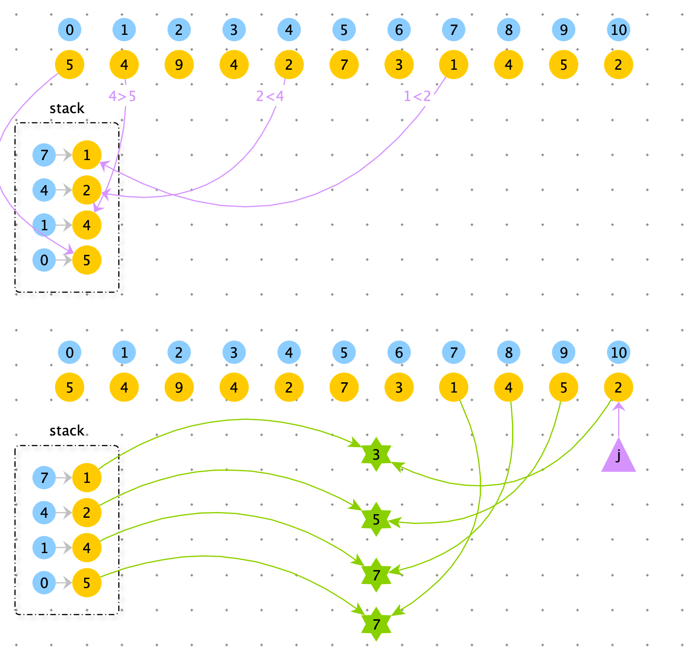

# 最大宽度坡

> 给定一个整数数组 A，坡是元组 (i, j)，其中  i < j 且 A[i] <= A[j]。这样的坡的宽度为 j - i。
>
> 找出 A 中的坡的最大宽度，如果不存在，返回 0 。

**示例 1：**

```python
输入：[6,0,8,2,1,5]
输出：4
解释：
最大宽度的坡为 (i, j) = (1, 5): A[1] = 0 且 A[5] = 5.
```

**示例 2：**

```
输入：[9,8,1,0,1,9,4,0,4,1]
输出：7
解释：
最大宽度的坡为 (i, j) = (2, 9): A[2] = 1 且 A[9] = 1.
```


**解法一：暴力算法**

时间复杂度：$O(N^2)$

空间复杂度：O(1)

```python
def max_width_ramp(arr):
    res = 0
    for i in range(len(arr)):
        for j in range(i + 1, len(arr)):
            if arr[j] >= arr[i]:
                res = max(res, j - i)
    return res
```

总结：由于数组是无序的，中间的那层循环无法省去。如果想省去，必须用空间换时间，使用一个结构，保存坡的左节点或者坡的右节点保持有序。这样在遍历尝试时，在有序的结构中依次选择即可，不需要反复遍历尝试。


**解法一：单调栈**

分析：

使用单调栈存放坡的左数据节点（从栈顶到栈底是从小到大）。然后从后向前遍历（j 位置大）作为右数据节点去匹配，如果匹配成功，作为一个坡，单调栈弹出元素。如果匹配不成成功，j -=1 换一个右数据节点。

单调栈中是左数据节点，由于单调性，一旦使用后续就不需要再考虑的。

从右向左遍历，保证了右数据节点的单调性。


栈的中下标是降序，因为从左向右比遍历入栈。

栈的中下标代表的数据是升序，因为越小的值越可能作为坡的左节点。




时间复杂度：O(N)

空间复杂度：O(N)

```python
def max_width_ramp(arr):
    stack = [0]
    for i in range(1, len(arr)):
        if arr[i] < arr[stack[-1]]:
            stack.append(i)

    i = len(arr) - 1
    res = 0
    while stack:
        if arr[stack[-1]] <= arr[i]:
            res = max(res, i - stack[-1])
            stack.pop()
        else:
            i -= 1
```


**对数器**

```python
import random

def check():
    for _ in range(1000):
        arr = [int(random.random() * 100) + 1 for _ in range(int(random.random()*100) + 1)]
        res1 = max_width_ramp1(arr)
        res2 = max_width_ramp1(arr)
        print("Info",  res1, res2)
        if res1 != res2:
            print("ERROR", arr, res1, res2)
    print("OVER")

check()
```

