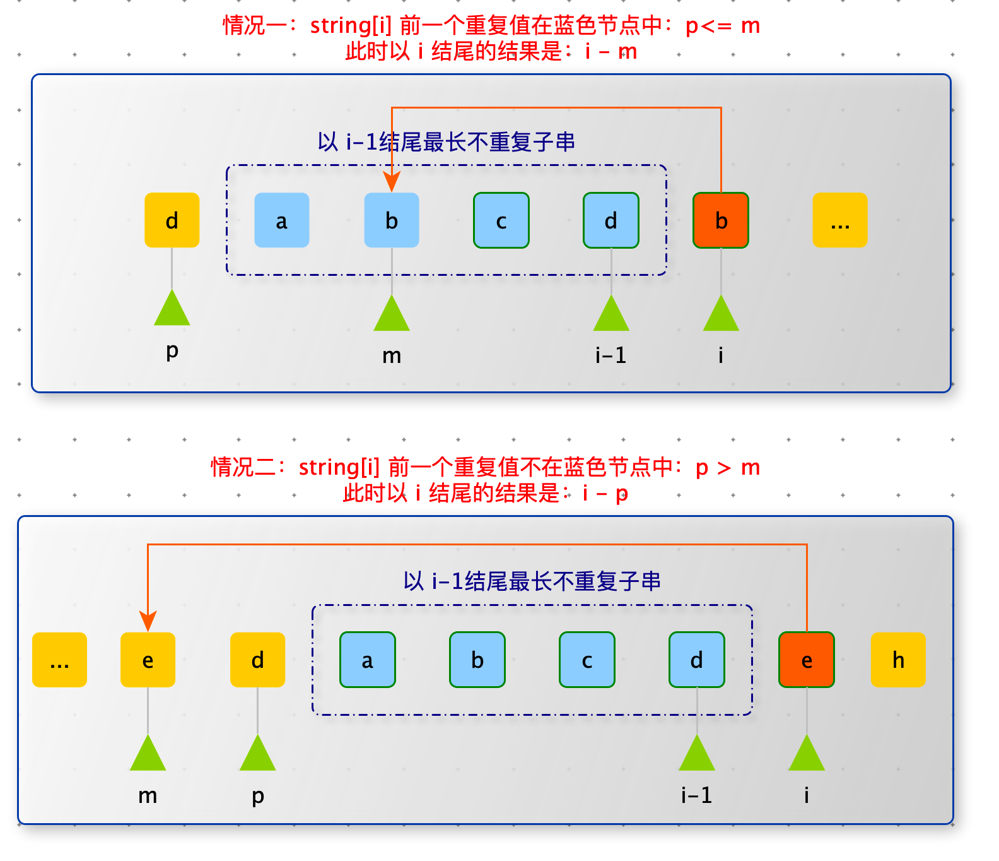

> 将给定的数转换为字符串，原则如下：1 对应 a，2 对应 b，... 26 对应 z。例如：12258 可以转换为 ”abbeh“，”aveh“，“abyh”，”lbeh“，”lyh“  ，个数为 5。编写一个数，给出可以转换的不同字符串的个数。


错误

```python
def num_to_string_ways(num):
    if num <= 0:
        return 0
    return process3(str(num), 0)


def process3(string, index):
    if index == len(string):
        return 1

    # index 后还有其他数字
    # 以 0 开头返回 0
    if string[index] == "0":
        return 0

    # index 及其后续还有数字字符，且不以 0 开头，以 1 ~ 9 开头
    res = process3(string, index + 1)

    if index == len(string) - 1:
        return res

    # index + 1 没有越界
    # index 和 index + 1 共同构成一个部分 < 27
    if ((ord(string[index]) - ord("a")) * 10 + (ord(string[index + 1]) - ord("a"))) < 26:
        res += process3(string, index + 2)
    return res
```


> 给定一个字符串类型的数组 arr，求其中出现次数最多的前 K 个


```python
import heapq

def top_k(arr, k):
    n = len(arr)
    if n <= k: return arr

    freq_map = {}
    for item in arr:
        freq_map[item] = freq_map.get(item, 0) + 1

    return heapq.nlargest(k, freq_map.items(), key=lambda x: x[1])

print(top_k(["a", "a", "a", "b", "b", "b", "b", "b", "b", "b", "c", "c"], 2))
```


```python
class Heap:
    def __init__(self, capacity, reverse=False):
        self.a = [None] * (capacity + 1)
        self.n = capacity
        self.count = 0
        self.reverse = reverse

    def push(self, data):
        # 堆满了
        if self.count >= self.n: return
        self.count += 1
        self.a[self.count] = data
        i = self.count
        # 自下向上堆化
        while self.parent(i) > 0 and not self.compare(self.a[i], self.a[self.parent(i)]):
            self.a[i], self.a[self.parent(i)] = self.a[self.parent(i)], self.a[i]
            i = self.parent(i)

    def pop(self):
        if self.count == 0: return
        data = self.a[1]
        self.a[1] = self.a[self.count]
        self.count -= 1
        self.heapify(1)
        return data

    def peek(self):
        if self.count == 0: return
        return self.a[1]

    # 从上向下堆化
    def heapify(self, i):
        while True:
            # 左子树判断
            if self.left(i) < self.count and self.compare(self.a[i], self.a[self.left(i)]):
                j = self.left(i)
            # 右子树判断
            elif self.right(i) < self.count and self.compare(self.a[i], self.a[self.right(i)]):
                j = self.right(i)
            else:
                break
            self.a[i], self.a[j] = self.a[j], self.a[i]
            i = j

    def is_full(self):
        return self.count >= self.n

    def is_empty(self):
        return self.count == 0

    def compare(self, a, b):
        if self.reverse:
            return b > a
        return a > b

    def left(self, i):
        return 2 * i

    def right(self, i):
        return 2 * i + 1

    def parent(self, i):
        return i >> 1

def top_k2(arr, k):
    n = len(arr)
    if n <= k: return arr

    freq_map = {}
    for item in arr:
        freq_map[item] = freq_map.get(item, 0) + 1

    heap = Heap(k)
    for k, v in freq_map.items():
        if not heap.is_full():
            heap.push((v, k))
            continue
        if heap.peek()[0] < v:
            item = heap.pop()
            heap.push((v, k))

    res = []
    while not heap.is_empty():
        res.append(heap.pop())
    return res

print("top_k2", top_k2(["a", "a", "a", "b", "b", "b", "b", "b", "b", "b", "c", "c"], 2))
```


> 如果一个字符串为 str，把字符串 str 前面任意的部分挪到后边形成的字符串叫作：str 的旋转词，比如 str = ”12345“，str 的旋转词有 ”12345“、”23451“、”34512“、”45123“、”51234“。给定两个字符串 a 和 b，请判断 a 和 b 是否互为旋转词。
>
> 比如：a = ”cdab“、b=”abcd“，返回 true
>
> 比如：a = ”1ab2“、b=”ab12“，返回 false
>
> 比如：a = ”2ab1“、b=”ab12“，返回 true


1. 将 a 变为 a + a 
2. 判断 b 是否是 a + a 的子串，如果是返回 true，否则 返回 false
3. KMP 算法 判断 b 是否是 a + a 的子串


> 有一个字符串中找到没有重复字符串中最长的长度。
>
> 例如：abcabcbb m没有重复字符串的最长子串是 abc，长度为 3
>
> bbbbb，答案是 b，长度为 1
>
> pwwkew：答案是wke，长度为 3
>
> 要求：答案必须是子串，“pwke” 是一个子字符序列但不是子字符串。


分析：

子串：必须连续的。

子序列：可以不连续。

<font color=red>**技巧：子串或者子数组的问题，就想每个位置为结尾，问题是怎么样的。**</font>


判断以 i 结尾没有重复的子串：分为一下几种情况

- string[i] 在此前未出现过：$res_i = res_{i-1} + 1   | res_i = i - p$，如果此时 m 的默认值为 -1
- string[i] 在此前出现过：
  - string[i] 此前出现过的位置在，以 i - 1 没有重复子串的子串内：$res_i = i - m$
  - string[i] 此前出现过的位置在，以 i - 1 没有重复子串的子串外：$res_i = i - p$

综上所述：$res_i= i - max( m , p)$ 也就是说，m 和 p 谁离 i 近，谁就是以 i 结尾没有重复子串的起始位置 - 1





```python
def max_unique(string):
    map = {string[0]: 0}
    array = [1] * len(string)
    max_value = 1

    for i in range(1, len(string)):
        if string[i] not in map or map[string[i]] < i - 1 - array[i - 1]:
            array[i] = array[i - 1] + 1
        else:
            array[i] = i - map[string[i]]

        max_value = max(max_value, array[i])
        map[string[i]] = i

    return max_value
```


```python
def max_unique2(string):
    map = {string[0]: 0}
    # 最终结果
    max_value = 1
    # 以 i - 1 结尾没有重复子串的起始位置 - 1
    pre = -1

    for i in range(1, len(string)):
        pre = max(pre, map.get(string[i], -1))
        max_value = max(max_value, i - pre)
        map[string[i]] = i

    return max_value

print(max_unique("abcabcbb"))
print(max_unique("bbbbb"))
print(max_unique("pwwkew"))

print("-" * 1000)

print(max_unique2("abcabcbb"))
print(max_unique2("bbbbb"))
print(max_unique2("pwwkew"))
```

