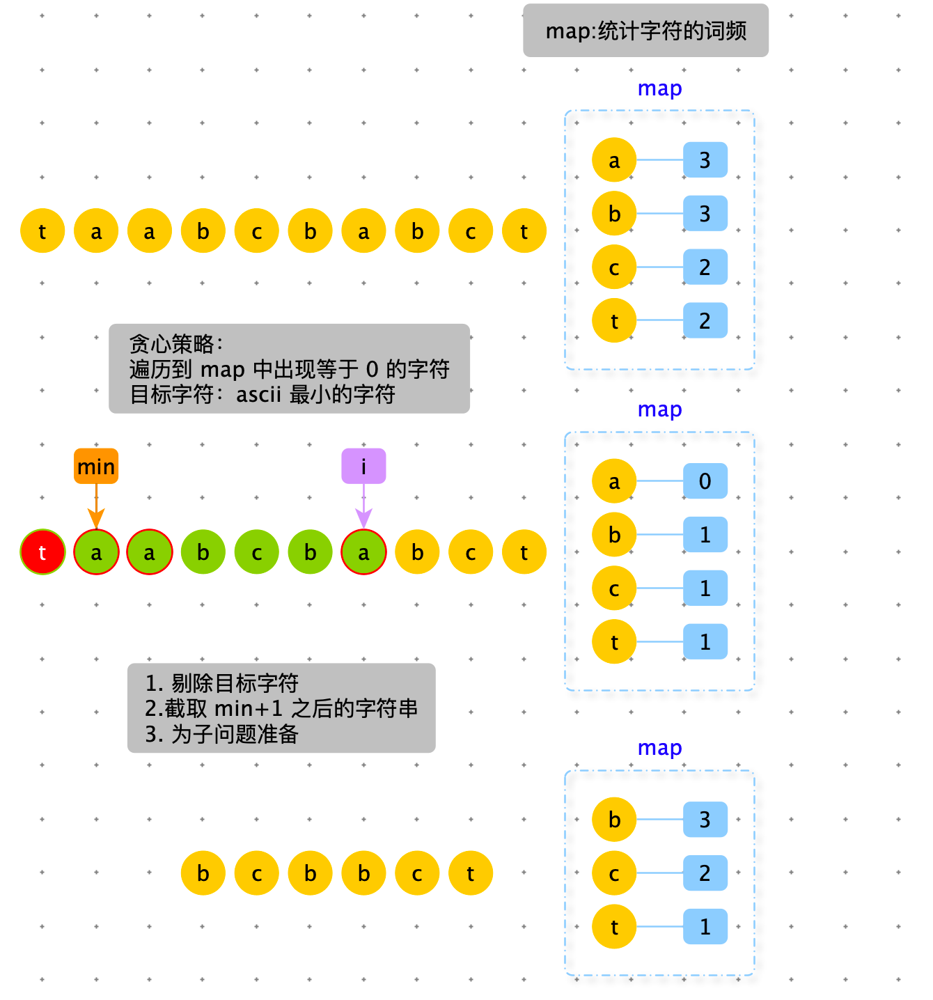

[TOC]

> 将给定的数转换为字符串，原则如下：1 对应 a，2 对应 b，... 26 对应 z。例如：12258 可以转换为 ”abbeh“，”aveh“，“abyh”，”lbeh“，”lyh“  ，个数为 5。编写一个数，给出可以转换的不同字符串的个数。


错误

```python
def num_to_string_ways(num):
    if num <= 0:
        return 0
    return process3(str(num), 0)


def process3(string, index):
    if index == len(string):
        return 1

    # index 后还有其他数字
    # 以 0 开头返回 0
    if string[index] == "0":
        return 0

    # index 及其后续还有数字字符，且不以 0 开头，以 1 ~ 9 开头
    res = process3(string, index + 1)

    if index == len(string) - 1:
        return res

    # index + 1 没有越界
    # index 和 index + 1 共同构成一个部分 < 27
    if ((ord(string[index]) - ord("a")) * 10 + (ord(string[index + 1]) - ord("a"))) < 26:
        res += process3(string, index + 2)
    return res
```


> 给定一个字符串类型的数组 arr，求其中出现次数最多的前 K 个


```python
import heapq

def top_k(arr, k):
    n = len(arr)
    if n <= k: return arr

    freq_map = {}
    for item in arr:
        freq_map[item] = freq_map.get(item, 0) + 1

    return heapq.nlargest(k, freq_map.items(), key=lambda x: x[1])

print(top_k(["a", "a", "a", "b", "b", "b", "b", "b", "b", "b", "c", "c"], 2))
```


```python
class Heap:
    def __init__(self, capacity, reverse=False):
        self.a = [None] * (capacity + 1)
        self.n = capacity
        self.count = 0
        self.reverse = reverse

    def push(self, data):
        # 堆满了
        if self.count >= self.n: return
        self.count += 1
        self.a[self.count] = data
        i = self.count
        # 自下向上堆化
        while self.parent(i) > 0 and not self.compare(self.a[i], self.a[self.parent(i)]):
            self.a[i], self.a[self.parent(i)] = self.a[self.parent(i)], self.a[i]
            i = self.parent(i)

    def pop(self):
        if self.count == 0: return
        data = self.a[1]
        self.a[1] = self.a[self.count]
        self.count -= 1
        self.heapify(1)
        return data

    def peek(self):
        if self.count == 0: return
        return self.a[1]

    # 从上向下堆化
    def heapify(self, i):
        while True:
            # 左子树判断
            if self.left(i) < self.count and self.compare(self.a[i], self.a[self.left(i)]):
                j = self.left(i)
            # 右子树判断
            elif self.right(i) < self.count and self.compare(self.a[i], self.a[self.right(i)]):
                j = self.right(i)
            else:
                break
            self.a[i], self.a[j] = self.a[j], self.a[i]
            i = j

    def is_full(self):
        return self.count >= self.n

    def is_empty(self):
        return self.count == 0

    def compare(self, a, b):
        if self.reverse:
            return b > a
        return a > b

    def left(self, i):
        return 2 * i

    def right(self, i):
        return 2 * i + 1

    def parent(self, i):
        return i >> 1

def top_k2(arr, k):
    n = len(arr)
    if n <= k: return arr

    freq_map = {}
    for item in arr:
        freq_map[item] = freq_map.get(item, 0) + 1

    heap = Heap(k)
    for k, v in freq_map.items():
        if not heap.is_full():
            heap.push((v, k))
            continue
        if heap.peek()[0] < v:
            item = heap.pop()
            heap.push((v, k))

    res = []
    while not heap.is_empty():
        res.append(heap.pop())
    return res

print("top_k2", top_k2(["a", "a", "a", "b", "b", "b", "b", "b", "b", "b", "c", "c"], 2))
```


> 如果一个字符串为 str，把字符串 str 前面任意的部分挪到后边形成的字符串叫作：str 的旋转词，比如 str = ”12345“，str 的旋转词有 ”12345“、”23451“、”34512“、”45123“、”51234“。给定两个字符串 a 和 b，请判断 a 和 b 是否互为旋转词。
>
> 比如：a = ”cdab“、b=”abcd“，返回 true
>
> 比如：a = ”1ab2“、b=”ab12“，返回 false
>
> 比如：a = ”2ab1“、b=”ab12“，返回 true


1. 将 a 变为 a + a 
2. 判断 b 是否是 a + a 的子串，如果是返回 true，否则 返回 false
3. KMP 算法 判断 b 是否是 a + a 的子串


> 有一个字符串中找到没有重复字符串中最长的长度。
>
> 例如：abcabcbb m没有重复字符串的最长子串是 abc，长度为 3
>
> bbbbb，答案是 b，长度为 1
>
> pwwkew：答案是wke，长度为 3
>
> 要求：答案必须是子串，“pwke” 是一个子字符序列但不是子字符串。


分析：

子串：必须连续的。

子序列：可以不连续。

<font color=red>**技巧：子串或者子数组的问题，就想每个位置为结尾，问题是怎么样的。**</font>


判断以 i 结尾没有重复的子串：分为一下几种情况

- string[i] 在此前未出现过：$res_i = res_{i-1} + 1   | res_i = i - p$，如果此时 m 的默认值为 -1
- string[i] 在此前出现过：
  - string[i] 此前出现过的位置在，以 i - 1 没有重复子串的子串内：$res_i = i - m$
  - string[i] 此前出现过的位置在，以 i - 1 没有重复子串的子串外：$res_i = i - p$

综上所述：$res_i= i - max( m , p)$ 也就是说，m 和 p 谁离 i 近，谁就是以 i 结尾没有重复子串的起始位置 - 1


```python
def max_unique(string):
    map = {string[0]: 0}
    array = [1] * len(string)
    max_value = 1

    for i in range(1, len(string)):
        if string[i] not in map or map[string[i]] < i - 1 - array[i - 1]:
            array[i] = array[i - 1] + 1
        else:
            array[i] = i - map[string[i]]

        max_value = max(max_value, array[i])
        map[string[i]] = i

    return max_value
```


```python
def max_unique2(string):
    map = {string[0]: 0}
    # 最终结果
    max_value = 1
    # 以 i - 1 结尾没有重复子串的起始位置 - 1
    pre = -1

    for i in range(1, len(string)):
        pre = max(pre, map.get(string[i], -1))
        max_value = max(max_value, i - pre)
        map[string[i]] = i

    return max_value

print(max_unique("abcabcbb"))
print(max_unique("bbbbb"))
print(max_unique("pwwkew"))

print("-" * 1000)

print(max_unique2("abcabcbb"))
print(max_unique2("bbbbb"))
print(max_unique2("pwwkew"))
```


> 给定一个全是小写字母的字符串 str，删除多余字符，使得每种字符只保留一个，并让最终结果字符串的字典序最小。
>
> 【举例】
>
> str= “acbc” 删除第一个 “c”，得到 “abc”，是所有结果字符串中字典序最小的。
>
> str= “dbcacbca” ，删除第一个 “b”，第一个 “c” ，第二个 “a” ，得到 “dabc” 是所有结果字符串中字典序最小的。





```java
public static String remove2(String str) {
        if (str == null || str.trim().length() < 2) {
            return str;
        }

        // 统计每个字符个数
        int[] map = new int[256];
        for (int i = 0; i < str.length(); i++) {
            map[str.charAt(i)]++;
        }

        // 查到第一个统计数为0，记录之前最小 ASCII 值的第一个字符的位置。
        int minACSIndex = 0;
        for (int i = 0; i < str.length(); i++) {
            map[str.charAt(i)]--;
            minACSIndex = str.charAt(minACSIndex) > str.charAt(i) ? i : minACSIndex;
            if (map[str.charAt(i)] == 0) {
                break;
            }
        }

        //  minACSIndex 位置的字符，就是本次选中的字符。
      	// 截取字符串，剔除所有的已选的字符，为下一次迭代做准备。 
        return String.valueOf(str.charAt(minACSIndex)) + remove2(str
                .substring(minACSIndex + 1)
                .replaceAll(String.valueOf(str.charAt(minACSIndex)), ""));
    }
```


> 给定两个字符串 str1 和 str2 ，再给定三个整数 ic 、dc、rc，分别代表插入、删除、替换一个字符的代价，返回将 str1 编辑成 str2 的最小代价。
>
> 【举例】
>
> str1= “abc”，str2= “adc”，ic=5，dc=3，rc=2
>
> 从 “abc” 编辑成 “adc” ,把 “b” 替换成 “d” 是代价最小的，所以返回 2
>
> str1= “abc”，str2= “adc”，ic=5，dc=3，rc=100
>
> 从 “abc” 编辑成 “adc” ,先删除 “b”，再插入 “d” 是代价最小的，所以返回 8
>
> str1= “abc”，str2= “abc”，ic=5，dc=3，rc=2
>
> 不需要编辑了，本来就是一样的字符串，所以返回 0


编辑距离的升级版


普通 dp\[i][j] 可能性分析：

1. 什么都不做：$dp[i][j]=dp[i-1][j-1]$
   1. dp\[i][j] 含义是：要将 abc 编辑成 skb 的最小代价
   2. dp\[i-1][j-1] 含义是：要将 ab 编辑成 sk 的最小代价，dp\[i-1][j-1] 是 ab 已经编辑成 sk 了，那么只需要 str1 [ i-1]  == str1 [ j-1]  (i 和 j 与 str 的下标对应关系是 -1) ，就什么都不需要做了。
2. 如果要新增：$dp[i][j]=dp[i][j-1] + ic$ 删除是对 str2 操作 
   1. dp\[i][j-1] 含义是：要将 abc 编辑成 sk 的最小代价，此时只需要再加一个 “b”，就是 dp\[i][j]。
   2. $abc \rightarrow sk \quad \overrightarrow{b \quad insert}  \quad abc \rightarrow   skb$ 
3. 如果要删除：$dp[i][j]=dp[i-1][j] + dc$  删除是对 str1 操作 
   1. dp\[i-1][j] 含义是：要将 ab 编辑成 skb 的最小代价，此时只需要再加一个 “b”，就是 dp\[i][j]。
   2. $abc \rightarrow skb \quad \overrightarrow{c \quad delete}  \quad ab \rightarrow   skb$  说明：$abc \rightarrow skb $ 比 $ab \rightarrow   skb$ 多一个 dc
4. 如果要替换：$dp[i][j]=dp[i-1][j-1] + rc$
   1. dp\[i-1][j-1] 含义是：要将 ab 编辑成 sk 的最小代价。
   2. $ab \rightarrow sk \quad \overrightarrow{c \quad replace \quad b}  \quad abc \rightarrow   skb$ 


```python
def min_cost(str0, str1, insert_cost, delete_cost, replace_cost):
    if not str0 or not str1: return 0

    row = len(str0) + 1
    col = len(str1) + 1
    dp = [[0] * col for _ in range(row)]

    # basecase
    for i in range(1, col):
        dp[0][i] = i * insert_cost

    for i in range(1, row):
        dp[i][0] = i * delete_cost

    # 普通 case
    for i in range(1, row):
        for j in range(1, col):
            if str0[i - 1] == str1[j - 1]:
                dp[i][j] = dp[i - 1][j - 1]
            else:
                dp[i][j] = dp[i - 1][j - 1] + replace_cost

            dp[i][j] = min(dp[i][j], dp[i][j - 1] + insert_cost)
            dp[i][j] = min(dp[i][j], dp[i - 1][j] + delete_cost)

    return dp[-1][-1]


str1 = "abc"
str2 = "adc"
ic = 5
dc = 3
rc = 2
print(min_cost(str1, str2, ic, dc, rc))

str1 = "abc"
str2 = "adc"
ic = 5
dc = 3
rc = 100
print(min_cost(str1, str2, ic, dc, rc))

str1 = "abc"
str2 = "abc"
ic = 5
dc = 3
rc = 2
print(min_cost(str1, str2, ic, dc, rc))
```


# bool 表达式解析

> 给定一个只由 0（假）、1 (真)、&（逻辑与）、|（逻辑或）、^（s）五种字符组成的字符串 express，再给定一个布尔值 desired。返回 express 能有多少种组合方式，可以达到 desired 的结果。
>
> 【举例】
>
> Express = “1^0|0|1”，desired = false
>
> 只有 1^((0|0)|1) 和 (1^0|(0|1)) 的组合可以得到 false ，返回 2
>
> 无组合可以得到 false ，返回 0


以下 a = 0 ；b = 1

验证 express 正确性：

1. 长度必须是奇数：a ^ b 或者 a ^ b | a
2. 偶数位是 a 或者 b，奇数位是运算符


可能性分析：


```python
# 校验 exp 正确性
def is_valid(exp):
    n = len(exp)
    # exp 长度必须奇数
    if n % 2 == 0: return False

    # 偶数位必须是 0 或者 1
    for i in range(0, n, 2):
        if exp[i] != "0" and exp[i] != "1":
            return False

    # 奇数位必须是 ^ | &
    for i in range(1, n, 2):
        if exp[i] != "^" and exp[i] != "|" and exp[i] != "&":
            return False

    return True


# 主函数
def express01(exp, desired):
    if not exp: return 0

    if not is_valid(exp): return 0

    return process(exp, desired, 0, len(exp) - 1)


# L R 一定不要压中逻辑符号
def process(exp, desired, L, R):
    # base_case 当 L == R 时，没有操作符只是 0 或者 1
    if L == R:
        if desired:
            return 1 if exp[L] == "1" else 0
        else:
            return 1 if exp[L] == "0" else 0

    res = 0
    if desired:
        # 逐个尝试操作符
        for i in range(L + 1, R, 2):
            if exp[i] == "|":
                res += process(exp, True, L, i - 1) * process(exp, True, i + 1, R)
                res += process(exp, True, L, i - 1) * process(exp, False, i + 1, R)
                res += process(exp, False, L, i - 1) * process(exp, True, i + 1, R)
            elif exp[i] == "^":
                res += process(exp, True, L, i - 1) * process(exp, False, i + 1, R)
                res += process(exp, False, L, i - 1) * process(exp, True, i + 1, R)
            elif exp[i] == "&":
                res += process(exp, True, L, i - 1) * process(exp, True, i + 1, R)
    else:
        # 逐个尝试操作符
        for i in range(L + 1, R, 2):
            if exp[i] == "|":
                res += process(exp, False, L, i - 1) * process(exp, False, i + 1, R)
            elif exp[i] == "^":
                res += process(exp, False, L, i - 1) * process(exp, False, i + 1, R)
                res += process(exp, True, L, i - 1) * process(exp, True, i + 1, R)
            elif exp[i] == "&":
                res += process(exp, False, L, i - 1) * process(exp, True, i + 1, R)
                res += process(exp, True, L, i - 1) * process(exp, False, i + 1, R)
                res += process(exp, False, L, i - 1) * process(exp, False, i + 1, R)

    return res
```


将暴力递归改为动态规划

有三个变量：desired, L, R。但是 desired 只有两个值，我们可以使用两个 dp 分别对应 desired =True 或者desired = False


```python
def express01_v2(exp, desired):
    if not exp: return 0

    if not is_valid(exp): return 0

    n = len(desired)
    dp_true = [[0] * n for _ in range(n)]
    dp_false = [[0] * n for _ in range(n)]
    # 处理 base case
    for i in range(0, n, 2):
        dp_true[i][i] = 1 if exp[i] == "1" else 0
        dp_false[i][i] = 0 if exp[i] == "1" else 1

    for row in range(n - 3, -1, -2):
        for col in range(row + 2, n, 2):

            for i in range(row + 1, col, 2):
                if exp[i] == "|":
                    dp_true[row][col] += dp_true[row][i - 1] * dp_true[i + 1][col]
                    dp_true[row][col] += dp_true[row][i - 1] * dp_false[i + 1][col]
                    dp_true[row][col] += dp_false[row][i - 1] * dp_true[i + 1][col]
                elif exp[i] == "^":
                    dp_true[row][col] += dp_true[row][i - 1] * dp_false[i + 1][col]
                    dp_true[row][col] += dp_false[row][i - 1] * dp_true[i + 1][col]
                elif exp[i] == "&":
                    dp_true[row][col] += dp_true[row][i - 1] * dp_true[i + 1][col]

                if exp[i] == "|":
                    dp_false[row][col] += dp_false[row][i - 1] * dp_false[i + 1][col]
                elif exp[i] == "^":
                    dp_false[row][col] += dp_false[row][i - 1] * dp_false[i + 1][col]
                    dp_false[row][col] += dp_true[row][i - 1] * dp_true[i + 1][col]
                elif exp[i] == "&":
                    dp_false[row][col] += dp_false[row][i - 1] * dp_true[i + 1][col]
                    dp_false[row][col] += dp_true[row][i - 1] * dp_false[i + 1][col]
                    dp_false[row][col] += dp_false[row][i - 1] * dp_false[i + 1][col]

    return dp_true[0][-1] if desired else dp_false[0][-1]
```


# 公式计算


> 给定一个字符串str，str 表示一个公式，公式里可能有整数，加减乘除，返回公式的计算结果。
>
> 【举例】
>
> str = “3-6*9+43\*70\*8-6” , 返回 24023
>
> str = “3+1*4” , 返回 7 


分析：

由于乘除的计算优先级高于加减，因此：第一遍遍历优先计算乘除，第二遍遍历再计算加减。


```python
def expression_compute(string):
    stack = []
    i = 0
    while i < len(string):
        item = string[i]
        # 遇到数字
        if '0' <= item <= '9':
            num, j = get_num(string, i)
            stack.append(num)
            i = j
        # 遇到乘除：立即计算
        elif item == "*" or item == "/":
            num, j = get_num(string, i + 1)
            stack.append(compute(stack.pop(), item, num))
            i = j
        # 遇到加减：暂时缓存
        elif item == "+" or item == "-":
            stack.append(item)
            i += 1
    
    # 计算加减
    i = 0
    res = stack[0]
    # 注意从前向后计算
    while i < len(stack) - 1:
        operator = stack[i + 1]
        num2 = stack[i + 2]
        res = compute(res, operator, num2)
        i += 2
    return res


# 从 string 的 index 位置开始获取数字
# 返回：num, i。计算结果，后续要处理的位置
def get_num(string, index):
    num = 0
    for i in range(index, len(string)):
        item = string[i]
        if item < '0' or item > '9': break

        num = num * 10 + int(item)

    return num, i + 1 if i == len(string) - 1 else i

# 运算
def compute(num1, operator, num2):
    if operator == "+": return num1 + num2
    if operator == "-": return num1 - num2
    if operator == "*": return num1 * num2
    if operator == "/": return int(num1 / num2)
  
  
print(expression_compute("14-95+62/50"))
```


> 给定一个字符串str，str 表示一个公式，公式里可能有整数，加减乘除和左右括号，返回公式的计算结果。
>
> 【举例】
>
> str = “48*((70-65)-43)+8\*1” , 返回 -1816 
>
> str = “3+1*4” , 返回 7 
>
> str = “3+(1*4)” , 返回 7
>
> 【说明】
>
> 1. 可以认为给定的字符串一定是正确的公式，即不需要对 str 做公式有效性检查。
> 2. 如果是负数，就需要用括号括起来，比如”4*(-3)“ 。但如果负数作为公式的开头或者括号部分的开头，则可以没有括号，比如：”-3\*4“ 和 ”(-3\*4)“ 都是合法的。
> 3. 不用考虑计算过程中发生的溢出的情况


运算规则：

- 优先计算括号内公式
- 再计算乘算
- 再计算加法


在计算括号内公式时：遇到 ”(“ 时，递归调用，再遇到 “)” 在进行计算，每次调用 que 中只存储当前括号内的公式。


```python
def expression_compute(string):
    return process(string, 0)[0]

def get_num(string, index):
    num = 0
    for i in range(index, len(string)):
        item = string[i]
        if item < '0' or item > '9': break

        num = num * 10 + int(item)

    return num, i + 1 if i == len(string) - 1 else i

# 计算 string 公式
# 优先括号内的公式，再计算乘除，再计算加减
def process(string, index):
    que = []
    i = index
    while i < len(string):
        # (：递归调用
        if string[i] == "(":
            num, j = process(string, i + 1)
            i = j
            que.append(num)
        # 遇到数字
        elif "0" <= string[i] <= "9":
            num, j = get_num(string, i)
            que.append(num)
            i = j
        # ) 计算括号内的公式
        elif string[i] == ")":
            res = sub_expression_compute(que)
            return res, i + 1
        else:
            que.append(string[i])
            i += 1

    # 计算没有括号，剩下的公式
    return sub_expression_compute(que), i

# 计算 array 内的公式
# 优先计算乘除，再计算加减
def sub_expression_compute(array):
    stack = []
    i = 0
    # 计算乘除
    while i < len(array):
        if array[i] == "*" or array[i] == "/":
            stack.append(compute(stack.pop(), array[i], array[i + 1]))
            i += 2
        else:
            stack.append(array[i])
            i += 1

    # 计算加减
    i = 0
    res = stack[0]
    while i < len(stack) - 1:
        operator = stack[i + 1]
        num2 = stack[i + 2]
        res = compute(res, operator, num2)
        i += 2
    return res

# 运算
def compute(num1, operator, num2):
    if operator == "+": return num1 + num2
    if operator == "-": return num1 - num2
    if operator == "*": return num1 * num2
    if operator == "/": return int(num1 / num2)
  
print(expression_compute("48*((70-65)-43)+8*1"))
print(expression_compute("3+1*4"))
print(expression_compute("3+(1*4)"))
```

