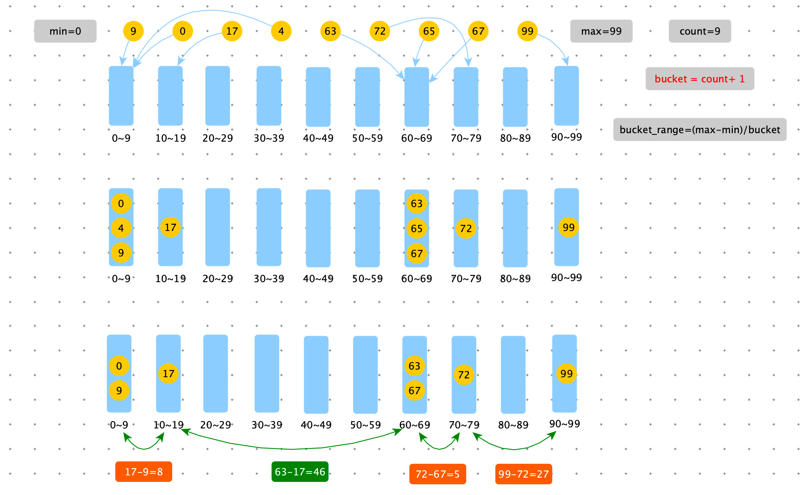

> 给定一个数组，求如果排序之后，相邻两数的最大差值。要求时间复杂度 O(N)，且要求不能用非基于比较的排序。

例如数组：【9	0	17	4	63	72	65	67	99】

排序后：	【0	4	9	17	63	65	67	72	99】

相邻两数的最大差值：17，63 之间的差值为：46





```python
def max_gap(nums):
    if not nums or len(nums) < 2: return 0
    min_value = min(nums)
    max_value = max(nums)

    if min_value == max_value: return 0
    n = len(nums)

    bucket_empty = [True] * (n + 1)
    bucket_min = [0] * (n + 1)
    bucket_max = [0] * (n + 1)

    for num in nums:
        # num 所属的桶号
        bid = get_bucket_id(num, min_value, max_value, n)
        bucket_min[bid] = num if bucket_empty[bid] else min(bucket_min[bid], num)
        bucket_max[bid] = num if bucket_empty[bid] else max(bucket_max[bid], num)
        bucket_empty[bid] = False

    # 注意第一个桶和最后一个桶必定有值
    last_max = bucket_max[0]
    res = 0
    for i in range(1, n + 1):
        if bucket_empty[i]:
            continue

        res = max(res, bucket_min[i] - last_max)
        last_max = bucket_max[i]

    return res


def get_bucket_id(num, min_value, max_value, count):
    return int((num - min_value) * count / (max_value - min_value))


def max_gap2(nums):
    if not nums or len(nums) < 2: return 0
    nums.sort()
    res = 0
    last_value = nums[0]
    for i in range(1, len(nums)):
        res = max(res, nums[i] - last_value)
        last_value = nums[i]
    return res

import random

def random_array_generator(max_size, max_value):
    size = int(random.random() * max_size)
    # 通过相减可以随机生成负数
    return [int(random.random() * max_value) - int(random.random() * max_value) for _ in range(size)]

def test():
    n = 50000
    test_max_size = 100
    test_max_value = 100

    for _ in range(n):
        nums = random_array_generator(test_max_size, test_max_value)
        if max_gap(nums) != max_gap(nums):
            print(nums)
            break
    print("Over")
```

