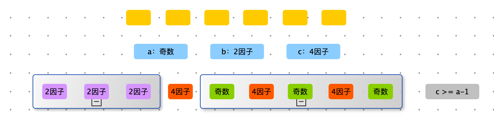

> 给定一个数组，求如果排序之后，相邻两数的最大差值。要求时间复杂度 O(N)，且要求不能用非基于比较的排序。

算法难度：<font color=red>困难</font>


例如数组：【9	0	17	4	63	72	65	67	99】

排序后：	【0	4	9	17	63	65	67	72	99】

相邻两数的最大差值：17，63 之间的差值为：46


步骤

1. 遍历数组，获取最大值和最小值。如果最大值等于最小值，说明数组中的数全部相等，最大差值为 0
2. 设置 n + 1 个桶，每个桶的数据范围，是均分最大值和最小值。所以第一个桶和最后一个桶一定有数据。有 n 个数据，n + 1 个桶，至少有一个桶是空的，<font color=red>那么在同一个桶里的数据相差不会大于一个桶的范围，所以最大差值一定在桶与桶之间。</font>
3. 由于最大值一定在桶与桶之间，那么桶内不没有存所以的数据，只需要存最大值和最小值。
4. 遍历所以数据，计算出桶内的最大值和最小值。
5. 遍历桶，对于有数据的桶，计算桶间距（ 当前桶的min - 上一个桶 max ）。


```python
def max_gap(nums):
    if not nums or len(nums) < 2: return 0
    min_value = min(nums)
    max_value = max(nums)

    if min_value == max_value: return 0
    n = len(nums)

    bucket_empty = [True] * (n + 1)
    bucket_min = [0] * (n + 1)
    bucket_max = [0] * (n + 1)

    for num in nums:
        # num 所属的桶号
        bid = get_bucket_id(num, min_value, max_value, n)
        bucket_min[bid] = num if bucket_empty[bid] else min(bucket_min[bid], num)
        bucket_max[bid] = num if bucket_empty[bid] else max(bucket_max[bid], num)
        bucket_empty[bid] = False

    # 注意第一个桶和最后一个桶必定有值
    last_max = bucket_max[0]
    res = 0
    for i in range(1, n + 1):
        if bucket_empty[i]:
            continue

        res = max(res, bucket_min[i] - last_max)
        last_max = bucket_max[i]

    return res


def get_bucket_id(num, min_value, max_value, count):
    return int((num - min_value) * count / (max_value - min_value))


def max_gap2(nums):
    if not nums or len(nums) < 2: return 0
    nums.sort()
    res = 0
    last_value = nums[0]
    for i in range(1, len(nums)):
        res = max(res, nums[i] - last_value)
        last_value = nums[i]
    return res

import random

def random_array_generator(max_size, max_value):
    size = int(random.random() * max_size)
    # 通过相减可以随机生成负数
    return [int(random.random() * max_value) - int(random.random() * max_value) for _ in range(size)]

def test():
    n = 50000
    test_max_size = 100
    test_max_value = 100

    for _ in range(n):
        nums = random_array_generator(test_max_size, test_max_value)
        if max_gap(nums) != max_gap(nums):
            print(nums)
            break
    print("Over")
```


> 给定一个数组 arr，已知其中所有的值都是非负的，将这个数组看作一个容器，请返回容器能装多少水?
>
> 比如，arr=【3，1，2，5，2，4】，根据值画出的直方图就是容器形状，该容器可以装下 5 格水。
>
> 再比如：arr=【4，5，1，3，2】，该容器可以装下 2 格水。


```python
def get_water(arr):
    if not arr or len(arr) < 3: return 0
    n = len(arr)

    left_max_value = [0] * n
    right_max_value = [0] * n

    for i in range(n):
        left_max_value[i] = max(left_max_value[i - 1], arr[i])

    max_value = 0
    for i in range(n - 1, -1, -1):
        max_value = max(max_value, arr[i])
        right_max_value[i] = max_value

    res = 0
    for i in range(n):
        res += max(min(left_max_value[i], right_max_value[i]) - arr[i], 0)
    return res


def get_water2(arr):
    if not arr or len(arr) < 3: return 0
    n = len(arr)

    left_max_value = [0] * n
    right_max_value = [0] * (n + 1)

    for i in range(n):
        left_max_value[i] = max(left_max_value[i - 1], arr[i])
        right_max_value[n - 1 - i] = max(right_max_value[n - i], arr[n - 1 - i])

    res = 0
    for i in range(n):
        res += max(min(left_max_value[i], right_max_value[i]) - arr[i], 0)
    return res
```


```python

def get_water3(arr):
    if not arr or len(arr) < 3: return 0
    n = len(arr)

    left = 1
    right = n - 2
    left_max_value = arr[0]
    right_max_value = arr[-1]

    res = 0
    while left <= right:
        if left_max_value < right_max_value:
            res += max(left_max_value - arr[left], 0)
            left_max_value = max(left_max_value, arr[left])
            left += 1
        else:
            res += max(right_max_value - arr[right], 0)
            right_max_value = max(right_max_value, arr[right])
            right -= 1

    return res
```


对数器

```python
import random

def random_array_generator(max_value, max_size):
    return [int(random.random() * max_value + 1) for _ in range(int(random.random() * max_size))]

def check():
    n = 1000
    max_value = 100
    max_size = 100

    for _ in range(n):
        arr = random_array_generator(max_value, max_size)
        res1 = get_water(arr)
        res2 = get_water2(arr)
        res3 = get_water3(arr)

        if res1 != res2 or res1 != res3:
            print("Error", arr, res1, res2, res3)
    print("Game Over!")

check()
```


> 给定一个数组 arr，如果通过调整可以做到 arr 中任意两个相邻的数字相乘是 4 的倍数，如果能返回 True，否则返回 False。

1. 遍历数组 arr，统计三类数据：奇数个数 a，以 2 为因子的个数 b，以 4 为因子的个数 c
2. 如果 arr 中没有奇数，那么可以调整到任意相邻数字相乘是 4 的倍数，返回 True
3. 如果 arr 中全是奇数，那么必不能调整到任意相邻数字相乘是 4 的倍数，返回 False
4. 如果 arr 中 b == 0，那么4因子（c）至少是 a - 1 才能调整成 任意相邻数字相乘是 4 的倍数，否则返回 False
5. 如果 arr 中 b != 0，a !=0 ，c!=0。那么多需要一个4因子，去连接2因子数与奇数：c >= a 





```python
def is_four(arr):
    count1 = count2 = count4 = 0

    for item in arr:
        if item % 4 == 0:
            count4 += 1
            continue
        if item % 2 == 0:
            count2 += 1
            continue
        count1 += 1

    # arr 全部是奇数
    if count1 == len(arr):
        return False

    # arr 没有奇数
    if count1 == 0:
        return True

    # 如果存在奇数
    		# 如果存在以 2 为因子的数，2 与奇数相邻，需要用 4 为因子的数隔开，所需需要 count4 > count1 
      	# 如果不存在以 2 为因子的数，所需需要 count4 > count1 - 1 
      
    # return count4 >= count1 - 1 + (1 if count2 > 0 else 0)
    return count4 >= count1 - (0 if count2 > 0 else 1)
```


> 给定一个整数数组 A，长度为 n，有 1 <= A\[i] <= n, 切对于 【1，n】的整数，其中部分整数会重复出现而部分不会出现。实现算法找到【1，n】中所有未出现在 A 中的整数。
>
> 提示：尝试实现 O(n) 的时间复杂度和 O(1) 的空间复杂度（返回值不计入空间复杂度）。
>
> 输入：【1,3,4,3】
>
> 输出：2


```python
def print_num_no_in_arr(arr):
    if not arr or len(arr) < 2: return

    # 争取做到，i 位置上，放的数是 i + 1
    for num in arr:
        modify(num, arr)

    # i位置上的数不是 i+1，i+1 就是缺的数
    for i in range(len(arr)):
        if i + 1 != arr[i]:
            print(i + 1)


def modify(value, arr):
    while arr[value - 1] != value:
        tmp = arr[value - 1]
        arr[value - 1] = value
        value = tmp

print_num_no_in_arr([1, 3, 4, 3])
```


# 在两个排序数组中找到第 K 小的数


> 给定两个一维 int 数组 A 和 B，其中：A 是长度为 m、元素从小到大排好序的数组。B 是长度为 n、元素从小到大排好序的有序数组。希望从 A 和 B 数组只中，找到第 K 小的数，要求：使用尽量少的比较次数。
>
> 【举例】
>
> arr1 = [ 1, 2, 3, 4, 5 ] ， arr2 = [ 3, 4, 5 ] ，k = 1
>
> 1 是所有数据中第 1 小的数，所以返回 1
>
> 
>
> arr1 = [ 1, 2, 3 ] ， arr2 = [ 3, 4, 5, 6 ] ，k = 4
>
> 3 是所有数据中第 4 小的数，所以返回 3
>
> 【要求】
>
> 如果 arr1 的长度是 N，arr2 的长度为 M，时间复杂度度请达到 O（ log ( min {M ,N } ) ）,额外空间复杂度为 O(1)


方案一：双指针

- 时间复杂度：O(k)
- 空间复杂度：O(1)

当 k 比较大时，不满足题目要求。


```python
import sys

def find_kth_num(arr1, arr2, k):
    index1 = 0
    index2 = 0
    res = 0

    arr1.append(sys.maxsize)
    arr2.append(sys.maxsize)

    while index1 + index2 < k:
        if arr1[index1] < arr2[index2]:
            res = arr1[index1]
            index1 += 1
        else:
            res = arr2[index2]
            index2 += 1
    return res

print(find_kth_num([1, 2, 3, 4, 5], [3, 4, 5], 1))
print(find_kth_num([1, 2, 3], [3, 4, 5, 6], 4))
```


