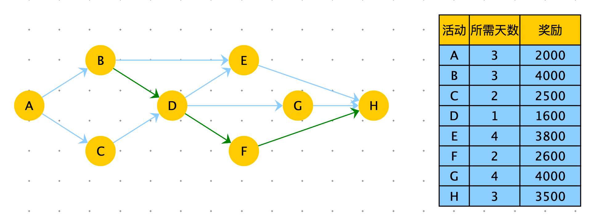
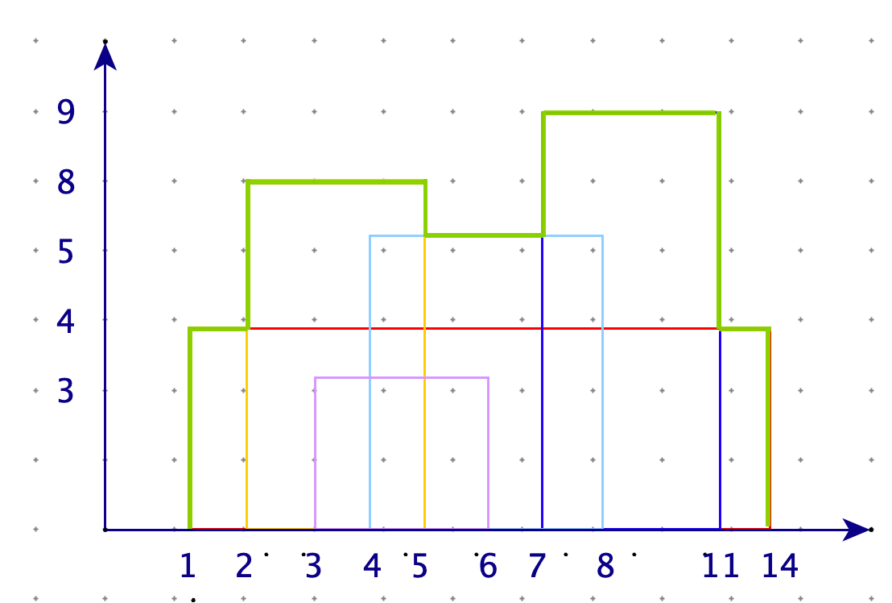
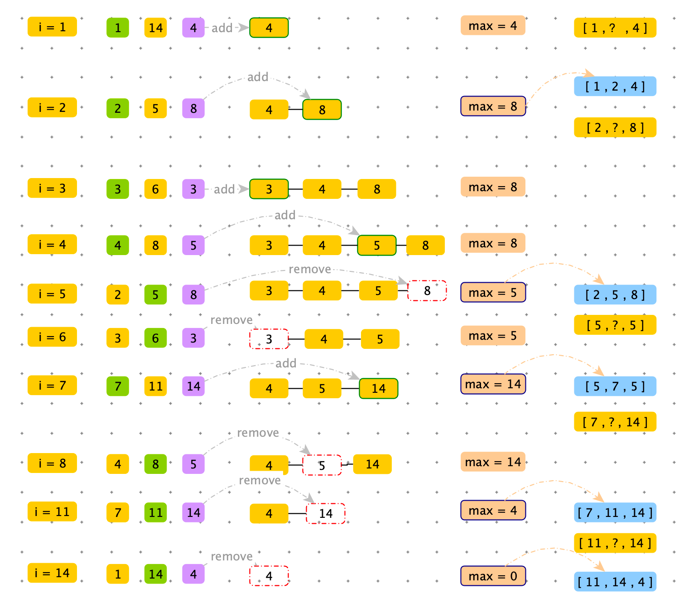
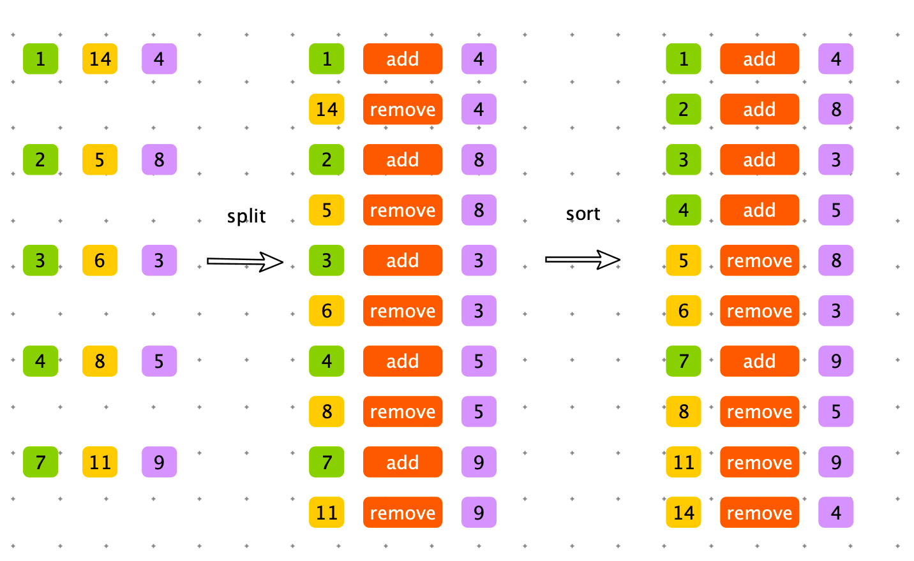

> 为了找到自己满意的工作，牛牛收集了每种工作的难度和报酬。牛牛选工作的标准是在难度不超过自身能力值的情况下，牛牛选择报酬最高的工作，在牛牛选定了自己的工作以后，牛牛的小伙伴们来找牛牛帮忙选工作，牛牛依然使用自己的标准来帮助小伙伴。牛牛的小伙伴太多了，于是他只好把这个任务交给了你。
>
> 输入参数：
>
> - Job_arr：表示所有的工作。
> - Int_arr：表示所有小伙伴的能力值。
>
> 返回数据：int_arr 表示每个小伙伴按照牛牛的标准选工作后所能获得的报酬。


步骤：

1. hard 升序，money 降序，对 job_arr 排序
2. 将 hard 相同，money 最大的 job 加入有序表（TreeMap），如果当前 money 小于之前的 job 也要排除（例如任务3的money 小于任务 2）。
3. 遍历 int_arr 数据，从有序表 treeMap floorEntry （获取能力能达到最大Job，将对应money 写入 result ）


```java
public static class Job {
        // 工作报酬
        public int money;
        // 工作难度
        public int hard;

        public Job(int hard, int money) {
            this.money = money;
            this.hard = hard;
        }
    }

    public static class JobComparator implements Comparator<Job> {
        @Override
        public int compare(Job o1, Job o2) {
            return o1.hard != o2.hard ? o1.hard - o2.hard : o2.money - o1.money;
        }
    }

    public static int[] getMoneys(Job[] jobs, int[] ability) {
        Arrays.sort(jobs, new JobComparator());
        TreeMap<Integer, Integer> treeMap = new TreeMap<>();

        int money = 0;
        for (Job job : jobs) {
            if (treeMap.containsKey(job.hard) || job.money <= money) {
                continue;
            }
            money = Math.max(money, job.money);
            treeMap.put(job.hard, job.money);
        }

        int[] res = new int[ability.length];

        for (int i = 0; i < ability.length; i++) {
            int item = ability[i];
            Map.Entry<Integer, Integer> entry = treeMap.floorEntry(item);
            if (entry == null) {
                continue;
            }
            res[i] = entry.getValue();
        }
        return res;
    }

    public static int[] getMoneys2(Job[] jobs, int[] ability) {
        Arrays.sort(jobs, new JobComparator());
        TreeMap<Integer, Integer> treeMap = new TreeMap<>();

      	// 由于已经排序，hard 相同并且 money 大的一定排在第一名，只需要将第一名插入 treeMap 中
      	// 需要 pre 记录每组的第一个 job，即可区分不同的组
      	// 时间复杂度从 O(N log N) 下降到 O(N)
        Job pre = jobs[0];
        for (int i = 1; i < jobs.length; i++) {
            if (jobs[i].hard != pre.hard && jobs[i].money > pre.money) {
                treeMap.put(jobs[i].hard, jobs[i].money);
                pre = jobs[i];
            }
        }

        int[] res = new int[ability.length];

        for (int i = 0; i < ability.length; i++) {
            int item = ability[i];
            Map.Entry<Integer, Integer> entry = treeMap.floorEntry(item);
            if (entry == null) {
                continue;
            }
            res[i] = entry.getValue();
        }
        return res;
    }

    public static void main(String[] args) {
        Job[] jobs = new Job[8];
        jobs[0] = new Job(3, 5);
        jobs[1] = new Job(2, 7);
        jobs[2] = new Job(9, 100);
        jobs[3] = new Job(1, 4);
        jobs[4] = new Job(2, 6);
        jobs[5] = new Job(3, 3);
        jobs[6] = new Job(1, 1);
        jobs[7] = new Job(2, 8);
        int[] ability = new int[]{0, 2, 8, 9, 10};
        
        for (int item : getMoneys(jobs, ability)) {
            System.out.println(item);
        }
    }
```


> CC 直播的运营部门组织了很多运营活动，每个活动需要花费一定的时间参与，主播每参加一个活动即可得到一定的奖励，参与活动可以从任意活动开始，但一旦开始，就需要将后续活动参加完毕（注意：最后一个活动必须参与），活动之间存在一定的依赖关系（不存在环的情况），现在给出所有的活动时间和依赖关系，以及给出有限的时间，请帮主播计算在有限的时间内，能获得最大的奖励，以及需要的最少时长。
>
> 
>
> 如上图数据所示，给定有限时间为 10 天，可以获取最大的奖励为：11700，需要的时长为：9 天。参加的活动为 $B \rightarrow D \rightarrow  F \rightarrow H $ 四个。


> 给定一个 N * 3 的矩阵 matrix ，对于每个长度为 3 的小数组 arr，都表示一个大楼的三个数据。arr[0] 表示大楼的左边界，arr[1] 表示大楼的右边界，arr[2] 表示大楼的高度（一定大于 0）。每座大楼的地基都在 X 轴上，大楼之间可能会有重叠，请返回整体的轮廓线数组。
>
> 【举例】
>
> matrix=[ [1, 14, 4], 
>
> ​				[2, 5, 8],
>
> ​				[3, 6, 3],
>
> ​				[4, 8, 5],
>
> ​				[7, 11, 9]]
>
> 返回：
>
> ​				[ [1, 2, 4], 
>
> ​				[2, 5, 8],
>
> ​				[5, 7, 5],
>
> ​				[7, 11, 9],
>
> ​				[11, 14, 4]]


难度：:star2::star2::star2::star2::star2:

如图：绿色的线框就是整体的轮廓。



分析：

最高高度变化时，会产生关键点。

比如： [1, 14, 4] 高度 4 在 i = 1时生效，在 i = 14 时失效（i 从 遍历到 14）。

过程如下图：



根据上图可知：在 i 等于起始位置时，在有序表中加入高度，在 i 等于终止位置时，需要从有序表中删除高度。所以可以将原始数据变化查分成两份：[ 起始位置，add，高度 ]，[ 终止位置，remove，高度 ]。

程序要沿着 x 轴依次遍历，所以需要根据起始位置排序。为了防止起始位置 == 终止位置（既 [ 3 , 3, 12 ]）





```java
public class BuildingOutline {

    // 描述高度变化的对象
    public static class Node {
        // x 轴上的值
        public int x;
        // true 为加入，false 为删除
        public boolean isAdd;
        // 高度
        public int height;

        public Node(int x, boolean isAdd, int height) {
            this.x = x;
            this.isAdd = isAdd;
            this.height = height;
        }
    }

    // 排序策略
    // 第一个维度：x 值从小到大
    // 第二个维度："加入" 排在前，"删除"排在后：插入后才能删除。
    // 第三个维度：前两个维度相同，则认为两个对象相等，谁在前都行
    public static class NodeComparator implements Comparator<Node> {
        @Override
        public int compare(Node o1, Node o2) {
            if (o1.x != o2.x) {
                return o1.x - o2.x;
            }
            if (o1.isAdd != o2.isAdd) {
                return o1.isAdd ? -1 : 1;
            }
            return 0;
        }
    }

    public static List<List<Integer>> buildingOutline(int[][] matrix) {
        List<Node> nodes = new ArrayList<>();
        // 每个大楼的轮廓数据，产生两个描述高度变化的对象
        for (int i = 0; i < matrix.length; i++) {
            int[] row = matrix[i];
            nodes.add(new Node(row[0], true, row[2]));
            nodes.add(new Node(row[1], false, row[2]));
        }
        // 按照规定的排序规则排序
        nodes.sort(new NodeComparator());

        // 有序表
        TreeMap<Integer, Integer> mapHeightTimes = new TreeMap<>();
        // 每个位置对应的最大高度
        Map<Integer, Integer> mapXHeight = new HashMap<>();
        for (int i = 0; i < nodes.size(); i++) {
            Node node = nodes.get(i);
            // 插入操作
            if (node.isAdd) {
                mapHeightTimes.put(node.height, mapHeightTimes.getOrDefault(node.height, 0) + 1);
            } else {
                // 删除操作
                if (mapHeightTimes.get(node.height) == 1) {
                    mapHeightTimes.remove(node.height);
                } else {
                    mapHeightTimes.put(node.height, mapHeightTimes.get(node.height) - 1);
                }
            }

            // 根据 mapHeightTimes 中的最大值，设置 mapXHeight
            if (mapHeightTimes.isEmpty()) {
                mapXHeight.put(node.x, 0);
            } else {
                // 通过 mapHeightTimes.lastKey() 获取当前的最大高度
                mapXHeight.put(node.x, mapHeightTimes.lastKey());
            }
        }
        
        // 每一个 List<Integer> 表示一个轮廓线，【开始位置，结束位置，高度】
        List<List<Integer>> res = new ArrayList<>();
        // 一个轮廓线的开始位置
        int start = 0;
        // 之前的最大高度
        int preHeight = 0;
        
        // 根据 mapXHeight 生成 res 数组
        for (int curX : mapXHeight.keySet()) {
            // 当前位置的最大高度
            int curMaxHeight = mapXHeight.get(curX);

            // 当前位置的最大高度与之前最大高度不一致时
            if (preHeight != curMaxHeight) {
                if (preHeight != 0) {
                    res.add(new ArrayList<>(Arrays.asList(start, curX, preHeight)));
                }
                start = curX;
                preHeight = curMaxHeight;
            }
        }

        return res;
    }

    public static void main(String[] args) {
        int[][] matrix = new int[5][3];
        matrix[0] = new int[]{1, 14, 4};
        matrix[1] = new int[]{2, 5, 8};
        matrix[2] = new int[]{3, 6, 3};
        matrix[3] = new int[]{4, 8, 5};
        matrix[4] = new int[]{7, 11, 9};

        System.out.println(buildingOutline(matrix));
    }
}
```


将 mapXHeight 优化掉

```java

    public static List<List<Integer>> buildingOutline2(int[][] matrix) {
        List<Node> nodes = new ArrayList<>();
        // 每个大楼的轮廓数据，产生两个描述高度变化的对象
        for (int i = 0; i < matrix.length; i++) {
            int[] row = matrix[i];
            nodes.add(new Node(row[0], true, row[2]));
            nodes.add(new Node(row[1], false, row[2]));
        }
        // 按照规定的排序规则排序
        nodes.sort(new NodeComparator());

        // 有序表
        TreeMap<Integer, Integer> mapHeightTimes = new TreeMap<>();
      
        // 每一个 List<Integer> 表示一个轮廓线，【开始位置，结束位置，高度】
        List<List<Integer>> res = new ArrayList<>();
        // 一个轮廓线的开始位置
        int start = 0;
        // 之前的最大高度
        int preHeight = 0;

        for (int i = 0; i < nodes.size(); i++) {
            Node node = nodes.get(i);
            // 插入操作
            if (node.isAdd) {
                mapHeightTimes.put(node.height, mapHeightTimes.getOrDefault(node.height, 0) + 1);
            } else {
                // 删除操作
                if (mapHeightTimes.get(node.height) == 1) {
                    mapHeightTimes.remove(node.height);
                } else {
                    mapHeightTimes.put(node.height, mapHeightTimes.get(node.height) - 1);
                }
            }

            // 当前位置的最大高度
            int curMaxHeight = 0;
            if (!mapHeightTimes.isEmpty()) {
                curMaxHeight = mapHeightTimes.lastKey();
            }

            // 当前位置的最大高度与之前最大高度不一致时
            if (preHeight != curMaxHeight) {
                if (preHeight != 0) {
                    res.add(new ArrayList<>(Arrays.asList(start, node.x, preHeight)));
                }
                start = node.x;
                preHeight = curMaxHeight;
            }
        }
        return res;
    }
```

