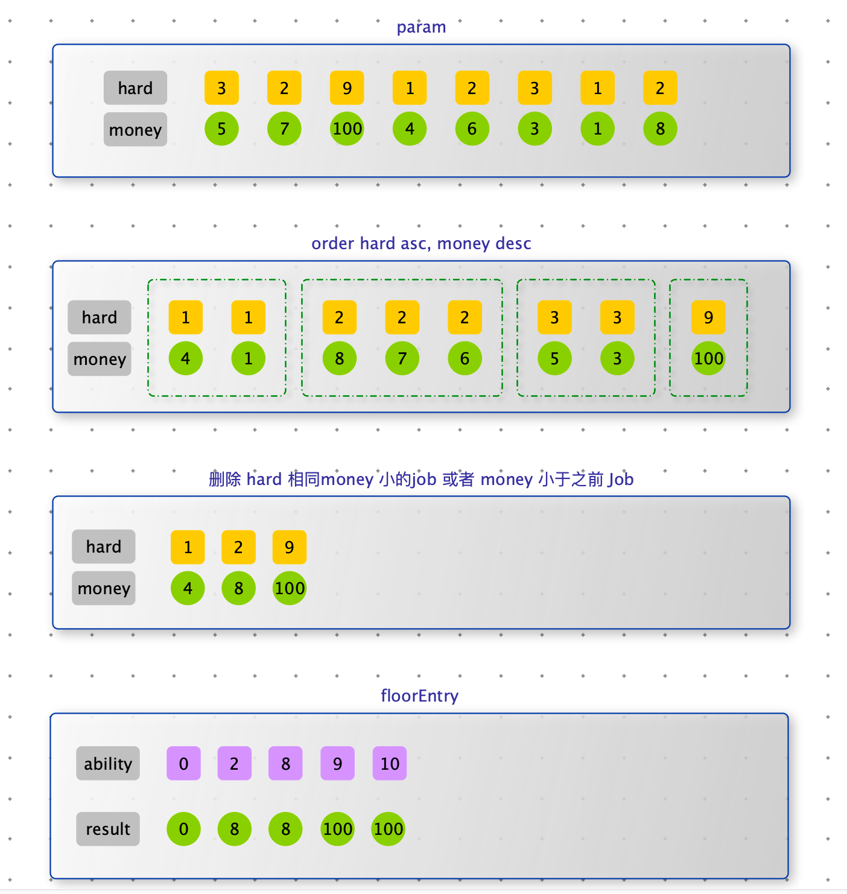

> 为了找到自己满意的工作，牛牛收集了每种工作的难度和报酬。牛牛选工作的标准是在难度不超过自身能力值的情况下，牛牛选择报酬最高的工作，在牛牛选定了自己的工作以后，牛牛的小伙伴们来找牛牛帮忙选工作，牛牛依然使用自己的标准来帮助小伙伴。牛牛的小伙伴太多了，于是他只好把这个任务交给了你。
>
> 输入参数：
>
> - Job_arr：表示所有的工作。
> - Int_arr：表示所有小伙伴的能力值。
>
> 返回数据：int_arr 表示每个小伙伴按照牛牛的标准选工作后所能获得的报酬。


步骤：

1. hard 升序，money 降序，对 job_arr 排序
2. 将 hard 相同，money 最大的 job 加入有序表（TreeMap），如果当前 money 小于之前的 job 也要排除（例如任务3的money 小于任务 2）。
3. 遍历 int_arr 数据，从有序表 treeMap floorEntry （获取能力能达到最大Job，将对应money 写入 result ）


```java
public static class Job {
        // 工作报酬
        public int money;
        // 工作难度
        public int hard;

        public Job(int hard, int money) {
            this.money = money;
            this.hard = hard;
        }
    }

    public static class JobComparator implements Comparator<Job> {
        @Override
        public int compare(Job o1, Job o2) {
            return o1.hard != o2.hard ? o1.hard - o2.hard : o2.money - o1.money;
        }
    }

    public static int[] getMoneys(Job[] jobs, int[] ability) {
        Arrays.sort(jobs, new JobComparator());
        TreeMap<Integer, Integer> treeMap = new TreeMap<>();

        int money = 0;
        for (Job job : jobs) {
            if (treeMap.containsKey(job.hard) || job.money <= money) {
                continue;
            }
            money = Math.max(money, job.money);
            treeMap.put(job.hard, job.money);
        }

        int[] res = new int[ability.length];

        for (int i = 0; i < ability.length; i++) {
            int item = ability[i];
            Map.Entry<Integer, Integer> entry = treeMap.floorEntry(item);
            if (entry == null) {
                continue;
            }
            res[i] = entry.getValue();
        }
        return res;
    }

    public static int[] getMoneys2(Job[] jobs, int[] ability) {
        Arrays.sort(jobs, new JobComparator());
        TreeMap<Integer, Integer> treeMap = new TreeMap<>();

      	// 由于已经排序，hard 相同并且 money 大的一定排在第一名，只需要将第一名插入 treeMap 中
      	// 需要 pre 记录每组的第一个 job，即可区分不同的组
      	// 时间复杂度从 O(N log N) 下降到 O(N)
        Job pre = jobs[0];
        for (int i = 1; i < jobs.length; i++) {
            if (jobs[i].hard != pre.hard && jobs[i].money > pre.money) {
                treeMap.put(jobs[i].hard, jobs[i].money);
                pre = jobs[i];
            }
        }

        int[] res = new int[ability.length];

        for (int i = 0; i < ability.length; i++) {
            int item = ability[i];
            Map.Entry<Integer, Integer> entry = treeMap.floorEntry(item);
            if (entry == null) {
                continue;
            }
            res[i] = entry.getValue();
        }
        return res;
    }

    public static void main(String[] args) {
        Job[] jobs = new Job[8];
        jobs[0] = new Job(3, 5);
        jobs[1] = new Job(2, 7);
        jobs[2] = new Job(9, 100);
        jobs[3] = new Job(1, 4);
        jobs[4] = new Job(2, 6);
        jobs[5] = new Job(3, 3);
        jobs[6] = new Job(1, 1);
        jobs[7] = new Job(2, 8);
        int[] ability = new int[]{0, 2, 8, 9, 10};
        
        for (int item : getMoneys(jobs, ability)) {
            System.out.println(item);
        }
    }
```


> CC 直播的运营部门组织了很多运营活动，每个活动需要花费一定的时间参与，主播每参加一个活动即可得到一定的奖励，参与活动可以从任意活动开始，但一旦开始，就需要将后续活动参加完毕（注意：最后一个活动必须参与），活动之间存在一定的依赖关系（不存在环的情况），现在给出所有的活动时间和依赖关系，以及给出有限的时间，请帮主播计算在有限的时间内，能获得最大的奖励，以及需要的最少时长。
>
> 
>
> 如上图数据所示，给定有限时间为 10 天，可以获取最大的奖励为：11700，需要的时长为：9 天。参加的活动为 $B \rightarrow D \rightarrow  F \rightarrow H $ 四个。


