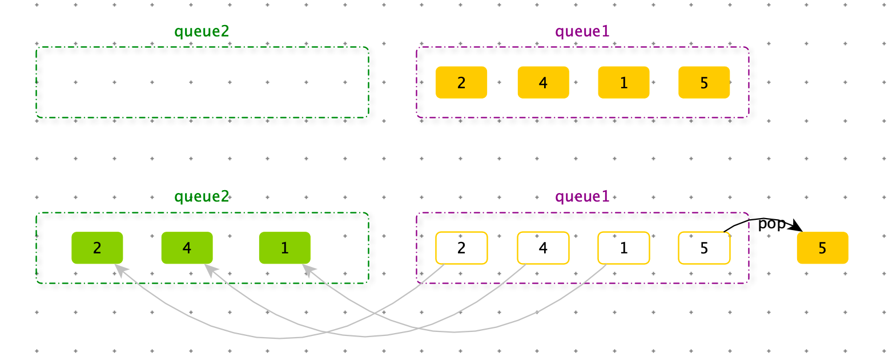

> 实现一个特殊的栈，在实现栈的基本功能的基础上，再实现返回栈中最小元素的操作。
>
> 要求：
>
> 1. pop、push、get_min 的操作的时间复杂度都是 O(1) 
> 2. 设计的栈类型可以使用现成的栈结构


使用两个栈

1. 一个栈实现正常栈的功能
2. 一个栈存放当前栈的最小值


```python
class Stack:
    def __init__(self):
        self.data = []
        self.min_value = []

    def pop(self):
        if self.data:
            self.min_value.pop()
            return self.data.pop()

    def push(self, item):
        self.data.append(item)
        self.min_value.append(min(item, self.min_value[-1] if self.min_value else item))

    def get_min(self):
        return self.min_value[-1]
```


> 如何仅用队列结构实现栈结构？





```python
class QueueStack:
    def __init__(self):
        self.queue1 = []
        self.queue2 = []

    def pop(self):
        if self.queue1:
            while len(self.queue1) > 1:
                self.queue2.append(self.queue1.pop(0))
            return self.queue1.pop(0)
        elif self.queue2:
            while len(self.queue2) > 1:
                self.queue1.append(self.queue2.pop(0))
            return self.queue2.pop(0)

    def push(self, item):
        if self.queue1:
            self.queue1.append(item)
        else:
            self.queue2.append(item)


print("-" * 100)

stack = QueueStack()
stack.push(1)
stack.push(2)
print(stack.pop())
print(stack.pop())
stack.push(3)
stack.push(4)
print(stack.pop())
print(stack.pop())
```


> 如果使用栈结构实现队列结构？


使用两个栈。


```python
class StackQueue:
    def __init__(self):
        self.stack1 = []
        self.stack2 = []

    def pop(self):
        while self.stack1:
            self.stack2.append(self.stack1.pop())
        if self.stack2:
            return self.stack2.pop()

    def push(self, item):
        self.stack1.append(item)

queue = StackQueue()
queue.push(1)
queue.push(2)
print(queue.pop())
print(queue.pop())
queue.push(3)
queue.push(4)
print(queue.pop())
print(queue.pop())
```


