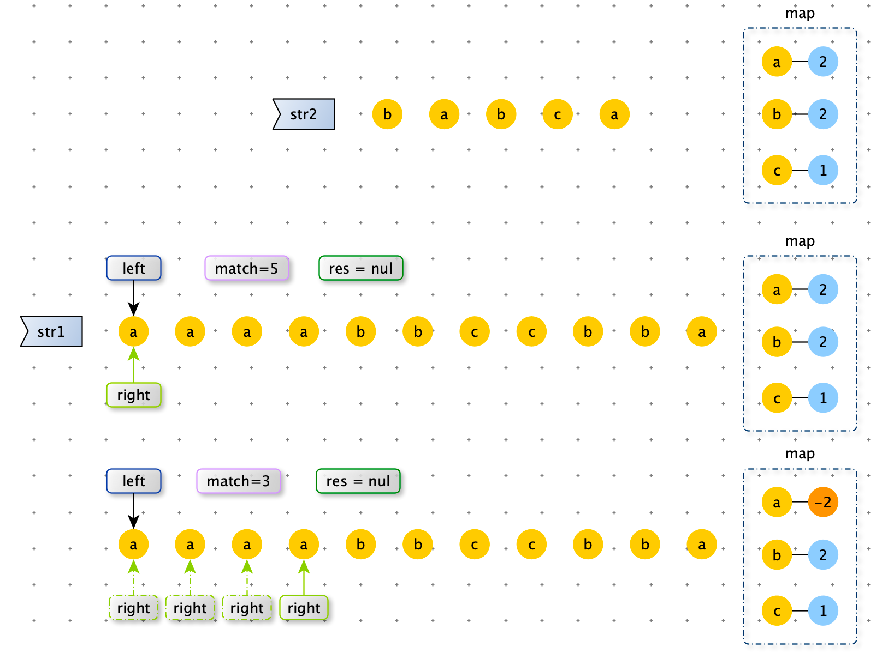
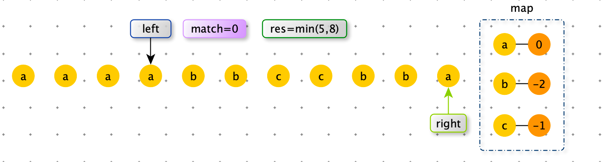

> 给定一个数组 arr，该数组无序，但每个值均为正整数，再给定一个正数 k，求 arr 的所有子数组中所有元素相加和为 k 的最长子数组长度。
>
> 【例如】 arr = 【1,2,1,1,1】，k = 3
>
> 累加和为 3 的最长子数组为 [ 1, 1, 1 ]，所以结果返回 3.
>
> 要求：时间复杂度 O( N )，额外空间复杂度：O( 1 ) 


分析：由于 arr 中每个值均为正整数，那么窗口每次向右移动一位，窗口内的和时单调递增的。窗口每次缩小和是单调递减的。利用这个性质，我们可以根据 sum 与 k 的关系，来控制窗口是扩大还是缩小。


```python
def max_len_sub_list(arr, k):
    left = 0
    right = 0
    sub_sum = arr[0]
    res = 0
    while right < len(arr) and left<len(arr):
        if sub_sum == k:
            res = max(res, right - left + 1)
            sub_sum -= arr[left]
            left += 1

        elif sub_sum < k:
            right += 1
            if right == len(arr): break
            sub_sum += arr[right]
        else:
            sub_sum -= arr[left]
            left += 1

    return res

def max_len_sub_list2(arr, k):
    res = 0
    n = len(arr)
    for i in range(n):
        sub_sum = 0
        for j in range(i, n):
            sub_sum += arr[j]
            if sub_sum >= k: break

        if sub_sum == k:
            res = max(res, j - i + 1)

    return res

import random

def generator_random_array(max_value, max_size):
    return [int(random.random() * max_value + 1) for _ in range(int(random.random() * max_size + 1))]

def check():
    max_value = 10
    max_size = 10

    for i in range(100):
        arr1 = generator_random_array(max_value, max_size)

        k = int(random.random() * sum(arr1))

        actual = max_len_sub_list(arr1, k)
        expect = max_len_sub_list2(arr1, k)
        if expect != actual:
            print("ERROR", expect, actual, arr1, k)
```


> 给定一个数组 arr，该数组无序，其中元素可正、可负、可 0，再给定一个整数 k，求 arr 的所有子数组中所有元素相加和小于或等于 k 的最长子数组长度。
>
> 【例如】 arr = 【3, -2, -4, 0 ,6】，k = -2
>
> 累加和小于或者等于 -2 的最长子数组为 [ 3, -2, -4, 0 ]，所以结果返回 4.

分析：此题中由于有负数，累加和没有上一题中单调性。


# 包含所有字符的最小子串长度

> 给定字符串 str1 和 str2 ，求 str1 的子串中含有 str2 所有字符的最小子串长度。
>
> 【举例】
>
> str1 = “abcde” ，str2 = “ac“  因为 ”abc“ 包含 str2 所有的字符，并且在满足这一条件的 str1 的所有子串中，”abc“ 是最短的，返回 3.
>
> str1 = “12345” ，str2 = “344“,最小包含子串不存在，返回 0。


分析：

使用 left 和 right 维护一个滑动窗口。

- right 移动的时机：窗口没有包含 str2 。扩大窗口。直到窗口内包含了 str2 所有字符。

- left 移动的时机：窗口已经完全有包含 str2 ，此时窗口的长度可能不是最小。在保证窗口内包含str2  所有字符的前提下，减小窗口。直到 map[left] ==0 ，最左端的字符串（str1[right]）的冗余已经删除完毕。
- 综上所述，right 和 left 移动时机，都依赖一个状态：窗口有没有包含 str2，我们可以使用 int match 来维护这个状态。初始值为 match  = len(str2)，right 每次移动包括 str2 字符 就需要 match -=1（当 map[str1[right]]<0 时，表示 str1 中多余的字符）。
- 也需要存储一个 map，保存 str2 剩余需要匹配字符的个数。








str1 的长度为 N

str2 的长度为 K

时间复杂度：O(max(N,K))

时间复杂度：O(K)

 ```python
 import sys
 
 def min_len(str1, str2):
     map = dict({(item, 0) for item in str1})
 
     for item in str2:
         map[item] = map.get(item, 0) + 1
     left = right = 0
     match = len(str2)
     res = sys.maxsize
 
     while right != len(str1):
         map[str1[right]] -= 1
         if map[str1[right]] >= 0:
             match -= 1
         if match == 0:
             while map[str1[left]] < 0:
                 map[str1[left]] += 1
                 left += 1
             res = min(res, right - left + 1)
             match += 1
             map[str1[left]] += 1
             left += 1
         right += 1
 
     return -1 if res == sys.maxsize else res
 ```

