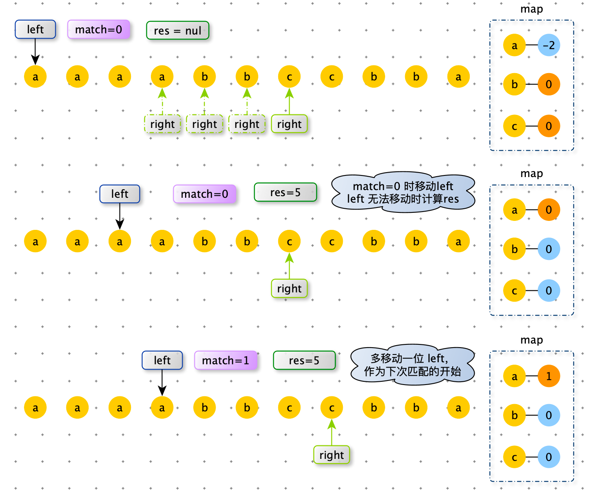
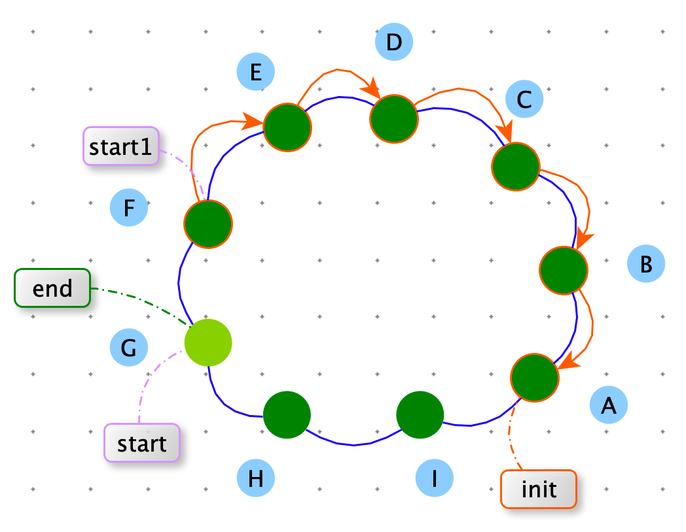

[TOC]

> 给定一个数组 arr，该数组无序，但每个值均为正整数，再给定一个正数 k，求 arr 的所有子数组中所有元素相加和为 k 的最长子数组长度。
>
> 【例如】 arr = 【1,2,1,1,1】，k = 3
>
> 累加和为 3 的最长子数组为 [ 1, 1, 1 ]，所以结果返回 3.
>
> 要求：时间复杂度 O( N )，额外空间复杂度：O( 1 ) 


分析：由于 arr 中每个值均为正整数，那么窗口每次向右移动一位，窗口内的和时单调递增的。窗口每次缩小和是单调递减的。利用这个性质，我们可以根据 sum 与 k 的关系，来控制窗口是扩大还是缩小。


```python
def max_len_sub_list(arr, k):
    left = 0
    right = 0
    sub_sum = arr[0]
    res = 0
    while right < len(arr) and left<len(arr):
        if sub_sum == k:
            res = max(res, right - left + 1)
            sub_sum -= arr[left]
            left += 1

        elif sub_sum < k:
            right += 1
            if right == len(arr): break
            sub_sum += arr[right]
        else:
            sub_sum -= arr[left]
            left += 1

    return res

def max_len_sub_list2(arr, k):
    res = 0
    n = len(arr)
    for i in range(n):
        sub_sum = 0
        for j in range(i, n):
            sub_sum += arr[j]
            if sub_sum >= k: break

        if sub_sum == k:
            res = max(res, j - i + 1)

    return res

import random

def generator_random_array(max_value, max_size):
    return [int(random.random() * max_value + 1) for _ in range(int(random.random() * max_size + 1))]

def check():
    max_value = 10
    max_size = 10

    for i in range(100):
        arr1 = generator_random_array(max_value, max_size)

        k = int(random.random() * sum(arr1))

        actual = max_len_sub_list(arr1, k)
        expect = max_len_sub_list2(arr1, k)
        if expect != actual:
            print("ERROR", expect, actual, arr1, k)
```


> 给定一个数组 arr，该数组无序，其中元素可正、可负、可 0，再给定一个整数 k，求 arr 的所有子数组中所有元素相加和小于或等于 k 的最长子数组长度。
>
> 【例如】 arr = 【3, -2, -4, 0 ,6】，k = -2
>
> 累加和小于或者等于 -2 的最长子数组为 [ 3, -2, -4, 0 ]，所以结果返回 4.

分析：此题中由于有负数，累加和没有上一题中单调性。


# 包含所有字符的最小子串长度

> 给定字符串 str1 和 str2 ，求 str1 的子串中含有 str2 所有字符的最小子串长度。
>
> 【举例】
>
> str1 = “abcde” ，str2 = “ac“  因为 ”abc“ 包含 str2 所有的字符，并且在满足这一条件的 str1 的所有子串中，”abc“ 是最短的，返回 3.
>
> str1 = “12345” ，str2 = “344“,最小包含子串不存在，返回 0。


分析：

使用 left 和 right 维护一个滑动窗口。

- right 移动的时机：窗口没有包含 str2 。扩大窗口。直到窗口内包含了 str2 所有字符。

- left 移动的时机：窗口已经完全有包含 str2 ，此时窗口的长度可能不是最小。在保证窗口内包含str2  所有字符的前提下，减小窗口。直到 map[left] ==0 ，最左端的字符串（str1[right]）的冗余已经删除完毕。
- 综上所述，right 和 left 移动时机，都依赖一个状态：窗口有没有包含 str2，我们可以使用 int match 来维护这个状态。初始值为 match  = len(str2)，right 每次移动包括 str2 字符 就需要 match -=1（当 map[str1[right]]<0 时，表示 str1 中多余的字符）。
- 也需要存储一个 map，保存 str2 剩余需要匹配字符的个数。





str1 的长度为 N

str2 的长度为 K

时间复杂度：O(max(N,K))

时间复杂度：O(K)

 ```python
 import sys
 
 def min_len(str1, str2):
     map = dict({(item, 0) for item in str1})
 
     for item in str2:
         map[item] = map.get(item, 0) + 1
     left = right = 0
     match = len(str2)
     res = sys.maxsize
 
     while right != len(str1):
         map[str1[right]] -= 1
         if map[str1[right]] >= 0:
             match -= 1
         if match == 0:
             while map[str1[left]] < 0:
                 map[str1[left]] += 1
                 left += 1
             res = min(res, right - left + 1)
             match += 1
             map[str1[left]] += 1
             left += 1
         right += 1
 
     return -1 if res == sys.maxsize else res
 ```


# 环形加油站

> N 个加油站组成一个环形，给定两个长度都是 N 的非负数组 oil 和 dis（N > 1）,oil\[i] 表示第 i 个加油站存的油可以跑多少千米，dis\[i] 代表第 i 个加油站到环中下一个加油站相隔多少千米。
>
> 假设你有一辆邮箱足够大的车，初始时车里没有油。如果车从第 i 个加油站出发，最终可以回到这个加油站，那么第 i 个加油站就算良好出发点，否则就不算。请返回长度为 N 的 boolean 数组 res，res\[i] 代表第 i 个加油站是不是良好出发点。


**解法一：暴力算法**

分析：

如果下图绿色节点顺利走完一圈，它就是良好出发点。


其实我们可以将 oil - dis 得到纯能数组。那么原问题就转化为：在纯能数组组成的环上，从起始点出发，累加纯能数组上的数值，累加和始终不为负数，那么起始点就是良好起点。


时间复杂度：$O(N^2)$

空间复杂度：$O(1)$

```python
def stations(dis, oil):
    if not dis or not oil or len(dis) < 2 or len(dis) != len(oil): return
    res = [False] * len(dis)
    n = len(dis)
    # 起始点（大于 0）
    init = -1
    # 生成纯能数组
    for i in range(n):
        dis[i] = oil[i] - dis[i]
        if dis[i] > 0: init = i

    if init == -1: return res

    # 尝试以每个加油站为出发点
    for i in range(n):
        res[i] = circular(dis, i) >= 0

    return res

# 以 i 为出发点，尝试走完一圈。如果累计和为 0 ，退出
def circular(dis, i):
    if dis[i] < 0: return dis[i]
    n = len(dis)
    sum_value = dis[i]
    j = i + 1
    while j % n != i:
        sum_value += dis[j % n]
        if sum_value < 0: break
        j += 1
    return sum_value
```


**解法二：滑动窗口**


**连通区（窗口）伸缩规则**：使用 [ start, end ) 表示连通区，前闭后开。

start 初始值为 init（初始点：在纯能数组中选择一个值大于 0 的数据作为初始点）

end = next_index( init , n)


如果 end 能扩展连通区：rest >= 0，就逆时针走，一直走到 rest 小于或者走到 start 位置；否则就顺时针移动 start，将所需的油累计在 need 变量上，在 end 扩展时使用 need，使用完毕后将 need 还原成 0。


跑完一圈后会出现两种情况：

- 没找到良好出发点
- 找到了一个良好出发点（start）


**情况一：没找到良好出发点**


<font color=orange>当走完一圈，如果 start 对应加油站不是一个良好出发点，就表明所有加油站不都不是良好出发点。</font>

如下图：连通区是：【G，H，I，A，B】，start 在 G 位置，不是一个良好出发点，那么【H，I，A，B】 也不是良好出发点。因为在连通区内 G 是可以到达【H，I，A，B】任何位置。G 带着剩余油（rest>=0） 到达【H，I，A，B】都没走通，那么以【H，I，A，B】为起始点（rest==0） 更不可能走完一圈。

连通图的 start 没有扩展到【F，E，D，C】说明，【F，E，D，C】无法达到 G 位置，所以【F，E，D，C】也不是良好出发点。

综上所述所此种情况下，所有的加油站都不是良好出发点。


**情况二：找到了一个良好出发点（start）**


当走完一圈，如果 start 对应加油站是一个良好出发点（rest >= 0），我们需要寻找其他良好出发点。

如下图：连通区是：【G，H，I，A，B，C，D，E，F】，start 所在的 G 位置是一个良好出发点，那么从 start 上一个加油站 start1 出发到一路追溯到 init ，任何一个能到 G 的加油站都是良好出发点。





时间复杂度：$O(N)$

空间复杂度：$O(1)$

```python
def stations2(dis, oil):
    if not dis or not oil or len(dis) < 2 or len(dis) != len(oil): return
    n = len(dis)
    # 起始点（大于 0）
    init = -1
    # 生成纯能数组
    for i in range(n):
        dis[i] = oil[i] - dis[i]
        if dis[i] > 0: init = i

    return [False] * len(dis) if init < 0 else enlarge_area(dis, init)

def enlarge_area(dis, init):
    n = len(dis)
    res = [False] * n
    # 连通区起始点
    start = init
    # 连通区终点
    end = next_index(init, n)
    # 突破 start 需要油量
    need = 0
    # 剩余油量
    rest = 0

    # 以 init 为起始点，跑一圈
    while True:
        # 连通区 start 扩展（如果 end 无法突破，就扩展 start，所需的油都累计在 need 中）
        if dis[start] < need:
            # 如果 dis[start] 为负数，need 值增加
            # 如果 dis[start] 为正数，need 值减少
            need -= dis[start]
        else:
            # 将 need 的累积的油计算到 rest
            rest += dis[start] - need
            # 重置 need
            need = 0
            # end 连续突破
            while rest >= 0 and end != start:
                rest += dis[end]
                end = next_index(end, n)

            # 如果 end 连续突破后，rest 还有剩余，说明是 end == start 的条件跳出循环的，已经跑了一圈了。
            # 跑过一圈后，rest >= 0 油有剩余，说明以 start 是良好起始点
            # 跑过一圈后，rest < 0 油没有剩余，说明没有一个良好起始点，直接返回
            if rest >= 0:
                res[start] = True
                # 寻找其他的良好起始点
                # 所有能正常能达到 start 的加油站都是良好起始点
                # 所有从 start 上一个节点开始一路向上寻找能正常穿过 start 的加油站，并将对应 res 设置为 True
                connect_good(dis, last_index(start, n), init, res)
                # 已经跑了一圈了，其他良好起始点也寻找完毕，任务完成，跳出。
                break
        start = last_index(start, n)
        if start == init or start == last_index(end, n):
            break
    return res

def connect_good(dis, start, init, res):
    need = 0
    n = len(dis)
    while start != init:
        # 如果当前节点 start 无法穿越，用 need 记录所需要油，继续向上寻找
        if dis[start] < need:
            need -= dis[start]
        else:
            # 成功穿越
            res[start] = True
            need = 0
        start = last_index(start, n)

      
# 数组需要循环访问，需要在两个端点做特殊处理
# 获取 index 前一个索引
def last_index(index, size):
    return size - 1 if index == 0 else index - 1

# 获取 index 后一个索引
def next_index(index, size):
    return 0 if index == size - 1 else index + 1
```


**对数器**

```python
import random

def check():
    for _ in range(100):
        n = int(random.random() * 5) + 1
        oil = [int(random.random() * 5) + 1 for _ in range(n)]
        dis = [int(random.random() * 5) + 1 for _ in range(n)]

        res = stations(dis[:], oil[:])
        res2 = stations2(dis[:], oil[:])

        if res != res2:
            print("ERROR", "res=", res, "res2=", res2, "oil=", oil, "dis=", dis)
    print("Nice")

check()
```

