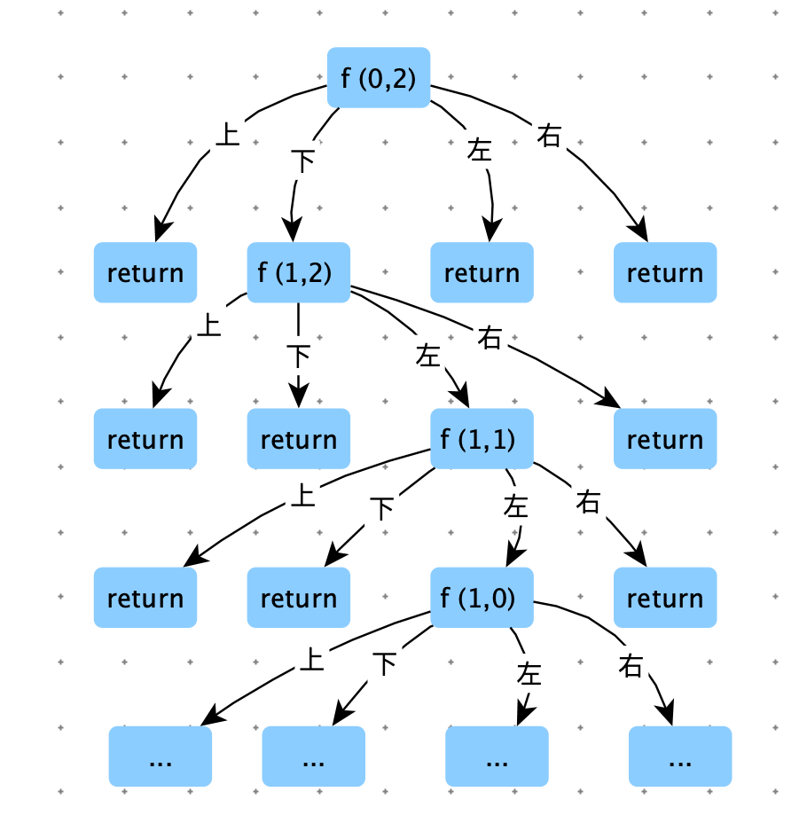

[TOC]

# 打印矩阵

## zigzag 的方式打印矩阵

> 用 zigzag 的方式打印矩阵，比如如下的矩阵：
>
> 0   1   2    3
>
> 4   5    6    7
>
> 8   9   10  11
>
> 打印顺序为：0  1  4  8  5  2  3  6 9  10  7  11

**分析**

如下图，zigzag 打印方式无论是不是方阵都可以。

这种类型的题，不能纠结在路径如何走的细节上。关键在于状态的控制。将路径拆分成规律的几组简单，然后循环处理。

本题：每次关注对角线上两个节点：比如：

节点 1 和 节点 4 ，有两个节点，那么剩下的就是打印从节点 1 到结点 4

节点 8 和 节点 2 ，有两个节点，那么剩下的就是打印从节点 8 到结点 2

节点 3 和 节点 12 ，有两个节点，那么剩下的就是打印从节点 3 到结点 12

节点 13 和 节点 7，有两个节点，那么剩下的就是打印从节点 13 到结点 7

节点 11 和 节点 14，有两个节点，那么剩下的就是打印从节点 11 到结点 14

节点 15 和 节点 15，有两个节点，那么剩下的就是打印从节点 15


从 A = 节点 1 和 B = 节点 4  到 节点 8 和 节点 42 就是一次状态转移。

状态转移：

- A 转移策略：优先向下转移，如果向下越界，那就就向右转移。
- B 转移策略：优先向右转移，如果向右越界，那就就向下转移。


```python
def print_matrix_zigzag(M):
    n = len(M)
    m = len(M[0])
    a_row = a_col = b_row = b_col = 0
    direction = False
    while a_row < n and a_col < m and b_row < n and b_col < m:
        print_level(M, a_row, a_col, b_row, b_col, direction)

        a_row = a_row + 1 if a_col == m - 1 else a_row
        a_col = a_col if a_col == m - 1 else a_col + 1
        b_col = b_col + 1 if b_row == n - 1 else b_col
        b_row = b_row if b_row == n - 1 else b_row + 1
        direction = not direction
    print("")

def print_level(M, a_row, a_col, b_row, b_col, direction):
    n = len(M)
    m = len(M[0])
    if direction:
        while a_row < n and a_col > -1:
            print(M[a_row][a_col], end=" ")
            a_row += 1
            a_col -= 1
    else:
        while b_row > -1 and b_col < m:
            print(M[b_row][b_col], end=" ")
            b_row -= 1
            b_col += 1

M = [[0, 1, 2, 3], [4, 5, 6, 7], [8, 9, 10, 11], [12, 13, 14, 15]]
print_matrix_zigzag(M)
print("-" * 10)
M = [[0, 1, 2], [3, 4, 5], [6, 7, 8], [9, 10, 11], [12, 13, 14]]
print_matrix_zigzag(M)
print("-" * 10)
M = [[0, 1, 2, 3, 4], [5, 6, 7, 8, 9], [10, 11, 12, 13, 14]]
print_matrix_zigzag(M)
```


## 旋转矩阵

> 用螺旋方式打印矩阵，比如如下矩阵
>
> 0	1	2	3
>
> 4	5	6	7
>
> 8	9   10  11
>
> 打印顺序：0	1	2	3	7	11	10	9	8	4	5	6

分析：像剥洋葱一样，一层一层打印。要确定当前的圈层，需要节点 a 和 节点 b。然后分别打印上边，右边，下边，左边（注意：边的连接点别打印重复）。一层打印完毕，向内层递进：a _row += 1 、a_col +=1 ，b_row -= 1 、b_col -= 1


```python
def spiral_order_print(M):
    a_row = a_col = 0
    b_row = len(M) - 1
    b_col = len(M[0]) - 1

    while a_row <= b_row and a_col <= b_col:
        print_edge(M, a_row, a_col, b_row, b_col)
        a_row += 1
        a_col += 1
        b_row -= 1
        b_col -= 1
    print()


def print_edge(M, a_row, a_col, b_row, b_col):
    # 打印上边
    for i in range(a_col, b_col + 1):
        print(M[a_row][i], end=" ")

    # 打印右边
    for i in range(a_row + 1, b_row):
        print(M[i][b_col], end=" ")

    # 打印下边
    for i in range(b_col, a_col, -1):
        print(M[b_row][i], end=" ")

    # 打印左边
    for i in range(b_row, a_row, -1):
        print(M[i][a_col], end=" ")


M = [[0, 1, 2, 3], [4, 5, 6, 7], [8, 9, 10, 11], [12, 13, 14, 15]]

print_edge(M, 0, 0, 3, 3)
print("-" * 10)
spiral_order_print(M)
```


## 方阵旋转

> 给定一个正方形矩阵，只用有限几个变量，实现矩阵中每个位置的数顺时针转动 90 度，比如如下矩阵
>
> 0	1	2	3
>
> 4	5	6	7
>
> 8	9   10  11
>
> 12 13  14  15
>
> 矩阵应该被调整为：
>
> 12	8	4	0
>
> 13	9	5	1
>
> 14  10    6	2
>
> 15  11	7	3

如图：状态转移规则：

1. 外层旋转完毕后，还在外层，内层旋转后还在内层。不会突破层级。
2. 同层旋转，可以分为 m - 1 组数据，依次交换数据。


```python
def rotate(M):
    a_row = 0
    b_row = len(M) - 1
    while a_row < b_row:
        rotate_edge(M, a_row, b_row)
        a_row += 1
        b_row -= 1

def rotate_edge(M, a_row, b_row):
    for i in range(b_row - a_row):
        tmp = M[a_row][a_row + i]
        M[a_row][a_row + i] = M[b_row - i][a_row]
        M[b_row - i][a_row] = M[b_row][b_row - i]
        M[b_row][b_row - i] = M[a_row + i][b_row]
        M[a_row + i][b_row] = tmp

M = [[0, 1, 2, 3], [4, 5, 6, 7], [8, 9, 10, 11], [12, 13, 14, 15]]
rotate(M)
for item in M:
    print(item)
```

本题更好展示了，程序实现的打印路径，和直观感受上的不一样。更好体现了状态的转移。


如果本题不限制空间的使用。我们可以使用一个临时矩阵，更加直观的将数据转移到tmp 矩阵，再将 tmp 中的数据拷贝到 M 矩阵中。

```python
def rotate2(M):
    n = len(M)
    tmp = [[0] * n for _ in range(n)]
    for i in range(n):
        for j in range(n):
            tmp[j][n - i - 1] = M[i][j]

    for i in range(n):
        for j in range(n):
            M[i][j] = tmp[i][j]


M = [[0, 1, 2, 3], [4, 5, 6, 7], [8, 9, 10, 11], [12, 13, 14, 15]]
print(rotate2(M))
for item in M:
    print(item)
```


## 岛问题

> 一个矩阵中只有 0 和 1两种值，每个位置都可以和自己的上、下、左、右四个位置相连，如果有一片 1 连在一起，这个部分叫做一个岛，求一个矩阵中有多少个岛？
>
> 【举例】
>
> 0	0	1	0	1	0
>
> 1	1	1	0	1	0
>
> 1	0	0	1	0	0
>
> 0	0	0	0	0	0
>
> 这个矩阵中有三个岛。
>
> 【进阶】
>
> 如何设计一个并行算法解决问题。


分析：通过传染发，通过深度优先遍历，将相连的 1 感染成 2（防止被重复计算），统计岛的个数。


时间复杂度：O(N * M)

```python
def num_of_islands(M):
    row = len(M)
    col = len(M[0])

    res = 0
    for i in range(row):
        for j in range(col):
            if M[i][j] == 1:
                print((i, j))
                res += 1
                infect(M, i, j, row, col)
    return res

def infect(M, i, j, row, col):
    if M[i][j] != 1 or i < 0 or j < 0 or i >= row or j >= col:
        return

    M[i][j] = 2
    # 向上传染
    infect(M, i - 1, j, row, col)
    # 向下传染
    infect(M, i + 1, j, row, col)
    # 向左传染
    infect(M, i, j - 1, row, col)
    # 向右传染
    infect(M, i, j + 1, row, col)

M = [[0, 0, 1, 0, 1, 0],
     [1, 1, 1, 0, 1, 0],
     [1, 0, 0, 1, 0, 0],
     [0, 0, 0, 0, 0, 0]]
print(num_of_islands(M))
```


时间复杂度分析

函数：num_of_islands 中时间复杂度是：O(N * M)

函数：infect 的递归树如下图。

我们看一个节点被访问多少次：自己被访问，被相邻节点（上，下，左，右）访问，共访问 5 次，$O(5*M*N$) 所以O(N*M)

总体时间复杂度：O(N * M)





> 给定一个整型矩阵，返回子矩阵的最大累计和。

分析：求每一行的最大累计和。


返回子数组中最大累计和：

cur 从前先后累计和，如果 cur < 0，说明cur 不能向后赋能，需要将 cur 设置为 0


```python
import sys

# 返回子矩阵的最大累计和
def sub_matrix_max_sum(M):
    res = -sys.maxsize
    for i in range(len(M)):
        res = max(sub_array_max_sum(M[i]), res)

        if i == len(M) - 1: break
        # 下一行累计上以上的数据
        for j in range(len(M[0])):
            M[i + 1][j] += M[i][j]
    return res

# 返回子数组中最大累计和
def sub_array_max_sum(a):
    cur = 0
    res = -sys.maxsize
    for item in a:
        cur += item
        res = max(res, cur)
        cur = max(0, cur)

    return res

print(sub_array_max_sum([-7, 9, -5, 3]))
print(sub_matrix_max_sum([[-5, 3, 6, 4], [-7, 9, -5, 3], [-10, 1, -200, 4]]))
```


# 贪吃蛇

> 给定一个二维数组 matrix，每个单元都是一个整数，有正有负。最开始的时候小 Q 操纵一条长度为 0 的蛇。蛇从矩阵最左侧人选一个单元格进入地图，蛇每次只能够到大当前位置的右上相邻，右侧相邻和右下相邻的单元格。蛇蛇到达一个单元格后，自身的长度会瞬间加上改单元格的数值，任何情况下长度为负则游戏结束。小 Q 是个天才，他拥有一个超能力，可以在游戏开始的时候把地图中的某一个节点的值变为相反数（注意：最多只能改变一个节点）。问小 Q 游戏过程中，他的蛇蛇最长长度可以到多少？
>
> 【例如】matrix =[ [ 1, -4, 10 ],
>
> ​							    [ 3, -2, -1 ],
>
> ​							    [ 2, -1, 0 ],
>
> ​							    [ 0, 5, -2 ]]
>
> 最优路径为从最左侧的 3 开始， 3 -> -4 ( 利用能力变为 4 )  -> 10。所以返回 17


**暴力递归**

```python
class Info:
    def __init__(self, yes, no):
        self.yes = yes
        self.no = no

import sys

def snake(matrix):
    res = - sys.maxsize
    for row in range(len(matrix)):
        for col in range(len(matrix[0])):
            cur = process(matrix, row, col)
            res = max(res, max(cur.yes, cur.no))
    return res

def process(matrix, row, col):
    if col == 0:
        return Info(-matrix[row][0], matrix[row][0])

    left = process(matrix, row, col - 1)
    # 之前旅程中，一次能力也沒有用，能达到的最大路径和
    pre_no = left.no if left.no >= 0 else -1
    # 之前旅程中，用过一次能力，能达到的最大路径和
    pre_yes = left.yes if left.yes >= 0 else -1

    if row - 1 >= 0:
        left_up = process(matrix, row - 1, col - 1)
        # 如果为负数，说明已经死亡，这条尝试路径断了
        if left_up.yes >= 0:
            pre_yes = max(pre_yes, left_up.yes)
        if left_up.no >= 0:
            pre_no = max(pre_no, left_up.no)

    if row + 1 < len(matrix):
        left_down = process(matrix, row + 1, col - 1)
        if left_down.yes >= 0:
            pre_yes = max(pre_yes, left_down.yes)
        if left_down.no >= 0:
            pre_no = max(pre_no, left_down.no)

    yes = no = -1
    # 之前旅程中，no 这条尝试路径没有断
    if pre_no >= 0:
        # 当前 yes，之前旅途中 no + （当前翻转）
        yes = pre_no - matrix[row][col]
        # 当前 yes，之前旅途中 no + 不翻转
        no = pre_no + matrix[row][col]
    if pre_yes >= 0:
        # 当前 yes，之前旅途中 no + （当前翻转）PK 之前旅途中 yes + 当前不翻转
        yes = max(yes, pre_yes + matrix[row][col])

    return Info(yes, no)
```


**动态规划**


```python
def snake3(matrix):
    res = - sys.maxsize

    dp_yes = [[-1] * len(matrix[0]) for _ in range(len(matrix))]
    dp_no = [[-1] * len(matrix[0]) for _ in range(len(matrix))]

    # base_case
    for i in range(len(matrix)):
        dp_yes[i][0] = -matrix[i][0]
        dp_no[i][0] = matrix[i][0]

    for col in range(1, len(matrix[0])):
        for row in range(len(matrix)):
            # 之前旅程中，一次能力也沒有用，能达到的最大路径和
            pre_no = dp_no[row][col - 1] if dp_no[row][col - 1] >= 0 else -1
            # 之前旅程中，用过一次能力，能达到的最大路径和
            pre_yes = dp_yes[row][col - 1] if dp_yes[row][col - 1] >= 0 else -1

            if row - 1 >= 0:
                # 如果为负数，说明已经死亡，这条尝试路径断了
                if dp_yes[row - 1][col - 1] >= 0:
                    pre_yes = max(pre_yes, dp_yes[row - 1][col - 1])
                if dp_no[row - 1][col - 1] >= 0:
                    pre_no = max(pre_no, dp_no[row - 1][col - 1])

            if row + 1 < len(matrix):
                if dp_yes[row + 1][col - 1] >= 0:
                    pre_yes = max(pre_yes, dp_yes[row + 1][col - 1])
                if dp_no[row + 1][col - 1] >= 0:
                    pre_no = max(pre_no, dp_no[row + 1][col - 1])

            yes = no = -1
            # 之前旅程中，no 这条尝试路径没有断
            if pre_no >= 0:
                # 当前 yes，之前旅途中 no + （当前翻转）
                yes = pre_no - matrix[row][col]
                # 当前 yes，之前旅途中 no + 不翻转
                no = pre_no + matrix[row][col]
            if pre_yes >= 0:
                # 当前 yes，之前旅途中 no + （当前翻转）PK 之前旅途中 yes + 当前不翻转
                yes = max(yes, pre_yes + matrix[row][col])
            dp_yes[row][col] = yes
            dp_no[row][col] = no

    for row in range(len(matrix)):
        for col in range(len(matrix[0])):
            res = max(res, max(dp_no[row][col], dp_yes[row][col]))
    return res
```

