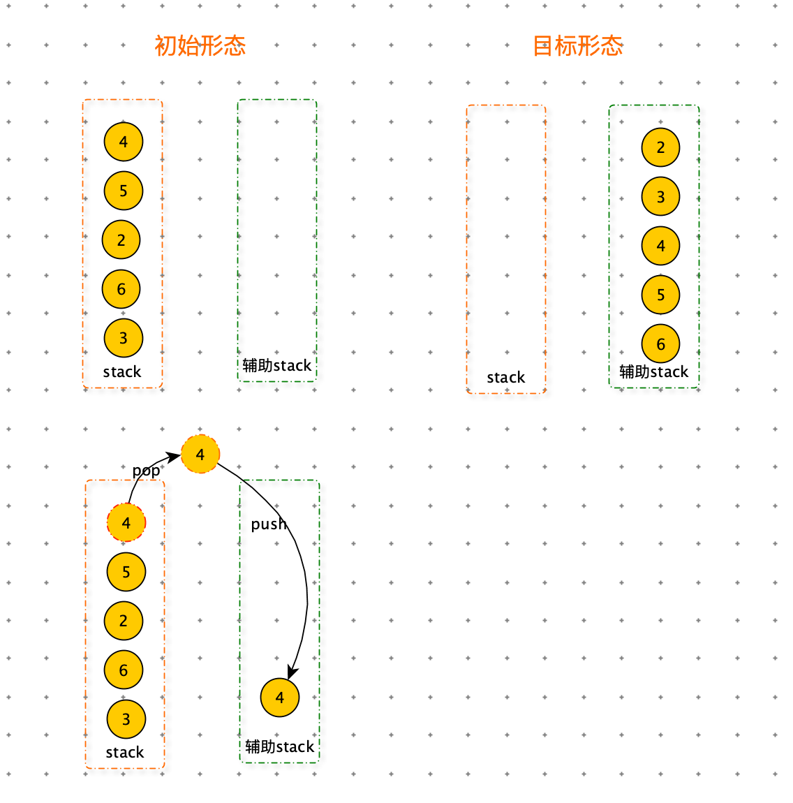

[TOC]

# 矩阵

## 查询值

> 给定一个元素为非负整数的二维数组 matrix ，每行和每列都是从小到大有序的。再给定一个非负整数 aim，请判断 aim 是否在 matrix 中。

分析

<font color=orange>从右上角开始，如果 matrix \[i][j] > aim，向左走，否则向下走。</font>很多矩阵的题都是这个套路


时间复杂度为：O(n + m)  ；n 是矩阵行数，m 是矩阵列数。

空间复杂度：O(1)

```python
def find(M, aim):
    n = len(M)
    m = len(M[0])
    row = 0
    col = m - 1

    while row < n and col > -1:
        if M[row][col] == aim:
            return True
        if M[row][col] > aim:
            col -= 1
        else:
            row += 1
    return False


print(find([[1, 5, 9, 10], [2, 6, 11, 16], [7, 9, 15, 17]], 7))
print(find([[1, 5, 9, 10], [2, 6, 11, 16], [7, 9, 15, 17]], 2))
print(find([[1, 5, 9, 10], [2, 6, 11, 16], [7, 9, 15, 17]], 3))
```


## 1 最多的行号

>给定一个的二维数组 matrix ，矩阵只有 0 和 1 组成，1 在 0 的左边，求 1 最多的行号。


<font color=orange>从右上角开始，如果 matrix \[i][j] == 1，向左走，否则向下走。统计最多 1 的行数</font>很多矩阵的题都是这个套路


时间复杂度为：O(n + m)  ；n 是矩阵行数，m 是矩阵列数。

空间复杂度：O(1)

```python
def maxOne(M):
    n = len(M)
    m = len(M[0])
    row = 0
    col = m - 1

    res = -1
    while row < n and col > -1:
        if M[row][col] == 1:
            col -= 1
            res = row
        else:
            row += 1
    return res

print(maxOne([[0, 0, 0, 0, 1, 1, 1, 1],
              [0, 0, 0, 0, 0, 0, 1, 1],
              [0, 0, 0, 1, 1, 1, 1, 1],
              [0, 0, 0, 1, 1, 1, 1, 1],
              [0, 1, 1, 1, 1, 1, 1, 1]
              ]))

print(maxOne([[0, 0, 0, 0, 1, 1, 1, 1],
              [0, 0, 0, 0, 0, 0, 1, 1],
              [0, 0, 0, 1, 1, 1, 1, 1],
              [0, 1, 1, 1, 1, 1, 1, 1],
              [0, 0, 1, 1, 1, 1, 1, 1]
              ]))

print(maxOne([[0, 0, 0, 0, 1, 1, 1, 1],
              [0, 0, 0, 0, 0, 0, 1, 1],
              [0, 1, 1, 1, 1, 1, 1, 1],
              [0, 0, 0, 1, 1, 1, 1, 1],
              [0, 0, 1, 1, 1, 1, 1, 1]
              ]))

```


# 二叉树

## 最大权值

> 二叉树每个节点都有一个 int 的权值，给定一个课二叉树，要求计算出根节点到叶节点的所有路径中，权值和最大的值为多少？


**二叉树遍历**

在二叉数据从上向下遍历过程中累加权值，到叶子节点时，与全局 res 比较大小，保存较大的值。

```python
class TreeNode:
    def __init__(self, val=0, left=None, right=None):
        self.val = val
        self.left = left
        self.right = right

max_sum = 0

def max_dis(head):
    global max_sum
    process(head, 0)
    return max_sum

def process(node, pre):
    global max_sum
    pre += node.val
    # 叶子节点
    if not node.left and not node.right:
        max_sum = max(max_sum, pre)
        return

    if node.left:
        process(node.left, pre)
    if node.right:
        process(node.right, pre)
```


**二叉树递归套**

节点 X，需要从左节点获取权重值的和，需要从右节点获取权重值的和，从左右节点中选取权重较大的值再加上自己的权值，就是以 X 为头结点的子树的：权值和最大的值。

```python
def max_dis2(head):
    return process2(head)

def process2(node):
    left_value = 0
    right_value = 0
    if node.left:
        left_value = process2(node.left)
    if node.right:
        right_value = process2(node.right)
    return max(left_value, right_value) + node.val
  
head = TreeNode(1)
head.left = TreeNode(2)
head.right = TreeNode(3)

head.left.left = TreeNode(4)
head.left.right = TreeNode(5)

head.right.left = TreeNode(6)
head.right.right = TreeNode(7)

print("max_weight", max_dis(head))
print("max_weight2", max_dis2(head))
```


## 二叉树结构树

> 给定一个非负整数 n，代表二叉树的节点数。返回能形成多少种不同的二叉树结构。


num_tree = f(n-1) * f(0) + f(1) * f(n-2) + f(2) * f(n-3) + ... + f(n-1) * f(0) 

```python
def num_tree(n):
    if n == 0: return 1
    if n < 3:
        return n
    res = 0
    for i in range(n):
        res += num_tree(i) * num_tree(n - i - 1)
    return res

print(num_tree(4))
```

优化：

上述方案存在重复计算子问题，使用 dp 数组存放子问题，防止重复计算。


递推公式

f(n) =  f(n-1) * f(0) + f(1) * f(n-2) + f(2) * f(n-3) + ... + f(n-1) * f(0) 

```python
def num_tree2(n):
    if n < 0: return 0
    dp = [0] * (n + 1)
    dp[0] = 1
    dp[1] = 1

    for i in range(2, n + 1):
        for j in range(i):
            dp[i] += dp[j] * dp[i - j - 1]

    return dp[-1]
```


# 栈

请编写一个程序，对一个栈里的整型数据，按升序进行排序（即排序前，栈里的数据是无序的，排序后最大元素位于栈顶），要求最多只能使用一个额外的栈存放临时数据，但不得将元素复制到别的数据结构中。


分析：

如果我们可以将数据调整成，辅助栈中的数据从小到大排列，然后再依次将辅助栈的数据压入原始栈就可以完成任务。

要使辅助栈的数据从小到大排列，步骤如下：

1. 从原始栈弹出数据 x，如果辅助栈为空，直接压入辅助栈。
2. 如果 x 小于辅助栈栈顶数据，直接压入辅助栈。
3. 如果 x 大于辅助栈栈顶数据，需要将辅助栈中的数据从新压入原始栈中，直到如果 x 小于辅助栈栈顶数据或者辅助栈为空。





```python
def process(stack):
    tmp_stack = []
    while stack:
        x = stack.pop()
        # 辅助栈为空或者 x 小于辅助栈栈顶数据
        if not tmp_stack or x < tmp_stack[-1]:
            tmp_stack.append(x)
            continue

        #  x 大于辅助栈栈顶数据
        # 将辅助栈中的数据从新压入原始栈中，直到如果 x 小于辅助栈栈顶数据或者辅助栈为空
        while tmp_stack and x > tmp_stack[-1]:
            stack.append(tmp_stack.pop())
        stack.append(x)

    # 将 tmp_stack 中导入 stack
    while tmp_stack:
        stack.append(tmp_stack.pop())


stack = [3, 6, 2, 5, 4]
process(stack)
print(stack)
```


# 字符串问题

## 括号匹配问题

> 一个合法的括号匹配序列有以下定义
>
> 1. 空串” “ 是一个合法的括号匹配序列
> 2. 如果 X 和 Y 都是合法的括号匹配序列，那么 ”XY“ 也是一个合法的括号匹配序列
> 3. 如果 X 是一个合法的括号匹配序列，那么”（X）“ 也是一个合法的括号匹配序列
> 4. 每个合法的括号序列都可以由以上规则生成。
>
> 例如：” “ 、”()“、”()()“、、”((()))“ 都是合法的括号序列。对于一个合法的括号序列我们有以下定义它的<font color=green>深度</font>
>
> 1. 空串 ” “ 深度为 0
> 2. 如果字符串 ”X“ 的深度是 x ，字符串 ”Y“ 的深度为 y，那么字符串 ”XY” 深度为 max( x , y) 
> 3. 如果 “X”  的深度是 x ，那么字符串 ”(X)“ 的深度为 x + 1
>
> 例如：”()()()“ 的深度是 1，”((()))“ 的深度是 3。牛牛现在给你一个合法的括号序列，需要你计算出其深度。


分析：

<font color=red>用 count 记录，当遇到 “(” count +=1 ，当遇到 “)” count -=1 </font>, count 最大时，就是深度。

```python
def max_depth(string):
    count = 0
    res = 0
    for item in string:
        if item == "(":
            count += 1
            res = max(res, count)
        else:
            count -= 1
    return res


print("max_depth", max_depth("((()))"))
```

<font color=red>用 count 记录，当遇到 “(” count +=1 ，当遇到 “)” count -=1 </font>对于括号问题常用的套路。


> 牛牛现在给你一个合法的括号序列，检验是否合法匹配？

<font color=red>用 count 记录，当遇到 “(” count +=1 ，当遇到 “)” count -=1 </font>如果 count 出现过负数，那么不合法。

```python
def is_match(string):
    count = 0
    for item in string:
        if item == "(":
            count += 1
        else:
            count -= 1
            if count < 0:
                return False
    return True
  
print(is_match("((()))"))
print(is_match(")((())"))
```
