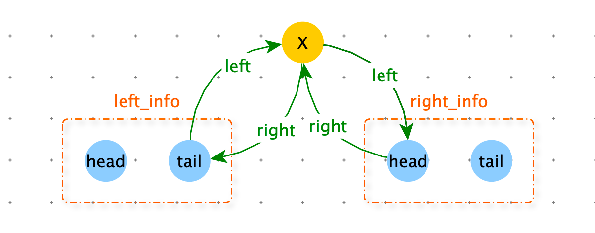

> 双向链表节点结构和二叉树节点结构是一样的，如果你把 next 认为 left，pre 认为是 right的话。
>
> 给定一个搜索二叉树的头节点 head，请转化成一条有序的双向链表，并返回链表的头节点。





```python
class TreeNode:
    def __init__(self, val):
        self.val = val
        self.left = None
        self.right = None

class Info:
    def __init__(self, head, tail):
        self.head = head
        self.tail = tail

def convert(root):
    if not root: return
    return process(root).head

def process(node: TreeNode):
    if not node:
        return

    left_info = process(node.left)
    right_info = process(node.right)

    if left_info:
        node.right = left_info.tail
        left_info.tail.left = node
    if right_info:
        right_info.head.right = node
        node.left = right_info.head

    return Info(left_info.head if left_info else node, right_info.tail if right_info else node)

def print_linked_list(head):
    node = head
    while node:
        print(node.val)
        node = node.left

root = TreeNode(50)
root.left = TreeNode(30)
root.right = TreeNode(80)
root.left.left = TreeNode(20)
root.left.right = TreeNode(40)
root.right.left = TreeNode(70)
root.right.right = TreeNode(90)

head = convert(root)
print_linked_list(head)
```


> 找到一棵二叉树中，最大的搜索二叉子树，返回最大搜索二叉树的节点个数。

