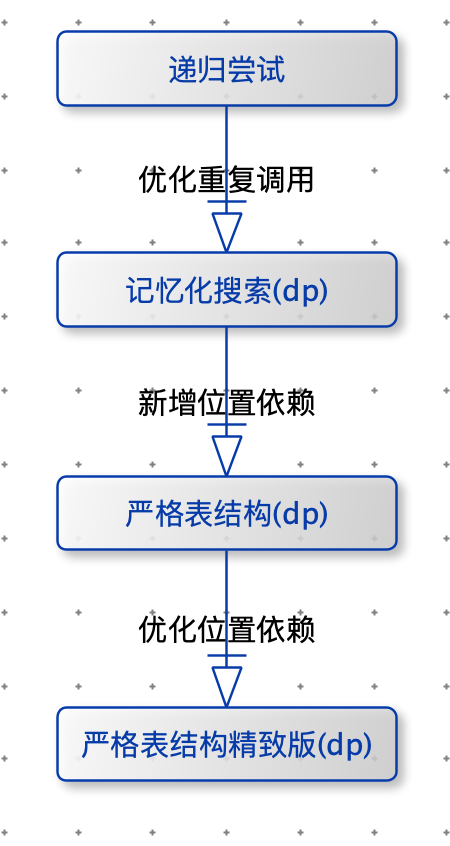
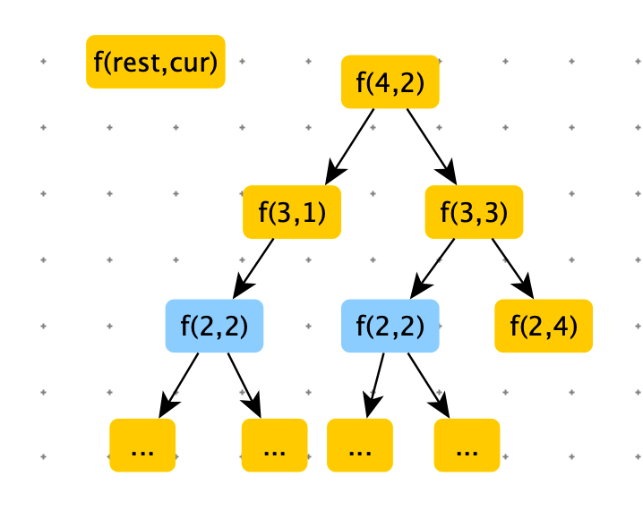
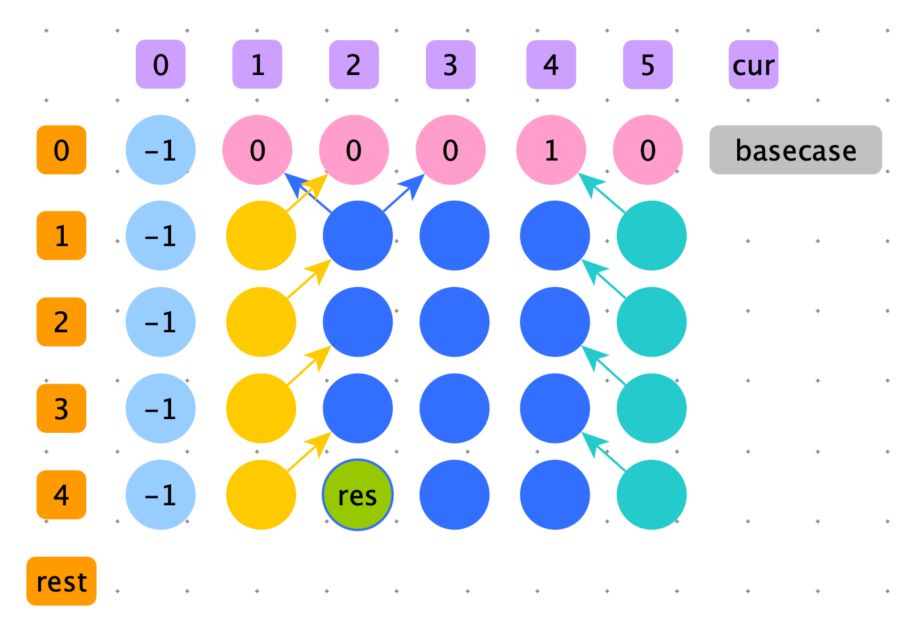
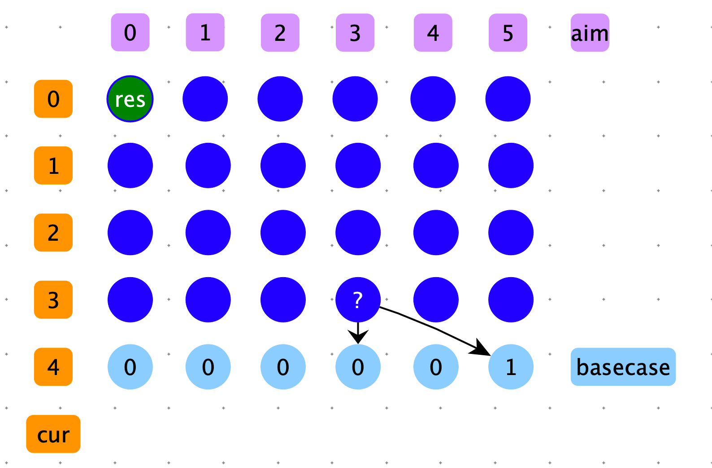
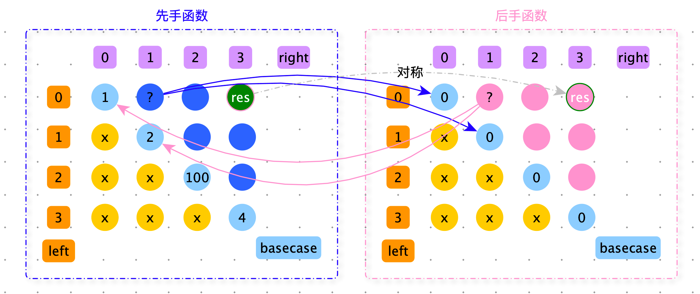
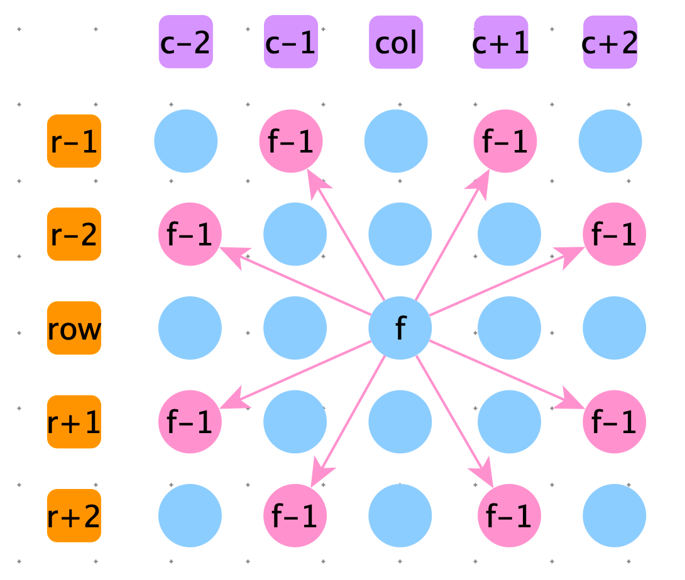

[TOC]

# 递归尝试套路

暴力递归到动态规划的演进路线：




递归尝试套路

1. 从左向右尝试
2. 范围尝试：left，right


递归尝试策略评价标准

1. 单可变参数的维度
   1. 尽量使用一维参数，如果但可变参数是个数组，那么它的变化就超级多。
   2. 取值范围尽可能小
2. 可变参数的个数越少越好。

上边两个评价标准，是为了然后续 dp 表占用的空间越小越好。


# 动态规划空间压缩技巧


# 例题

## 多少走法

> 给定一个正整数 n，一个正整数 s（1 <= s <=n）,一个正整数 e（1 <= e <=n）,一个正整数 k （k > 0）
>
> 表示从 s 点出发，走 k 步到 e 点，一共有多少走法?
>
> 【例子】n = 5；s = 2；e = 4；k = 4
>
> 1	2	3	4	5	
>
> ​	  s		  e
>
> 路径1：2 --> 3 --> 4 --> 5 --> 4
>
> 路径2：2 --> 3 --> 4 --> 3 --> 4
>
> 路径3：2 --> 3 --> 2 --> 3 --> 4
>
> 路径4：2 --> 1 --> 2 --> 3 --> 4
>
> 返回 4


递归尝试策略：从左向右策略



```python
def walk_ways(n, e, k, s):
    return process(n, e, k, s)

# n 和 e 是常量
# rest 剩余步数
# cur 当前位置
def process(n, e, rest, cur):
    # base case:如果没有剩余步数了，如果刚好走到 e 位置，说明这条路是正确的返回 1，否则返回 0
    if rest == 0:
        return 1 if cur == e else 0

    # 如果 cur 在起始位置(边界)，那么只能向右走
    if cur == 1:
        return process(n, e, rest - 1, cur + 1)
    # 如果 cur 在终止位置（边界），那么只能向左走
    if cur == n:
        return process(n, e, rest - 1, cur - 1)
    # cur 既可以向左走，也可以向右走。将向左走的路径条数 + 向右走的路径条数，就是总的路径条数
    return process(n, e, rest - 1, cur - 1) + process(n, e, rest - 1, cur + 1)

print(walk_ways(5, 4, 4, 2))
```


记忆化搜索：没有位置依赖

```python
def walk_ways2(n, e, s, k):
    dp = [[-1] * (n + 1) for _ in range(k + 1)]
    return process2(n, e, k, s, dp)

#
# n 和 e 是常量
# rest 剩余步数
# cur 当前位置
def process2(n, e, rest, cur, dp):
    if dp[rest][cur] != -1:
        return dp[rest][cur]

    if rest == 0:
        dp[rest][cur] = 1 if cur == e else 0

    elif cur == 1:
        dp[rest][cur] = process(n, e, rest - 1, cur + 1)
    elif cur == n:
        dp[rest][cur] = process(n, e, rest - 1, cur - 1)
    else:
        dp[rest][cur] = process(n, e, rest - 1, cur - 1) + process(n, e, rest - 1, cur + 1)
    return dp[rest][cur]
```


严格表格的动态规划：位置依赖


<font color=green>**从递归尝试改成严格表格的动态规划步骤：**</font>

1. **分析可变参数个数：（一个可变参数需要一维表存储，两个可变参数需要二维表存储...）**
2. **标出计算终止位置**
3. **根据 basecase 确定不需要计算就可以得到答案的位置**
4. **确定普通位置的位置依赖**
5. **确定依次计算的顺序**


1. 分析可变参数个数：n 与 e 是常量，rest 与 cur 为变量，需要二维表，rest 的范围是【1~k】cur 的范围是【1~ n】因此二维表格可以使用：k + 1 行，n + 1 列

```python
def walk_ways(n, e, k, s):
    return process(n, e, k, s)
```

2. 标出计算终止位置：process(n, e, k, s) k = 4, s = 2 ,dp\[4][2]（n 与 e 常量），下图中青色节点res

3. 根据 basecase 确定不需要计算就可以得到答案的位置：basecase 为 e = 4，cur == e 时为1，其他为 0，粉色节点

   ```python
       if rest == 0:
           return 1 if cur == e else 0
   ```

4. 确定普通位置的位置依赖：

   1. 起始节点：只能向左走：黄色节点
   2. 终止节点：只能向右走：绿色节点
   3. 中间节点：可向左，可向右走：蓝色节点
   4. 箭头指向就是依赖

   ```python
   						# 起始节点
     					if j == 1:
                   dp[i][j] = dp[i - 1][j + 1]
               elif j == n:	#终止节点
                   dp[i][j] = dp[i - 1][j - 1]
               else:	# 中间节点
                   dp[i][j] = dp[i - 1][j - 1] + dp[i - 1][j + 1]
   ```

5. 确定依次计算的顺序：下一行的节点依赖上一行的节点，所以是从上向下填充数据。同一行中无论是从左向右还是从右向左均可。



```python
def walk_ways3(n, e, s, k):
    # 创建二维表
    dp = [[-1] * (n + 1) for _ in range(k + 1)]

     # 填充 basecase
    for i in range(n + 1):
        dp[0][i] = 1 if i == e else 0

    # 填充普通方格
    for i in range(1, k + 1):
        for j in range(1, n + 1):
          	# 此处判断，与暴力递归处理逻辑一致：拷贝过来直接改写
            # 起始节点
            if j == 1:
                dp[i][j] = dp[i - 1][j + 1]
            elif j == n:# 终止节点
                dp[i][j] = dp[i - 1][j - 1]
            else:# 中间结点
                dp[i][j] = dp[i - 1][j - 1] + dp[i - 1][j + 1]

    return dp[e][s]

print(walk_ways3(5, 4, 2, 4))
```


## 最少硬币数


> 给一个正整数数组 arr=【2,7,3，5,3】，每一个数表示一枚硬币，硬币可以重复。再一个 aim=10，求用硬币组成 aim，使用最少的硬币是多个？


递归尝试策略：从左向右策略

```python
def min_coins_count2(array, aim):
    return f2(array, aim, 0)


def f2(array, aim, cur):
  	# 钱不够了
    if aim < 0: return -1
  	# 上一步刚等于 aim，此时不需要硬币了
    if aim == 0: return 0
    # aim > 0 没有硬币可用了
    if cur == len(array):
        return -1

    # aim > 0 并且有硬币
    # 由于返回值有 -1，-1 会干扰求 min
    # min( f2(array, aim, cur + 1), f2(array, aim - array[cur], cur + 1))
    p1 = f2(array, aim, cur + 1)
    p2 = f2(array, aim - array[cur], cur + 1)

    if p1 == -1 and p2 == -1:
        return -1
    elif p1 == -1 or p2 == -1:
        return max(p1, p2 + 1)

    return min(p1, p2 + 1)

array = [2, 7, 3, 5, 3]
aim = 10
print(min_coins_count2(array, aim))
```

1. 分析可变参数个数：两个：aim 和 cur：aim in 【0，aim】，cur in 【0，len(array)】
2. 标出计算终止位置：dp\[ 0 ][ aim ]
3. 根据 basecase 确定不需要计算就可以得到答案的位置：aim == 0 return = 0 dp\[i][0]=0
4. 确定普通位置的位置依赖：
5. 确定依次计算的顺序：上下方向：从下向上。左右方向：均可。由于只依赖下一行的数据，不依赖同一行的数据。


```python
def min_coins_count3(array, aim):
    n = len(array)
    dp = [[-1] * (aim + 1) for _ in range(n + 1)]

    for i in range(n + 1):
        dp[i][0] = 0
        
    for cur in range(n - 1, -1, -1):
        for rest in range(1, aim + 1):
            p1 = dp[cur + 1][rest]
            p2 = dp[cur + 1][rest - array[cur]] if rest - array[cur] >= 0 else -1
            if p1 == -1 and p2 == -1:
                dp[cur][rest] = -1
            elif p1 == -1 or p2 == -1:
                dp[cur][rest] = max(p1, p2 + 1)
            else:
                dp[cur][rest] = min(p1, p2 + 1)

    return dp[0][aim]
```


> 给一个正整数数组 arr=【2,7,3，5,3】，每一个数表示一枚硬币，硬币可以重复。再一个 aim=10，求用硬币组成 aim，有多少种硬币的组合数？

```python
def coins(array, aim):
    return f(array, aim, 0, 0)

def f(array, aim, cur, s):
    if cur == len(array):
        return 1 if s == aim else 0

    return f(array, aim, cur + 1, s) + f(array, aim, cur + 1, s + array[cur])

array = [1, 2, 3, 4]
aim = 5
print(coins(array, aim))
```


1. 分析可变参数个数：两个：s 和 cur：s in 【0，sum(array)】，cur in 【0，len(array)】
2. 标出计算终止位置：dp\[ 0 ][ 0 ]
3. 根据 basecase 确定不需要计算就可以得到答案的位置：dp\[cur][i] = 1 if s == aim else 0
4. 确定普通位置的位置依赖：
5. 确定依次计算的顺序：上下方向：从下向上。左右方向：均可。由于只依赖下一行的数据，不依赖同一行的数据。




```python
def coins2(array, aim):
    n = len(array)
    dp = [[0] * (aim + 1) for _ in range(n + 1)]
    dp[-1][-1] = 1

    for cur in range(n - 1, -1, -1):
        for rest in range(aim + 1):
            dp[cur][rest] = dp[cur + 1][rest] + (0 if rest + array[cur] > aim else dp[cur + 1][rest + array[cur]])

    return dp[0][0]
```


对数器

```python
import random

def random_array_generator(max_value, max_size):
    return [int(random.random() * max_value + 1) for _ in range(int(random.random() * max_size + 1))]

def check():
    n = 100
    max_value = 10
    max_size = 10

    for i in range(n):
        array = random_array_generator(max_size, max_value)
        aim = int(random.random() * sum(array))
        if coins(array, aim) != coins2(array, aim):
            print("ERROR", aim, array, coins(array, aim), coins2(array, aim))
    print("Game Over!")
```


> arr 里都是正数，没有重复值，每一个值都代表一种货币，每一种货币都可以用无限张。最终要找零钱数是 aim，返回找零方法数？


暴力递归尝试

```python
def ways(arr, aim):
    if not arr: return 0
    return process(arr, 0, aim)


def process(arr, cur, rest):
    if len(arr) == cur or rest < 0: return 1 if rest == 0 else 0

    i = 0
    ways = 0
    while rest >= i * arr[cur]:
        ways += process(arr, cur + 1, rest - (i * arr[cur]))
        i += 1
    return ways
```


动态规划

```python
def ways2(arr, aim):
    if not arr: return 0
    n = len(arr)
    dp = [[0] * (aim + 1) for _ in range(n + 1)]

    for i in range(n + 1):
        dp[i][0] = 1

    for cur in range(n - 1, -1, -1):
        for rest in range(1, aim + 1):

            i = 0
            while rest >= i * arr[cur]:
                dp[cur][rest] += dp[cur + 1][rest - (i * arr[cur])]
                i += 1

    return dp[0][aim]
```


精致版动态规划

```python
def ways3(arr, aim):
    if not arr: return 0
    n = len(arr)
    dp = [[0] * (aim + 1) for _ in range(n + 1)]

    for i in range(n + 1):
        dp[i][0] = 1

    for cur in range(n - 1, -1, -1):
        for rest in range(1, aim + 1):
            dp[cur][rest] = dp[cur + 1][rest]
            dp[cur][rest] += dp[cur][rest - arr[cur]] if rest - arr[cur] >= 0 else 0

    return dp[0][aim]
```


滚动数组版动态规划


对数器

```python
import random

def random_array_generator(max_value, max_size):
    return [int(random.random() * max_value + 1) for _ in range(int(random.random() * max_size + 1))]

def check():
    n = 100
    max_value = 10
    max_size = 10

    for _ in range(n):
        arr = random_array_generator(max_value, max_size)
        aim = int(random.random() * sum(arr) + 1)
        res = ways(arr, aim)
        res2 = ways2(arr, aim)
        res3 = ways3(arr, aim)

        if res != res2 or res != res3:
            print("Error", arr, aim, res, res2, res3)
    print("Game Over!")

check()
```


> 给定一个整型数组 arr，代表数值不同的纸牌排成一条线。玩家 A 和 玩家 B 依次拿走每张纸牌，规定玩家 A 先拿，玩家 B 后拿，但是每个玩家每次只能拿走最左或最右的纸牌，玩家 A 和 玩家 B 都绝顶聪明。请返回最后获胜者的分数。
>
> 【举例】arr = 【1	2	100	4】开始时，玩家 A  只能拿走 1 或 4 。如果开始时玩家 A 只能拿走 1，则排列变为【2	100	4】，接下来玩家 B 可以拿走 2 或 4，然后继续轮到玩家 A...
>
> 如果开始时玩家 A 拿走 4，则排列变为【1	2	100】，接下来玩家 B 可以拿走 1 或 100，然后继续轮到玩家 A...
>
> 玩家 A 作为绝顶聪明的人不会先拿走 4，因为拿走 4 之后，玩家 B 将拿走 100。所以玩家 A 会先拿 1，让排列变为【2	100	4】，接下来玩家 B 不管怎么选，100 都会被玩家 A 拿走。玩家 A 会获胜，分数为 101。所以返回 101
>
> arr =【1	100	2】 开始时，玩家 A 不管拿 1 还是 2，玩家 B 作为绝顶聪明的人，都会把 100 拿走。玩家 B 会获胜，分数100。所以返回 100。


递归尝试策略：范围尝试

```python
def win(nums):
    if not nums: return 0

    return max(frist(nums, 0, len(nums) - 1), second(nums, 0, len(nums) - 1))

# 先手函数，在 left 到 right 范围上尝试
def frist(nums, left, right):
    if left == right:
        return nums[left]
    # 本次先手：如果拿到 nums[left] 利益后，就变成在 left + 1 到 right 上的后手：second(nums, left + 1, right)
    # 本次先手：如果拿到 nums[right] 利益后，就变成在 left 到 right - 1 上的后手：second(nums, left, right - 1)
    return max(nums[left] + second(nums, left + 1, right), nums[right] + second(nums, left, right - 1))

# 后手函数
def second(nums, left, right):
  # 如果只有一个数，这个数肯定被先手拿到，因此后手只能拿到 0
    if left == right:
        return 0
		# 先手可能是 frist(nums, left + 1, right) 或者 frist(nums, left, right - 1)
    # 先手从这两种决策中拿去最大值，后手只能拿去最小值
    return min(frist(nums, left + 1, right), frist(nums, left, right - 1))

print(win([1, 2, 100, 4]))
```


先手函数和后手函数各有一个 dp 表。范围尝试，矩阵就是 n * n （n 是数组长度），矩阵只有上半部分的数据有用。

先手函数和后手函数矩阵大小一样，每一个位置都有一个对称位置。先手函数的普通节点都依赖：同行前边节点的对称节点，同列下边节点的对称节点。

计算顺序：从上向下，从左向右。先手函数和后手函数同时计算。



```python
def win2(nums):
    if not nums: return 0
    n = len(nums)
    f = [[0] * n for _ in range(n)]
    s = [[0] * n for _ in range(n)]

    for i in range(n):
        f[i][i] = nums[i]
    for i in range(1, n):
        for j in range(n):
            if i + j >= n: break
            left = j
            right = i + j
            f[left][right] = max(nums[left] + s[left + 1][right], nums[right] + s[left][right - 1])
            s[left][right] = min(f[left + 1][right], f[j][right - 1])

    return max(f[0][-1], s[0][-1])
```


对数器

```python
import random

def random_array_generator(max_size, max_value):
    return [int(random.random() * max_value + 1) for _ in range(int(random.random() * max_size + 1))]

def check():
    n = 200
    max_size = 20
    max_value = 20

    for i in range(n):
        nums = random_array_generator(max_size, max_value)
        if win(nums) != win2(nums):
            print("ERROR", win2(nums), win(nums), nums)
    print("Game Over!")

check()
```


> 求象棋中马从 （0,0） 点通过 k 步跳到 B 点 ，一共有多少走法？象棋棋盘是 9 行 10 列的矩阵





```python
def way(row, col, k):
    return process(row, col, k)

def process(row, col, k):
    if row > 8 or col > 9 or row < 0 or col < 0 or k < 0:
        return 0

    if k == 0 and row == 0 and col == 0:
        return 1

    return process(row - 1, col - 2, k - 1) + \
           process(row - 2, col - 1, k - 1) + \
           process(row - 2, col + 1, k - 1) + \
           process(row - 1, col + 2, k - 1) + \
           process(row + 1, col + 2, k - 1) + \
           process(row + 2, col + 1, k - 1) + \
           process(row + 2, col - 1, k - 1) + \
           process(row + 1, col + 2, k - 1)
```


```python
def way2(x, y, rest):
    max_row = 9
    max_col = 10
    dp = [[[0] * max_col for _ in range(max_row)] for _ in range(rest + 1)]

    dp[0][0][0] = 1

    for k in range(1, rest + 1):
        for row in range(max_row):
            for col in range(max_col):
                dp[k][row][col] = get_value(dp, row - 1, col - 2, k - 1) + \
                                  get_value(dp, row - 2, col - 1, k - 1) + \
                                  get_value(dp, row - 2, col + 1, k - 1) + \
                                  get_value(dp, row - 1, col + 2, k - 1) + \
                                  get_value(dp, row + 1, col + 2, k - 1) + \
                                  get_value(dp, row + 2, col + 1, k - 1) + \
                                  get_value(dp, row + 2, col - 1, k - 1) + \
                                  get_value(dp, row + 1, col + 2, k - 1)

    return dp[rest][x][y]

def get_value(dp, row, col, k):
    if row > 8 or col > 9 or row < 0 or col < 0 or k < 0:
        return 0

    return dp[k][row][col]
```


对数器

```py
import random

def check():
    n = 10
    max_row = 8
    max_col = 9

    for _ in range(n):
        row = int(random.random() * max_row + 1)
        col = int(random.random() * max_col + 1)
        k = int(random.random() * max_row + 1)

        if way(row, col, k) != way2(row, col, k):
            print("ERROR",row,col,k)
    print("Game Over!")

check()
```


> arr=【3,2,7】 每个数表示每一个咖啡机冲一杯咖啡用的时间。有 N 个人要喝咖啡，假设每人喝咖啡的时间为 0。每人要在咖啡机前排队冲咖啡。只有 1 台洗咖啡杯的机器（只能串行不能并行），需要 a 的时间才能洗完。咖啡杯如果不洗靠挥发 b 时也能变干净。问所有人喝完咖啡并且让各自的咖啡杯变干净至少需要多少时间？


贪心算法 + 动态规划

将此题分为两步：选咖啡机（贪心算法），选洗杯机（动态规划）


```python
import heapq

def min_time(arr, n, a, b):
    heap = []
    for item in arr:
        heapq.heappush(heap, (item, 0, item))

    drinks = [0] * n
    for i in range(n):
        s, time_point, work_time = heapq.heappop(heap)
        drinks[i] = time_point + work_time
        heapq.heappush(heap, (s + work_time, time_point + work_time, work_time))

    return process(drinks, a, b, 0, 0)

# 还剩 wash_line 时间可以用洗杯机
def process(drinks, a, b, index, wash_line):
    if index == len(drinks) - 1:
        # 洗杯 vs 风干，取最小值
        # 如果洗杯：如果 wash_line 大说明需要等， max(wash_line, drink[index])
        return min(max(wash_line, drinks[index]) + a, drinks[index] + b)

    # 选择一：洗杯
    # wash 是我当前的咖啡杯，洗完的时间
    wash = max(wash_line, drinks[index]) + a
    # 我洗完后，其他人用的时间
    next1 = process(drinks, a, b, index + 1, wash)
    # 我与其他人最晚完成的时间就是总的时间
    p1 = max(wash, next1)

    # 选择二：风干
    # dry 是我当前的咖啡杯，风干的时间
    dry = drinks[index] + b
    # 我在风干,没有影响 wash_line，其他的使用的时间
    next2 = process(drinks, a, b, index + 1, wash_line)
    p2 = max(dry, next2)

    # 两种选择的最小值
    return min(p1, p2)
  
  
print(min_time([2, 3, 7], 10, 10, 10))
```

