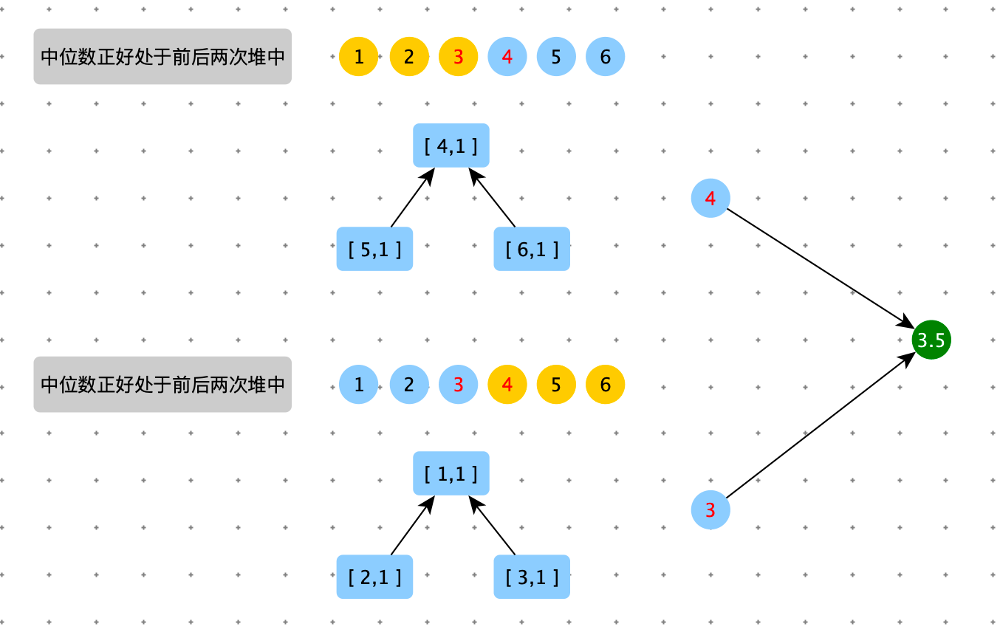

资源限制类题目


大数据题目的解题技巧

1. 哈希函数可以把数据按照种类均匀分流（通用方法）
2. 布隆过滤器用于集合的建立和查询，并可以节省大量的空间。
3. 一致性哈希解决数据服务器的负载管理问题。
4. 利用差并集结构做岛问题的并行计算。
5. 位图解决某一个范围上数字的出现情况，并可以节省大量空间。
6. 利用分段统计思维，进一步节省大量空间。
7. 利用堆、外排序来做多个处理单元的结果合并。


> 有一个包含 100 亿个 URL 的大文件，假设每个 URL 占用 64 B，请找出其中所有重复的 URL。


**方案一：hash 函数分流**

1. 利用 hash 函数将大文件均匀分成小文件
2. 每个小文件的全部数据加载内存，找出有重复数据的 URL
3. 将每个小文件的重复数据，归并到一个文件中。

```java
import java.io.BufferedWriter;
import java.io.IOException;
import java.nio.file.Files;
import java.nio.file.Path;
import java.nio.file.Paths;
import java.util.*;
import java.util.stream.Collectors;
import java.util.stream.Stream;

public class FindRepeatedUrl {
    private List<Path> splitFile(String dataFileName, int count) {
        BufferedWriter[] writers = null;
        List<Path> smallFileNames = new ArrayList<>(count);
        try {
            writers = new BufferedWriter[count];
            for (int i = 0; i < count; i++) {
                Path path = Paths.get(dataFileName + "_" + i);
                writers[i] = Files.newBufferedWriter(path);
                smallFileNames.add(path);
            }
        } catch (Exception e) {
            e.printStackTrace();
        }

        try (Stream<String> stream = Files.lines(Paths.get(dataFileName))) {
            for (String line : stream.collect(Collectors.toList())) {
                int index = line.hashCode() % count;
                writers[index].write(line + "\n");
            }
        } catch (IOException e) {
            e.printStackTrace();
        } finally {
            try {
                for (int i = 0; i < count; i++) {
                    writers[i].flush();
                    writers[i].close();
                }
            } catch (Exception e) {
                e.printStackTrace();
            }
            return smallFileNames;
        }
    }

    public Set<String> findRepeatedUrl(Path path) {
        try (Stream<String> stream = Files.lines(path)) {
            Map<String, Long> collect = stream.collect(Collectors.groupingBy(x -> x, Collectors.counting()));
            return collect.entrySet().stream().filter(x -> x.getValue() > 1).map(x -> x.getKey()).collect(Collectors.toSet());
        } catch (IOException e) {
            e.printStackTrace();
        }
        return new HashSet<>();
    }

    public void findRepeatedUrl(String dataFileName, int fileSize) {
        if (fileSize <= 0) {
            return;
        }
        long fileLineCount = getFileLineCount(dataFileName);
        Long count = fileLineCount % fileSize == 0 ? fileLineCount / fileSize : fileLineCount / fileSize + 1;

        List<Path> pathList = splitFile(dataFileName, count.intValue());
        BufferedWriter resultPath = null;

        try {
            resultPath = Files.newBufferedWriter(Paths.get(dataFileName + "_repeated_url"));
            for (Path path : pathList) {
                Set<String> repeatedUrl = findRepeatedUrl(path);
                for (String url : repeatedUrl) {
                    resultPath.write(url + "\n");
                }
            }
        } catch (Exception e) {
            e.printStackTrace();
        } finally {
            try {
                resultPath.flush();
                resultPath.close();
            } catch (IOException e) {
                e.printStackTrace();
            }
        }
    }

    private long getFileLineCount(String dataFileName) {
        try {
            return Files.lines(Paths.get(dataFileName)).count();
        } catch (IOException e) {
            e.printStackTrace();
        }
        return 0;
    }

    public static void main(String[] args) {
        FindRepeatedUrl findRepeatedUrl = new FindRepeatedUrl();
        findRepeatedUrl.findRepeatedUrl("/Users/dongyf/Desktop/word_a", 100);
    }
}
```


**方案二：使用布隆过滤器**


> 【补充】
>
> 某搜索公司一天的用户搜索词汇是海量的（百亿数据量），请设计一种算法，求出每天热门 Top 100 词汇的可行办法。


**方案一：hash 函数分流**


1. 利用 hash 函数将大文件均匀分成小文件
2. 在每个小文件中使用 HashMap 统计词频，排序，生成小文件的 Top 100 
3. 多路归并成最终的结果


> 32 位无符号整数的范围 0 ~ 4294967295，现在有 40 亿个无符号整数，可以使用最多 1 GB 的内存，找出所有出现了两次的数。


**方案一：hash 函数分流**


**方案一：位图**

由于位图只能表示一个数是否出现过。怎么表示一个数出现两次呢？

可以使用两个表示一个数出现的次数：

- 00 表示出现 0 次
- 01 表示出现 1 次
- 10 表示出现 2 次
- 11 表示出现大于 2 次


> 【补充】
>
> 可以使用最多 10 KB 的内存，怎么找到这 40 亿个整数的中位数？


**方案一：范围统计**

内存： 10 KB     		数的范围：0 ~ $2^{32} -1$       		数据量：40 亿


unsign int []  的长度：$\frac{10KB}{4K}=2500 \approx 2^{11}$

将 0 ~ $2^{32} -1$       划分2048 个桶，遍历 40亿个数，看看每个树落入到哪个桶里，对应的桶++ (统计落入的个数)。

遍历每个桶求和（sum），看看中位数对应的下标落入哪个桶：K

将桶 K 代表的数据范围再划分 2048 个桶，再来一遍，中位数 = 中位数 - sum。


**方案二：多次 Top K**


有一种特殊情况：




```python
import heapq
import sys

def process(nums, y, heap_size):
    num_freq_map = {}

    heap = []
    for num in nums:
        if num >= y: continue

        if num in num_freq_map:
            num_freq_map[num] += 1
            continue

        if len(heap) < heap_size:
            heapq.heappush(heap, num)
            num_freq_map[num] = num_freq_map.get(num, 0) + 1
            continue

        if num > heap[0]:
            data = heapq.heapreplace(heap, num)
            num_freq_map.pop(data)
            num_freq_map[num] = 1

    return (num_freq_map, heap)

def get_median(nums, heap_size):
    if not nums: return 0
    n = len(nums)

    index = int(n / 2)
    y = sys.maxsize
    num_total = 0
    while True:
        num_freq_map, heap = process(nums, y, heap_size)
        y = heap[0]
        num_total += sum(num_freq_map.values())
        if n - num_total <= index:
            break

    t = index - (n - num_total)
    if t == 0:
        if n % 2 != 0:
            return heap[0]
        else:
            one = heap[0]
            num_freq_map, heap = process(nums, y, heap_size)
            two = 0
            while heap:
                two = heapq.heappop(heap)
            return (one + two) / 2

    tmp = []
    while heap:
        num = heapq.heappop(heap)
        tmp += [num] * num_freq_map[num]

    if n % 2 != 0:
        return tmp[t]
    else:
        return (tmp[t] + tmp[t - 1]) / 2

def get_median2(nums):
    if not nums: return 0
    nums.sort()
    n = len(nums)
    index = n >> 1
    if n % 2 == 0:
        return (nums[index] + nums[index - 1]) / 2
    return nums[index]

# 对数器
import random
def random_array_generator(max_size, max_value):
    size = int(random.random() * max_size)
    return [int(random.random() * max_value) - int(random.random() * max_value) for _ in range(size)]

def check():
    n = 5000
    max_size = 100
    max_value = 100

    for i in range(n):
        array = []
        try:
            array = random_array_generator(max_size, max_value)
            expect = get_median2(array)
            actual = get_median(array, 3)
            if expect != actual:
                print("ERROR", "expect:", expect, "actual", actual, array)
        except Exception as err:
            print("ERROR", array, err)
    print("OVER!")

check()
```


上边代码中：下边代码可以优化。

```python
    tmp = []
    while heap:
        num = heapq.heappop(heap)
        tmp += [num] * num_freq_map[num]

    if n % 2 != 0:
        return tmp[t]
    else:
        return (tmp[t] + tmp[t - 1]) / 2
      
  
  
def get_median_heap(heap, nums_freq, t, n):
    sum_value = 0
    last_num = None

    while heap:
        num = heapq.heappop(heap)
        sum_value += nums_freq[num]
        if sum_value > t:
            break
        last_num = num

    if last_num == None or n % 2 != 0: return num

    if sum_value - nums_freq[num] == t:
        return (num + last_num) / 2

    return num
```


如果 n 为奇数，只需要查找一个数据 t 的位置，如果前缀和 prefix_sum > t ，所在 num 就是中位数。


如果 n 为偶数，要查找 t 和 t - 1 的位置，t 的位置，用上边的方法寻找。然后根据 t 计算出 t - 1。

t -1 有以下两种情况

1. t 位置在一个数据块的最左边，那么 t - 1 一定位于上一个数据块（需要一个变量保存上一个数据块的数据）


2. t 位置不在一个数据块的最左边，那么 t - 1 就等于 t。


注意：这种情况与第一种情况相同。


