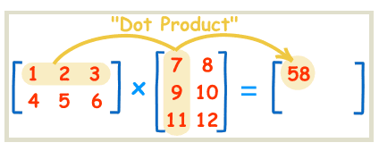

[TOC]

# 斐波那契数列系列问题

## 题目一

> 给定整数 N，返回斐波那契数列的 第 N 项。

时间复杂度

- $O(N^2)$

```python

def get_n(n):
    if n < 1: return 0
    if n < 3: return 1
    return get_n(n - 1) + get_n(n - 2)
```


时间复杂度

- $O(N)$

```python
# O(N)
def get_n2(n):
    if n < 1: return 0
    if n < 3: return 1

    num1 = 1
    num2 = 1
    res = 0
    for i in range(2, n):
        res = num1 + num2
        num1 = num2
        num2 = res
    return res
  
# 代码优化
def get_n2(n):
    if n < 1: return 0
    if n < 3: return 1

    num1 = num2 = 1
    for i in range(2, n):
        num2, num1 = num1 + num2, num2
    return num2
```


思路：

<font color=red>如果递归式严格符合：$ F(n)=a*F(n-1)+b*F(n-2)+...+k*F(n-i)$ ，那么它就是一个 i 阶的递推式，必然有与 i x i 的状态矩阵有关的矩阵乘法的表达式。一律可以用加速矩阵乘法的动态规划将时间复杂度降为$O(logN)$ </font>

斐波那契数列是严格符合：$F(n)=F(n-1)+F(n-2)$ 的二阶递推数列，一定可以用 2x2 矩阵乘法表示

$(F(n),F(n-1))=(F(n-1),F(n-2))*\begin{bmatrix} a & b \\ c & d  \end{bmatrix}$

已知：F(1) = 1，F(2) = 1，F(3) = 2，F(4) = 3 带入上式

$[2,1]=[1,1]* \begin{bmatrix}a & b\\c & d\end{bmatrix} \Longrightarrow \begin{cases} a+c=2 \\b+d=1 \end{cases} $

$[3,2]=[2,1]*\begin{bmatrix}a & b\\c & d\end{bmatrix} \Longrightarrow \begin{cases} 2a+c=3 \\2b+d=2 \end{cases}$


$\begin{cases} a+c=2 \\ b+d=1 \\ 2a+c=3 \\ 2b+d=2 \end{cases}$

得

$\begin{cases} a=1 \\ b = 1 \\ c=1 \\ d=0 \end{cases}$

求矩阵后，当 n > 2 时，原来的公式可简化为：

$[F(3),F(2)]=[F(2),F(1)]* \begin{bmatrix}  1 & 1 \\ 1 & 0 \end{bmatrix}==[1,1]* \begin{bmatrix}  1 & 1 \\ 1 & 0 \end{bmatrix}$

$[F(4),F(3)]=[F(3),F(2)]* \begin{bmatrix}  1 & 1 \\ 1 & 0 \end{bmatrix}==[1,1]* \begin{bmatrix}  1 & 1 \\ 1 & 0 \end{bmatrix} ^2$

$[F(n),F(n-1)]=[F(n-1),F(n-2)]* \begin{bmatrix}  1 & 1 \\ 1 & 0 \end{bmatrix}==[1,1]* \begin{bmatrix}  1 & 1 \\ 1 & 0 \end{bmatrix} ^{n-2}$

将求斐波那契数列第 N 项问题<font color=red>转变</font> 为如何用最快的方法求一个矩阵的 N 次方的问题。

求矩阵的 N 次的问题能够在 <font color=red>$O(logN)$</font> 时间内解决。

**知识点：矩阵乘法**



$\C(i,j)=\sum^k_{k=1}A(i,k)B((k,j))$


我们先看一下一个整数 N 次方的例子，矩阵的N 次方和整数的 N 次方是同理的，区别是矩阵乘法和整数乘法在细节上有些不一样，但对于怎么乘更快，两者的道理相同。


假设一个整数是 10 ，如果最快地求解 10 的 75 次方。

1. 75 的二进制形式为 1001011
2. 10 的 75 次方 $=10^{64}*10^8*10^2*10^1$ 
   1. 这个过程中，先求 $10^1$ ，根据 $10^1$ 求$10^2$； $10^2 \rightarrow 10^4$；$10^4 \rightarrow 10^8$；...$10^{32} \rightarrow 10^{64}$，
   2. 75 的二进制形式总共有几位，我们就使用了几次乘法
   3. 75 的二进制形式位是 1 的，64，8，2，1 ；累成到最终结果中。

对矩阵同理


时间复杂度

- $O(logN)$

```python
# 矩阵乘积
def product_matrix(M, N):
    m_row = len(M)
    n_col = len(N[0])
    res = [[0] * (n_col) for _ in range(m_row)]

    for k in range(m_row):
        for i in range(n_col):
            for j in range(m_row):
                res[k][i] += M[k][j] * N[j][i]
    return res

# 矩阵次方
def pow_matrix(M, n):
    res = [[0] * (len(M[0])) for _ in range(len(M))]
    for i in range(min(len(M[0]), len(M))):
        res[i][i] = 1
    p = n
    tmp = M
    while p != 0:
        if p & 1 != 0:
            res = product_matrix(res, tmp)
        tmp = product_matrix(tmp, tmp)
        p >>= 1
    return res


def get_n3(n):
    if n < 1: return 0
    if n < 3: return 1
    base = [[1, 1], [1, 0]]
    res = pow_matrix(base, n - 2)
    return sum(res[0])
  
  
# 代码优化
import numpy as np

def power_matrix2(M, n):
    res = np.identity(len(M))
    p = n
    tmp = M
    while p != 0:
        if p & 1 != 0:
            res = np.dot(res, tmp)
        tmp = np.dot(tmp, tmp)
        p >>= 1
    return res
```


# 跳台阶

**题目** 

> 给定整数 N ，代表台阶数，一次可以跨 2 个或者 1 个台阶，返回有多少种走法。


**举例**

> N = 3时，
>
> 1. 三次都跨 1 个台阶
> 2. 先跨 2 个台阶，再跨 1 个台阶
> 3. 先跨 1 个台阶，再跨 2 个台阶
>
> 所以有3 中走法，返回 3


**分析**

1. 如果 N =1 时，方法只有 1 中。
2. 如果 N =2 时，方法只有 2 中。
3. 如果 N = N 时，最后跳上第 N 级台阶，要么是从第 N - 1 级，要么是从第 N - 2 级，

所以 S(N) = S(N-1) + S(N) ，初始项 S(1) = 1 ，S(2) = 2。

<font color=green>跳台阶类似斐波那契数列，唯一的不同是初始项不同。</font>


```python
# O(N^2)
def get_n(n):
    if n < 1: return 0
    if n < 4: return n
    return get_n(n - 1) + get_n(n - 2)

# O(N)
def get_n2(n):
    if n < 1: return 0
    if n < 4: return n
    num1 = 1
    num2 = 2
    for i in range(2, n):
        num2, num1 = num1 + num2, num2
    return num2

# O(log N)
import numpy as np
def power_matrix2(M, n):
    res = np.identity(len(M))
    p = n
    tmp = M
    while p != 0:
        if p & 1 != 0:
            res = np.dot(res, tmp)
        tmp = np.dot(tmp, tmp)
        p >>= 1
    return res

def get_n3(n):
    if n < 1: return 0
    if n < 4: return n
    base = [[1, 1], [1, 0]]
    res = power_matrix2(base, n - 2)
    # [2,1] * res
    return 2 * res[0][0] + res[1][0]

# 对数器  
for i in range(3, 10):
    print("expect", get_n(i))
    print("actual", get_n2(i))
    print("actual", get_n3(i))
```

S(1) = 1；S(2) = 2；S(3) = 3；S(4) = 5

$[S(3),S(2)]=[S(2),S(1)]* \begin{bmatrix}a & b\\c & d\end{bmatrix} \Longrightarrow \begin{cases} 2a+c=3 \\2b+d=2 \end{cases} $

$[S(4),S(3)]=[S(3),S(2)]* \begin{bmatrix}a & b\\c & d\end{bmatrix} \Longrightarrow \begin{cases} 3a+2c=5 \\3b+2d=3 \end{cases} $

求得矩阵

$\begin{cases} a=1 \\ b = 1 \\ c=1 \\ d=0 \end{cases}$


$\begin{bmatrix}  1 & 1 \\ 1 & 0 \end{bmatrix}$


# 牛数量

**题目** 

> 假设农场中成熟的母牛，每年只会生 1 头小母牛，并且永远不会死。第一年农场有 1 只成熟的母牛，从第二年开始，母牛开始生小母牛。每只小母牛 3 年之后成熟又可以生小母牛。给定整数 N，求出 N 年后牛的数量。

