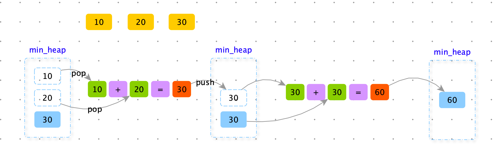
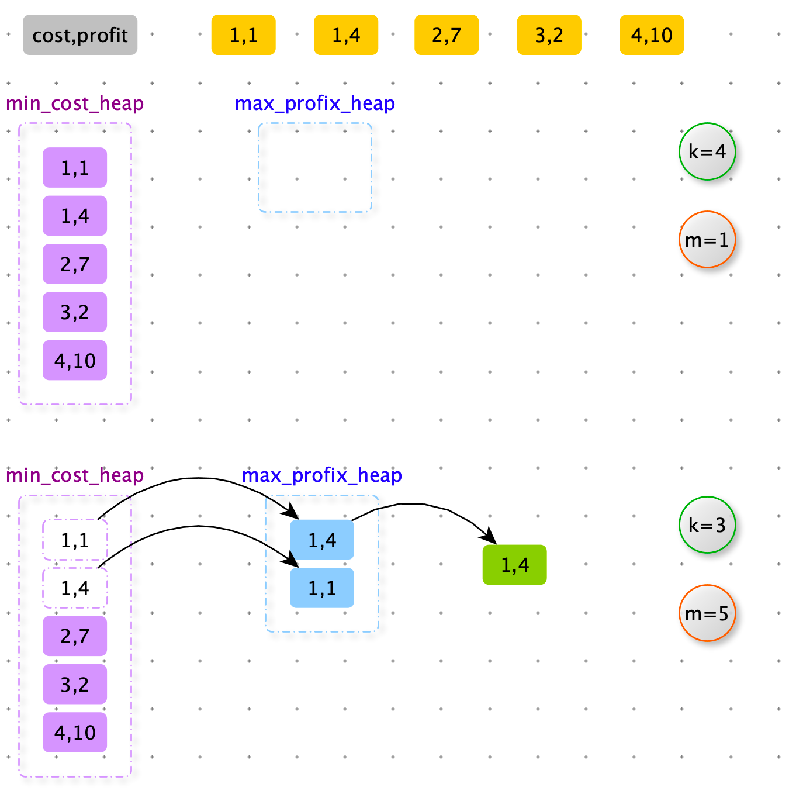
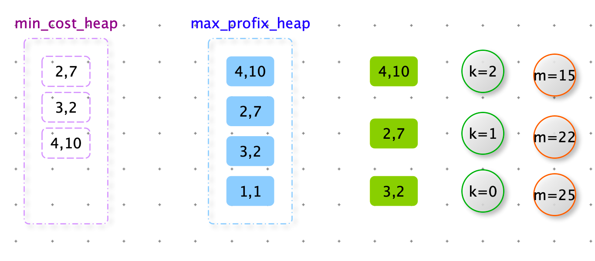

<font color=red>**贪心算法在笔试时的解题套路**</font>

1. <font color=red>实现一个不依靠贪心策略的解法 X，可以用暴力的尝试</font>
2. <font color=red>脑补出贪心策略 A，贪心策略B，贪心策略C...</font>
3. <font color=red>用解法 X 和对数器，去验证每一个贪心策略，用实验的方式得知哪个贪心策略正确</font>
4. <font color=red>不要去纠结贪心策略的证明</font>


> 给一个数组，将数组中字符串拼接起来，字典序最小的字符串是什么？

将一个字符串想想成一个数字，abc < bac 。比较从高位比较每一位字典序的大小。

如果字符串不一样长，字符串 b 和 apple 字典序：apple < b。那么先用 0 补成一样长。

apple < b0000


猜测贪心策略：将数组按照字典序排序（升序），依次结合这些字符串。

数组【“ba”、“b”】 排序后【“b”、“ba”】 ，res = “bba”  但是 “bab” 的字典序更小，所以此策略有问题。


猜测贪心策略：如果 a * b < b * a （字典序）那么就用 a * b 否则就 b * a

```python
from functools import cmp_to_key

def lowest_lexicography(strs):
    strs.sort(key=cmp_to_key(lambda x, y: 1 if x + y >= y + x else -1))
    return "".join(strs)

def lowest_lexicography2(strs):
    return permute(strs)
  
def permute(nums):
    if not nums: return ""
    # 栈：好回溯
    path = []
    # 在一条路径上，节点是否访问过。
    used = [False] * len(nums)
    res = "".join(nums)
    return dfs(nums, len(nums), 0, path, used, res)

def dfs(nums, length, depth, path, used, res):
    # 遍历到根节点
    if depth == length:
        # 数据拷贝，后续遍历会修改path 中的值
        # res.append(path[::])
        return min(res, "".join(path))

    # 所有节点都需要作为开头
    for i in range(length):
        if used[i]: continue
        path.append(nums[i])
        used[i] = True
        res = min(dfs(nums, length, depth + 1, path, used, res), res)
        # 回到 dfs 上一层，状态恢复
        path.pop()
        used[i] = False
    return res

import random
def random_array_generator(max_size, max_value):
    ascii_case = "abcdefghijklmnopqrstuvwxyz"
    return ["".join(random.sample(ascii_case, int(1 + random.random() * max_value))) for _ in
            range(int(random.random() * max_size))]

def check():
    n = 100
    max_value = 5
    max_size = 10

    for _ in range(n):
        strs = random_array_generator(max_size, max_value)
        strs3 = strs[:]
        strs2 = strs[:]

        actual = lowest_lexicography(strs3)
        expect = lowest_lexicography2(strs2)
        if actual != expect:
            print("error:", strs3, strs2, strs, "actual:", actual, "expect:", expect)
    print("Game Over!")

check()
```


> 一块金条切成两半，是需要花费和长度数值一样的铜板的。比如长度为 20 的金条，不管切成长度多大的两半，都要花费 20 个铜板。
>
> 一群人想整分整块金条，怎么划分最省铜板？
>
> 【例如】给定数组【10,	20,	30】，代表这一共三个人，整块金条长度为 10 + 20 + 30 = 60。金条要分成10，20，30 三个部分。如果先把长度 60 的金条分成 10 和 50，花费 60，再把 50 的金条分成 20 和 30，花费 50；一共花费 110 铜板。但是如果先把金条分成 30 和 30，花费 60；再把长度 30 金条分成 10 和 20，花费 30；一共花费 90 铜板。
>
> 输入一个数组，返回划分的最小代价。


1. 将给定数组，依次 push 到小根堆
2. 从小根堆中每次pop 出两个数据，求和后，在 push 到小根堆中。
3. 重复上边直到小根堆中数据少于 2



```python
import heapq

def get_min_cost(nums):
    if not nums and len(nums) < 3: return nums
    heap = []
    for num in nums:
        heapq.heappush(heap, num)

    res = 0
    while len(heap)>1:
        num = heapq.heappop(heap) +heapq.heappop(heap)
        res += num
        heapq.heappush(heap, num)

    return res

print(get_min_cost([10, 20, 30]))
```


> 输入：正数数组 costs，正数数组 profits，正数 k，正数 m。
>
> - costs[i]  表示 i 号项目的花费。
> - profits[i] 表示 i 号项目在扣除花费之后还能挣到的钱（利润）。  
> - k 表示你只能串行的最多做 k 个项目
> - m 表示你初始的资金
>
> 说明：你没做完一个项目，马上获得的收益，可以支持你去做下一个项目。
>
> 输出：你最后获得的最大钱数。


1. 用两个堆，一个小根堆（根据 cost 排序），一个大根堆（根据 profix），大根堆中数据都是可以做的项目。
2. 将所有任务初始化到小根堆中
3. 根据现有资金，从小根堆中选择有能力做的项目(cost < m)，放入大根堆中
4. 从大根堆中pop 出一个利益最大的任务来做
5. 做完后，m 更新，k 更新。







```python
def get_max_capital(costs, profits, k, m):
    min_cost_heap = []
    max_profit_heap = []

    # 所有项扔到被锁池中，花费组织的小根堆
    for i in range(len(costs)):
        heapq.heappush(min_cost_heap, (costs[i], profits[i]))

    # 进行 k 轮
    for _ in range(k):
        # 能力所及的项目，全解锁
        while min_cost_heap and min_cost_heap[0][0] <= m:
            cost, profit = heapq.heappop(min_cost_heap)
            heapq.heappush(max_profit_heap, (-profit, cost))

        if not max_profit_heap:
            return m

        profit, cost = heapq.heappop(max_profit_heap)
        m -= profit

    return m
  
print(get_max_capital([1, 1, 2, 2, 3, 4], [1, 4, 3, 7, 2, 10], 4, 1))
```


上边方案中小根堆，从建堆，到中间每次维护，时间复杂度O(n log n)，还不如直接对数组按照根据 cost 排序，后边遍历即可。

```python
def get_max_capital2(costs, profits, k, m):
    min_cost_heap = sorted(zip(costs, profits))
    max_profit_heap = []

    i = 0
    for _ in range(k):

        while i < len(costs) and min_cost_heap[i][0] <= m:
            cost, profit = min_cost_heap[i]
            heapq.heappush(max_profit_heap, (-profit, cost))
            i += 1

        if not max_profit_heap:
            return m

        profit, cost = heapq.heappop(max_profit_heap)
        m -= profit

    return m
```


