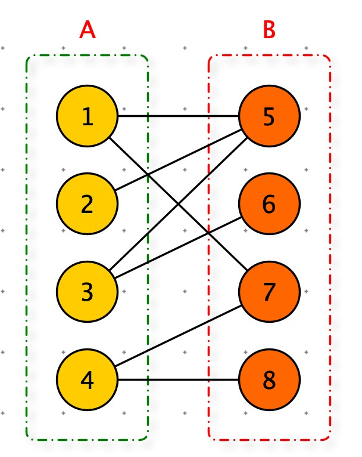
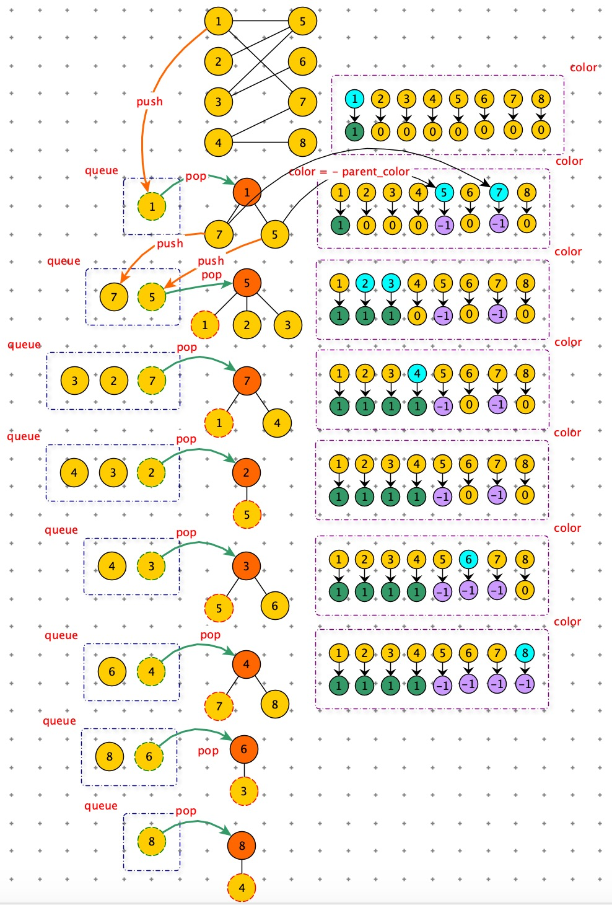

[TOC]


# 二部图



二分图(二部图)的定义

1. G = ( V , E ) 是一个<font color=red>无向图</font>
2. 顶点 V 可以分割为两个互不相交的子集（A , B）
3. 每条边（i，j）所关联顶点 i 和 j 分别属于两个不同顶点集（i in A , j in B）


# 判别二部图

## 染色法

<font color=red>使用黑白两中颜色，将所有结点都染上颜色，所有相邻的两个节点，颜色不同。</font>

染色法可以使用 dfs 和 bfs 两种方式实现。将 dfs 和 bfs 中 seen 数组，替换为节点的颜色，-1 表示黑色，0 表示没有染色，1 表示白色。


### 染色法 BFS 实现



```python
def BFS(graph, s):
    queue = []
    # 队列中节点都是染过色的。
    queue.append(s)
    # 初始化：color ：0 未染色(未访问)
    color_map = dict([(key, 0) for key in graph.keys()])
    color_map[s] = 1
    while queue:
        vertex = queue.pop(0)
        nodes = graph[vertex]
        for w in nodes:
          	# color_map[w] == 0 未染色
            if color_map[w] == 0:
                color_map[w] = -color_map[vertex]
                queue.append(w)
            else:
              	# 已染色与父节点颜色相同
                if color_map[w] == color_map[vertex]:
                    return False
    return True

graph1 = {
    "A": ["B", "C"],
    "B": ["A", "C", "D"],
    "C": ["A", "B", "D", "E"],
    "D": ["B", "C", "E", "F"],
    "E": ["C", "D"],
    "F": ["D"]
}

graph = {
    "1": ["5", "7"],
    "2": ["5"],
    "3": ["5", "6"],
    "4": ["7", "8"],
    "5": ["1", "2", "3"],
    "6": ["3"],
    "7": ["1", "4"],
    "8": ["4"],
}
```


### 染色法 DFS 实现

与BFS 思想类似：将队列改为栈即可

```python
def DFS(graph, s):
    stack = []
    stack.append(s)
    color_map = dict([(key, 0) for key in graph.keys()])
    color_map[s] = 1
    while stack:
        vertex = stack.pop()
        nodes = graph[vertex]
        for w in nodes:
            if color_map[w] == 0:
                stack.append(w)
                color_map[w] = -color_map[vertex]
            else:
                if color_map[w] == color_map[vertex]: return False
    return True


print(DFS(graph, "1"))
print(DFS(graph1, "A"))
```


# 最大匹配

