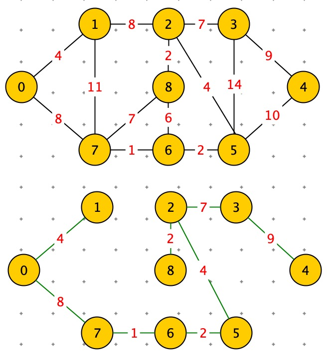
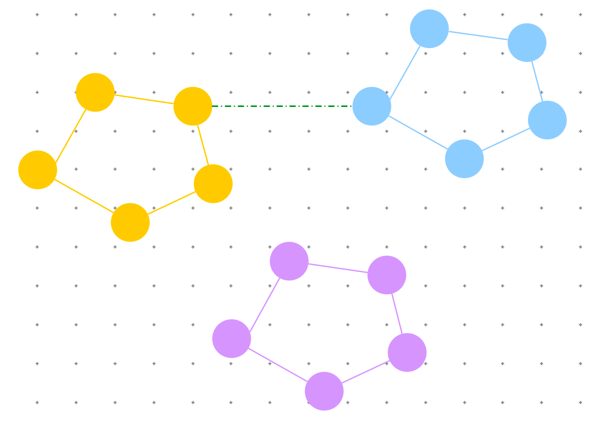
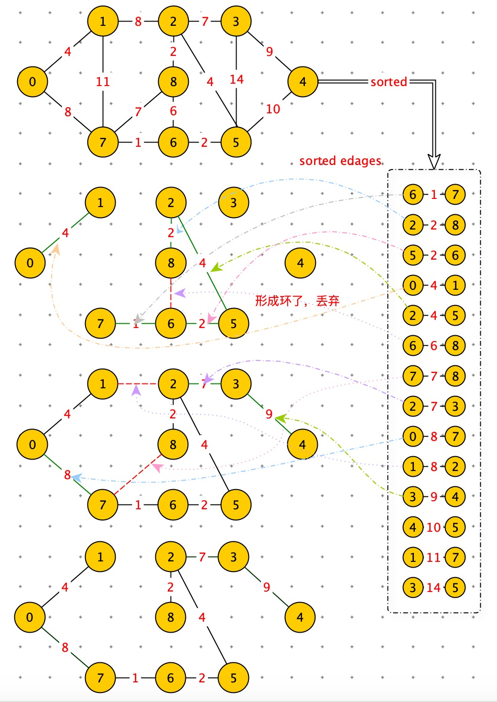
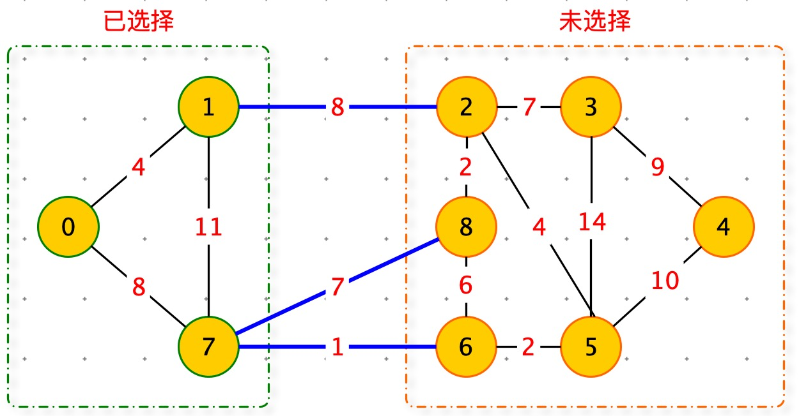
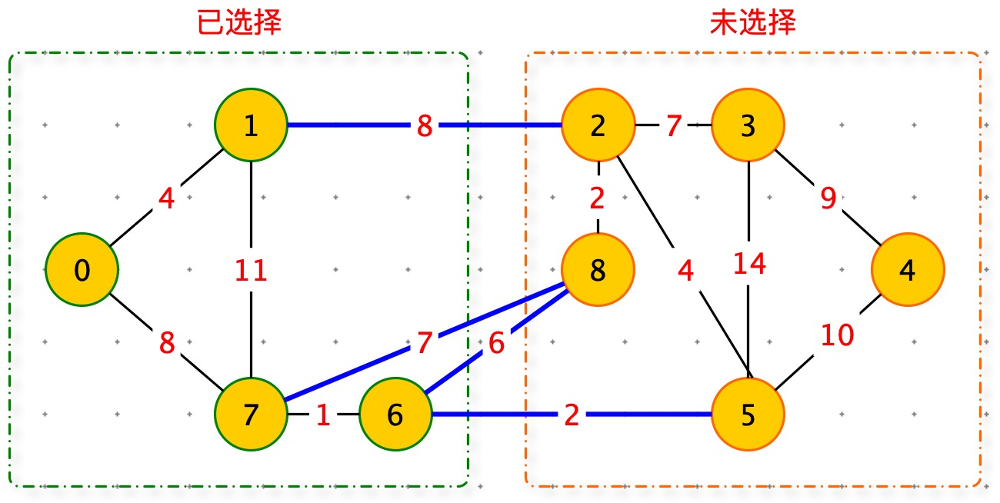

[TOC]

# 问题

顶点是城市，边是光缆，权重是铺光缆的成本。按照最小生成树的方式铺设光缆。既保证了每两个城市之间都铺设光缆，成本也是最低的。

# 最小生成树


<font color=orange>Kruskal 和 Prim 算法都必须在无向图上。</font>


最小生成树（<font color=red>Minimum</font> spaming <font color=red>Tree</font>）

最小生成树定义：

1. Without any cycle( 结构中不能有环 )
2. Connect all the vertices( 必须连接所有顶点 )
3. N vertices , N - 1 Edges

Minimum:

1. 权值和最小。




最小生成树常用的两个算法

- Kruskal ( 克鲁斯卡尔 )
- Prim （普里姆）

这两三算法都是：贪心算法：每次选择权值最小的边。两个算法选择方式不同。

## Kruskal 

从边出发，来解决最小生成树的问题。

由于本算法是从权重最小的边开始使用，边的使用是随机，跳跃的，在过程中会出现连成一片图与另一个连城一片的图尝试连接，因此需要使用差并集去判断两个集合是否是同一个。prime 算法是从一个节点，逐渐扩展到全图，因此不存在两个小图连接的情况，因此不需要使用差并集。





步骤：

1. 将图中所有边，排序：sorted_edages（升序）
2. 遍历：sorted_edages，将边回填到图中。
3. 判断是否有环，如果有环，丢弃回填的边。
4. 直到回填边数 == vertices_count - 1




代码：

```python
# 差并集：判断图中是否有环
class FindUnionSet:
    def __init__(self, vertices_count):
        self.n = vertices_count
        self.parent = [None] * vertices_count

    def find_root(self, x):
        x_root = x
        while self.parent[x_root]:
            x_root = self.parent[x_root]
        return x_root

    def union(self, x, y):
        x_root = self.find_root(x)
        y_root = self.find_root(y)
        if x_root == y_root:
            return False
        else:
            self.parent[x_root] = y_root
            return True
          
     def same(self,x,y):
      return self.find(x) == self.find(y)

def kruskal(vertices_count, edges):
    n = vertices_count
    sorted_edges = sorted(edges)
    result = []
    find_union_set = FindUnionSet(vertices_count)
    for i in range(len(edges)):
        edge = sorted_edges[i]
        # 如果无环
        if not find_union_set.same(edge[1], edge[2]):
            result.append(edge)
            union_find.union(edge[1], edge[2])
            
        if len(result) == n - 1: break
    return result

# (weight,vertice1,vertice2)
edges = [(4, 0, 1), (8, 0, 7), (11, 1, 7), (8, 1, 2), (7, 2, 3), (4, 2, 5), (2, 2, 8)
    , (9, 3, 4), (14, 3, 5), (10, 4, 5), (2, 5, 6), (1, 6, 7), (6, 6, 8), (7, 7, 8)]

print(kruskal(9, edges))
```


使用标准图结构

```python
from graph.my_graph import Graph
from graph.my_graph import create_graph
from graph.UnionFind import UnionFind

import heapq

def kruskal(graph: Graph):
    union_find = UnionFind(graph.nodes.values())

    priority_queue = []
    for edge in graph.edges:
        heapq.heappush(priority_queue, edge)

    result = set()
    while priority_queue:
        edge = heapq.heappop(priority_queue)
        # 判断是否有环：from_node 和 to_node 是否在一个集合里
        if not union_find.same(edge.from_node, edge.to_node):
            result.add(edge)
            union_find.union(edge.from_node, edge.to_node)

    return result
  
# (from, to, weight)
matrix = [(0, 1, 4),
          (0, 7, 8),
          (1, 7, 11),
          (1, 2, 8),
          (2, 3, 7),
          (2, 5, 4),
          (2, 8, 2),
          (3, 4, 9),
          (3, 5, 14),
          (4, 5, 10),
          (5, 6, 2),
          (6, 7, 1),
          (6, 8, 6),
          (7, 8, 7)]

graph = create_graph(matrix)

for edge in kruskal(graph):
    print(edge.from_node.value, edge.to_node.value, edge.weight)
```


## Prim 



1. 通过 select 数组，将图中的结点，划分为已访问过和未访问过两部分。
2. 访问权重最小蓝色边对应的结点，将其纳入已访问过边。



<font color=red>注意：使用优先级队列来选择支持结点</font>


```python
import heapq

def prim(graph, start=0):
    selected = [False] * len(graph)
    min_tree = []

    edges = graph[start]
    heapq.heapify(edges)
    selected[start] = True
    while edges:
        w, v1, v2 = heapq.heappop(edges)
        if selected[v2]: continue
        selected[v2] = True
        min_tree.append((w, v1, v2))

        for next_edge in graph[v2]:
            if selected[next_edge[2]]: continue
            heapq.heappush(edges, next_edge)

    return min_tree
  
graph = [[(4, 0, 1), (8, 0, 7)],
         [(4, 1, 0), (11, 1, 7), (8, 1, 2)],
         [(8, 2, 1), (2, 2, 8), (4, 2, 5), (7, 2, 3)],
         [(7, 3, 2), (14, 3, 5), (9, 3, 4)],
         [(9, 4, 3), (10, 4, 5)],
         [(2, 5, 6), (4, 5, 2), (14, 5, 3), (10, 5, 4)],
         [(1, 6, 7), (6, 6, 8), (2, 6, 5)],
         [(8, 7, 0), (11, 7, 1), (7, 7, 8), (1, 7, 6)],
         [(7, 8, 7), (2, 8, 2), (6, 8, 6)]]
```

