[TOC]

# 背景

数组新增和删除时 O(n) ，不支持动态扩容，数组需要整块内存，对内存使用不友好。

所以开发了链表。


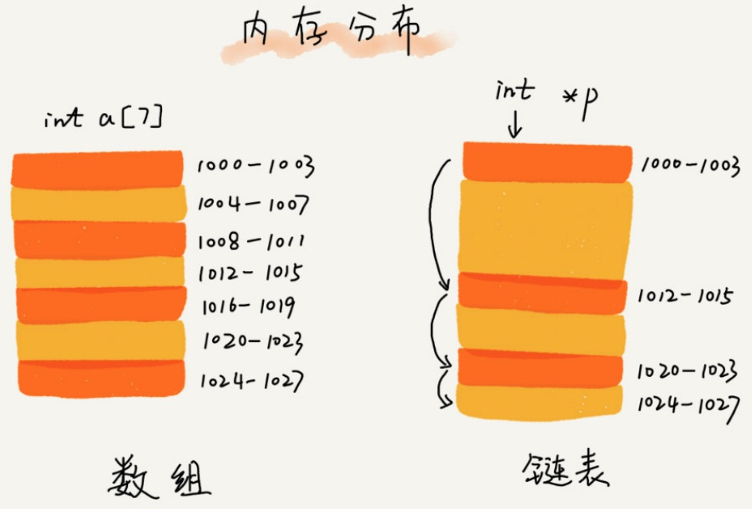

链表通过指针将一组==零散的内存块==串联起来。

常见链表：单链表，双向链表，循环链表。

# 单链表

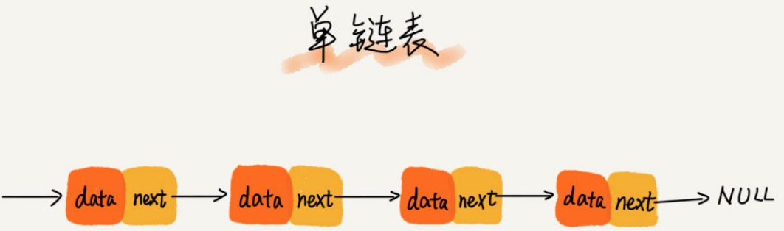

头结点：第一个节点

尾节点：最后一个节点。

```python
class ListNode(object):
    def __init__(self, x):
        self.val = x
        self.next = None

```

## 插入和删除

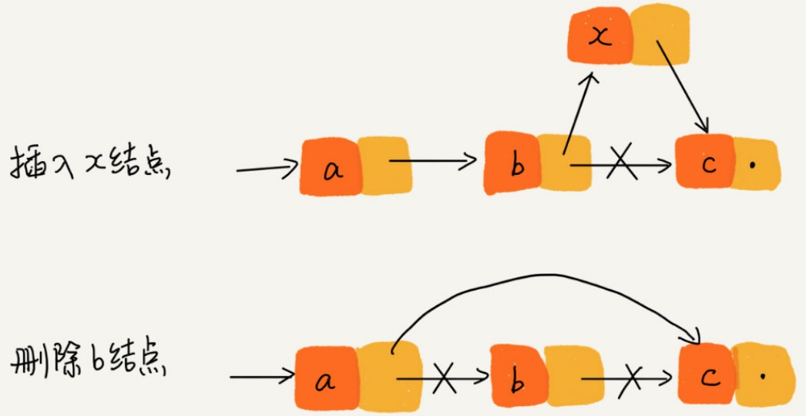

```python
'''
在 position 之后添加 x
'''
def insertNode(head, position, xNode):
    node = head
    while node:
        if node.val == position:
          	# node.val = b
            # x next 指向 c 节点
            xNode.next = node.next
            # b 节点 next 指向 x 节点
            node.next = xNode
            break
        node = node.next
    return head
  
'''
在 position 之前添加 x
'''
def insertNode2(head, position, xNode):
    dump = ListNode(None)
    dump.next = head
    node = dump

    while node and node.next:
        if node.next.val == position:
            xNode.next = node.next
            node.next = xNode
            break 
        node = node.next
    return dump.next

'''
 删除 x ，涉及到 x 的前驱节点，x 节点，x 的 next 节点。
 如果删除是第一个节点，需要特殊判断，通过 dump 避免这种判断。
 note.next 中 next 是 图中的箭头，不是一下节点。
''' 
def deleteNode(head, x):
    dump = ListNode(None)
    dump.next = head

    while dump and dump.next:
        if dump.next.val == x:
            dump.next = dump.next.next
            break
        dump = dump.next
	    return head
```


## 随机访问第 k 个元素

由于链式是非连续存储，不能通过寻址公式直接计算出对应的内存地址。所以需要从头节点遍历查找节点 k，时间复杂度为 ==O(n)==。

```python
def find(head,k):
  	node = head
    i = 0
    while node:
      	if i == k:
          return node
        i += 1
        node = node.next

def find(head, target):
    node = head
    while node:
        if node.val == target:
            return node
        node = node.next
    return
```


# 循环链表


循环链表是一种特殊的单链表。

优点：从链尾到链头比较方便。适合处理环形结构的数据。比如：[约瑟夫斯问题](https://zh.wikipedia.org/wiki/%E7%BA%A6%E7%91%9F%E5%A4%AB%E6%96%AF%E9%97%AE%E9%A2%98)


# 双向链表


优点：找前驱节点的时间复杂度是O(1)，在某些情况下，插入，删除等操作比单链表简单，高效。

缺点：占用更多的空间。

删除数据的场景：

场景一：删除节点中”值等于 x “ 的节点。

步骤：

1. 查找到 value == x 的节点：单链表和双向链表为O(n)
2. 删除节点：O(1)

场景二：删除给定指针的节点。

删除指定节点，需要先找到前驱节点。那么单链表需要遍历链表找到前驱节点O(n)，而双向链表O(1) 找到前驱接节点。

同理指定节点插入。


对于有序链表，双向链表更高效。因为，可以记录上次查找位置 p，每次查询时，根据要查找的值 与 p 的大小关系，决定是往前还是往后查找，所以平均只需要查找一半的数据。 


双向链表在实际软件开发中，使用更频繁，Java 中 LikedHashMap 就用到了双向链表。

==空间换时间==的设计思想。

```python
class Node(object):
    def __init__(self, val, prev, next):
        self.val = val
        self.prev = prev
        self.next = next
```


# 双向循环链表


# 链表 VS 数组性能

|            | 数组 | 链表 |
| ---------- | ---- | ---- |
| 插入，删除 | O(n) | O(1) |
| 随机访问   | O(1) | O(n) |

链表天然支持动态扩容。

数组是连续内存，可以借助 CPU 的缓存机制，预读数组中的数据。

链表在内存中不是连续存储，所以对 CPU 缓存不友好。

数组的缺点：大小固定，如果声明过大，系统可能没有足够的内存空间分配给它，导致”内存不足（out of memery）“，如果声明过小，频繁扩容，拷贝数据性能。

同样的数据，链表占用内存空间会翻倍，如果对链表频繁的插入，删除操作，还会导致频繁的内存申请和释放，容易造成内存碎片，java 语言，可能会导致频发 GC （Garbege Collection，垃圾回收）。

# 链表常用技巧

## 一、理解指针的含义

**将某个变量赋值给指针，实际上就是将这个变量的地址赋值给指针，或者反过来说，指针中存储了这个变量的内存地址，指向了这个变量的内存地址，指向了这个变量，通过指针就能找到这个变量。**

p.next  = q   :     p 节点中 next 指针存储了 q 节点的内存地址。

p.next = p.next.next  :  p 节点中 next 指针存储了 p 节点下下一个结点的内存地址（删除结点是常用）。


## 二、警惕指针丢失和内存泄漏


如插入节点：

错误代码：

```python
# p 指针指向 b
p.next = x   # 将 p 的 next 指针指向 x 结点(注意：测试 c 结点及其以后结点丢失了)
x.next = p.next # 将 x 的 next 指针 指向 c 结点(错误地认为)
```

正确代码：

```python
x.next = p.next
p.next = x
```

一个链表可以想象成一只放飞的风筝，在要剪短风筝线时，第一步确保断口前后，有手（指针）拉住限购线头，否则风筝就飞走了。


## 三、利用哨兵简化实现难度

例子1：在 p 结点后插入一个新结点：

```python
x.next = p.next
p.next = x
```

但是如果向一个空链表中插入第一个结点，p == null 了，p.next 报错。所以需要特殊处理：

```python
if not p:
  p = x
```

例子2：删除结点 p 之后的结点：

```python
p.next = p.next.next
```

但是如果 p 是最后一个结点，p.next == null。

```python
if not p.next:
  p = None
```

**链表的插入和删除操作，需要针对头结点和尾结点进行特殊处理。**

==引入哨兵元素：解决边界问题==。

有人将这种有哨兵结点的链表叫：**带头链表**。没有哨兵的链表叫作**不带头链表**。

```python
def deleteNode(head, x):
	  # 哨兵结点
    dump = ListNode(None)
    dump.next = head

    node = dump
    while node and node.next:
        if node.next.val == val:
            node.next = node.next.next
        else:
            node = node.next
    return dump.next
```


## 四、重点留意边界条件处理

- 链表为空
- 链表只有一个结点
- 链表只有两个结点
- 逻辑在头结点和尾结点，是否正常。


## 五、举例画图，辅助思考

画图使逻辑更加清晰：

例如：画出插入前和插入后的链表变化

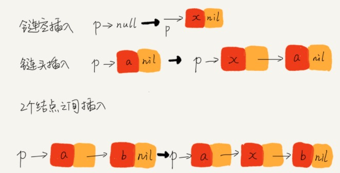	


# 六、多写多练

https://github.com/dongyifeng/leetcode/tree/master/linked_list


## 将单链表按某值划分成左边小、中间相等、右边大的形式

> 【题目】给定一个单链表的头节点 head，节点的值类型是整型，再给定一个整型 pivot。实现一个调整链表的函数，将链表调整为左边部分都小于 pivot 的节点，中间部分都是值等于 pivot 的节点，右边部分都是值大于 pivot 的节点。
>
> 
> 【进阶】在实现原问题功能的基础上增加如下的要求
>
> - 调整后所有小于 pivot 的节点之间的相对顺序和调整前一样
>- 调整后所有等于 pivot 的节点之间的相对顺序和调整前一样
> - 调整后所有大于 pivot 的节点之间的相对顺序和调整前一样
> - 时间复杂度请达到 O(N)，额外空间复杂度达到 O(1)


**机试**

使用一个额外的数组，进行 partition，然后将数组转为链表。
<font color=orange>注意：数组 partition 调整没有稳定性。</font>


```python
class ListNode:
    def __init__(self, val=0, next=None):
        self.val = val
        self.next = next

def linked_list_partition(head, pivot):
    if not head: return

  	# 生成数组
    nums = []
    node = head
    while node:
        nums.append(node.val)
        node = node.next
        
    partition(nums, pivot)

    # 数据覆盖
    node = head
    for num in nums:
        node.val = num
        node = node.next
    return head

# 对数组 nums，partition 根据 pivot 划分
def partition(nums, pivot):
    less = -1
    more = len(nums)

    i = 0
    while i < more:
        if nums[i] < pivot:
            less += 1
            swap(nums, less, i)
            i += 1
        elif nums[i] == pivot:
            i += 1
        else:
            more -= 1
            swap(nums, i, more)

def swap(nums, i, j):
    nums[i], nums[j] = nums[j], nums[i]

def print_linked_list(head):
    if not head: return
    nums = []
    node = head
    while node:
        nums.append(node.val)
        node = node.next
    print(nums)

head = ListNode(3)
head.next = ListNode(4)
head.next.next = ListNode(5)
head.next.next.next = ListNode(4)
head.next.next.next.next = ListNode(1)
head.next.next.next.next.next = ListNode(6)
head.next.next.next.next.next.next = ListNode(2)
head.next.next.next.next.next.next.next = ListNode(5)

node = linked_list_partition(head, 5)
print_linked_list(head)
```


**面试**

使用 6 个指针，管理 3 个链表，第一个链表小于 pivot ，第二个链表等于 pivot ，第二个链表大于 pivot 。
遍历链表将节点分到不同到链表中。最终将三个链表连接起来，就是最终结果。


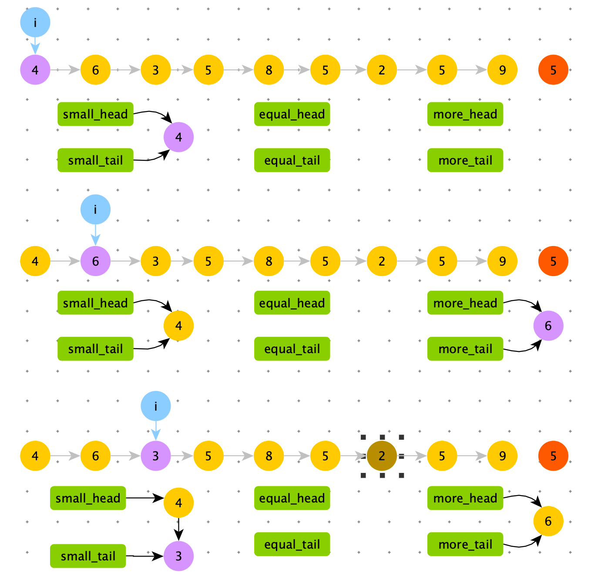

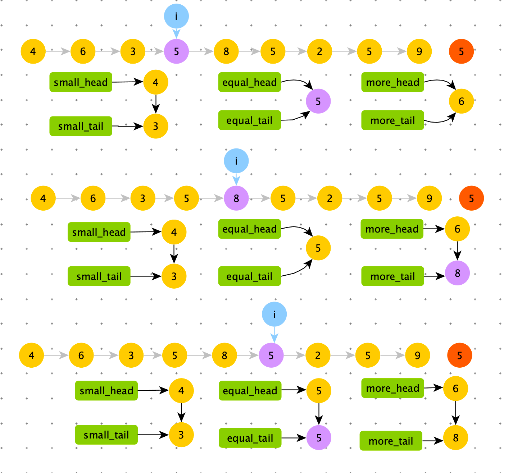

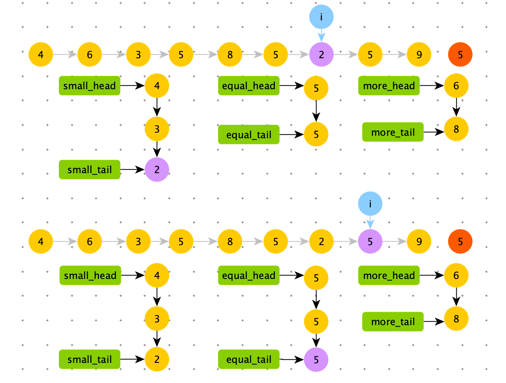

将三个链表联合起来。

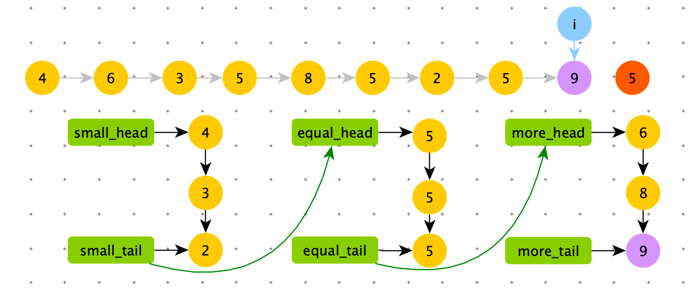

```python
def linked_list_partition2(head, pivot):
    if not head: return
    small_head = None
    small_tail = None
    equal_head = None
    equal_tail = None
    big_head = None
    big_tail = None

    node = head
    while node:
        if node.val < pivot:
            if not small_head:
                small_head = node
                small_tail = node
            else:
                small_tail.next = node
                small_tail = node
        elif node.val == pivot:
            if not equal_head:
                equal_head = node
                equal_tail = node
            else:
                equal_tail.next = node
                equal_tail = node
        else:
            if not big_head:
                big_head = node
                big_tail = node
            else:
                big_tail.next = node
                big_tail = node

        node = node.next

    # small and equal reconnect
    # 如果有小于区
    if small_head:
        small_tail.next = equal_head

        # 下一步，谁去连大于区域的头，谁就变成 equal_tail
        equal_tail = equal_tail if equal_tail else small_tail

    # equal_tail 不为空：存在小于区域或者存在等于区域
    # 如果都不存在，equal_tail 为 null，也不需要连接了
    if equal_tail:
        equal_tail.next = big_head

    if small_head:
        return small_head
    if equal_head:
        return equal_head
    return big_head

head = ListNode(4)
head.next = ListNode(6)
head.next.next = ListNode(3)
head.next.next.next = ListNode(5)
head.next.next.next.next = ListNode(8)
head.next.next.next.next.next = ListNode(5)
head.next.next.next.next.next.next = ListNode(2)
head.next.next.next.next.next.next.next = ListNode(5)
head.next.next.next.next.next.next.next.next = ListNode(9)

linked_list_partition2(head, 5)
print_linked_list(head)
```

总结经验：<font color=red>将链表打散成个小链表，按照新的规则，再重新组合成一个大链表。这是常用的处理链表的手段。空间复杂度不会增加</font>


## 复制含有随机指针节点的链表

> 【题目】一种特殊的单链表节点描述如下
>
> ```python
> class Node:
>   def __init__(self,value,next,rand):
>     self.value = value
>     self.next = next
>     self.rand = rand
> ```
>
> rand 指针是单链表节点结构中新增的指针，rand 可能指向链表中的任意一个节点，也可能指向 null。给定一个由 Node 节点类型组成的无环单链表的头节点 head，请实现一个函数完成这个链表的复制，并返回复制的新链表的头节点。
>
> 【要求】时间复杂度为 O(N)，额外空间复杂度O(1)


**机试**


```python
class ListNode:
    def __init__(self, val=0, next=None, rand=None):
        self.val = val
        self.next = next
        self.rand = rand

def copy_linked_list_rand(head):
    if not head: return
    node_map = {}
    node = head
    while node:
        node_map[node] = ListNode(node.val)
        node = node.next

    node = head
    while node:
        node_map[node].next = node_map.get(node.next, None)
        node_map[node].rand = node_map.get(node.rand, None)
        node = node.next
    return node_map[head]

head = ListNode(1)
head.next = ListNode(2)
head.next.rand = head
head.next.next = ListNode(3)

node = copy_linked_list_rand(head)
```


**面试**


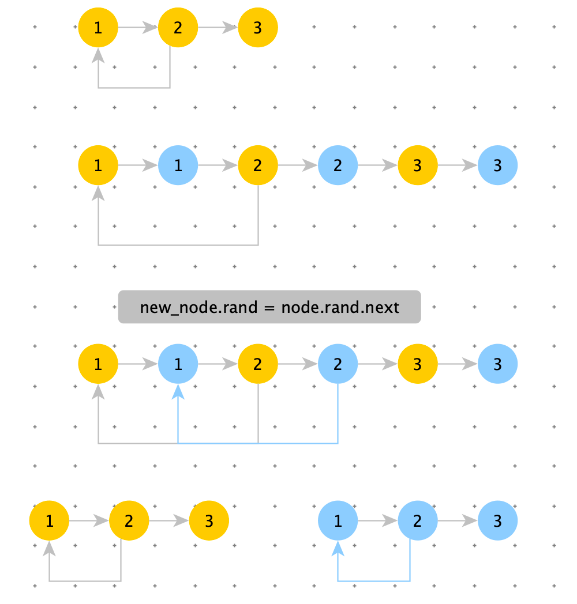


```python
def copy_linked_list_rand2(head):
    if not head: return
  
  	# 生成 1 -> 1` -> 2 -> 2' ...
    node = head
    while node:
        node.next = ListNode(node.val, node.next)
        node = node.next.next

    # 对 nnode` 生成 rand 指针
    # node`.rand = node.rand.next
    node = head
    new_node = node.next
    while node:
        new_node.rand = node.rand.next if node.rand else None
        node = node.next.next
        new_node = new_node.next.next if new_node.next else None

    # 拆分链表
    node = head
    res = node.next
    new_node = res
    while node:
        node.next = node.next.next if node.next else None
        new_node.next = new_node.next.next if new_node.next else None
        new_node = new_node.next
        node = node.next

    return res
```


> 两个链表相交
>
> 【题目】给定两个可能有环也可能无环的单链表，头结点 head1 和 head2。请实现一个函数，如果两个链表相交，请返回相交的第一个节点。如果不相交，返回 null。
>
> 【要求】如果两个链表长度之和为 N ，时间复杂度请达到 O(N)，额外空间复杂度请达到 O(1)

**机试**

使用两个 map，一个存链表1的结点，一个存链表2的结点。


```python
class ListNode:
    def __init__(self, val=0, next=None):
        self.val = val
        self.next = next


def get_intersect_node(head1, head2):
    if not head1 or not head2: return

    node1_set = set()
    node = head1
    while node:
        # 有环,遍历完毕
        if node in node1_set:
            break
        node1_set.add(node)
        node = node.next

    node2_set = set()
    node = head2
    while node:
        # 有环,遍历完毕
        if node in node2_set:
            break
        # 与链表1 相交 node
        if node in node1_set:
            return node
        node2_set.add(node)
        node = node.next
        
        
head = ListNode(1)
head.next = ListNode(2)
head.next.next = ListNode(3)

head2 = ListNode(5)
head2.next = ListNode(6)
head2.next.next = ListNode(7)
print(get_intersect_node(head, head2))
```


**面试**

单链表相交，相交后的部分合成一条链。因为是单链表，只有一个 next 指针。所以两个链表不会出现一个链表有环，一个链表无环的链表相交。

两个链表种类如下

1. 两个链表都无环
   1. 两个无环链表相交
   2. 两个无环链表不相交
2. 两个链表都有环
   1. 两个有环链表不相交
   2. 两个有环链表相交，相交点不在环上
   3. 两个有环链表相交，相交点在环上

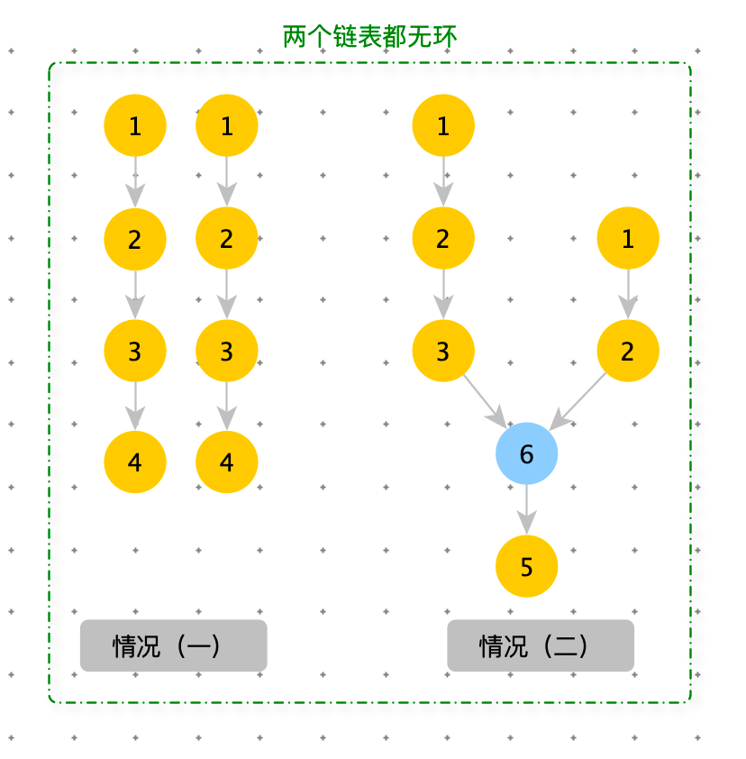


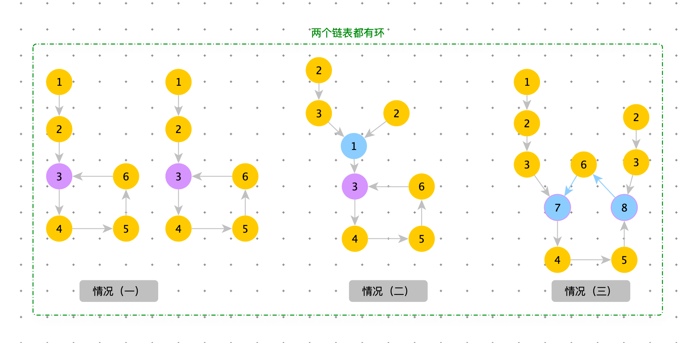

在情况（二）好区分，两个链表的loop 节点相同（紫色节点：链表入环节点）。如果将情况（二）看成，两个链表到 loop 节点就结束了，那么这种情况就和”两个链表都无环“的情况（二）相同。

 loop1 能到达 loop2 节点是情况（三），否则就是情况（一）。

情况（三）两个相交节点（蓝色节点）返回任意一个就可以。

```python
def get_intersect_node2(head1, head2):
    if not head1 or not head2: return

    loop1 = get_loop_node(head1)
    loop2 = get_loop_node(head2)

    # 两个链表都没有环
    if not loop1 and not loop2:
        no_loop(head1, head2)
   # 两个链表都有环
    elif loop1 and loop2:
        return both_loop(head1, loop1, head2, loop2)

# 获取链表入环节点
def get_loop_node(head):
    if not head: return

    fast = head
    node = head
    while fast and fast.next:
        node = node.next
        fast = fast.next.next
        if node == fast: break

    if node != fast: return

    fast = head
    while fast != node:
        fast = fast.next
        node = node.next
    return node

# 两个链表都没有环
def no_loop(head1, head2):
    n = 0
    node1 = head1
    while node1.next:
        node1 = node1.next
        n += 1

    node2 = head2
    while node2.next:
        node2 = node2.next
        n -= 1

    if node1 != node2: return

    node1 = head1 if n > 0 else head2
    node2 = head2 if n > 0 else head1

    n = abs(n)
    while n > 0:
        node1 = node1.next
        n -= 1

    while node1 != node2:
        node2 = node2.next
        node1 = node1.next

    return node1
  
# 两个链表都有环
def both_loop(head1, loop1, head2, loop2):
    # 情景二
    if loop2 == loop1:
        n = 0

        node1 = head1
        while node1 != loop1:
            node1 = node1.next
            n += 1

        node2 = head2
        while node2 != loop1:
            node2 = node2.next
            n -= 1

        if node1 != node2: return

        node1 = head1 if n > 0 else head2
        node2 = head2 if n > 0 else head1

        n = abs(n)
        while n > 0:
            node1 = node1.next
            n -= 1

        while node1 != node2:
            node2 = node2.next
            node1 = node1.next
        return node1

    # 如果两个链表相交，那么从 loop1 一定能走到 loop2
    node1 = loop1.next
    while node1 != loop1:
        # 情景三
        if node1 == loop2:
            return node1
        node1 = node1.next

    # 情景一
```

