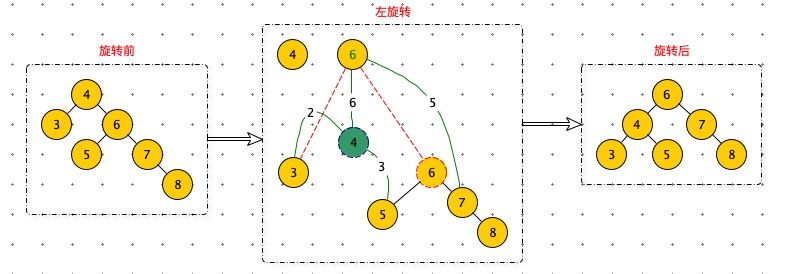
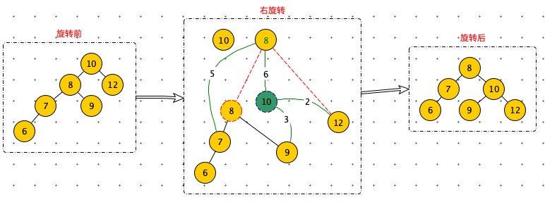
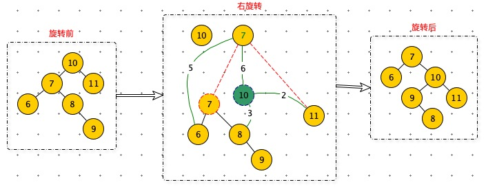
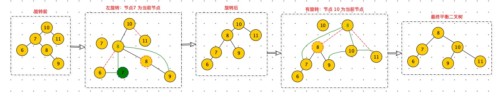

## 左旋转

**当 rightHeight - leftHeight > 1  时，进行左旋转。**

左旋转的目的：减低 rightHeight。手段：将有右子树中节点，提升为根节点，减少 rightHeight ，提升 leftHeight。新的根节点，就成为三叉树了，需要将原来左子树（节点5），迁移到原根节点（节点4）的右子树。

当前节点为 4。

**步骤：**

1. 根据当前节点：创建一个新节点 newNode（绿色节点 4）。
2. newNode.left = left：新节点的左子树 = 当前节点的左子树
3. newNode.right = right.left：新节点的右子树 = 当前节点的右子树的左子树
4. value = right.value：当前节点的值 = 当前节点的右子树的值
5. right = right.right：当前节点的右子树 = 当前节点的右子树的右子树
6. left = newNode：当前节点的左子树 = 新节点

## 有旋转

**当 leftHeight - rightHeight > 1  时，进行右旋转。**

当前节点为 10。

**步骤：**

1. 根据当前节点：创建一个新节点 newNode（绿色节点 10）。
2. newNode.right = right：新节点的右子树 = 当前节点的右子树
3. newNode.left = left.right：新节点的左子树 = 当前节点的左子树的右子树
4. value = left.value：当前节点的值 = 当前节点的左子树的值
5. left = left.left：当前节点的左子树 = 当前节点的左子树的左子树
6. right = newNode：当前节点的右子树 = 新节点

## 双旋转

如图：旋转前 leftHeight - rightHeight > 1 满足有旋转的条件。

但是：右旋转后，树依然不平衡。

问题分析：

