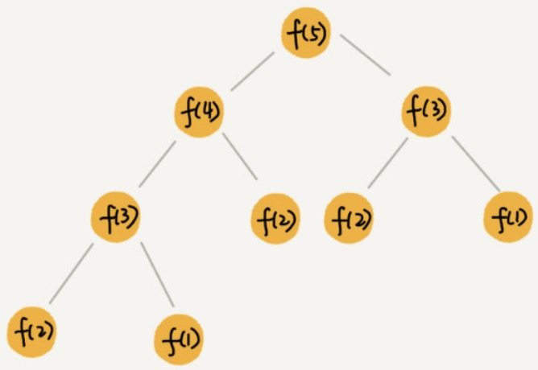
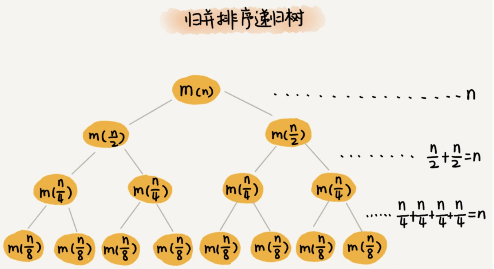
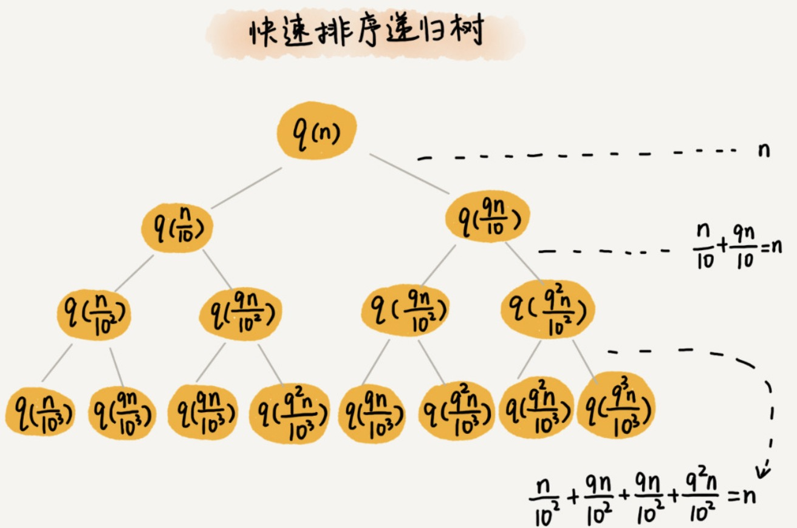
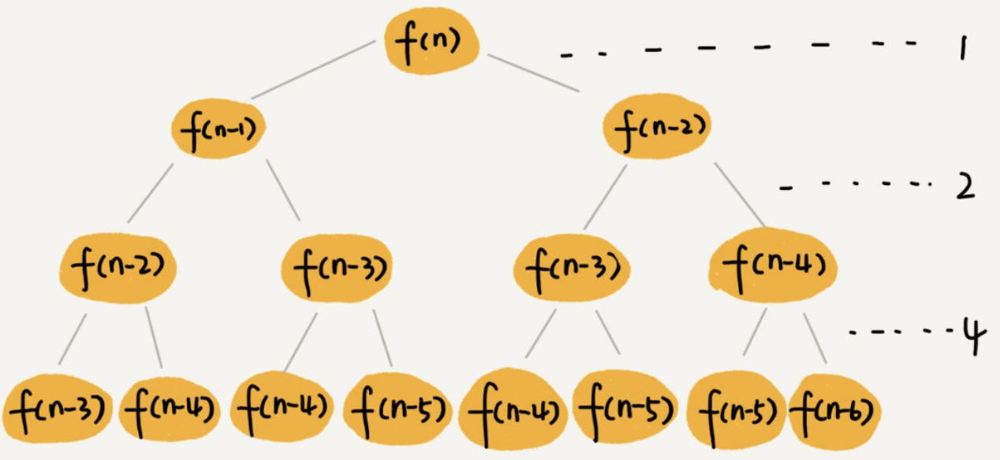
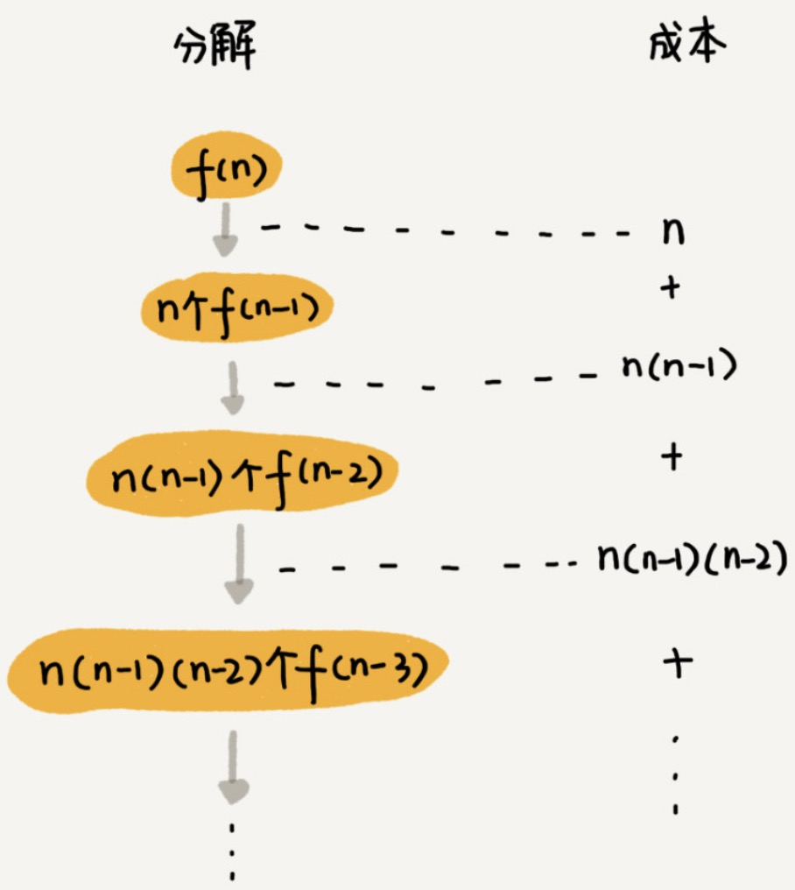

[TOC]

# 定义

递归树：将递归过程一层一层的分解过程画成一棵树。

一个节点的求解可以分解为左右子节点两个问题。



**优化程序**

通过递归树，非常清晰第看到，哪些子问题被重复计算。可以以空间换时间思想，将这些子问题的结果记录下来，作为缓存，在计算前如果已存在，直接获取计算结果。

**分析递归算法时间复杂度**

# 使用场景

## 分析归并排序时间复杂度



归并排序过程

1. 分解成子问题
2. 两个子问题合并排序。

树的高度为：h，每一层的是将消耗为：n，那么总的时间消耗：$$O(n * h)$$

归并排序的递归树是：满二叉树，那么 $$h = log_2n$$， 则总的时间消耗：$$O(nlog_2n)$$

## 分析快速排序的时间复杂度

快排过程

1. 数组下标从 low 到 high ，从 low 和 high 中任意选择一个数据作为 pivot （区分点）,一般情况下，可以选择数组最后一个元素。
2. low --> high 遍历数据，小于 pivot 的数据放左边，大于pivot 的数据放右边。最后 pivot 放中间。
3. 分治：划分为两个子问题：[low,pivot -1 ] 和 [pivot-1,hight] 两个子数组。


快排在最好情况下，每次分区都能一分为二，那么递推公式：$$T(n) = 2T(\frac{n}{2}) + n$$ ，很容易推导出时间复杂度：$$O(nlog{n})$$

快排在平均情况下，每次分区，两个分区大小比例为 1：k。当 k = 9 是，那么递推公式：$T(n) = T(\frac{n}{10} + T(\frac{9n}{10}) + n)$ 根据这个递归公式很难推导出时间复杂度。所以使用递归树。



递归树每一层操作遍历的数据之和为 n。

递归树高度为：h

总的时间消耗：$$O(n * h)$$ 

由于每次分区不是均匀分区，那么递归树并不是满二叉树。

 由于分区比例是 1：k，那么分区后：较少数据的结点中的数据： $\frac{n}{1+k}$ （路径短）, 较多数据节点中的数据：$\frac{nk}{k+1}$ （路径长）。

最短路径：$h = log_{k+1}n$   推导：$n, \frac{n}{k+1}, \frac{n}{(k+1)^2}, \frac{n}{(k+1)^3}, ... 1$

最长路径：$ h = log{\frac{k+1}{k}}{n} $ 推导：$n, \frac{kn}{k+1}, \frac{k^2n}{(k+1)^2}, \frac{k^3n}{(k+1)^3}, ... 1$

所以，遍历数据的个数和就介于 $nlog_{k+1}n$ 和 $nlog{\frac{k+1}{k}}{n}$ 之间，快排的时间复杂度依然是：O(nlogn)

## 分析斐波那契数列的时间复杂度



**代码**

```python
def f(n):
  if n <= 2:return n
  return f(n-1) + f(n-2)
```

**分析**

​		f( n ) 分解为 f( n - 1) 和 f( n - 2 )，每次分解数据规模减小 1 和 2。从根节点到叶子节点，每条路径长短不一。如果每次都是 -1，最长路径大约为 n。如果每次都是 -2，最短路径大约为 n / 2。


## 分析全排列的时间复杂度

 全排列：1，2，3 的全排列

```python
1,2,3
1,3,2
2,1,3
2,3,1
3,1,2
3,2,1
```

递归实现：确定了一位数 x ，就变成 n - 1 个数的排列问题。x 可以是 n 个数中任意一个，它的取值有 n 中情况，所以是 ”n 个数据的排列“，那么就是分解为 n 个 ”n - 1 个数据的排列子问题“。

递推公式

$f(1,2,...n)=\{x=1,f(n-1)\} + \{x=2,f(n-1)\} +...+ \{x=n,f(n-1)\}$


```python
# k表示要处理的子数组的数据个数
def print_permutations(data, k):
    if k == 1:
        print(data)
        return
    for i in range(k):
        data[i], data[k - 1] = data[k - 1], data[i]
        print_permutations(data, k - 1)
        data[i], data[k - 1] = data[k - 1], data[i]


print_permutations([1, 2, 3, 4], 4)
```

递归树



$n + n*(n-1) + n*(n-1)*(n-2) +...+ n*(n-1)*(n-2)*...*2*1$

$n! = n*(n-1)*(n-2)*...*2*1$

前边的 n - 1 个数小于 n!，那么总和小于 n*n!。

全排列递归算法的时间复杂度：大于 O( n! )，小于 O( n*n! )

全排列的时间复杂度是非常高的。 