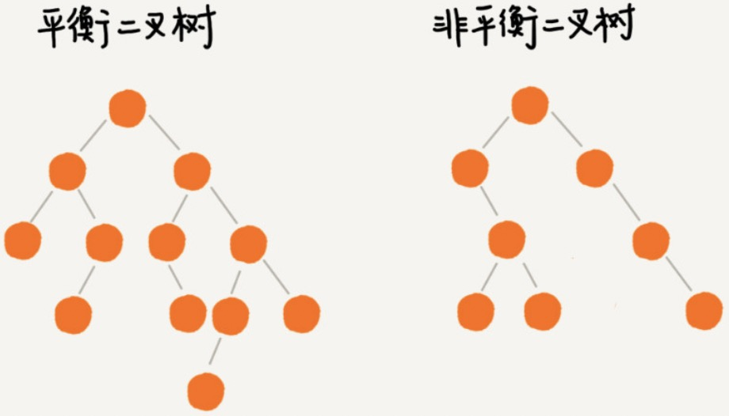

[TOC]

# 平衡二叉树

二叉查找树在极端的情况下，会退化为链表。

平衡二叉树的严格定义：二叉树中任意一个节点的左右子树的高度相差不能大于 1 。

完全二叉树，满二叉树都是平衡二叉树。

 

AVL 树：最先被发明的平衡二叉查找树。

AVL 树严格符合平衡二叉树的定义：左右子树高度相差不大于 1.很多平衡二叉树并没有严格符合这个定义，比如：红黑树。


==平衡二叉查找树中“平衡”的意思，其实就是让整棵树左右看起来比较“对称”、比较“平衡”，不要出现左子树很高、右子树很矮的情况。这样就能让整棵树的高度相对来说低一些，相应的插入、删除、查找等操作的效率高一些。==

如果我们现在设计一个新的平衡二叉查找树，只要==树的高度不比 $log_2{n}$ 大很多==（比如树的高度仍然是对数量级的），尽管它不符合我们前面讲的严格的平衡二叉查找树的定义，但我们仍然可以说，这是一个合格的平衡二叉查找树。

平衡二叉查找树

- Red-Black Tree（红黑树）
- AVL Tree
- Splay Tree（伸展树）
- Treap Tree（树堆）

# 红黑树

红黑树的定义：

1. 任何一个节点都有颜色，黑色或者红色
2. 根节点是黑色的
3. 父子节点之间不能出现两个连续的红节点
4. 任何一个节点向下遍历到其子孙的叶子节点，锁经过的黑色节点个数必须相等。
5. 空节点被认为是黑色节点


红黑树是“近似平衡"

```python
class Node:
    def __init__(self, value, parent, is_red, left, right):
        self.value = value
        self.parent = parent
        self.is_red = is_red
        self.left = left
        self.right = right
```

