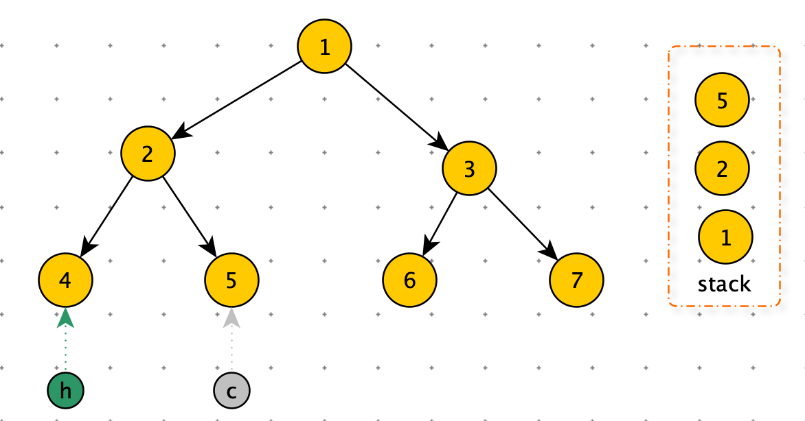

[TOC]

# 二叉树基础

三个比较混淆的概念

- 节点的高度：节点到叶子节点的最长路径（边数）。
- 节点的深度：根节点到这个节点所经历的边的个数。
- 节点的层数：节点深度 + 1。
- 树的高度：根节点的高度。


生活中：

- ”高度“就是从下向上度量。
- ”层“ 从下向上度量，从 1 开始（楼层）。
- ”深度“就是：从上向下度量。


**满二叉树**：叶子节点都在最底层，并且每个节点都有左右两个子节点。（树 2）

**完全二叉树**：叶子节点都在最底两层，最后一层叶子节点靠左排列，且除了最后一层，其他层的节点个数都达到最大。（树 3）

## 二叉树的存储

1. 通过指针链式存储。
2. 通过数组顺序存储。

链式存储：比较常用。


顺序存储

根节点小标为 1，

左子节点：2 * i 

右子节点：2 * i + 1

父节点：i / 2


顺序存储非常适合完全二叉树，如果是非完全二叉树，比较浪费空间。


完全二叉树如果用链式存储，需要额外存储左右指针。

堆就是一个完全二叉树，最常用的存储方式就是数组。


# 二叉树遍历

二叉树遍历的时间复杂度：O(n)

```python
print("二叉树遍历")
class Node:
    def __init__(self, data):
        self.data = data
        self.left = None
        self.right = None
'''
先序遍历
根 -> 左 —> 右
'''
def preorder(node):
    if node:
        print(node.data)
        preorder(node.left)
        preorder(node.right)


'''
中序遍历
左 -> 根 —> 右
'''
def inorder(node):
    if node:
        inorder(node.left)
        print(node.data)
        inorder(node.right)


'''
后序遍历
左 -> 右 —> 根
'''
def postorder(node):
    if node:
        postorder(node.left)
        postorder(node.right)
        print(node.data)
        
'''
层遍历
'''
def layerOrder(node):
    if node is Node: return
    queue = [node]
    while queue:
        t = queue.pop(0)
        print(t.data)
        if t.right: queue.append(t.right)
        if t.left: queue.append(t.left)

root = Node(5)
node1 = Node(6)
node2 = Node(7)
node3 = Node(8)

root.left = node1
root.right = node2
node1.left = node3

print("先序遍历")
preorder(root)
print("中序遍历")
inorder(root)
print("后序遍历")

postorder(root)
```


二叉树遍历：非递归实现

**先序遍历**

​		由于栈是先进后出，如果我们需要先处理左子树，后处理右子树，所以需要先压右子树

1. 从栈中弹出一个节点 cur
2. 打印（处理）cur
3. 先左，再右压栈
4. 循环上边 3 步

```python
'''
先序遍历：非递归实现
根 -> 左 —> 右
'''
def preorder(node):
    if node is None: return
    stack = [node]
    while stack:
        p = stack.pop()
        print(p.data)
        if p.right: stack.append(p.right)
        if p.left: stack.append(p.left)
```


**后序遍历**

​		对于先序遍历，如果我先压左子树，后压右子树。就变成：根 $\rightarrow$ 右 $\rightarrow$ 左。那么与后序遍历 左 $\rightarrow$ 右 $\rightarrow$ 根 正好相反，所以在从栈中弹出时不打印，而是使用另一个栈（stack2）记录数据，最后打印 stack2，就是后序遍历。

```python
'''
后序遍历：非递归实现
左 -> 右 —> 根
# 利用一个额外的栈
'''
def postorder(node):
    if node is Node: return
    stack1 = [node]
    stack2 = []

    '''
    翻译后序遍历，将 print 存到 stack2 中
    '''
    while stack1:
        p = stack1.pop()
        if p.left: stack1.append(p.left)
        if p.right: stack1.append(p.right)
        stack2.append(p)

    while stack2:
        print(stack2.pop().data)
```


​		可不可以不使用额外的栈的方法，有。

```python
# 后续遍历：没有利用额外的栈
# 可以吹 NB
def pos2(head):
    if not head: return
    stack = [head]
    while stack:
        c = stack[-1]
        # head != c.left and head != c.right 表示：上次打印不是左孩子，也不是右孩子。那么表示 c 是第一次遇到，需要将左孩子入栈
        # head == c.left：表示左树处理完毕
        # head == c.right：表示右树处理完毕
        # 如果右树处理完毕了，那么左树也一定处理完毕了
        if c.left and head != c.left and head != c.right:
            stack.append(c.left)
        # head != node.right 表示：上次打印的不是右孩子，那么将右孩子入栈
        elif c.right and head != c.right:
            stack.append(c.right)
        else:
          	# 如果上边两个条件都没中，表示左右都处理完毕了。
            print(stack.pop().val)
            head = c
```

- head 指针永远跟踪上次打印的结点。初始化时，head 赋值给一个不干扰的值，只有打印过一次后，head 才是上次打印的结点。
- 通过 c 来卡逻辑，表示左右子孩子是否处理完毕。
- 如果左右孩子都没有处理：那么处理左孩子：head != c.left and head != c.right
- 如果左孩子处理完毕：那么处理右孩子：head != c.right
- 如果左右孩子都处理完毕，那么处理当前节点


初始化状态


由于 h 是根节点，所以满足 head != c.left and head != c.right，分别将节点1 ，节点 2 ，节点 4（左边界）入栈，状态如下图


c 指向节点 4 时，c 的 left 和 right 为空，相当于 c 的 left 和right 都处理完毕。那么处理当前节点4，打印。打印完毕后，将 h 指针指向节点 4，状态如下图


此时c.left == h 表示做孩子已经处理，需要处理右孩子，c.righit != h 那么将右孩子入栈，状态如下图。





c 的 left 和 right 为空，相当于 c 的 left 和right 都处理完毕。那么处理当前节点5，打印。


此时 c.right == h 那么表示右孩子已经处理完毕，只需打印当前节点 2。

后续按此规则处理。


**中序遍历**

```python
'''
中序遍历：非递归实现
左 -> 根 —> 右
'''
def inorder(head):
    if not head: return
    stack = []
    while head or stack:
        # 从根节点开始，一直找它的左子树
        if head:
            stack.append(head)
            head = head.left
       else:
            # while结束表示当前节点node为空，即前一个节点没有左子树了
            head = stack.pop()
            print(head.data)
            # 开始查看它的右子树
            head = head.right
      
```


中序遍历非递归实现：

1. 将左路径所有节点压栈
2. node = stack.pop()，处理 node 节点，如果 node 有右子树，将 node 右子树的所有左路径节点压栈。

例子：


步骤：

1. 将根节点 5 ，的左子树压栈：stack_0
2. 节点_1 = stack.pop()，节点_1 没有右子树，继续 pop
3. 节点_2 = stack.pop()，节点_2 有右子树，将右子树的做路径上节点压栈：stack_3
4. 节点_3 = stack.pop()，节点_3 没有右子树，继续 pop
5. 节点_4 = stack.pop()，节点_3 没有右子树，继续 pop
6. 节点_5 = stack.pop()，节点_5 有右子树，将节点_6 压栈：stack_7
7. 节点_6 = stack.pop()，节点_6 有右子树，将节点_7 压栈：stack_9
8. 节点_7 = stack.pop()，节点遍历完毕，stack 为空，退出循环。


中序遍历就是通过左边界，将整棵树分解。每次都是将左边界压入栈，在弹出栈时打印，如果有右子树，将右子树的左边界也压入栈。

从左边界的视角，栈弹出的顺序总是：左--> 根


# 计算树的深度

递归实现

```python
def calcTreeDepth(root):
    if not root: return 0

    l_depth = calcTreeDepth(root.left) + 1
    r_depth = calcTreeDepth(root.right) + 1
    return max(l_depth, r_depth)
```

非递归实现

```python
# 层遍历思想
def maxDepth2(root):
    if not root: return 0
    res = 0
    stock = [root]
    while stock:
        tmp = []
        # 遍历一层
        for node in stock:
            if node.left: tmp.append(node.left)
            if node.right: tmp.append(node.right)
        stock = tmp
        res += 1

    return res
```

