[TOC]


# Size Balanced Tree


平衡性

1. 每棵子树的大小，不小于其兄弟的子树大小。既每棵叔叔树的大小，不小于其任何侄子树的大小。


## 左旋

触发条件：cur = 节点 4，cur.right.right.size > cur.left.size。出现右边子树节点数太多。通过左旋，将 cur.right 的结点替换 cur 节点。

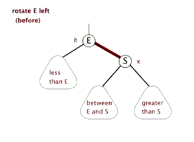

具体过程如下图

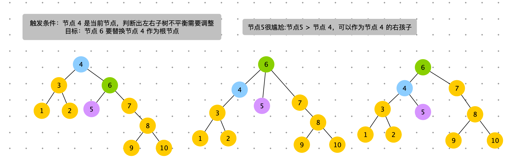

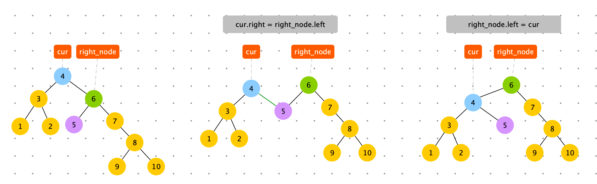

```python
# 左旋
def left_rotate(self, cur: Node):
    right_node = cur.right
    cur.right = right_node.left
    right_node.left = cur
    # 此时 right_node 成为父节点
    right_node.size = cur.size
    cur.size = (cur.left.size if cur.left else 0) + (cur.right.size if cur.right else 0) + 1
    return right_node
  
if right_right_size > left_size:  # 左旋
   cur = self.left_rotate(cur)
   cur.left = self.maintain(cur.left)
   cur = self.maintain(cur)
```


## 右旋

触发条件：cur = 节点 4，cur.left.left.size > cur.right.size。出现左边子树节点数太多。通过右旋，将 cur.left 的结点替换 cur 节点。

具体过程如下图


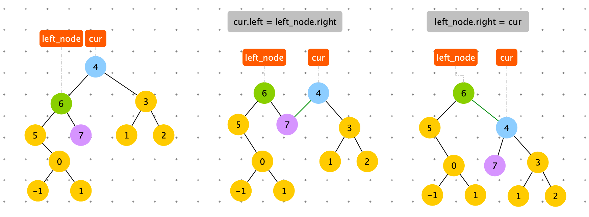

```python
    # 右旋
    def right_rotate(self, cur: Node):
        left_node = cur.left
        cur.left = left_node.right
        left_node.right = cur
        # 此时 left_node 成为父节点
        left_node.size = cur.size
        cur.size = (cur.left.size if cur.left else 0) + (cur.right.size if cur.right else 0) + 1
        return left_node
      
# 右旋
if left_left_size > right_size:
   cur = self.right_rotate(cur)
   cur.right = self.maintain(cur.right)
   cur = self.maintain(cur)
```


## 左旋 + 右旋

触发条件：cur = 节点 4，cur.left.right.size > cur.right.size。出现左边子树节点数太多。通过右旋，将 cur.left 的结点替换 cur 节点。

具体过程如下图


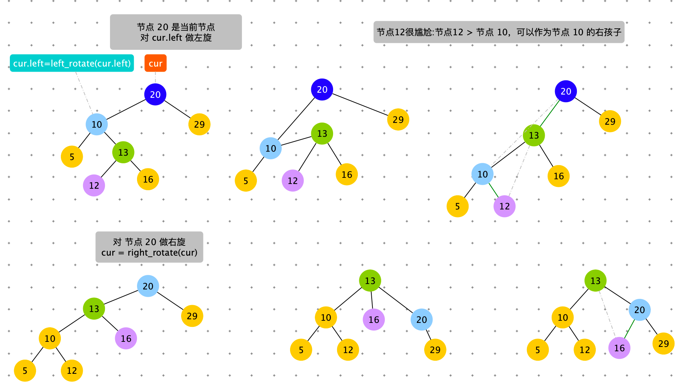


```python
if left_right_size > right_size:  # 左旋，右旋
   cur.left = self.left_rotate(cur.left)
   cur = self.right_rotate(cur)
   # 检查cur.left 是否平衡
   cur.left = self.maintain(cur.left)
   # 检查cur.right 是否平衡
   cur.right = self.maintain(cur.right)
   cur = self.maintain(cur)
```


## 右旋 + 左旋

触发条件：cur = 节点 4，cur.right.left.size > cur.left.size。出现左边子树节点数太多。通过右旋，将 cur.left 的结点替换 cur 节点。

具体过程如下图

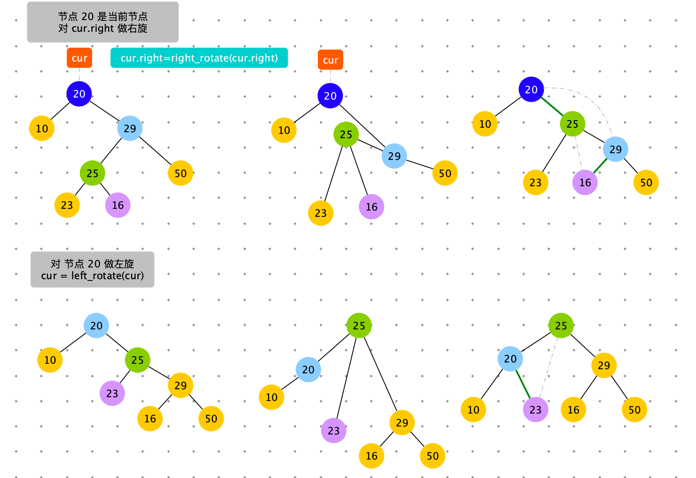

```python
if right_left_size > left_size:  # 右旋，左旋
   cur.right = self.right_rotate(cur.right)
   cur = self.left_rotate(cur)
   cur.left = self.maintain(cur.left)
   cur.right = self.maintain(cur.right)
   cur = self.maintain(cur)
```


## 删除

删除节点为叶子节点

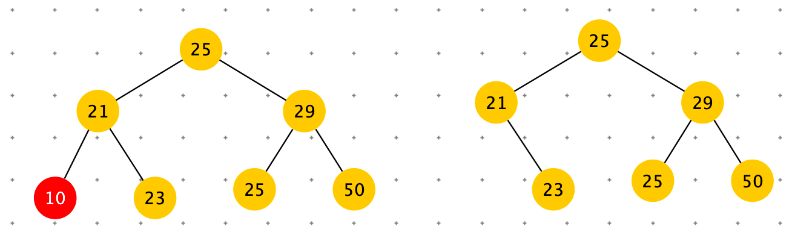


删除节点有left 节点，没有 right 节点：cur = cur.left

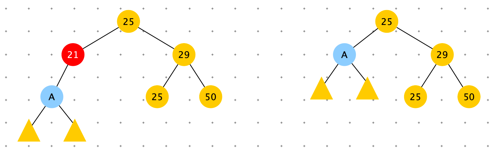


删除节点有 right节点，没有 left节点：cur = cur.right

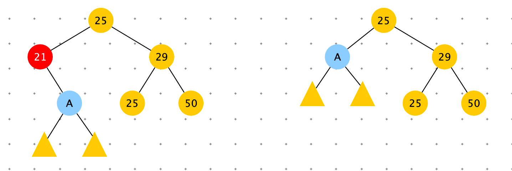


删除节点 21。cur 有左节点和右节点。用cur.left 的最右节点替换 cur 或者使用 cur.right 的最左节点替换 cur。

下图是用 cur.right 的最左节点替换 cur。 下图 des.left 为空，需要安排好 desc.right ， pre.left = desc.right

替换： des.left = cur.left ; des.right = cur.right。  

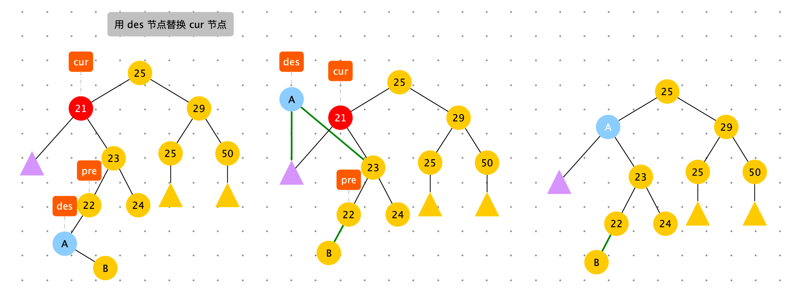


```python
    # 在cur这棵树上，删掉 key 所代表的节点
		# 返回cur这棵树的新头部
    def delete(self, cur: Node, key):
        cur.size -= 1
        if cur.key > key:
            cur.left = self.delete(cur.left, key)
        elif cur.key < key:
            cur.right = self.delete(cur.right, key)
        else:
            # 要删除 cur，cur.key == key
            # cur 是叶子节点
            if not cur.left and not cur.right:
                cur = None
            # cur 只有右节点
            elif not cur.left and cur.right:
                cur = cur.right
            # cur 只有左节点
            elif cur.left and not cur.right:
                cur = cur.left
            else:
              	# cur 有左有右
              	# 查询到 cur.right 的最左边的结点 pre
                # 可以替换 cur 的节点为：cur.right 的最左节点或者 cur.left 最右节点
                pre = None
                des = cur.right
                des.size -= 1
                while not des.left:
                    pre = des
                    des = des.left
                    des.size -= 1
                    
                if pre:
                    # 将 des.right 安排给好的人家
                    pre.left = des.right
                    # des.right 替换 cur.right
                    des.right = cur.right
                # des.left 替换 cur.left
                # des 替换 cur 完毕
                des.left = cur.left
                # 更新 des
                des.size = des.left.size + (des.right.size if des.right else 0) + 1
                cur = des

        return cur
```


## floor

如果表中存入过 key，返回 key，否则返回所有键值的排序结果中，key 的前一个。

例子：floor ( 59 )

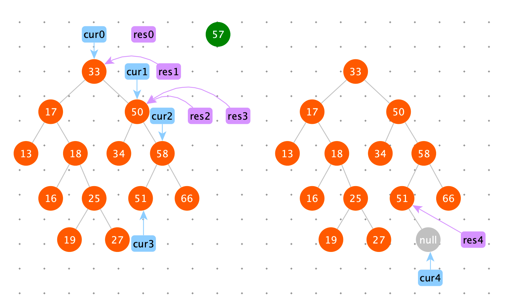

```python
    def floor(self, data):
        res = None
        cur = self.root
        while cur:
            if cur.data == data:
                return cur
            if cur.data > data:
                cur = cur.left
            else:
                res = cur
                cur = cur.right
        return res
```


## ceiling

如果表中存入过 key，返回 key，否则返回所有键值的排序结果中，key 的后一个。


```python
    def ceiling(self, data):
        res = None
        cur = self.root
        while cur:
            if cur.data == data:
                return cur
            if cur.data > data:
                res = cur
                cur = cur.left
            else:
                cur = cur.right
        return res
```


```python
class Node:
    def __init__(self, key, value):
        self.key = key
        self.value = value
        self.size = 1
        self.left = None
        self.right = None

class SizeBalancedTreeMap:
    def __init__(self):
        self.root: Node = None

    # 右旋
    def right_rotate(self, cur: Node):
        left_node = cur.left
        cur.left = left_node.right
        left_node.right = cur
        # 此时 left_node 成为父节点
        left_node.size = cur.size
        cur.size = (cur.left.size if cur.left else 0) + (cur.right.size if cur.right else 0) + 1
        return left_node

    # 左旋
    def left_rotate(self, cur: Node):
        right_node = cur.right
        cur.right = right_node.left
        right_node.left = cur
        # 此时 right_node 成为父节点
        right_node.size = cur.size
        cur.size = (cur.left.size if cur.left else 0) + (cur.right.size if cur.right else 0) + 1
        return right_node

    def maintain(self, cur: Node):
        if not cur: return

        left_size = cur.left.size if cur.left else 0
        left_left_size = cur.left.left.size if cur.left and cur.left.left else 0
        left_right_size = cur.left.right.size if cur.left and cur.left.right else 0
        right_size = cur.right.size if cur.right else 0
        right_right_size = cur.right.right.size if cur.right and cur.right.right else 0
        right_left_size = cur.right.left.size if cur.right and cur.right.left else 0

        # 右旋
        if left_left_size > right_size:
            cur = self.right_rotate(cur)
            cur.right = self.maintain(cur.right)
            cur = self.maintain(cur)
        elif left_right_size > right_size:  # 左旋，右旋
            cur.left = self.left_rotate(cur.left)
            cur = self.right_rotate(cur)
            cur.left = self.maintain(cur.left)
            cur.right = self.maintain(cur.right)
            cur = self.maintain(cur)
        elif right_right_size > left_size:  # 左旋
            cur = self.left_rotate(cur)
            cur.left = self.maintain(cur.left)
            cur = self.maintain(cur)
        elif right_left_size > left_size:  # 右旋，左旋
            cur.right = self.right_rotate(cur.right)
            cur = self.left_rotate(cur)
            cur.left = self.maintain(cur.left)
            cur.right = self.maintain(cur.right)
            cur = self.maintain(cur)

        return cur

    def find_last_index(self, key):
        pre = self.root
        cur = self.root
        while cur:
            pre = cur
            if cur.key == key:
                return pre
            if cur.key > key:
                cur = cur.left
            else:
                cur = cur.right

        return pre

    def find_last_no_small_index(self, key):
        res = None
        cur = self.root
        while cur:
            if cur.key == key:
                return cur
            if cur.key > key:
                res = cur
                cur = cur.left
            else:
                cur = cur.right
        return res

    def find_last_no_big_index(self, key):
        res = None
        cur = self.root
        while cur:
            if cur.key == key:
                return cur
            if cur.key > key:
                cur = cur.left
            else:
                res = cur
                cur = cur.right
        return res

        # 现在，以cur为头的树上，新增，加(key, value)这样的记录
        # 加完之后，会对cur做检查，该调整调整
        # 返回，调整完之后，整棵树的新头部
    def add(self, cur: Node, key, value):
        if not cur: return Node(key, value)

        # 寻找插入点 
        cur.size += 1
        if cur.key > key:
            cur.left = self.add(cur.left, key, value)
        else:
            cur.right = self.add(cur.right, key, value)

        # 调整平衡性
        return self.maintain(cur)

    # 在cur这棵树上，删掉 key 所代表的节点
		# 返回cur这棵树的新头部
    def delete(self, cur: Node, key):
        cur.size -= 1
        if cur.key > key:
            cur.left = self.delete(cur.left, key)
        elif cur.key < key:
            cur.right = self.delete(cur.right, key)
        else:
            # 要删除 cur，cur.key == key
            # cur 是叶子节点
            if not cur.left and not cur.right:
                cur = None
            # cur 只有右节点
            elif not cur.left and cur.right:
                cur = cur.right
            # cur 只有左节点
            elif cur.left and not cur.right:
                cur = cur.left
            else:
              	# cur 有左有右
              	# 查询到 cur.right 的最左边的结点 pre
                # 可以替换 cur 的节点为：cur.right 的最左节点或者 cur.left 最右节点
                pre = None
                des = cur.right
                des.size -= 1
                while not des.left:
                    pre = des
                    des = des.left
                    des.size -= 1
                    
                if pre:
                    # 将 des.right 安排给好的人家
                    pre.left = des.right
                    # des.right 替换 cur.right
                    des.right = cur.right
                # des.left 替换 cur.left
                # des 替换 cur 完毕
                des.left = cur.left
                # 更新 des
                des.size = des.left.size + (des.right.size if des.right else 0) + 1
                cur = des

        return cur

    def get_index(self, cur: Node, kth):
        left_size = cur.left.size if cur.left else 0
        if kth == left_size + 1:
            return cur
        elif kth <= left_size:
            return self.get_index(cur.left, kth)
        return self.get_index(cur.right, kth - left_size - 1)

    def size(self):
        return self.root.size if self.root else 0

    def __contains__(self, key):
        if not key: return
        last_node = self.find_last_index(key)
        return last_node and last_node.key == key

    def put(self, key, value):
        if not key: return
        last_node = self.find_last_index(key)
        if last_node and last_node.key == key:
            last_node.value = value
        else:
            self.root = self.add(self.root, key, value)

    def remove(self, key):
        if not key: return key

        if self.__contains__(key):
            self.root = self.delete(self.root, key)

    def get_index_key(self, index):
        if index < 0 or index >= self.root.size: return
        return self.get_index(self.root, index + 1).key

    def get_index_value(self, index):
        if index < 0 or index >= self.root.size: return
        return self.get_index(self.root, index + 1).value

    def get(self, key):
        if not key: return
        last_node = self.find_last_index(key)
        if last_node and last_node.key == key:
            return last_node.value

    def first_key(self):
        if not self.root: return
        cur = self.root
        while cur.left:
            cur = cur.left
        return cur.key

    def last_key(self):
        if not self.root: return
        cur = self.root
        while cur.right:
            cur = cur.right
        return cur.key

    def floor_key(self, key):
        if not key: return
        last_no_big_node = self.find_last_no_big_index(key)

        if last_no_big_node: return last_no_big_node.key

    def ceiling_key(self, key):
        if not key: return
        last_no_small_node = self.find_last_no_small_index(key)
        if last_no_small_node:
            return last_no_small_node.key

    ############# Test ###############

    def print_all(self, head: Node):
        print("Binary Tree")
        self.print_in_order(head, 0, "H", 17)
        print()

    def print_in_order(self, head: Node, height, to, length):
        if not head: return
        self.print_in_order(head.right, height + 1, "v", length)
        val = str(to) + "(" + str(head.key) + "," + str(head.value) + ")" + str(to)
        len_m = len(val)
        len_l = (length - len_m) / 2
        len_r = length - len_m - len_l
        val = self.get_space(len_l) + val + self.get_space(len_r)
        print(self.get_space(height * length) + val)
        self.print_in_order(head.left, height + 1, "^", length)

    def get_space(self, num):
        return " " * int(num)


def check():
    sbt = SizeBalancedTreeMap()
    sbt.put("d", 4)
    sbt.put("c", 3)
    sbt.put("a", 1)
    sbt.put("b", 2)
    # sbt.put("e", 5);
    sbt.put("g", 7)
    sbt.put("f", 6)
    sbt.put("h", 8)
    sbt.put("i", 9)
    sbt.put("a", 111)

    print(sbt.get("a"))
    sbt.put("a", 1)
    print(sbt.get("a"))

    for i in range(sbt.size()):
        print(sbt.get_index_key(i), sbt.get_index_value(i))

    sbt.print_all(sbt.root)

    print(sbt.first_key())
    print(sbt.last_key())
    print(sbt.floor_key("g"))
    print(sbt.ceiling_key("g"))
    print(sbt.floor_key("e"))
    print(sbt.ceiling_key("e"))
    print(sbt.floor_key(""))
    print(sbt.ceiling_key(""))
    print(sbt.floor_key("j"))
    print(sbt.ceiling_key("j"))

    sbt.remove("d")
    sbt.print_all(sbt.root)
    sbt.remove("f")
    sbt.print_all(sbt.root)

check()
```

