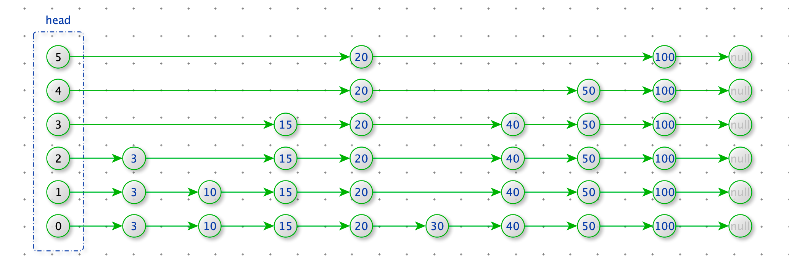
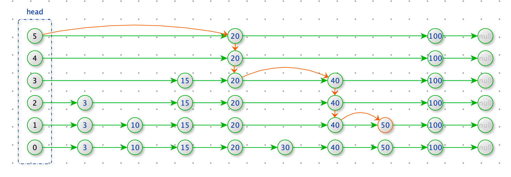
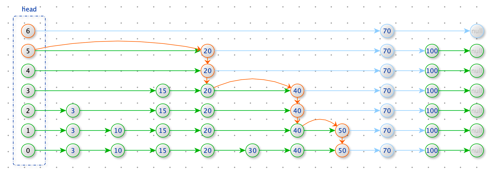

SkipLists

- 跳表是一个随机化的搜索数据结构





跳表的 NB 之处：

1. 思想先进：跳表不再使用硬规则来数据的平衡性，而是使用概率保证。
2. 由于使用概率随机生成数据层，与用户输入的数据无关。


跳表时间复杂度评估

第 0 层：N 个节点（每个节点必在第 0 层）

第 1 层：$\frac{N}{2}$ 个节点

第 2 层：$\frac{N}{4}$ 个节点

第 3 层：$\frac{N}{8}$ 个节点

...

第 k 层：$\frac{N}{2^k}$ 个节点

类似满二叉树


## 查找数据

查找 50 。从 head 的最上层开始查找，如果节点小于 50 就next，否则就下降一层查找。



```python
    def find(self, value):
        p = self.head
        for i in range(len(self.head.next_nodes) - 1, -1, -1):
            while p.next_nodes[i] and p.next_nodes[i].value < value:
                p = p.next_nodes[i]

        if p.next_nodes[0] and p.next_nodes[0].value == value:
            return p.next_nodes[0].value
```


## 添加数据

新增数据 70，随机出 70 需要的层数（以等概率出现 0 和 1 ，当出现 1 时层数+1，当出现 0 时结束。但是要保证至少有一层）

如下图：70 随机出了 7 层 大于 head 的层数，所以 head 需要扩展层数到 7 层。


```python
    def expand_head(self, level):
        n = len(self.head.next_nodes)
        if level < n:
            return
        for _ in range(level - n):
            self.head.next_nodes.append(None)

    def get_random_level(self):
        res = 0
        while int(random.random() * 2) != 0:
            res += 1
        return max(res,1)
```


查找插入为位置：从 head 的最上层开始查找，寻找每一层小于  70 的最后的节点。


插入节点：根据 70 节点的层数，从上向下加入到每一层，加入位置就是上边查找的位置。




```python
    def insert(self, value):
        self.insert_level(value, self.get_random_level())

    def insert_level(self, value, level):
        self.expand_head(level)

        new_node = Node(value, level)
        update_arr = [self.head] * len(self.head.next_nodes)
        p = self.head

        n = len(self.head.next_nodes)
        for i in range(n - 1, -1, -1):
            while p.next_nodes[i] and p.next_nodes[i].value < value:
                p = p.next_nodes[i]
            update_arr[i] = p

        # 加入 new_node
        for i in range(level):
            new_node.next_nodes[i] = update_arr[i].next_nodes[i]
            update_arr[i].next_nodes[i] = new_node
```


## 删除数据

删除节点 15

查找删除为位置：从 head 的最上层开始查找，寻找每一层小于  15 的最后的节点。


删除节点：如果上一步的节点的 node.next_node.value = 15，那么 node.next_node = node.next_node.next_node


```python
    def delete(self, value):
        n = len(self.head.next_nodes)
        update_arr = [None] * n
        p = self.head
        # 查找需要更新结点
        for i in range(n - 1, -1, -1):
            while p.next_nodes[i] and p.next_nodes[i].value < value:
                p = p.next_nodes[i]
            update_arr[i] = p

        # 如果没有删除节点，直接返回
        if p.next_nodes and p.next_nodes[0].value != value: return

        # 删除节点
        for i in range(n - 1, -1, -1):
            if update_arr[i].next_nodes[i] and update_arr[i].next_nodes[i].value == value:
                update_arr[i].next_nodes[i] = update_arr[i].next_nodes[i].next_nodes[i]
```


```python
import random

class Node:
    def __init__(self, value, max_level):
        self.value = value
        self.next_nodes = [None] * max_level

    def __lt__(self, other):
        return self.key < other

    def __eq__(self, other):
        return self.key == other

    def __ge__(self, other):
        return self.key > other

class SkipList:
    def __init__(self):
        self.head = Node(-1, 1)

    def insert(self, value):
        self.insert_level(value, self.get_random_level())

    def insert_level(self, value, level):
        self.expand_head(level)

        new_node = Node(value, level)

        update_arr = [self.head] * len(self.head.next_nodes)
        p = self.head

        n = len(self.head.next_nodes)
        for i in range(n - 1, -1, -1):
            while p.next_nodes[i] and p.next_nodes[i].value < value:
                p = p.next_nodes[i]
            update_arr[i] = p

        # 加入 new_node
        for i in range(level):
            new_node.next_nodes[i] = update_arr[i].next_nodes[i]
            update_arr[i].next_nodes[i] = new_node

    def delete(self, value):
        n = len(self.head.next_nodes)
        update_arr = [None] * n
        p = self.head
        # 查找需要更新结点
        for i in range(n - 1, -1, -1):
            while p.next_nodes[i] and p.next_nodes[i].value < value:
                p = p.next_nodes[i]
            update_arr[i] = p

        # 删除节点
        if p.next_nodes and p.next_nodes[0].value != value: return

        # 删除节点
        for i in range(n - 1, -1, -1):
            if update_arr[i].next_nodes[i] and update_arr[i].next_nodes[i].value == value:
                update_arr[i].next_nodes[i] = update_arr[i].next_nodes[i].next_nodes[i]

    def expand_head(self, level):
        n = len(self.head.next_nodes)
        if level < n:
            return
        for _ in range(level - n):
            self.head.next_nodes.append(None)

    def get_random_level(self):
        res = 1
        while int(random.random() * 2) != 0:
            res += 1
        return res

    def find(self, value):
        p = self.head
        for i in range(len(self.head.next_nodes) - 1, -1, -1):
            while p.next_nodes[i] and p.next_nodes[i].value < value:
                p = p.next_nodes[i]

        return p

    def __contains__(self, item):
        node = self.find(item)
        return node.next_nodes[0] and node.next_nodes[0].value == item

    # 返回所有排序结果中，最左（最小）的那个
    def first(self):
        return self.head.next_nodes[0].value

   # 返回所有排序结果中，最右（最大）的那个
    def last(self):
        p = self.head
        n = len(self.head.next_nodes)
        for i in range(n - 1, -1, -1):
            while p.next_nodes[i]:
                p = p.next_nodes[i]

        return p.value

    # 如果表中存入过 value，返回 value，否则返回所有键值的排序结果中，value 的前一个
    def floor(self, value):
        node = self.find(value)
        if node.next_nodes[0] and node.next_nodes[0].value == value:
            return value
        return node.value

    # 如果表中存入过 value，返回 value，否则返回所有键值的排序结果中，value 的后一个
    def ceiling(self, value):
        node = self.find(value)
        if node.next_nodes[0] and node.next_nodes[0].value == value:
            return value

        if node.next_nodes[0]:
            return node.next_nodes[0].value

skipList = SkipList()
skipList.insert_level(3, 3)
skipList.insert_level(10, 2)
skipList.insert_level(15, 4)
skipList.insert_level(20, 6)
skipList.insert_level(30, 1)
skipList.insert_level(40, 4)
skipList.insert_level(50, 5)
skipList.insert_level(70, 2)
skipList.insert_level(100, 6)

skipList.delete(50)
print("aaa")
```


