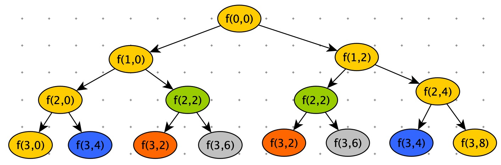
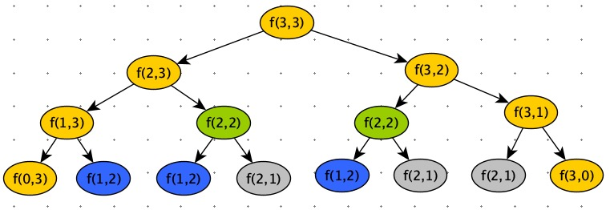

<font color=red>**一个算法流程的优化，从两方面如数：**</font>

1. <font color=red>**问题的数据状况**</font>
1. <font color=red>**问题求解的标准**</font>


动态规划适合解决：最优化问题。

# 一个模型三个特征

## 模型

动态规划适合解决的问题模型：**多阶段决策最优模型**。

解决问题的过程，需要经历多个决策阶段，每个决策阶段对应着一组状态，然后寻找一组决策序列，经过这组决策序列，能够产生期望的最优值。

<font color=red>动态规划是自顶向下递归地思考，自底向上反过来解决</font>

## 三个特征

### 最优子结构

最终的最优解，可以由子问题的最优解推导出来。

### 无后效性

### 重复子问题

有很多子问题重复执行。



以空间换时间。

使用备忘录，记录这些结果，下次再使用时，直接获取结果即可。

<font color=red>动态规划最难的部分：准确定义出子问题</font>

# 解题思路

## 状态转移表法

一般动态规划问题，都可以使用回溯算法进行暴力搜索解决。

1. 尝试回溯算法解决（找到递归公式）。
2. 定义状态，每个状态表示一个节点。
3. 画出递归树。
4. 是否存在重复子问题？重复子问题是如何产生的？以此寻找规律。


如果有重复子问题的处理思路：

1. ==**回溯 + 备忘录**==，避免重复子问题。
2. ==**状态转移表法**==，标准的动态规划解法。

状态转移表一般就是二维的。


**问题：**

> 有 n * n 的矩阵 w\[n][n],棋子从左上角移动到右下角，每次只能向右或者向下移动一位。从左上角到右下角会有很多路径，将路径上的数字加起来作为路径长度，求最短路径的长度是多少？


问题分析：

到位置 ( i , j ) 的最短距离：min_dist( i, j ) = min( min_dist( i , j-1 ) , min_dist( i-1 , j) ) + w\[ i ][ j ] 

根据递归公式，通过回溯算法的实现。

```python
import sys
w = [
    [1, 3, 5, 9],
    [2, 1, 3, 4],
    [5, 2, 6, 7],
    [6, 8, 4, 3]
]

# 回溯，从后向前求解
def select0(i, j):
    if i == 0 and j == 0: return w[i][j]
    min_left = sys.maxsize
    min_right = sys.maxsize
    if j - 1 >= 0:
        min_left = select0(i, j - 1)
    if i - 1 >= 0:
        min_right = select0(i - 1, j)
    return min(min_left, min_right) + w[i][j]
```

这个实现是从右下角一层一层递归到 右上角。


其实我们也可以从左上角，一步一步走到右上角。这样每一步都是：向左一步，或者向下一步。

```python
# 回溯，从前向后求解
minDist = sys.maxsize

def select1(i, j, n, dist):
    global minDist
    dist += w[i][j]
    if i == n and j == n:
        minDist = min(dist, minDist)
        return

    if i < n:
        select1(i + 1, j, n, dist)
    if j < n:
        select1(i, j + 1, n, dist)
```

画出回溯算的递归树：



我们可以使用一个备忘录，存放这些结果，避免子问题重复计算。

```python
# 备忘录
pd = {}

def select2(i, j):
    key = (i, j)
    if key in pd.keys():
        return pd[key]

    if i == 0 and j == 0:
        pd[key] = w[i][j]
    elif i == 0 and j > 0:
        pd[key] = select2(i, j - 1) + w[i][j]
    elif j == 0 and i > 0:
        pd[key] = select2(i - 1, j) + w[i][j]
    elif i > 0 and j > 0:
        pd[key] = min(select2(i - 1, j), select2(i, j - 1)) + w[i][j]
    return pd[key]
```

语法层面优化上边代码：

```python
'''
 备忘录
对select2 代码优化
'''
pd = {}

def select21(i, j):
    if i == 0 and j == 0: return w[0][0]
    key = (i, j)
    if key in pd.keys():
        return pd[key]

    min_left = sys.maxsize
    min_right = sys.maxsize
    if j > 0: min_left = select21(i, j - 1)
    if i > 0: min_right = select21(i - 1, j)

    pd[key] = min(min_left, min_right) + w[i][j]
    return pd[key]
```

标准的动态规划使用二维数组表示转移状态，求解过程就是根据状态转移方程填表。

pd\[ i ][ j ] = min( pd\[ i - 1 ][ j ] ,pd\[ i  ][ j -1 ] ) + w\[ i ][ j ]

```python
# 状态转移表法
def select3(n):
    pd = [[None for i in range(n)] for j in range(n)]

    pd[0][0] = w[0][0]
    for i in range(1, n):
        pd[i][0] = pd[i - 1][0] + w[i][0]
        pd[0][i] = pd[0][i - 1] + w[0][i]

    for i in range(1, n):
        for j in range(1, n):
            pd[i][j] = min(pd[i - 1][j], pd[i][j - 1]) + w[i][j]
    return pd[n - 1][n - 1]
```


## 状态转移方程法

根据最优子结构，写出递归公式，就有了状态转移方程。

**==状态转移方程是解决动态规划的关键==**

1. 递归 + “备忘录”。
2. 迭代递推。

min_dist( i , j ) = w\[ i ][ j ] + min( min_dist( i ,  j - 1 ),  min_dist( i - 1 ,  j ))

```python
pd = [[None for i in range(len(w))] for j in range(len(w))]

def select4(i, j):
    if i == 0 and i == 0: return w[i][j]
    if pd[i][j]: return pd[i][j]
    min_left = sys.maxsize
    min_right = sys.maxsize
    if j - 1 >= 0:
        min_left = select4(i, j - 1)
    if i - 1 >= 0:
        min_right = select4(i - 1, j)
    pd[i][j] = min(min_left, min_right) + w[i][j]
    return pd[i][j]
```


# 贪心 VS 回溯 VS 动态规划 VS 分治

贪心，回溯，动态规划可以归为一类。

分治归为一类。


分治算法分解的子问题，是相互独立的。


能用贪心算法和动态规划解决的问题，都可以使用回溯算法。

回溯算法相当于穷举搜索。穷举所有情况，然后对比求得最优解。

回溯算法时间复杂度比较高，指数级别。只能用于小规模的数据。


动态规划解决问题有限：必须满足

1. 最优子结构
2. 后无效性
3. 重复子问题


贪心算法是动态规划的一种特殊情况。

1. 高效
2. 代码简洁

贪心算法解决的问题必须满足：

1. 最优子结构
2. 后无效性
3. 贪心选择性：局部最优解的选择，能产生全局最优解。


我们证明了子问题的解可以从规模较小的子问题的解获得，就有了递推公式。

接着确定出求解子问题的顺序，作为辅助，我们可以画出一个子问题依赖关系的关系图，一个节点就是一个子问题，边代表依赖关系。

看看这个图是否为有向无环图，如果存在环形依赖，则用不了动态规划，因为后者是顺序计算所有子问题。

然后我们基于该图，采用合适的计算顺序，自底而上地计算。

如果我们只想求出最优解的值，则任务完成。如果要找出所有的最优解，那么 DP 是无能为力的，必须用回溯算法去构建答案。

动态规划有它的局限性。不要轻视递归，它可以发散出很多东西，甚至帮你想出DP解法。


